- [Introduction to Service Management with I.T.I.L. 4.](#introduction-to-service-management-with-itil-4)
  - [What is Service Management?](#what-is-service-management)
- [Study guide](#study-guide)
  - [Guiding Principles](#guiding-principles)
  - [Service Value Chain](#service-value-chain)
  - [Demand](#demand)
  - [Engage](#engage)
  - [Plan](#plan)
  - [Design \& Transition](#design--transition)
  - [Obtain/Build](#obtainbuild)
  - [Deliver \& Support](#deliver--support)
  - [Improve](#improve)
- [Four Dimensions](#four-dimensions)
  - [1. Organisations and People](#1-organisations-and-people)
  - [2. Information and Technology](#2-information-and-technology)
  - [3. Partners and Suppliers](#3-partners-and-suppliers)
  - [4. Value Streams and Processes](#4-value-streams-and-processes)
- [Continual Improvement](#continual-improvement)
- [Service Value System](#service-value-system)
  - [Guiding Principles](#guiding-principles-1)
  - [Governance](#governance)
  - [Service Value Chain](#service-value-chain-1)
  - [Practices](#practices)
  - [Continual Improvement](#continual-improvement-1)
  - [How SVS Works](#how-svs-works)
- [What is service?](#what-is-service)
- [Utility/Warranty](#utilitywarranty)
- [Industrial Revolution](#industrial-revolution)
- [Service Organisations](#service-organisations)
- [Value](#value)
- [Organisations and People](#organisations-and-people)
  - [Roles an Organisation can fill](#roles-an-organisation-can-fill)
    - [Service Provider](#service-provider)
    - [Consumer](#consumer)
  - [People's roles](#peoples-roles)
- [Services and Products](#services-and-products)
  - ['Service'](#service)
  - ['Product'](#product)
    - [Essence of a Product](#essence-of-a-product)
- [Service Offerings](#service-offerings)
  - [Goods](#goods)
  - [Access to resources](#access-to-resources)
  - [Service actions](#service-actions)
- [Service Relationships](#service-relationships)
  - [Service Provision](#service-provision)
  - [Service Consumption](#service-consumption)
  - [Service Relationship Management](#service-relationship-management)
  - [Service Relationship Model](#service-relationship-model)
    - [Example of a Service Relationship Model](#example-of-a-service-relationship-model)
- [Definition of "Outcomes" within Service Definition](#definition-of-outcomes-within-service-definition)
- [Costs](#costs)
- [Risks](#risks)
  - [Risk in Service Management](#risk-in-service-management)
  - [Consumer and Service Provider Responsibilities](#consumer-and-service-provider-responsibilities)
  - [Ways to Manage Risk](#ways-to-manage-risk)
- [Utility and Warranty in ITIL](#utility-and-warranty-in-itil)
  - [Illustration](#illustration)
- [The 4 Dimensions of Service Management](#the-4-dimensions-of-service-management)
  - [1. Organisations and People](#1-organisations-and-people-1)
  - [2. Information and Technology](#2-information-and-technology-1)
  - [3. Partners and Suppliers](#3-partners-and-suppliers-1)
  - [4. Value Streams and Processes](#4-value-streams-and-processes-1)
- [Service Value System (SVS)](#service-value-system-svs)
- [Guiding Principles](#guiding-principles-2)
  - [Examples](#examples)
- [Service Value Chain](#service-value-chain-2)
- [Continual Improvement](#continual-improvement-2)
- [The 34 Practices](#the-34-practices)
  - [Categories of Practices:](#categories-of-practices)
    - [General Management Practices (14/34):](#general-management-practices-1434)
    - [Service Management Practices (17/34):](#service-management-practices-1734)
    - [Technical Management Practices (3/34):](#technical-management-practices-334)
- [Putting it All Together](#putting-it-all-together)
  - [Four Dimensions of Service Management](#four-dimensions-of-service-management)
  - [ITIL Service Value System](#itil-service-value-system)
  - [Service Value Chain Activities](#service-value-chain-activities)
  - [34 ITIL Practices](#34-itil-practices)
  - [Real-World Scenario](#real-world-scenario)
- [Completion of Course](#completion-of-course)

# Introduction to Service Management with I.T.I.L. 4.
Introduction to the world of I.T. Service management and the I.T.I.L. framework.
* ITIL is a framework for service management.

> IT Service Management helps all organisations, regardless of their industry or business sector, provide their IT services using the most efficient and economical methods. The ITIL® framework focuses on IT Service Management best practices and efficient operations, and is used in government, commercial, and non-profit organisations, alike.
  
## What is Service Management?
* A set of specialised organisational capabilities for enabling **value** to customers in the form of **services**. 
* ITIL was deigned to provide organisations with a comprehensive framework for I.T.
* ITIL is the most popular information technology service management framework in the world which is why it's in high demand. 
  * This is because most large companies have built their i.t. Service management systms and processes around the ITIL framework.

 

# Study guide

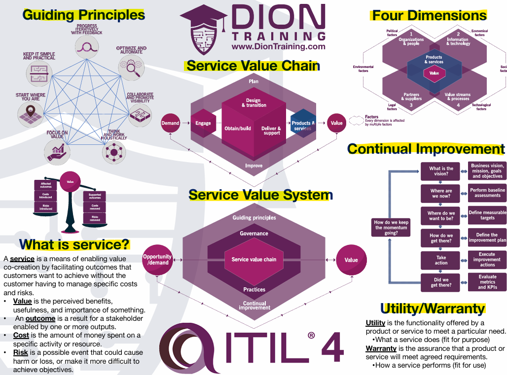

## Guiding Principles
* Progress iteratively with feedback.
* Optimise and automate.
* Collaborate and promote visibility.
* Think and work holistically.
* Focus on value.
* Start where you are.
* Keep it simple and practical.

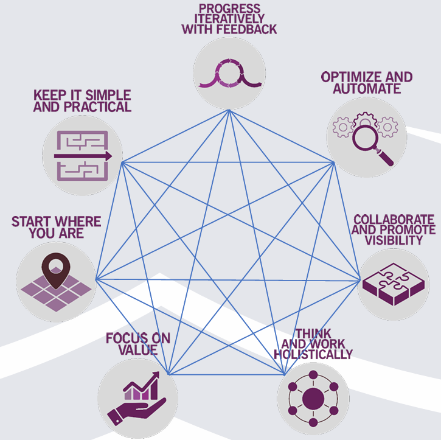

## Service Value Chain
* The ITIL 4 Service Value Chain is a central element of the ITIL 4 framework, which provides a structured approach to delivering valuable services to customers. 
* It represents a flexible and versatile model for creating, delivering, and improving services.

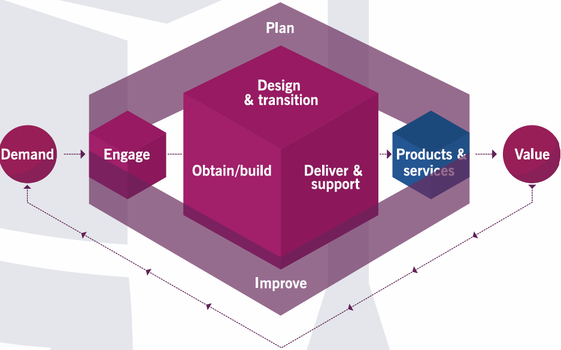

## Demand
* **demand** refers to the need or desire for services from customers and stakeholders. 
* The Service Value Chain is designed to transform this demand into valuable products and services through its six key activities.

## Engage
* This activity is crucial for understanding and capturing demand. 
* It involves interacting with stakeholders to gather their needs, expectations, and feedback. 
* Effective engagement ensures that the service provider is aware of the demand and can respond appropriately.

## Plan
* Once demand is understood, planning activities ensure that the organisation is prepared to meet this demand.
* This includes strategic planning, resource allocation, and setting objectives to align with stakeholder needs.

## Design & Transition
* This activity involves designing and transitioning new or changed services to meet the identified demand. 
* It ensures that services are designed to meet quality, cost, and time-to-market expectations.

## Obtain/Build
* This activity focuses on obtaining or building the necessary components to fulfill the demand. 
* It involves sourcing or developing the required resources, whether they are software, hardware, or other service components.

## Deliver & Support
* This activity ensures that services are delivered and supported according to the agreed specifications and stakeholder expectations. 
* It involves the actual provision of services to meet the demand.

## Improve
* Continuous improvement activities ensure that services remain aligned with changing demand. 
* By regularly assessing and enhancing services, the organisation can adapt to evolving stakeholder needs and maintain value delivery.

> The Service Value Chain is designed to be flexible and adaptable, allowing organisations to respond to varying levels of demand effectively. By integrating demand into each activity, the Service Value Chain ensures that services are continuously aligned with stakeholder needs and expectations.

 

# Four Dimensions
* The ITIL 4 framework emphasises a holistic approach to service management, which is encapsulated in the Four Dimensions Model. 
* These dimensions ensure that services are designed, managed, and improved in a balanced and integrated manner.

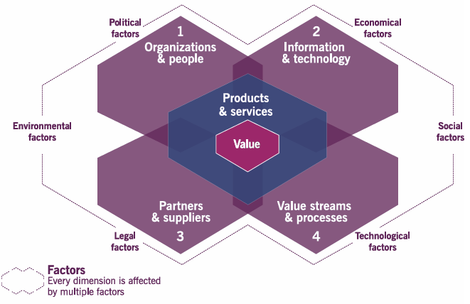

## 1. Organisations and People
* This dimension focuses on the structure and culture of the organisation, as well as the roles and responsibilities of individuals within it. 
* It emphasises the importance of a well-defined organisational structure, clear roles and responsibilities, and a culture that supports the organisation's objectives. 
* Effective communication, collaboration, and a skilled workforce are crucial for success in this dimension.

## 2. Information and Technology
* This dimension covers the information and knowledge necessary for service management, as well as the technologies required to support and deliver services. 
* It includes the management of data, information security, and the use of technology to enable service delivery. 
* The goal is to ensure that the right information and technology are available to support the organisation's objectives and service management practices.

## 3. Partners and Suppliers
* This dimension focuses on the relationships and agreements with external parties that are essential for service delivery. 
* It includes the management of contracts, partnerships, and supplier relationships. 
* The aim is to ensure that partners and suppliers are aligned with the organisation's goals and contribute to the value creation process. 
* Effective management of these relationships is key to delivering high-quality services.

## 4. Value Streams and Processes
* This dimension looks at how the organisation's activities are organised and managed to create value. 
* It involves the identification and optimisation of value streams, which are the sequences of activities that deliver value to customers. 
* It also includes the design and management of processes that support service delivery. 
* The focus is on ensuring that activities are efficient, effective, and aligned with the organisation's objectives.

> These four dimensions are interrelated and must be considered together to ensure a holistic approach to service management. By addressing all four dimensions, organisations can create and deliver value more effectively and efficiently.

 

# Continual Improvement
* Continual improvement is a core principle of the ITIL 4 framework, emphasising the need for ongoing enhancement of services, processes, and practices. 
* The goal is to ensure that organisations can adapt to changing environments, meet evolving customer needs, and maintain high levels of service quality.

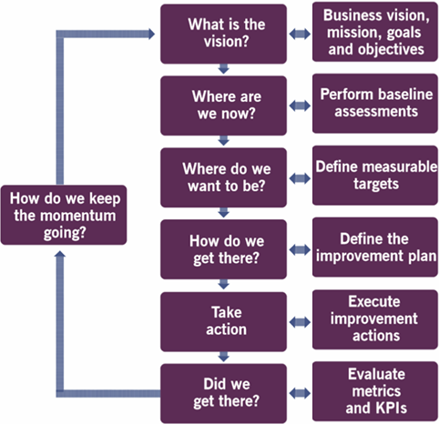

 

# Service Value System

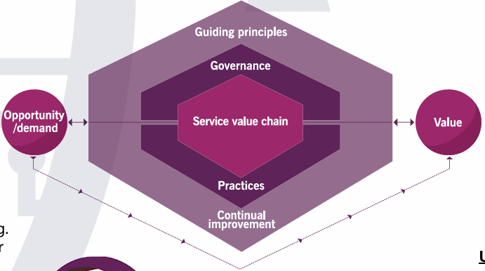

## Guiding Principles
These are recommendations that guide an organisation in all circumstances, regardless of changes in its goals, strategies, type of work, or management structure. 
* Focus on value.
* Start where you are.
* Progress iteratively with feedback.
* Collaborate and promote visibility.
* Think and work holistically.
* Keep it simple and practical.
* Optimise and automate.

## Governance
* Governance is the means by which an organisation is directed and controlled. 
* It includes the activities of evaluating, directing, and monitoring the organisation’s performance. 
* Governance ensures that policies and continual improvement are aligned with the organisation's objectives.

## Service Value Chain
* The Service Value Chain is a set of interconnected activities that an organisation performs to deliver a valuable product or service to its customers. 
* It includes six key activities: Plan, Improve, Engage, Design and Transition, Obtain/Build, and Deliver and Support.

## Practices
* Practices are sets of organisational resources designed for performing work or accomplishing an objective. 
* ITIL 4 includes 34 management practices, such as Incident Management, Change Control, and Service Desk, which support the Service Value Chain activities.

## Continual Improvement
* Continual improvement is a recurring organisational activity performed at all levels to ensure that an organisation’s performance continually meets stakeholders’ expectations. 
* It involves identifying and implementing improvements in services, processes, and practices.

## How SVS Works
The ITIL 4 Service Value System (SVS) is designed to help organisations create value through services. It starts with understanding the demand for services and ends with delivering value to customers.

* **Guiding Principles**: These are the core ideas that guide decision-making and actions.
* **Governance**: Ensures that everything aligns with the organisation's goals.
* **Service Value Chain**: Transforms inputs into valuable outputs through various activities.
* **Practices**: Support the activities in the Service Value Chain
* **Continual Improvement**: Keeps the system effective and efficient over time.

> By combining these components, the SVS helps organisations deliver high-quality services that meet customer needs and drive business success.

 

# What is service?
 A **service** is a means of enabling value co-creation by facilitating outcomes that customers want to achieve without the customer having to manage specific costs and risks.
 • **Value** is the perceived benefits, usefulness, and importance of something. 
 • An **outcome** is a result for a stakeholder enabled by one or more outputs.
 • **Cost** is the amount of money spent on a specific activity or resource.
 • **Risk** is a possible event that could cause harm or loss, or make it more difficult to achieve objectives.

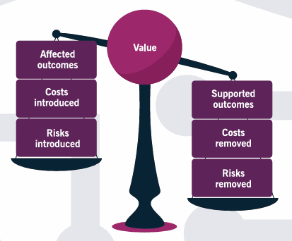

# Utility/Warranty
* **Utility** is the functionality offered by a product or service to meet a particular need.
  * What a sercive does (fit for purpose).
* **Warranty** is the assurance that a product or service will meet agreed requirements.
  * How a service performs (fit for use).

 

# Industrial Revolution
First:
* The first industrial revolution occurred in the 18th and 19th centuries, all across Europe and America.
* During this period, humanity moved from an agrarian-based rural society of farmers into an urbanised, industrial area, that later developed into some of our country's largest cities.
* This movement was brought about by the development of **mechanisation** in the form of iron and textile industries, as well as the power of the steam engine for our transportation needs.

Second:
* After WWI.
* Our industries expanded to include steel, oil, electricity, and electrically-powered equipment to aid in the mass production of goods.
* During this time period, cars were developed with their internal combustion engines, that made transportation even more convenient and efficient.
* At the same time, the light bulb began to replace candlelight, allowing us to work longer into the night.
* And of course, communication across great distances became possible through the use of our telephones.

Third (digital revolution):
* 1980s+
* With the advancement of analog and digital electronics, humanity began to utilise life-changing technologies on a daily basis, including the personal computer, the Internet, and the entire spectrum of information and communication technologies.
* ITIL was created.
  * ITIL was first developed as a series of best practices and guidance on how to run an information technology organisation.
  * In fact, ITIL, as it was originally developed, was an acronym that stood for Information Technology Infrastructure Library.
  * ITIL began in the 1980s as a way for organisations to create processes and procedures to better run their IT systems.

Fourth (now!):
* early 21st century.
* The fourth industrial revolution is marked by the creation of cyber-physical systems, where a fusion of technologies has blurred the lines between physical and digital realms.
* This includes the use of technologies like robotics, nanotechnology, artificial intelligence, the Internet of things, autonomous cars, and so much more.

 

# Service Organisations
The purpose of ITIL 4 is to provide organisations in the modern service economy with **guidance** on **managing their information technology** and **dependencies** **effectively** and **efficiently**. 
* It offers a **coordinated**, **structured**, and **integrated** approach that c**ombines agility**, **time-to-market**, and the ability to **deliver** new services **quickly**. 
* ITIL 4 also **emphasises risk controls** and ensures that services are performed properly today, tomorrow, and in the future.

It's not just about providing fast service to customers;
* it's about **balancing speed** with proper controls to **ensure quality service** now and into the future. 
* This balance ensures that organisations can **maintain** both **speed** and **control** in their services.

> ITIL 4 provides a comprehensive framework for IT service management. This framework ensures an **effective**, **efficient**, **flexible**, **coordinated**, and **integrated system** for the governance and management of services. It also focuses on the continual improvement of these services within your organisation.

**Governance**: The means by which an **orginisation** is **directed** and **controlled**. 
* This means that it involves all of the processes needed to govern or oversee the running of the organisation.

**Organisational Capability**: an organisation having both the **capacity** and the **ability** to **perform the functions required**.

**Service Management**: is focused on how to best **create value** within an organisation to **provide the desired benefits** to your **consumers**.
    
    How can we do that?

*  To achieve this, an organisation must organise its people to best **support** its **activities**, **practices**, and **processes**. 
*  These elements are the engine that **drives the creation** of the organisation's **products** and **services**. 
   *  However, none of these activities, practices, and processes can be done in isolation. 
   *  Instead, consider the service **relationships** that are **built**, **created**, and **nurtured** **throughout the service management process**.

 

# Value
* The **perceived** benefits, usefulness, and importance of something.
  * It's **subjective**.
  * The **recipient** determines the percieved value. 
    * It's the recipient that actually is expected to get the value from the products, from those relationships, from those services, from whatever it is we're expecting to deliver, or to facilitate the value for them.
    * The perceived benefits and usefulness of something really do **depend** on the **context** that it's being talked about.
* Value is co-created by the service provider and the consumer. 

 

# Organisations and People
ITIL definition of **organisation**: as a person or a group of people that has its own **functions** with **responsibilities**, **authorities**, and **relationships** to **achieve its objectives**.

## Roles an Organisation can fill
* Organisations can vary in size, complexity, and in their legal structure.
  * They can be a single person, a team, or a complex multinational corporation. 
  * What binds an organisation together is a set of **common objectives**, **relationships**, and **authorities**.
* People are **organised** around **common goals** within a larger business organisation to **achieve common objectives** in a coordinated method. 
* Value is co-created by the service provider and the consumer. 
* You can be both a supplier (provider) and a consumer simultaneously.  
  * You can fulfil multiple roles simultaneiously. 

### Service Provider
* a role performed by an organisation in a service relationship to provide services to consumers.

### Consumer
* a role performed by an organisation in the relationship that uses or consumes those services.

## People's roles
* **User**: a person who **uses services**. 
* **Customer**: A customer is a person who **defines the requirements** for a service and **takes responsibility for the outcomes of service** consumption.
* **Sponser**: A person who **authorises the budget** for service consumption.
  * also used in some organisations to describe an organisation or department or an individual that **provides financial or other support** for an **initiative**.

> We need to ensure that the financials work for the sponsor, that the requirements are met for the customer, and the users get what they expect in usability of our service.

 

# Services and Products

## 'Service'
* A means of enabling **value co-creation** by facilitating the outcomes that customers want to achieve, without the customer having to manage specific costs and risks. 
  * AKA: A service helps customers **achieve** their **desired outcomes** **without** them having to **worry** about specific **costs** and **risks**.
* A service organisation can **provide services based on products** that they have.

"A means of enabling value co-creation"
* a reference back to how value is determined, as a result of the relationship between the provider of the service and the customer of the service.

"by facilitating the outcomes that customers want to achieve"
* The concept of value.
* The service provider can't achieve your objectives for you.
* The service provider is only able to facilitate the achievement of those customer outcomes.

This co-created value if created "without the customer having to manage specific costs and risks"
* This refers to the reason why a customer hires a service provider in the first place.
* It's their job as the service provider to manage all the specific costs and risks associated with that service.

## 'Product'
* A service organisation can **provide services based on products** that they have.
* A product is a **configuration** of an organisation's **resources** that's **designed to offer value** for a consumer.
  * A *collection of services* that are put together to *give more value than* they could *individually*.
* These resources can be owned or managed by the organisation.
  * Can be leased or rented.
  * Could be the people who work in an orginisation, under contractual agreement, because these people are a resource. 

### Essence of a Product
* The way an organisation configures all those resources into an **set offering** is the essence of a product.
  * AKA, how they arrange/organise them and give them a title - like a package deal. 

 

# Service Offerings
* A service offering is a description of **one or more services** **designed to address** the **needs** of a **target consumer group**.
  * AKA, A service offering describes one or more services that meet the needs of a specific group of customers.
  * These can include goods, access to resources, and service actions. 
* In essence, a service provider **presents their services** to customers **through service offerings**, which describe one or more **services based** on their **products**.
  * Service offerings can include goods, access to resources, and service actions as part of the service offering. 
  * *different service offerings* happen based on the *different functionalities* at the *different price points.*
    * E.g., Hulu offers different tiers of monthly packages depending on what services you desire. I.e., tv shows with ads or live tv and sports.
  
## Goods
* Goods are things that are **supplied** to the consumer.
* Goods are going to be transferred over to the consumer.
* These are things that are **transferred from the service provider to the consumer**, and once that occurs, the **consumer is now responsible** for that future use..
  * E.g., a phone.

## Access to resources
* Access to resources is granted or a **license is given** to a consumer under some **agreed terms and conditions**.
* Access to the resources is going to let the consumer access them on the terms and conditions in the license that has been granted from the service provider.
  * E.g., Udemy website. 
    * You're given access to the videos, the practice exams, etc.
    * You're given a license to use them under the terms and conditions, that you agreed to when you signed up.
    * These resources all remain under the service providers control and the service provider is responsible for ensuring that you can use them in the way that it was promised.
  * This does come with subjective downsides to the consumer.
    * E.g., You may not be allowed to download videos, what you can do depends on an active subscription. 

## Service actions
* Actions **performed** to **address a consumer's needs**.
  * E.g., Providing technical support to help a customer resolve an issue with their software.
* Service actions are going to be covering things that are going to be ongoing things, like technical support and customer service fees.

 

# Service Relationships

> Service relationships are what being a service provider is all about. To create value, an organisation has to provide more than just a service. They must work with their consumers and customers to build an ongoing relationship.

* A service relationship is a cooperation **between** a service **provider** and a service **consumer** that includes service **provision**, service **consumption**, and service **relationship management**.
  * AKA, when two organisations want to work together, a relationship is formed.
  * During this time, one may be considered as the service provider, and the other the service consumer. 

## Service Provision
* The **activities performed** by an **organisation** to** provide the services**. 
  * AKA, The activities an organisation performs to provide services.
* E.g., managing resources, configuring them to deliver services, providing user access, fulfilling agreed service actions, managing service levels, and continually improving services.
* Can include supplying goods to the consumer.
  * E.g., A phone seller in EE manages their inventory, configures display models for customers to try, provides assistance and information to customers, processes sales transactions, and offers after-sales support such as troubleshooting and warranty services.

## Service Consumption
* The **activities performed** by an **organisation** to **consume the services**. 
* Service consumption includes managing the consumer's resources needed to use the service, such as paying your bill every month to keep the service running. 
* It also involves actions like checking your email, making phone calls on your new smartphone, or requesting new service actions to be fulfilled.
  * When the **consumer is doing something** - **this is service consumption**.

## Service Relationship Management
* The **activities** that the service **provider** and the service **consumer** do **together** to **enable value co-creation** to occur **based upon the service offerings** (back and forth communication).
  * AKA, the activities that the service provider and consumer do together to create value based on the service offerings.
  * E.g., having the consumer paying their bill on time so their monthly subscription doesn't get canceled and the service doesn't get turned off.
  * Organisations warning their consumers about an outage to upgrade their servers. 

## Service Relationship Model
* Business can be complicated, and because of this, we have to **consider** the **different relationships** that are **involved** in any **single service**.

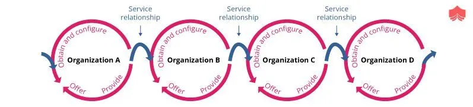

 

### Example of a Service Relationship Model

1. `You` (Organisation D): You want to watch the video. To do that, you have a service relationship with our company.
   * **Consumer**: You
   * **Service Provider**: Dion Training

1. `Dion Training` (Organisation C): We provide the video content, but we rely on other service providers to make it work.
   * **Consumer**: Dion Training
   * **Service Provider**: Video Streaming Company. 

1. `Video Streaming Company` (Organisation B): They host and stream our videos, but they don't own their servers. They rely on Google Cloud.
   * **Consumer**: Video Streaming Company
   * **Service Provider**: Google Cloud

4. `Google Cloud` (Organisation A): They provide the infrastructure for the video streaming company. Additionally, some Google employees might be members of our website.
   * **Consumer**: Google employees (when using diontraining.com)
   * **Service Provider**: Dion Training

This can get more complicated:
* You could have a worker at Google that's a member of Dion Training , now they're a consumer as well. 

 

# Definition of "Outcomes" within Service Definition
* An outcome is a **result** for a stakeholder, enabled by one or more outputs. 
* It **focuses** on the **customer's desired outcome**, not the service provider's, which is important to understand.

  

# Costs
* The amount of money **spent** on a **specific activity or resource**. 
* It can be expressed both **financially** and in **non-financial** ways. 
* The service provider is aiming to **reduce or remove costs**, when they **provide a service**.

`Example: Measuring Course Creation Cost`
* When we create a new course, we measure the cost in hours spent creating it. A typical course might require 400-500 hours of effort across our staff. 

This is described in either:

* **Person hours** (man hours): Total hours worked by all staff.
* **FTE** (Full Time Equivalent): Based on a single employee working 40 hours per week for a year, equating to roughly 2,000 hours.

> When considering costs, ensure that outsourcing a service or paying for something provides more value than its cost.

 

# Risks
* Refers to a possible event that cuold **cause harm**, **loss**, or make it more **difficult to achieve objectives**. 
  * AKA, any possible event that could **impact our ability to co-create** that value through our services.
* Risk is potentially imposed on consumers by the service.
* Consumers should contribute to the reduction of risk. 

## Risk in Service Management
* When most people think of risk and service management, they consider it from a new installation or project perspective. 
* However, risk is also present in our services. 
* From a service provider perspective, our goal is to minimise risk for our customers who use our services. 
* Risks are similar to costs. 
  * Just like costs, our customers will assume that some new risk will occur as part of their consumption of our services.

## Consumer and Service Provider Responsibilities

**Communicate Needs and Outcomes:**
* Define the requirements of th service and clarify the required outcomes. 
* As a consumer, clearly communicate your needs and desired outcomes to the service provider.

**Communicate Constraints and Success Factors:**
* Clearly communicate any constraints and the critical success factors for the service.

**Mutual Requirements:**
* Consumers must ensure providers have access to the necessary resources. 
* Both the consumer and the service provider may have requirements for each other. 
  * For example, Uber requires customers to have a cell phone, a valid data plan, and the ability to send GPS location.

## Ways to Manage Risk

1. **Avoid**: Risk avoidance involves removing risks from the service. 
   * Take actions to prevent the risk from occurring.
   * E.g., don't accept cookies. 
2. **Accept**: Risk acceptance is used when the risk or cost is considered low. 
   * Acknowledge the risk and decide to deal with it if it happens.
   * E.g., simpler to pay for the risk. 
3. **Transfer**: Risk transfer is often used when you insure against a risk. 
   * Shift the risk to another party, such as through insurance.
   * E.g., hire a service provider to collect it for you, to store it securely, and to give you access.
4. **Mitigate**: Risk Mitigation is used when you implement technology or processes to reduce the risk.
   * Take steps to reduce the impact or likelihood of the risk.
   * E.g., Add new technology systems to better protect the data and implement new processes for handling the data. This will help reduce risk and make the information more secure.

 

# Utility and Warranty in ITIL
`Utility:`
* Refers to the **functionality offered** by a product or service to meet a particular need.
* Requires that a service support the performance or remove constraints from the consumer. 
* Known as "**fit for purpose.**"
  * **Example**: A Toyota Prius meeting the need to transport a family from point A to point B.

`Warranty:`
* **Assurance** that a product or service will **meet the agreed-upon requirements**.
* Known as "**fit for use.**"
  * **Example**: A Toyota Prius having high fuel efficiency and a working air conditioner and heater.

`Comparison:`
* Utility is about what a service does (e.g., driving from point A to point B).
* Warranty is about how the service performs (e.g., fuel efficiency and temperature control).

`Importance of Both:`
* Both utility and warranty are needed for a service to operate successfully.
* In IT, warranty is often focused on, but utility is equally important.
  * **Example**: A service with great warranty but poor utility will fail.

## Illustration
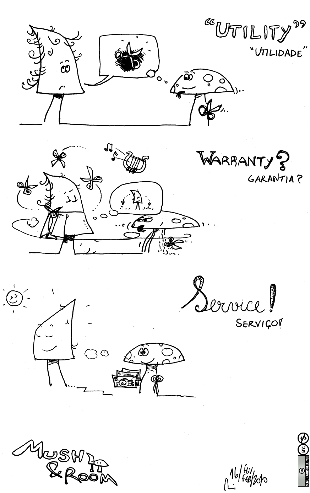

 

# The 4 Dimensions of Service Management
* 4 different perspecitives. 
* **External factors** around the side are going to impact the service and products that we're creating as well.

## 1. Organisations and People
* Organise teams and communications.
* Determine the number of people needed and their competencies.
* Motivate, hire, and retain the right people.

## 2. Information and Technology
* Register and track incidents.
* Use technology and information management software.
* Organise and share data.

## 3. Partners and Suppliers
* Manage external teams and suppliers.
* Evaluate contracts and escalate incidents.
* Ensure a two-way street between partners and suppliers.

## 4. Value Streams and Processes
* Optimise processes and reduce waste.
* Evaluate and improve value streams.
* Consider external factors like environmental impact.

 

# Service Value System (SVS)
* Describes **how** all the **components and activities** of the organisation **work together** as a system to **enable value co-creation**. 
* **Components and activities** are tied to the organisation's resources and can be **configured flexibly** based on circumstances.
* Requires **integration** and **coordination of activities**, practices, teams, authorities, and responsibilities.
* **Flexibility depends** on the organisation's **culture** and **implementation**.

> It's purpose is to ensure the organisation continually co-creates value with stakeholders through the use and management of products and services.

 

# Guiding Principles
* **Recommendations** that **guide** an organisation in **all circumstances**.
* Used to adopt a service management approach and adapt ITIL guidance to specific needs.
  * Allows organisations to integrate them into an overall approach to service management. 
  * Applied universally to all initiatives and stakeholder relationships.
  * Encourages continual improvement across all levels of the organisation.

## Examples
> You should consider which of the guiding principles are relevant to your situation.

1. **Focus on Value**: Applied to all relevant stakeholders and their definitions of value.
2. **Start Where You Are**: Begin with the current state and make improvements.
3. **Progress Iteratively with Feedback**: Make small, incremental changes and gather feedback.
4. **Collaborate and Promote Visibility**: Work together and ensure transparency.
5. **Think and Work Holistically**: Consider the entire system and its interactions.
6. **Keep It Simple and Practical**: Simplify processes and focus on practicality.
7. **Optimise and Automate**: Improve efficiency and automate where possible.

 

# Service Value Chain
`Components:`
   * Engage
   * Plan
   * Improve
   * Design and Transition
   * Obtain and Build
   * Deliver and Support
   * Products and Services

`Non-Linear Sequence:`
* Unlike ITIL v3's linear service lifecycle, ITIL 4's service value chain is not a linear sequence.
* Activities can interact in any order.

`Central Activities:`
* Design and Transition
* Obtain and Build
* Deliver and Support

`Feedback Loop:`
* Improve overlaps with other activities, creating a feedback loop for continual improvement.

`Value Creation:`
* Activities transform inputs (demand and opportunity) into outputs (value and desired outcomes).
* Uses combinations of 34 ITIL practices.

`Engage Activity:`
* Handles all interactions with external parties.

`Obtain and Build Activity:`
* Acquires new resources.

`Plan Activity:`
* Manages planning activities.

`Improve Activity:`
* Focuses on continual improvement.

`Central Cube:`
* Activities related to creating, modifying, delivering, maintaining, and supporting components, products, or services.

  

# Continual Improvement

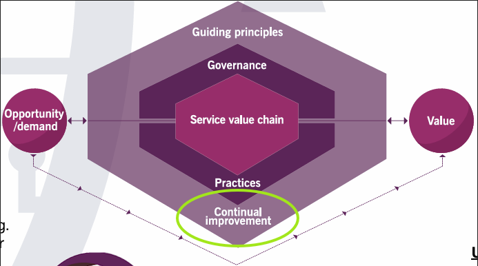

* "practices" are the 34 distinct ITIL practices (learn later in the course).
  * Continual improvement is one of those.

`Continual Improvement:`
* **Aligns** the organisation's **practices** and **services** with **changing business needs** through **ongoing identification and improvement** of services, components, practices, or elements.
* Highlighted as a distinct activity and practice due to its significance in ensuring continuous enhancement.

> Continual improvement is an ongoing process that never stops, aiming for constant enhancement and adaptation to new features and better ways of doing things.

  

# The 34 Practices

`What is a practice?`
* A set of organised resources designed for performing work or accomplishing an objective.
* Supports multiple service value chain activities and includes resources based on the four dimensions of IT service management.

## Categories of Practices:

### General Management Practices (14/34):
* Adopted from the wider business domain.

| Example                         | Example                         | Example                         |
|---------------------------------|---------------------------------|---------------------------------|
| Knowledge management            | Measurement and reporting       | Organizational change management|
| Portfolio management            | Project management              | Relationship management         |
| Risk management                 | Service financial management    | Strategy management             |
| Supplier management             | Workforce and talent management |                                 |
| Architecture management         | Continual improvement           | Information security management |

### Service Management Practices (17/34):
* Created by the service management organization or adopted from the service management industry.

| **Example**                     | **Example**                     | **Example**                     |
|---------------------------------|---------------------------------|---------------------------------|
| Availability management         | Business analysis               | Capacity and performance management |
| Change enablement               | Incident management             | IT asset management             |
| Monitoring and event management | Problem management              | Release management              |
| Service catalog management      | Service configuration management| Service continuity management   |
| Service design                  | Service desk                    | Service level management        |
| Service request management      | Service validation and testing  |                                 |

### Technical Management Practices (3/34):
* Technical functions elevated to the level of a service.
* **Examples**: Deployment management, infrastructure and platform management, software development and management.

 

# Putting it All Together

## Four Dimensions of Service Management
* Organisations and People.
* Information and Technology.
* Partners and Suppliers.
* Value Stream and Processes.

## ITIL Service Value System
* **Inputs**: Opportunity and Demand.
* **Components**: Service Value Chain, Governance, Practices, Guiding Principles, Continual Improvement.
* **Output**: Value.

## Service Value Chain Activities
* Engage.
* Plan.
* Improve.
* Design and Transition.
* Obtain and Build.
* Deliver and Support.
* Products and Services.

## 34 ITIL Practices
* General Management Practices.
* Service Management Practices.
* Technical Management Practices.

## Real-World Scenario
* **Incident**: Warehouse wifi network issue affecting forklift driver's mobile device.
* **Engage Activity**: Warehouse manager contacts service desk; incident logged and escalated.
* **Delivery and Support**: Network support engineer diagnoses and replaces faulty wireless access point.
* **Practices Involved**: IT asset management, service configuration management, change control, incident management.
  1. *IT Asset Management*: Update the serial number in the configuration item database.
  2. *Service Configuration Management*: Configure and install the device based on the approved baseline.
  3. *Change Control*: Install the new equipment into the network.
  4. *Incident Management*: Resolve the incident.
* **Continual Improvement**: Engineer suggests improvements; service desk verifies resolution with warehouse manager.
* **Value Creation**: Restored wifi coverage enables efficient forklift operations.
* **Feedback**: User satisfaction survey to identify trends and improve processes.

  

# Completion of Course
Certification:

Source: https://spartaglobal.udemy.com/certificate/UC-dbb498df-18c9-49de-9c69-4add52823882/?utm_campaign=email&utm_medium=email&utm_source=sendgrid.com

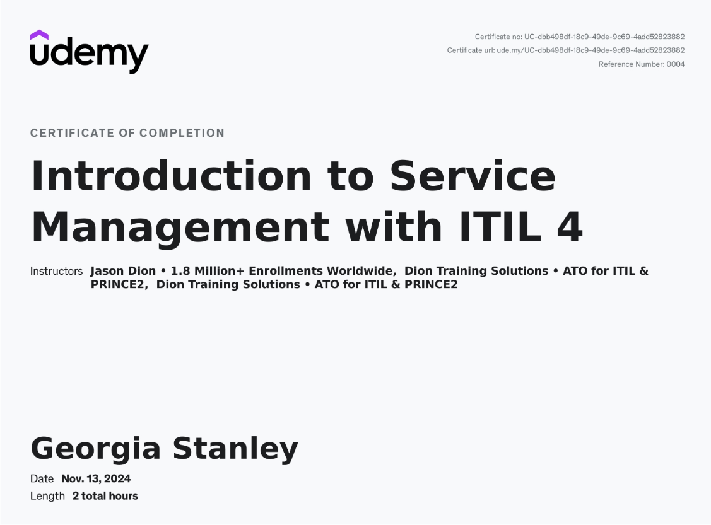