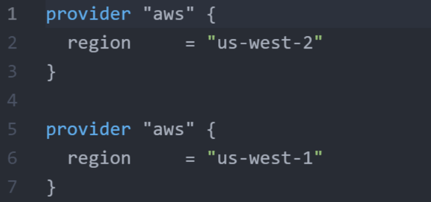

# Exam Preparation Practice Test - 1

1. Yes or No. Matt wants to run Terraform on his Windows Laptop.  Matt read that Terraform Core is developed using the Go programming language. **Is there a need for Matt to explicitly install the GO programming language on his Windows laptop in order to run Terraform**?

Answer:
   * No. 
   * Terraform Core is a statically-compiled binary written in the Go programming language.

<br>

<hr style="height:4px;background:grey">

<br>

2. True or false. Alice has created a variable associated with the db_password parameter in the following way: `var.db_password`
   
   The value associated with the variable is defined in terraform.tfvars file in the following way: `db_password="mypassword"`

   **Will the password be part of the terraform state file?**

Answer: 
   * True.
   * The sensitive values are still recorded in the state file and anyone who has access to the state file will be able to see the value.

<br>

<hr style="height:4px;background:grey">

<br>

3. Following is the snippet of Terraform code that is part of the AWS VPC Module.

```bash
variable "vpc_cidr_block" {
  type = map
  default = {
    us-east-1 = "192.168.10.0/24"
    ap-south-1 = "192.168.20.0/24"
    us-west-2  = "10.77.0.0/16"
  }
}
```
**If there is a requirement to fetch the value of** `10.77.0.0/16` **associated with a specific variable?**

Answer:
* var.vpc_cidr_block["us-west-2"]

<br>

<hr style="height:4px;background:grey">

<br>

4. Matthew is implementing Terraform in production. 
   
   He realised that every region in AWS has a different AMI ID for CentOS 7 OS.
   
   He wants to create a Terraform code that works for all the regions. 
   
   He has already created the EC2 resource but needs to figure on how he can deal with different AMI IDs based on regions. **What is the best approach?**

Answer:
   * Make use of Data Source.
   * Using Data source, we can query for latest AMI ID based on specific conditions like availability, Operating System or other.

<br>

<hr style="height:4px;background:grey">

<br>

5. ames is having an issue with his Terraform code. As part of the troubleshooting process, he intends to enable debugging. **What is the way to do that?**

Answer:
   * Create an environment veriable of TF_LOG=TRACE.

<br>

<hr style="height:4px;background:grey">

<br>

6. There is something wrong with the Terraform version that Alice is using. The HashiCorp team has requested to store the crash logs to a file and send the file over email.

    **What is the way for Alice to store the logs to a file named /`tmp/kplabs-tf-crash.log`?**

Answer: 
* Create an evironment variables named TF_LOG_PATH=/tmp/kplabs-tf-crash.log

<br>

<hr style="height:4px;background:grey">

<br>

7. Refer to the following Terraform code:

```bash
variable "mobile_phones" {
   type = list
   default = ["nokia", "motorola", "samsung", "apple", "siemens"]
}
``` 
There is a requirement to refer to "samsung" in the given list. **What is the way to do that?**


**How can the string of samsung can be referred from a variable?**

Answer: 
* var.mobile_phones[2]
* Remember that first value starts with reference of 0 and hence 3rd value of Samsung will be referenced with number 2.

<br>

<hr style="height:4px;background:grey">

<br>

8. Refer to the following example code:

```bash
provider "aws" {
  region     = "us-west-2"
  access_key = "YOUR-ACCESS-KEY"
  secret_key = "YOUR-SECRET-KEY"
}
 
variable "istest" {}
 
resource "aws_instance" "dev" {
   ami = "ami-082b5a644766e0e6f"
   instance_type = "t2.micro"
}
```
Since the value of the variable "istest" is undefined, **will the terraform plan operation show an error?**

Answer:
* No. Terraform will simply ask you to input the variable value.

<br>

<hr style="height:4px;background:grey">

<br>

9. Looking into the following code, what is the name of the provider that is being used?

```bash
resource "aws_instance" "myec2" {
  ami           = "ami-082b5a644766e0e6f"
  instance_type = var.instancetype
}
```

Answer:
* AWS.
* From the configuration, we can easily identify that resource type of "aws_instance" is used. This resource_type is part of the AWS provider.

<br>

<hr style="height:4px;background:grey">

<br>

10. Matt has a requirement to reference a local value to another local value in the same terraform code.
    
    **Is this feature supported in Terraform?**

Answer:
* Yes.
* The locals block defines one or more local variables within a module. Each locals block can have as many locals as needed. 
* *Documentation*: https://www.terraform.io/language/configuration-0-11/locals

<br>

<hr style="height:4px;background:grey">

<br>

11. True or false. Bob intends to pull the Terraform Module associated with AWS VPC.

    In the line 3, there is a version argument that is defined. 
    
    **Is it a mandatory requirement to specify version while pulling code from Terraform Registry?**

```bash
module "vpc" {
  source  = "terraform-aws-modules/vpc/aws"
  version = "3.14.2"
}
```

Answer: 
* False.
* If we do not specify the version argument, Terraform will download the newest version of the module .

<br>

<hr style="height:4px;background:grey">

<br>

12. Matthew is new to terraform. He is creating an EC2 instance. Matthew wants to display the IP address of the instance to show in the CLI output automatically once the EC2 instance gets deployed.

    **Which resource in terraform can he use?**

Answer:
* Output.

<br>

<hr style="height:4px;background:grey">

<br>

13. Based on the following Terraform code, **what is the name of IAM User that will be created?**

```bash
variable "elb_names" {
  type = list
  default = ["dev-loadbalancer", "stage-loadbalanacer","prod-loadbalancer"]
}
 
resource "aws_iam_user" "lb" {
  name = var.elb_names[count.index]
  count = 2
  path = "/system/"
}
```

Answer:
* "dev-loadbalancer" and "stage-loadbalancer".
* The count argument is set to 2. This means that the "aws_iam_user" resource will be created twice, once for each item in the list.

<br>

<hr style="height:4px;background:grey">

<br>

14. Alice is writing a VPC module in AWS and a variable needs to be defined in the following format:

    `az=["us-west-1a","us-west-1b"]`

    **What is the data type that alice can use to match this type of data?**

Answer: 
* List.

<br>

<hr style="height:4px;background:grey">

<br>

15. Andrew wants to read the contents of the file named id_rsa using Terraform.

    **Which terraform function can be used to achieve this use-case?**

Answer:
* file() function.

<br>

<hr style="height:4px;background:grey">

<br>

16. Matthew has studied that "terraform apply" is capable of performing wide variety of operations.

    However, **which is the following type of operation that "terraform apply" cannot do?** changing infrastructure, destroying infrastructure, import infrastructure objects, creating infrastructure.

Answer: 
* It cannot import infrastructure objects.
* To import existing infrastructure, you need to run the "terraform import" command. 
* *Documentation*: https://www.terraform.io/language/functions/file

<br>

<hr style="height:4px;background:grey">

<br>

17. Enterprise Corp has started using Terraform Cloud.

    There are multiple teams that makes use of Terraform and every team is using their custom Terraform resource configuration and settings for resources like EC2 Instances, IAM users and others.

    You want to enforce standardisation of the resources across the enterprise. **What should be your approach?**

Answer:
* Create a Centralised Module Repository
  * Develop standardised Terraform modules for commonly used resources like EC2 instances, IAM users, and others.
  * Store these modules in a centralised repository, such as a private GitHub repository or the Terraform Registry.

<br>

<hr style="height:4px;background:grey">

<br>

18. Refer to the following CLI Code:

```bash
locals {
  db_password = {
    admin = "password"
  }
}
 
output "db_password" {
  value = local.db_password
}
```

Whenever a terraform apply operation runs, the value of password is shown in the CLI.



**What is the easiest way to hide the value from CLI?**

Answer:
* Use a sensitive parameter.
* "sensitive" parameter use to prevent secrets from being shown in the CLI output.
* *Documentation*: https://www.terraform.io/language/values/variables#suppressing-values-in-cli-output

<br>

<hr style="height:4px;background:grey">

<br>

1.  **When a `terraform apply` operation is performed, which of these operations are performed?** 
* all the necessary provider plugins are downloaded.
* terraform will match the current state to desired state.
* modules referenced in the module sources are downloaded.
* None of the above.

Answer:
* Terraform will match the current state to desired state.

<br>

<hr style="height:4px;background:grey">

<br>

20. True or false. There are 3 team members working in DevOps Team. From the Terraform documentation, they read that if there are multiple writes happening in Terraform state file from different users, it can corrupt the state.

    To prevent this, Terraform state file lock must be used.

    **Is there an additional terraform code required to implement this functionality with the backend that supports state locking?**

Answer:
* Flase.
* State locking happens automatically on all operations that could write state.

<br>

<hr style="height:4px;background:grey">

<br>

21. Alice has written a Terraform code for creating a new EC2 instance.

    There is a requirement that before EC2 instance is created, a Public IP resource must first be created.

    **What functionality of Terraform must be used to ensure this?**

Answer:
* depends_on
* The "depends_on" meta-argument allows you to specify that one resource must be created before another resource. 
* *Documentation*: https://www.terraform.io/language/meta-arguments/depends_on

<br>

<hr style="height:4px;background:grey">

<br>

22. True or false. Matt wants to quickly validate syntax error in the Terraform code that he has written.

    Initially, Matt used to run a "terraform plan", but it took a lot of time.

    **Will the terraform validate command be useful in this use-case?**

Answer:
* True.
* The terraform validate command validates the configuration files in a directory, referring only to the configuration and not accessing any remote services such as remote state, provider APIs, etc. 
* *Documentation*: https://developer.hashicorp.com/terraform/cli/commands/validate

<br>

<hr style="height:4px;background:grey">

<br>