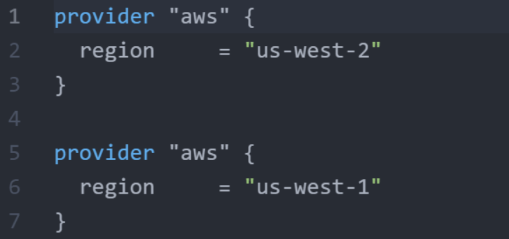
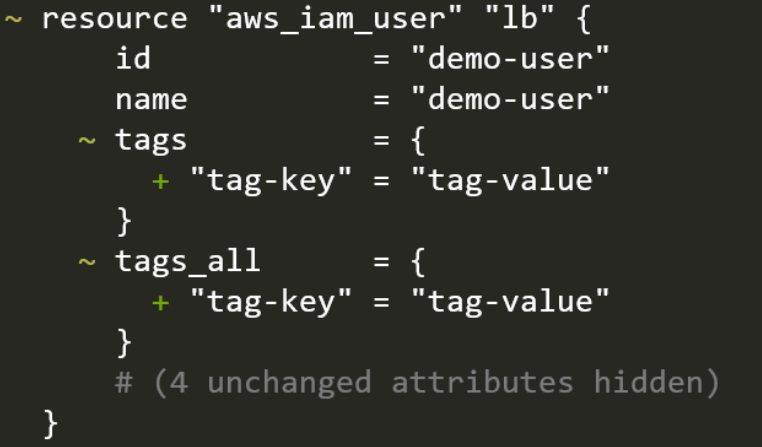

# Exam Preparation Practice Test - 3

1. **Will this code result in an error?**



Answer:
* Yes.
* The code is invalid because it defines two providers of the same type, "aws", with different regions. 
* Terraform requires that each provider be unique. 
* *Documentation*: https://www.terraform.io/language/providers/configuration#alias-multiple-provider-configurations
   
<br>

<hr style="height:4px;background:grey">

<br>

1. After creating an EC2 instance, Yash wants to automatically install certain software packages like Nginx inside that EC2 instance.

    **What is the way to achieve it?**

Answer:
* Make use of Remote provisioner: use the remote-exec provisioner to run commands on the EC2 instance.
* the remote-exec provisioner is used to run commands on the EC2 instance to update the package list and install Nginx.
* *Documentation*: https://www.terraform.io/language/resources/provisioners/remote-exec

<br>

<hr style="height:4px;background:grey">

<br>

3. There is an outdated provider version in the .terraform directory that needs to be updated to the latest version.

    **Which terraform command can be used to achieve this easily?**

Answer:
* Command: terraform init -upgrade
* This command will reinitialise the Terraform working directory and upgrade the provider to the latest version available.
* The "-upgrade" flag tells Terraform to upgrade all providers to the latest version. 
* *Documentation*: https://www.terraform.io/cli/commands/init

<br>

<hr style="height:4px;background:grey">

<br>

4. Matthew is performing some write operation and the Terraform state file is currently locked.

    **If Bob runs the terraform fmt command on the same project, will the action be allowed or blocked?**

Answer:
* Allowed.
* The "terraform fmt" command does not write to the Terraform state file, so it can be run safely even if the state file is locked.

Explanation:
* The terraform fmt command is used to format Terraform configuration files to a canonical format. 
* It does not interact with the state file or perform any operations that would require the state file to be unlocked. 
* Therefore, even if the state file is currently locked, Bob can still run the terraform fmt command without any issues.

<br>

<hr style="height:4px;background:grey">

<br>

5. Supratik has joined a Security Architect in Enterprise Corp.

    He has mandated that all the Terraform configuration that creates an S3 bucket must have encryption feature enabled. 

    **What is the best way to achieve it?**

Answer:
* Make use of Sentinel Policies.
* Using Sentinel Policies is the best way to enforce that all S3 buckets created with Terraform have encryption enabled. 
* Sentinel is a policy-as-code framework that allows you to define and enforce policies for your Terraform configurations, ensuring compliance with security requirements.

<br>

<hr style="height:4px;background:grey">

<br>

6. There are 3 resources that have been created using Terraform.

    1 resource among them has been deleted manually from the AWS console.

    **What will happen in the next terraform apply operation?**

Answer:
* The deleted resource will be created again.

<br>

<hr style="height:4px;background:grey">

<br>

7. Enterprise Corp has recently tied up with multiple small organizations to exchange database information.

    Due to this, the firewall rules are increasing, and there are more than 100 rules.

    This is a leading firewall configuration file that is difficult to manage.

    **What is the way this type of configuration can be managed easily?**

Answer:
* Dynamic blocks.
* Dynamic block can be useful for managing complex firewall configurations in a more efficient and maintainable way.

<br>

<hr style="height:4px;background:grey">

<br>

8. Alice works for Enterprise Corp and they have recently started to use Terraform Cloud.

    **What is the way in which the log output of terraform plan and apply operation that are running in Terraform Cloud be streamed in the local terminal?**

Answer:
* Remote backends.

<br>

<hr style="height:4px;background:grey">

<br>

9. James has created a variable and has explicitly defined the type as a string. Following is the snippet:

```bash
variable "myvar" {
  type = string
}
```

Which of the following value will be accepted? 2, "2", both of the above values, none of the above.

Answer:
* Both of the above values (2, "2").

<br>

<hr style="height:4px;background:grey">

<br>

10. Alice has created 10 different AWS resources from a single terraform configuration file named large.tf

    Due to some manual modification to one of the EC2 instances, she wants to destroy and recreate the EC2 instance.

    **What is the ideal way to achieve it?**

Answer:
* terraform taint
* By using the terraform taint command, you can ensure that only the specific EC2 instance is destroyed and recreated, without affecting the other resources defined in the large.tf configuration file.

<br>

<hr style="height:4px;background:grey">

<br>

11. Matthew is currently running a write operation on a terraform project, and the state file is currently locked.

    **If Bob runs a "terraform apply" command on the same project, will the action be allowed or blocked?**

Answer:
* blocked.

Explanation:
* When a write operation is in progress and the Terraform state file is locked, any other operations that require write access to the state file, such as terraform apply, will be blocked until the lock is released. 
* This mechanism ensures that the state file remains consistent and prevents conflicts or corruption.

<br>

<hr style="height:4px;background:grey">

<br>

12. Matthew is currently running a write operation on a terraform project, and the state file is currently locked.

    **If Bob runs a "terraform validate" command on the same project, will the action be allowed or blocked?**

Answer:
* Allowed.

Explanation: 
* The `terraform validate` command checks the syntax and validity of the Terraform configuration files. 
* It does not interact with the state file or perform any operations that require the state file to be unlocked. 
* Therefore, even if the state file is currently locked, Bob can still run the `terraform validate` command without any issues.

<br>

<hr style="height:4px;background:grey">

<br>

13. Matthew has recently subscribed to the Terraform Cloud Trial version.

    As part of POC, he is testing the Sentinel feature. 

    **At what stage does the Sentinel feature run in Terraform Cloud?**

Answer:
* Before apply operation.
* Sentinel Policies are checked when a run is performed, after the terraform plan but before it can be confirmed or the terraform apply is executed.

<br>

<hr style="height:4px;background:grey">

<br>

14. Alice wants to create a DOT file in Terraform.

    **Which terraform command can be used to create it?**

Answer:
* terraform graph
* The terraform graph command generates a visual representation of the Terraform configuration in DOT format, which can be used with graph visualization tools like Graphviz.

<br>

<hr style="height:4px;background:grey">

<br>

15. There is a requirement to save a terraform plan to a specific file.

    **Which of the following command can be used to achieve this use-case?**

Answer:
* terraform plan -out=planfile
* You can use the optional -out=FILE option to save the generated plan to a file on disk, which you can later execute by passing the file to terraform apply as an extra argument.

<br>

<hr style="height:4px;background:grey">

<br>

16. Enterprise Corp is using the count parameter to create 50 set of IAM users from a specific list.

Following is a sample configuration code:

```bash
resource "aws_iam_user" "lb" {
  name = var.elb_names[count.index]
  count = 50
  path = "/system/"
}
```

There is an attribute associated with the resource of aws_iam_user named arn.

There is a requirement that the ARN associated with all 50 IAM Users should be shown in the CLI .

**What of the following syntax can be used as initials to achieve this?**

Answer:
* aws_iam_user.lb[*].arn
  
```bash
output "user_arns" {
  value = aws_iam_user.lb[*].arn
}
```

<br>

<hr style="height:4px;background:grey">

<br>

17. Matthew is currently running a write operation on a terraform project and the state file is currently locked.

    **If Bob runs a "terraform destroy" command on the same project, will this action be allowed or blocked?**

Answer:
* Blocked.
* When a write operation is in progress and the Terraform state file is locked, any other operations that require write access to the state file, such as terraform destroy, will be blocked until the lock is released. 
* This mechanism ensures that the state file remains consistent and prevents conflicts or corruption.

<br>

<hr style="height:4px;background:grey">

<br>

18. Alice has generated a Terraform plan and saved it to a file that is committed to GIT repository.

    **Based on this use-case, which of the following statement is true?**

Answer:
* Any user who has access can perform apply operation from the generated plan. 
* Once a Terraform plan is saved to a file and committed to a Git repository, any user with access to that repository can use the saved plan to perform the apply operation.

<br>

<hr style="height:4px;background:grey">

<br>

19. James has run the terraform taint command in his terraform project as he wants to recreate the resource to it's base configuration.

    **By running the terraform taint command, will the affected resource be terminated immediately?**

Answer:
* No. 
* The resource will be re-created on next terraform apply operation.

Explanation:
* No, running the terraform taint command will not immediately terminate the affected resource. 
* Instead, it marks the resource as "tainted," indicating that it needs to be destroyed and recreated during the next terraform apply operation. 
* When you run terraform apply after tainting a resource, Terraform will destroy the tainted resource and then recreate it to match the desired state defined in the configuration.

<br>

<hr style="height:4px;background:grey">

<br>

20. Alice wants to run a specific program in local laptop after Terraform creates a resource.

    **Which provisioner can be used to achieve this use-case?**

Answer:
* use the local-exec provisioner to run a specific program on her local laptop after Terraform creates a resource. 
* The local-exec provisioner allows you to execute commands locally on the machine where Terraform is being run.

<br>

<hr style="height:4px;background:grey">

<br>

21. John has run the terraform validate command on his project.

    **What are the type of errors that terraform validate command can report?**

Answer:
* Multiple resource blocks that are defined by the using the same name twice.

<br>

<hr style="height:4px;background:grey">

<br>

22. Why does HashiCorp NOT recommend using dynamic block extensively within Terraform configuration?

    **What is one of the downsides of using dynamic blocks in a Terraform configuration?**

Answer:
* Overuse of dynamic blocks can make configuration hard to read and maintain, so we recommend using them only when you need to hide details in order to build a clean user interface for a re-usable module.

Explanation:
* HashiCorp does not recommend using dynamic blocks extensively within Terraform configurations because they can make the code harder to read and maintain. 
* One of the downsides of using dynamic blocks is that they can obscure the structure of the configuration, making it less clear and more difficult for others (or even yourself) to understand and modify later on. 
* This can lead to increased complexity and potential errors in the configuration. 
* It's generally better to use dynamic blocks sparingly and only when necessary to avoid these issues.

<br>

<hr style="height:4px;background:grey">

<br>

23. Matthew is currently running a write operation on a terraform project, and the state file is currently locked.

    **If Bob runs a terraform state list command on the same project, will this action be allowed or blocked?**

Answer:
* Allowed.
* State locking in Terraform is only required for write operations. 
* Read operations, such as terraform state list, can be performed even if the state file is locked.

Explanation:
* The terraform state list command is used to list the resources in the state file. 
* It does not require write access to the state file and does not modify it in any way. 
* Therefore, even if the state file is currently locked due to a write operation, Bob can still run the terraform state list command without any issues.

<br>

<hr style="height:4px;background:grey">

<br>

24. The Terraform module installer supports installation from a number of different source types, **which of these is not a supported source type?**

Answer:
* FTP Server.
* One source type that is not supported by the Terraform module installer is FTP URLs. 
* Terraform does not support installing modules from FTP URLs.

<br>

<hr style="height:4px;background:grey">

<br>

25. There are 20 resource in AWS created using Terraform configuration. The state file is stored locally.

    As part of Terraform best-practice, the team have decided to migrate the terraform.tfstate file from local backend to S3 backend.

    **Which of the following statements are true?**

Answer:
* Terraform backend can be migrated anytime even if the resources are already created.

<br>

<hr style="height:4px;background:grey">

<br>

26. Developers in Medium Corp are facing a few issues while writing complex expressions that involve interpolation. They have to run the terraform plan every time and check whether there are errors, and also verify the terraform apply to print value as a temporary output for the purpose of debugging

    **What can be achieved to avoid this?**

Answer:
* Use the terraform console command to run your interpolations and verify and debug them.

<br>

<hr style="height:4px;background:grey">

<br>

27. Matthew has written the following Terraform configuration file. **In which order will the resources be created?**

```bash
resource "aws_instance" "myec2" {
 ami = "ami-12345"
 instance_type = "t2.large"
}
 
resource "aws_eip" "myeip"{
 vpc = true 
 instance = aws_instance.myec2.id
}
```

Answer:
* `aws_instance "myec2"`: This resource will be created first because the aws_eip resource depends on it. The aws_eip resource references the ID of the aws_instance resource.
* `aws_eip "myeip"`: This resource will be created after the aws_instance resource because it requires the instance ID of the aws_instance to be available.

Explanation:
* Terraform automatically determines the dependency order based on the references between resources. 
* In this case, the aws_eip resource depends on the aws_instance resource, so Terraform will create the aws_instance first and then the aws_eip.

<br>

<hr style="height:4px;background:grey">

<br>

28. **What does the ~ symbol in terraform plan operation indicate?**
    


Answer:
* Updated in Place.

Explanation:
* The `~` symbol in the `terraform plan` operation indicates that the resource will be updated in place. 
* This means that some attributes of the resource will be modified without destroying and recreating the entire resource. 
* For example, if you see the `~` symbol next to a resource, it signifies that Terraform plans to make changes to that resource's configuration while keeping the resource itself intact.

<br>

<hr style="height:4px;background:grey">

<br>

1.  Matthew needs to configure some behaviors of Terraform, such as requiring a minimum Terraform version to apply your configuration.

    **Which configuration block can be used to achieve this use-case?**

Answer:
* Terraform.

```bash
terraform {
  required_version = ">= 0.12.0"
}
```

Explanation:
* This block allows specifying the required version of Terraform and other settings.
* In this example, the required_version attribute ensures that the configuration can only be applied using Terraform version 0.12.0 or higher. 
* This helps enforce version compatibility and prevents issues that might arise from using an unsupported version of Terraform.

<br>

<hr style="height:4px;background:grey">

<br>

30. There are a total of 3 workspaces available in a Terraform project: workspacea, workspaceb, workspacec.
    
Matthew wants to create an additional workspace named testing.  **Which command will create a new workspace?**

Answer:
* terraform workspace new testing
* This command will create the new workspace and switch to it.

<br>

<hr style="height:4px;background:grey">

<br>

31. **Which of the following block allows setting the credentials required while defining Terraform provisioners?**

Answer:
* You can use the connection block. 
* This block allows you to specify the connection details, such as the type of connection, user, password, and other necessary credentials.

For example:
```bash
resource "aws_instance" "example" {
  ami           = "ami-123456"
  instance_type = "t2.micro"

  provisioner "remote-exec" {
    connection {
      type     = "ssh"
      user     = "ubuntu"
      password = "your_password"
      host     = self.public_ip
    }

    inline = [
      "echo Hello, World!",
    ]
  }
}
```

Explanation:
* In this example, the connection block is used to set the SSH connection details for the remote-exec provisioner. 
* This allows Terraform to connect to the instance and execute the specified commands.

<br>

<hr style="height:4px;background:grey">

<br>
