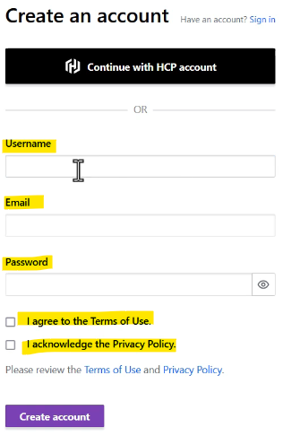

- [Terraform Cloud \& Enterprise Capabilities](#terraform-cloud--enterprise-capabilities)
  - [Overview of HashiCorp Cloud Platform for Terraform](#overview-of-hashicorp-cloud-platform-for-terraform)
    - [Introduction to HCP Terraform](#introduction-to-hcp-terraform)
    - [HashiCorp Cloud Platform (HCP) Terraform](#hashicorp-cloud-platform-hcp-terraform)
    - [Managing Infrastructure](#managing-infrastructure)
    - [Workspaces](#workspaces)
    - [Cost Estimation](#cost-estimation)
    - [Run History](#run-history)
    - [Practical Demonstration](#practical-demonstration)
    - [Additional Features](#additional-features)
    - [Pricing](#pricing)
    - [Personal Preference](#personal-preference)
    - [Recommendation](#recommendation)
  - [Creating a New HCP Terraform Account](#creating-a-new-hcp-terraform-account)
    - [Introduction to HCP Terraform](#introduction-to-hcp-terraform-1)
    - [Creating a Free Account](#creating-a-free-account)
    - [Creating an Organisation](#creating-an-organisation)
  - [Base Structure of HashiCorp Cloud Platform for Terraform](#base-structure-of-hashicorp-cloud-platform-for-terraform)
    - [Organisation](#organisation)
    - [Workspace](#workspace)
    - [Linking to Git Repository](#linking-to-git-repository)
    - [Comparison Between Workspace and Directory](#comparison-between-workspace-and-directory)
      - [Table of Comparison Between CLI and HCP Terraform Workspaces](#table-of-comparison-between-cli-and-hcp-terraform-workspaces)
    - [Projects](#projects)
    - [Important Points](#important-points)
  - [HCP Terraform Practical - Creating Organisation and Workspaces](#hcp-terraform-practical---creating-organisation-and-workspaces)
    - [Creating an Organisation](#creating-an-organisation-1)
    - [Creating a Project](#creating-a-project)
    - [Creating a Workspace](#creating-a-workspace)
    - [Exploring Other Features](#exploring-other-features)
  - [HCP Terraform - Core Practical](#hcp-terraform---core-practical)
    - [Creating a Workspace](#creating-a-workspace-1)
    - [Setting Up a GitHub Repository](#setting-up-a-github-repository)
    - [Linking Workspace to GitHub Repository](#linking-workspace-to-github-repository)
    - [Configuring Environment Variables](#configuring-environment-variables)
    - [Running Terraform Plan and Apply](#running-terraform-plan-and-apply)
  - [The CLI-driven Run Workflow in HCP](#the-cli-driven-run-workflow-in-hcp)
    - [Workflow Options in HCP Terraform](#workflow-options-in-hcp-terraform)
    - [CLI Driven Workflow](#cli-driven-workflow)
    - [Linking Local Directory to HCP Workspace](#linking-local-directory-to-hcp-workspace)
    - [Running Terraform Commands](#running-terraform-commands)
    - [Handling Errors](#handling-errors)
    - [End-to-End Workflow](#end-to-end-workflow)
  - [The CLI-driven Run Workflow - Practical](#the-cli-driven-run-workflow---practical)
    - [Setting Up Cloud Integration](#setting-up-cloud-integration)
    - [Terraform Login](#terraform-login)
    - [Initialising Terraform](#initialising-terraform)
    - [Running Terraform Plan and Apply](#running-terraform-plan-and-apply-1)
    - [Example Resource: cli-workflow.tf](#example-resource-cli-workflowtf)
    - [Verifying Execution](#verifying-execution)
  - [Overview of Sentinel](#overview-of-sentinel)
    - [Sentinel Overview](#sentinel-overview)
    - [Policy Structure](#policy-structure)
    - [High Level Structure](#high-level-structure)
    - [Example Policies](#example-policies)
    - [Creating a Workspace](#creating-a-workspace-2)
    - [Sentinel Policies](#sentinel-policies)
    - [Creating a Policy Set](#creating-a-policy-set)
    - [Creating a Policy](#creating-a-policy)
    - [Running Sentinel Policies](#running-sentinel-policies)
    - [Verifying Success](#verifying-success)
    - [Deleting a Workspace](#deleting-a-workspace)
    - [Limitations of Sentinel](#limitations-of-sentinel)
    - [Personal Note](#personal-note)
  - [Air Gapped Environments](#air-gapped-environments)
    - [Air Gapped Environment](#air-gapped-environment)
    - [Use Cases for Air Gapped Environments](#use-cases-for-air-gapped-environments)
    - [Challenges of Air Gapped Environments](#challenges-of-air-gapped-environments)
    - [Terraform Enterprise in Air Gapped Environments](#terraform-enterprise-in-air-gapped-environments)
    - [Key Points](#key-points)

<br>

<hr style="height:4px;background:black">

<br>

# Terraform Cloud & Enterprise Capabilities

## Overview of HashiCorp Cloud Platform for Terraform

### Introduction to HCP Terraform
* Provides a **GUI** for **managing infrastructure** using Terraform.
* `Former Name`: Previously referred to as **Terraform Cloud**.
* `Features`: Includes access control, private module registry, cost estimation, and more.

<br>


<br>

### HashiCorp Cloud Platform (HCP) Terraform
* HCP Terraform **manages Terraform runs** in a consistent and reliable environment with various features like access controls, private registry for sharing modules, policy controls and others.

<br>


<br>

### Managing Infrastructure
* `CLI vs. GUI`: 
  * Traditionally, Terraform commands are run via CLI. 
  * **HCP** Terraform offers an **alternative through a GUI**.
* `Project Linking`: Projects are linked to a Git repository, allowing HCP Terraform to fetch code and perform operations like terraform plan and terraform apply.

<br>

### Workspaces
* **Separate environments** within HCP Terraform for different **projects** or **accounts**.
  * **Example**: Workspaces for AWS hardening, Azure hardening, etc.
* `Code Management`: Each workspace has its own code and configuration.

<br>


<br>

### Cost Estimation
* Provides an **estimation** of the **cost associated** with deploying resources.
  * **Example**: Shows hourly and monthly costs for deploying an EC2 instance.

<br>


<br>

### Run History
* Stores the **history of runs**, including terraform plan and terraform apply **operations**.
  * It does this when you **link** it to your **GitHub repository**.
  * You can also see this in real time (i.e., during the applying phase).
* `Benefit`: Allows users to review previous runs and analyse changes.

<br>

### Practical Demonstration

`Steps`:
1. Link a Git repository containing Terraform code to a workspace.
2. Perform a `terraform plan` and review the plan and cost estimation.
3. Confirm and apply the plan to create resources.
   * **Example**: Creating an EC2 instance in AWS and reviewing the cost estimation.

<br>

### Additional Features
* `Usage Overview`: Provides insights into project **usage** and **compliance**.
* `Private Module Registry`: Allows organisations to manage their own private modules.

### Pricing
* `Free Tier`: Allows managing up to 500 resources per month.
* `Paid Plans`: Standard, Plus, and Enterprise plans with additional features.
* `Feature Comparison`: Different plans offer varying features, such as audit logging and compliance checks.

<br>


<br>

### Personal Preference
* `Terraform CLI`: For **personal projects**, the standard Terraform CLI is preferred due to its robustness and long-term reliability.
* `Dependency on HCP Terraform`: If heavily dependent on HCP Terraform and pricing increases significantly, switching back to CLI might be necessary, which could mean losing months of configuration efforts.

### Recommendation
* `Experience with HCP Terraform`: It's beneficial to manage some resources through HCP Terraform to gain experience, especially for working in larger organizations where automation and CI/CD pipelines are common.
* `Organisational Use`: Larger organizations may not have pricing constraints and can benefit from the advanced features of HCP Terraform.

> By understanding and using HCP Terraform, organizations can efficiently manage their infrastructure with enhanced features and a user-friendly interface.

<br>

<hr style="height:4px;background:black">

<br>

## Creating a New HCP Terraform Account
Documentation: https://www.hashicorp.com/products/terraform?utm_source=google&utm_channel_bucket=paid&utm_medium=sem&utm_campaign=CLOUD_EMEA_UKI_ENG_BOFU_PRACTITIONER_SEM_A_ALL_TERRAFORM_CLD_GG_BRAND_-_Obility&utm_content=terraform%20cloud-144080651246-645564370290&utm_offer=signup&gad_source=1&gclid=CjwKCAiAgoq7BhBxEiwAVcW0LFT2m5oPGgVfTwn8zSE1GXeG5GhpRiiwgJ_H8f0BRVufkpxSVAJdXxoCa6QQAvD_BwE

### Introduction to HCP Terraform
* Provides a GUI for managing infrastructure using Terraform.
* `Former Name`: Previously referred to as Terraform Cloud.

<br>

### Creating a Free Account

**Steps**:
1. Use Google to find the official page for [HCP Terraform](https://www.hashicorp.com/products/terraform?utm_source=google&utm_channel_bucket=paid&utm_medium=sem&utm_campaign=CLOUD_EMEA_UKI_ENG_BOFU_PRACTITIONER_SEM_A_ALL_TERRAFORM_CLD_GG_BRAND_-_Obility&utm_content=terraform%20cloud-144080651246-645564370290&utm_offer=signup&gad_source=1&gclid=CjwKCAiAgoq7BhBxEiwAVcW0LFT2m5oPGgVfTwn8zSE1GXeG5GhpRiiwgJ_H8f0BRVufkpxSVAJdXxoCa6QQAvD_BwE).
2. Go to the link app.terraform.io.
3. If you don't have an account, click on the option to create a free account.


<br>

4. Enter a unique username and your email address.
5. Configure a password for your account.



<br>

6. A verification link will be sent to your email. 
   * Click on the link to confirm your email address.

<br>


<br>

### Creating an Organisation
* `Prompt`: After verifying your email, you will be prompted to create your first organisation.


<br>

> By following these steps, you can create a free account on HCP Terraform and start exploring its features for managing infrastructure.

<br>

<hr style="height:4px;background:black">

<br>

## Base Structure of HashiCorp Cloud Platform for Terraform

### Organisation
* A **shared space** for one or more **teams to collaborate** on workspaces.

<br>


<br>

* `Multiple Organisations`: Users can **belong** to **multiple organisations**, each with its **own billing plans**.
* `Billing`: Managed at the organisational level.

<br>


<br>

### Workspace
* A set of **related files** **required** for a **project to run**, similar to a folder in a local workstation.
* `Multiple Workspaces`: Each project can have its **own workspace**.
  * **Example**: Workspaces for AWS hardening, Azure hardening, etc.

<br>

All of the files that you are used to like:


<br>

Will be here:


<br>

### Linking to Git Repository
* Instead of uploading files directly to the workspace, **link the workspace** to a Git repository where it can fetch code from.
* `Supported Providers`: GitHub, GitLab, Bitbucket, Azure DevOps.
  * **Example**: A workspace connected to a GitHub repository containing Terraform code.

<br>


<br>

For example:


<br>

### Comparison Between Workspace and Directory
* `Terraform Configuration`: In CLI, configuration lies on the disk; in HCP, it is linked to a version control repository.
* `Variable Values`: In CLI, defined in .tfvars files; in HCP, added directly to the workspace.
* `State File`: In CLI, stored in the same folder; in HCP, managed at the workspace level.
* `Credentials and Secrets`: In CLI, managed through shell environment or prompts; in HCP, stored as sensitive variables.

<br>

#### Table of Comparison Between CLI and HCP Terraform Workspaces

| Aspect                  | CLI                                      | HCP Terraform                          |
|-------------------------|------------------------------------------|----------------------------------------|
| Terraform Configuration | Configuration lies on the disk           | Linked to a version control repository |
| Variable Values         | Defined in .tfvars files                 | Added directly to the workspace        |
| State File              | Stored in the same folder                | Managed at the workspace level         |
| Credentials and Secrets | Managed through shell environment or prompts | Stored as sensitive variables          |

<br>

### Projects
* Allows organising workspaces into **groups**.
  * **Example**: A security team project with workspaces for AWS hardening, Azure hardening, and GCP hardening.
* `Benefits`: Defines the structure of the organisation based on ownership teams and provides access control.
  * You can **structure** your **projects** based on your organisation's **resource usage** and **ownership patterns**, such as teams, business units, or services.
  * With HCP Terraform Standard Edition, you can give teams **access to groups of workspaces using projects**.

<br>

For example:


<br>

### Important Points
* `Team Management`: Available in higher tiers, essential for larger organizations.
* `Feature Availability`: Not all features are available in the free tier; higher tiers offer more features.

> By understanding the basic structure and components of HCP Terraform, organisations can efficiently manage their infrastructure with enhanced features and a user-friendly interface.

<br>

<hr style="height:4px;background:black">

<br>

## HCP Terraform Practical - Creating Organisation and Workspaces

### Creating an Organisation

Steps:
1. Log in to the HCP Terraform account.
2. Create an organisation with a unique name (e.g., example-KP-labs-org).

<br>


<br>

> Options: After creating the organisation, multiple options related to projects, workspaces, registry, and settings become available.

<br>

### Creating a Project

Steps:
1. By default, a default project is created.
2. Create a new project (e.g., Terraform Learning).

<br>


<br>

> Navigation: Sometimes the GUI may have issues, so navigating back to the projects section may be necessary.

<br>

### Creating a Workspace

Steps:
1. Navigate to the workspace tab (this may happen automatically after creating a project).
2. Create a workspace and specify which project it belongs to (e.g., Terraform Learning).

<br>


<br>

> Workflows: Three workflows are available for creating a workspace: **version control**, **CLI driven**, and **API driven**.

<br>


<br>

### Exploring Other Features
* `Registry`: Allows organisations to use a **private** registry for managing their own **modules** and **providers**.

<br>


<br>

* `Settings`: Includes options for **generic settings**, **plan and billing**, and **user management**.

<br>


<br>

* `Plan and Billing`: Currently in the **free plan** with a resource limit of 500. 
  * Higher plans are available for more features.

<br>


<br>

* `User Management`: Ability to **invite multiple users**, especially useful for team collaboration.

<br>


<br>

> By understanding and creating these components in HCP Terraform, users can efficiently manage their infrastructure with enhanced features and a user-friendly interface.

<br>

<hr style="height:4px;background:black">

<br>

## HCP Terraform - Core Practical
Documentation: https://registry.terraform.io/providers/hashicorp/aws/latest/docs

### Creating a Workspace

Steps:
1. Navigate to the HCP Terraform account and select the **organization** (e.g., example-KP-labs-org).
2. Create a **workspace** within a project (e.g., Terraform Learning Project).


<br>

1. Choose the **workflow** for the workspace (e.g., version control workflow).
   * This is where it will **fetch** the **code** from a **specific git repository**, and based on this your workspace operation will happen.


<br>

### Setting Up a GitHub Repository

Steps:
1. Log in to a GitHub account and **create** a new repository (e.g., KP Labs Terraform Learning).


<br>

2. Create a **new file** in the repository (e.g., ec2.tf) with basic **Terraform code to deploy an EC2 instance**.


<br>

3. **Commit** the changes to the repository.


<br>

### Linking Workspace to GitHub Repository

`Steps`:
1. Select the **version control workflow** in HCP Terraform.


<br>

2. Connect to **GitHub** and **specify** the **repository** name.


<br>

* Select "GitHub.com".


<br>

* Choose your repo.


<br>

* If your repo is not showing, you can enter it's ID here:


<br>

3. **Confirm** the connection and **create** the workspace.


<br>

4. Configure Terraform variables.


<br>

### Configuring Environment Variables
* [AWS Provider](https://registry.terraform.io/providers/hashicorp/aws/latest/docs) documentation.

We will be taking our notes from this section specifically:


<br>

`Steps`:
1. Navigate to the **workspace** and open the **variables tab**.


<br>

2. Add **environment variables** for AWS access key, secret key, and region.
   * In order for it to deploy to an AWS account what it will need the credentials.


<br>

3. Generate new AWS access and secret keys if needed and mark them as sensitive.

<br>

### Running Terraform Plan and Apply

Steps:
1. Start a **new run** in the workspace.


<br>

2. HCP Terraform **fetches** the **code** from the GitHub repository and **runs** the **plan** operation.


<br>

3. Review the plan and confirm or discard the apply operation.


<br>

> By understanding and using the workspace features in HCP Terraform, users can efficiently manage their infrastructure with enhanced features and a user-friendly interface.

<br>

<hr style="height:4px;background:black">

<br>

## The CLI-driven Run Workflow in HCP

### Workflow Options in HCP Terraform
* `Version Control Workflow`: **Fetches** code from a **Git repository** and **performs operations** based on it.
* `CLI Driven Workflow`: Allows running Terraform **commands** from the **local machine** while linking to HCP Terraform.
* `API Driven Workflow`: Not covered in this video.

<br>

### CLI Driven Workflow
* In this approach, the **working directory** on your workstation is **linked** with **HCP Workspace**.
* The code file can be present in your **laptop**, and **plan/apply operations** can also be **initiated** from **local workstation**.

<br>


<br>

* Best for those comfortable with Terraform CLI and who prefer **not** to commit files to a Git repository.
* `Setup`: The local working directory is linked with the HCP Terraform workspace.

<br>

### Linking Local Directory to HCP Workspace

`Steps`:
1. Create a **workspace** in HCP Terraform (e.g., remote-operation-workspace).


<br>

2. **Link** the **local** working **directory** to the HCP workspace using the **cloud block** in the Terraform configuration file.

**Example**:

```bash
terraform {
  cloud {
    organization = "my-KP-labs-org"
    
    workspaces {
      name = "remote-operation-workspace"
    }
  }
}

resource "aws_security_group" "allow_tls" {
    name = "allow_tls"
}
```

<br>

### Running Terraform Commands

`Steps`:
1. Run `terraform plan` from the **local** terminal. The plan operation runs in HCP Terraform and streams the output to the local terminal.

**Example**:

```bash
terraform plan
```

2. Run `terraform apply` to create resources. The apply operation runs in HCP Terraform.

**Example**:

```bash
terraform apply -auto-approve
```

<br>

### Handling Errors
* **Example**: If AWS credentials are not configured in the HCP workspace, the plan operation will fail.
* `Solution`: Update the AWS access key and secret key in the HCP workspace variables.

<br>

### End-to-End Workflow

`Steps`:
1. Configure AWS credentials in the HCP workspace.
2. Run `terraform plan` and `terraform apply` from the local terminal.
3. Verify the creation of resources in the AWS console.
4. Run `terraform destroy` to remove resources.

<br>

> By understanding and using the CLI driven workflow in HCP Terraform, users can efficiently manage their infrastructure while leveraging the benefits of HCP Terraform.

<br>

<hr style="height:4px;background:black">

<br>

## The CLI-driven Run Workflow - Practical

### Setting Up Cloud Integration

`Steps`:
1. Create a **workspace** in **HCP Terraform** and select the **CLI driven workflow**.


<br>

2. Use the example code provided to set up the cloud integration.


<br>

3. Modify the organisation and workspace names in the code.
   * You have to **add code block** within your .tf file to **setup cloud integration**.
   * This code will contain details about your **HCP organisation** and **workspace name**.

**Example**:

```bash
terraform {
  cloud {
    organization = "mykplabs-org"
    workspaces {
      name = "CLI-driven-workflow"
    }
  }
}
```

<br>

### Terraform Login

`Steps`:
1. Once your cloud integration code block has been added, run the `terraform login` command to **authenticate** with HCP Terraform.


<br>

**Example**:

```bash
terraform login
```


<br>

2. Generate a **token** from the HCP Terraform website and enter it in the CLI.
   * This will take you to a new tab.


<br>

* Go back to your terminal where you used "terraform login" and paste the token code where prompted.


<br>

### Initialising Terraform

`Steps`:
1. Run the `terraform init` command to initialise the configuration.

**Example**:

```bash
terraform init
```

<br>


<br>

### Running Terraform Plan and Apply
* Once initialised, the terraform “plan”, and “apply” commands when entered through **CLI will run in HCP Terraform** with **output** **streamlined in terminal**.

`Steps`:
1. Run the `terraform plan` command to create an execution plan.


<br>

2. Run the `terraform apply` command to apply the changes and create resources.


<br>

**Example**:

```bash
terraform plan
terraform apply -auto-approve
```

<br>

### Example Resource: cli-workflow.tf

`Code`:

```bash
resource "time_sleep" "wait_10_seconds" {
  create_duration = "10s"
}
```

<br>

### Verifying Execution

`Steps`:
1. Check the HCP Terraform workspace to **verify the run**.
2. **Compare** the Terraform version in the **local machine** and **HCP Terraform** to ensure the plan is running in HCP Terraform.

<br>

> By following these practical steps, users can efficiently set up and use the CLI driven run workflow in HCP Terraform, leveraging the benefits of HCP Terraform while running commands from their local machine.

<br>

<hr style="height:4px;background:black">

<br>

## Overview of Sentinel
Documentation: 
* Sentinel: https://developer.hashicorp.com/terraform/tutorials/policy/sentinel-policy
* AWS Provider: Documentation: https://registry.terraform.io/providers/hashicorp/aws/latest/docs

### Sentinel Overview
* Sentinel is a **policy-as-code** framework integrated with the HashiCorp Enterprise products.
* It enables fine-grained, logic-based **policy decisions**, and can be extended to use information from external sources.
> Note: Sentinel policies are paid feature
* Allows users to add **logic-based policy decisions**.
* `Function`: Depending on the policy, Terraform "Apply" can either run or be blocked.

<br>


<br>

### Policy Structure
* **Example Policy**: "Block EC2 Without Tags" - Blocks any EC2 instance creation without tags.
* `Policy Sets`: Policies are attached to policy sets, which are associated with Terraform Cloud workspaces.

<br>

### High Level Structure


<br>

### Example Policies
* `Disallowing 0.0.0.0/0 CIDR Block`: Prevents security groups from having a 0.0.0.0/0 CIDR block.
* `Mandatory Tags on AWS Resources`: Ensures all taggable AWS resources have mandatory tags.

<br>

### Creating a Workspace

`Steps`:
1. Create a new workspace using the version control workflow.


<br>

2. Integrate with GitHub and use a Terraform repository.
3. Name the workspace (e.g., sentinel).

<br>

### Sentinel Policies
* `Paid Feature`: Sentinel policies are available only in paid plans.
* `Upgrading Plan`: Upgrade to a trial or paid plan to use Sentinel.

### Creating a Policy Set

`Steps`:
* Create a policy set and connect it to a workspace.
  * **Example**: Name the policy set sentinel-policy-set and associate it with the sentinel workspace.

<br>

### Creating a Policy

`Steps`:
1. Create a new policy (e.g., check-ec2-tags).

<br>


<br>

2. Add policy code to check for tags on EC2 instances.


<br>

3. Set enforcement mode (e.g., hard mandatory, soft mandatory, advisory).


<br>

### Running Sentinel Policies

`Steps`:
1. Set environment variables (e.g., AWS access key, secret key) in the workspace.


<br>

2. Start a new run and verify cost estimation and policy checks.


<br>

> If the policy check fails (e.g., EC2 instance without tags), the apply operation will be blocked.

<br>

### Verifying Success

`Steps`:
1. Add tags to the EC2 instance in the Terraform code.
2. Commit the changes and rerun the plan.
3. Verify that the policy check passes and the apply operation can proceed.

<br>

### Deleting a Workspace

`Steps`:
1. Go to workspace settings.
2. Select destruction and deletion.


<br>

3. Delete the workspace from Terraform Cloud.

<br>

### Limitations of Sentinel
* `Scope`: Sentinel is useful for resources created through Terraform but does not cover manual changes in AWS.
* `Recommendation`: Use AWS Config for additional policy checks at the AWS level.

<br>

### Personal Note
* `Usage`: Sentinel and Terraform Cloud/Enterprise are not extensively used in all organisations. Many large-scale organizations manage production environments efficiently with the free version of Terraform.

> By understanding and using Sentinel in HCP Terraform, users can enforce policies and ensure compliance in their infrastructure management.

<br>

<hr style="height:4px;background:black">

<br>

## Air Gapped Environments

### Air Gapped Environment
* A network security measure where a **secured computer network** is **physically isolated** from unsecured networks, such as the public Internet.

<br>


<br>

`Types`:
* **Connected Environment**: Servers connected to the Internet via an Internet gateway.
* **Air Gapped Environment**: Servers connected internally without any gateway to the Internet, ensuring isolation from unsecured networks.

<br>

### Use Cases for Air Gapped Environments
* `Military`: Secure communication and operations.
* `Governmental Systems`: Protect sensitive data and operations.
* `Financial Systems`: Secure transactions and data in stock exchanges.
* `Industrial Control Systems`: Secure operations in oil and gas fields.

<br>

### Challenges of Air Gapped Environments
* `No Internet Connectivity`: Difficulty in downloading patches, updates for operating systems, antivirus, IPS systems, etc.
* `Preparation`: Requires all necessary configurations and updates to be prepared offline.

<br>

### Terraform Enterprise in Air Gapped Environments

`Installation Methods`:
* **Online Method**: Requires Internet connectivity, straightforward installation.
* **Air Gapped Method**: Does not require Internet connectivity, needs offline preparation.
* **Air Gapped Installation**: Requires providing an airgap bundle path or uploading the airgap bundle during installation.

<br>

### Key Points
* Air Gap based approach is possible using Terraform Enterprise.
* Understanding where Air Gapped environments are used and their benefits.

> By understanding Air Gapped environments and their application in Terraform Enterprise, users can ensure secure and isolated infrastructure management.

<br>

<hr style="height:4px;background:black">
