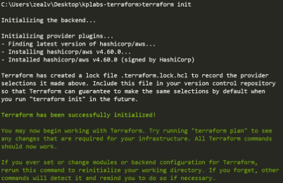

- [Deploying Infrastructure with Terraform](#deploying-infrastructure-with-terraform)
  - [Authentication and Authorisation](#authentication-and-authorisation)
    - [Authentication and Authorization in Terraform](#authentication-and-authorization-in-terraform)
      - [Authentication](#authentication)
      - [Authorisation](#authorisation)
    - [Practical Example in AWS](#practical-example-in-aws)
    - [Provider-Specific Credentials](#provider-specific-credentials)
      - [Example of AWS Provider in Terraform](#example-of-aws-provider-in-terraform)
      - [Example of GitHub Provider in Terraform](#example-of-github-provider-in-terraform)
    - [Authorisation Flexibility](#authorisation-flexibility)
    - [Creating Tokens in GitHub](#creating-tokens-in-github)
  - [Create User for AWS Account](#create-user-for-aws-account)
    - [Instructions for Creating a New User in AWS IAM](#instructions-for-creating-a-new-user-in-aws-iam)
    - [Using the Credentials in Terraform](#using-the-credentials-in-terraform)
  - [Launch a Virtual Machine via Terraform](#launch-a-virtual-machine-via-terraform)
    - [Creating and Managing EC2 Instances with Terraform](#creating-and-managing-ec2-instances-with-terraform)
    - [Steps to Create an EC2 Instance Using Terraform](#steps-to-create-an-ec2-instance-using-terraform)
    - [Modifying EC2 Instance Configuration](#modifying-ec2-instance-configuration)
    - [Key Points](#key-points)
  - [Resource and Providers](#resource-and-providers)
    - [Terraform Providers and Resources](#terraform-providers-and-resources)
    - [Exploring Terraform Providers](#exploring-terraform-providers)
    - [Example: Adding AWS and Azure Providers](#example-adding-aws-and-azure-providers)
    - [Resource Blocks](#resource-blocks)
    - [Key Points](#key-points-1)
    - [Practical Example](#practical-example)
    - [Important Considerations](#important-considerations)
    - [Handling Bugs and Issues](#handling-bugs-and-issues)
  - [Provider Tiers](#provider-tiers)
    - [Terraform Provider Tiers](#terraform-provider-tiers)
    - [Exploring Provider Tiers](#exploring-provider-tiers)
    - [Practical Example](#practical-example-1)
    - [Using Providers in Terraform](#using-providers-in-terraform)
    - [Practical Example with DigitalOcean Provider](#practical-example-with-digitalocean-provider)
    - [Key Points](#key-points-2)
  - [Create GitHub Repository via Terraform](#create-github-repository-via-terraform)
    - [Understanding the GitHub Provider](#understanding-the-github-provider)
    - [Steps to Generate a Personal Access Token (PAT)](#steps-to-generate-a-personal-access-token-pat)
      - [Setting Up Terraform Configuration](#setting-up-terraform-configuration)
    - [Creating a Repository with Terraform](#creating-a-repository-with-terraform)
    - [Verification](#verification)
    - [Key Terraform Commands](#key-terraform-commands)
    - [Tips for Beginners](#tips-for-beginners)
  - [What the script looks like](#what-the-script-looks-like)
  - [Terraform Destroy](#terraform-destroy)
    - [Overview](#overview)
    - [Steps to Destroy Resources](#steps-to-destroy-resources)
    - [Practical Example](#practical-example-2)
    - [Important Considerations](#important-considerations-1)
  - [Understanding Terraform State Files](#understanding-terraform-state-files)
    - [Overview](#overview-1)
    - [Key Concepts](#key-concepts)
    - [Practical Example](#practical-example-3)
    - [Important Considerations](#important-considerations-2)
  - [Unserstanding Desired \& Current States](#unserstanding-desired--current-states)
    - [Overview](#overview-2)
    - [Key Concepts](#key-concepts-1)
    - [Practical Example](#practical-example-4)
    - [Important Considerations](#important-considerations-3)
  - [Challenges with the Current Sate on Computed Values](#challenges-with-the-current-sate-on-computed-values)
    - [Overview](#overview-3)
    - [Key Concepts](#key-concepts-2)
    - [Practical Example](#practical-example-5)
    - [Important Considerations](#important-considerations-4)
  - [Terraform Provider Versioning](#terraform-provider-versioning)
    - [Overview](#overview-4)
    - [Key Concepts](#key-concepts-3)
    - [Practical Example](#practical-example-6)
    - [Important Considerations](#important-considerations-5)
    - [Best Practices](#best-practices)
  - [Terraform Refresh](#terraform-refresh)
    - [Terraform Refresh Functionality](#terraform-refresh-functionality)
    - [Key Concepts](#key-concepts-4)
    - [Practical Example](#practical-example-7)
    - [Important Considerations](#important-considerations-6)
  - [AWS Provider - Authentication Configuration](#aws-provider---authentication-configuration)
    - [AWS Provider Authentication Configuration in Terraform](#aws-provider-authentication-configuration-in-terraform)
    - [Key Concepts](#key-concepts-5)
    - [Avoid Hard Coding Credentials](#avoid-hard-coding-credentials)
      - [Alternative Authentication Methods](#alternative-authentication-methods)
    - [Using AWS CLI](#using-aws-cli)
    - [Practical Example](#practical-example-8)
    - [Additional Notes](#additional-notes)
    - [Best Practices](#best-practices-1)
- [Quiz](#quiz)

<br>

<hr style="height:4px;background:black">

<br>

# Deploying Infrastructure with Terraform

## Authentication and Authorisation

### Authentication and Authorization in Terraform
#### Authentication
* Authentication is the **process** of **verifying who a user is**.
* `Credentials`: Depending on the provider, authentication credentials can be a **username** and **password**, a token, etc.
  * **Example**: When you log in to AWS as a user named Alice, the authentication process checks if the user Alice exists.

#### Authorisation
* Authorisation is the process of **verifying** what **access a user has**.
* `Permissions`: Users can have **different levels** of access, such as admin access, read-only access, or no access.
  * **Example**: Alice might be a user in AWS but may not have any permissions assigned. Authorization determines what actions Alice can perform.

<br>

### Practical Example in AWS
`Creating a User`:
1. Go to the AWS **Management** Console.
2. Navigate to **IAM** (Identity and Access Management).
3. Create a new user (e.g., Alice).
4. Assign permissions (e.g., administrator access, read-only access).

`Terraform and Permissions`:
* In Terraform, you need to provide credentials with relevant permissions to create and manage resources.
  * Example: For AWS, you might need to supply access and secret keys.

<br>

### Provider-Specific Credentials
* `AWS Provider`: Requires access and secret keys.
* `GitHub Provider`: Requires a token.
* `Kubernetes Provider`: May require a kubeconfig file or credentials config.

#### Example of AWS Provider in Terraform
* `Documentation`: Check the provider's documentation for authentication and configuration details.
* **AWS Example**: Access and secret keys are needed for authentication.

#### Example of GitHub Provider in Terraform
* `Documentation`: Check the provider's documentation for authentication details.
* **GitHub Example**: A token is needed for authentication.

<br>

### Authorisation Flexibility
* `Permissions`: Providers offer flexibility in defining what actions a user can perform.
  * **Example**: In GitHub, you can create a token with specific permissions (e.g., read and write access to repositories).

<br>

| Provider       | Access Credentials                  |
|----------------|-------------------------------------|
| AWS            | Access Keys and Secret Keys         |
| GitHub         | Tokens                              |
| Kubernetes     | Kubeconfig file, Credentials Config |
| Digital Ocean  | Tokens                              |

<br>

### Creating Tokens in GitHub
`Go to Settings`:
1. Navigate to the **settings** page in GitHub.

`Create a Token`:
1. Specify the permissions for the token (e.g., access to all repositories or selected repositories).

2. Define access patterns for different features (e.g., read and write access for discussions, no access for pull requests).

<br>

<hr style="height:4px;background:black">

<br>

## Create User for AWS Account
GitHub source: https://github.com/zealvora/terraform-beginner-to-advanced-resource/blob/master/Section%201%20-%20Deploying%20Infrastructure%20with%20Terraform/first-ec2.md

### Instructions for Creating a New User in AWS IAM
`Go to the IAM Console`:
1. Open the AWS Management Console.
2. Navigate to the IAM (Identity and Access Management) service.
   
<br>

`Add a New User`:
1. In the IAM console, go to the "Users" section.


1. Click on "Add user".
2. Enter the username (e.g., "Terraform").


<br>

`Set Permissions`:
1. Click "Next" to proceed to the **permissions** settings.
2. Attach the "AdministratorAccess" permission to the user. 
   * This grants full access to AWS services and resources.


<br>

`Review and Create User`:
1. Scroll down and click "Next".
2. Review the settings and click "Create user".

<br>

`Generate Access and Secret Keys`:
1. Once the user is created, click on the **username** to open the user details.
2. Go to the "Security credentials" tab.


3. Click on "Create access key".


<br>

`Select CLI Option`:
1. Select the "Command Line Interface (CLI)" option.


2. Check the **checkbox** to confirm.
3. Click "Next" and then "Create access key".

<br>

`Store Access and Secret Keys`:
1. Copy the access key and secret key.


2. Store these keys securely in your workstation. 
   * You can create a simple text file to save them or create an environment variable on your system.

Example:
```
Access Key: YOUR_ACCESS_KEY
Secret Key: YOUR_SECRET_KEY
```

<br>

### Using the Credentials in Terraform
Add Credentials to Terraform:
* When writing Terraform code, use the access and secret keys to authenticate with AWS.

Example Terraform configuration:

```bash
provider "aws" {
  access_key = "YOUR_ACCESS_KEY"
  secret_key = "YOUR_SECRET_KEY"
  region     = "us-west-2"
}
```

<br>

<hr style="height:4px;background:black">

<br>

## Launch a Virtual Machine via Terraform

### Creating and Managing EC2 Instances with Terraform
* `EC2` (Elastic Compute Cloud): A **virtual server** or **virtual machine** that you launch in AWS.
* `Considerations`: When creating an EC2 instance, consider the **region** and the virtual machine **configuration** (CPU, memory, storage, operating system).

### Steps to Create an EC2 Instance Using Terraform
`Set Up Workspace`:
1. Create a new folder on your desktop (e.g., "kplab-terraform").
2. Open the folder in Visual Studio Code.

<br>

`Create Terraform File`:
1. Create a new file (e.g., "first_ec2.tf").
2. Ensure the file extension is .tf.

<br>

`Configure AWS Provider`:
1. Define the provider in the Terraform file:

```bash
provider "aws" {
  region     = "us-east-1"
  access_key = "YOUR_ACCESS_KEY"
  secret_key = "YOUR_SECRET_KEY"
}
```

* Replace "YOUR_ACCESS_KEY" and "YOUR_SECRET_KEY" with your actual AWS credentials.

<br>

`Define EC2 Instance Resource`:
1. Add the resource definition to your Terraform file:

```bash
resource "aws_instance" "myEC2" {
  ami           = "ami-0c55b159cbfafe1f0" # Example AMI ID for Amazon Linux
  instance_type = "t2.micro"             # Free tier eligible instance type
}
```

<br>

`Initialise Terraform`:
1. Open a terminal in Visual Studio Code.
2. Ensure you are in the "kplab-terraform" folder.
3. Run **terraform init** to initialise the configuration and download the necessary provider plugins.

<br>



<br>

`Plan and Apply Terraform Configuration`:
1. Run **terraform plan** to see what Terraform will create or destroy based on the code.
2. Verify the output to ensure everything is correct.
3. Run **terraform apply** to create the EC2 instance. Confirm the action when prompted by typing yes.

<br>

`Verify EC2 Instance`:
1. Go to the **AWS Management** Console.
2. Navigate to the **EC2** service.
3. Verify that the instance is running in the specified region (e.g., North Virginia).

<br>

### Modifying EC2 Instance Configuration
`Add Tags to EC2 Instance`:
1. Modify the Terraform file to include tags:

```bash
resource "aws_instance" "myEC2" {
  ami           = "ami-0c55b159cbfafe1f0"
  instance_type = "t2.micro"
  tags = {
    Name = "myFirstEC2"
  }
}
```

2. Save the file.

<br>

`Apply Changes`:
1. Run **terraform plan** to see the changes.
2. Run **terraform apply** to apply the changes. Confirm the action by typing yes.

<br>

`Verify Changes`:
1. Go to the **AWS Management** Console.
2. Navigate to the **EC2** service.
3. Verify that the instance now has the specified tags.

<br>

`Revert Changes`:
1. Modify the Terraform file to remove the tags.
2. Run **terraform apply** to apply the changes. Confirm the action by typing yes.

<br>

### Key Points
* `Provider Configuration`: The provider configuration remains the same for different resources in AWS.
* `Authentication`: Terraform needs access credentials with relevant permissions to create and manage resources.
* `Documentation`: Refer to the Terraform documentation for specific resource configurations and examples.

<br>

<hr style="height:4px;background:black">

<br>

## Resource and Providers

### Terraform Providers and Resources
`Terraform Providers`:
* Terraform supports multiple providers, allowing you to create and manage infrastructure across various platforms like AWS, Azure, GCP, Alibaba, Kubernetes, etc.

`Provider Plugins`: 
* Providers are plugins that let Terraform manage external APIs. 
* When you add a provider configuration block in your .tf file, you need to run terraform init to download the appropriate plugins.

<br>

### Exploring Terraform Providers
* `Terraform Registry`: Visit Terraform Registry to explore over 3000 available providers.
* `Provider Configuration`: Specify the provider in your .tf file to download the necessary plugins.

<br>

### Example: Adding AWS and Azure Providers
`AWS Provider`:

```bash
provider "aws" {
  region     = "us-east-1"
  access_key = "YOUR_ACCESS_KEY"
  secret_key = "YOUR_SECRET_KEY"
}
```

`Azure Provider`:

```bash
provider "azurerm" {
  features {}
}
```

Run `terraform init`:
* This command downloads the necessary provider plugins and stores them in the .terraform directory.

<br>

### Resource Blocks
* A resource block **describes** one or more **infrastructure objects** **associated** with a **provider**.

**Example**: Creating an EC2 instance in AWS:

```bash
resource "aws_instance" "myEC2" {
  ami           = "ami-0c55b159cbfafe1f0"
  instance_type = "t2.micro"
}
```

<br>

### Key Points
* `Resource Type and Local Name`: The combination of resource type (e.g., aws_instance) and local name (e.g., myEC2) serves as an identifier and must be unique.
* `Multiple Instances`: To create multiple instances, use different local names:

```bash
resource "aws_instance" "myEC2" {
  ami           = "ami-0c55b159cbfafe1f0"
  instance_type = "t2.micro"
}

resource "aws_instance" "web" {
  ami           = "ami-12345678"
  instance_type = "t3.micro"
}
```

<br>

### Practical Example
`Define Resources`:
1. Add the resource block to your .tf file.
2. Ensure the local names are unique.

Run `terraform plan`:
* This command shows what Terraform will create or destroy based on the code.

Run `terraform apply`:
* This command creates the resources in the specified provider. Confirm the action when prompted.

<br>

### Important Considerations
* `Provider-Specific Resources`: You can only use resources supported by the specified provider. 
  * For **example**, aws_instance can only be managed by the AWS provider plugin.
* `Multiple Providers`: A single Terraform configuration can include multiple provider plugins, allowing you to manage resources across different platforms.

<br>

### Handling Bugs and Issues
* `Provider Bugs`: Even providers officially maintained by HashiCorp can have bugs. 
  * If you encounter inconsistencies, you can raise an issue on the provider's GitHub page.
* `GitHub Pages`: Terraform has multiple GitHub pages for different providers. 
  * You can check for existing issues or raise new ones if needed.
    * **Example**: The AWS provider's GitHub page shows pull requests and issues related to bugs and documentation.

<br>

<hr style="height:4px;background:black">

<br>

## Provider Tiers

### Terraform Provider Tiers
Terraform providers are maintained at **three** different tiers:

* `Official Providers`: Owned and maintained by HashiCorp.
* `Partner Providers`: Owned and maintained by technology companies with a direct partnership with HashiCorp.
* `Community Providers`: Owned and maintained by individual contributors.

<br>


<br>

### Exploring Provider Tiers
Visit the [Terraform Registry](https://registry.terraform.io/) to explore providers.

`Provider Tiers`:
* **Official Providers**: Maintained by HashiCorp (e.g., AWS, Azure).
* **Partner Providers**: Maintained by partners (e.g., Alibaba Cloud, Oracle Cloud Infrastructure).
* **Community Providers**: Maintained by individual contributors.

### Practical Example
`Search for Providers`:
1. Go to the Terraform Registry.
2. Search for official providers, partner providers, and community providers.

`Provider Namespaces`:
* **Official Providers**: Namespace is "hashicorp" (e.g., hashicorp/aws, hashicorp/azurerm).
* **Partner Providers**: Namespace varies by partner (e.g., alibaba/alicloud, oracle/oci).
* **Community Providers**: Namespace varies by contributor (e.g., onepassword/onepassword).

<br>


<br>

### Using Providers in Terraform
`Official Providers`: Can be used with a simple provider block.

```bash
provider "aws" {
  region     = "us-east-1"
  access_key = "YOUR_ACCESS_KEY"
  secret_key = "YOUR_SECRET_KEY"
}
```

<br>

`Non-HashiCorp Providers`: Require explicit source information using the required_providers block.

```bash
terraform {
  required_providers {
    digitalocean = {
      source = "digitalocean/digitalocean"
    }
  }
}

provider "digitalocean" {
  token = "YOUR_API_TOKEN"
}
```

<br>

### Practical Example with DigitalOcean Provider
`Add Provider Block`:
1. Add the DigitalOcean provider block to your .tf file.
2. Specify the source in the required_providers block.

Run `terraform init`:
1. Initialise the configuration to download the necessary provider plugins.

**Example**:

```bash
terraform {
  required_providers {
    digitalocean = {
      source = "digitalocean/digitalocean"
    }
  }
}

provider "digitalocean" {
  token = "YOUR_API_TOKEN"
}
```

<br>

`Handle Errors`:
* If you encounter errors, ensure the correct namespace is specified.
  * **Example error**: "Failed to query the available providers" if the namespace is incorrect.

### Key Points
* `Provider Tiers`: Use official providers for production environments. Partner providers are also stable. Avoid community providers if possible due to potential bugs.
* `Namespaces`: Ensure the correct namespace is specified for non-HashiCorp providers.
* `Required Providers Block`: Essential for non-HashiCorp providers and community providers.

<br>

<hr style="height:4px;background:black">

<br>

## Create GitHub Repository via Terraform
** not tested. Just notes. 

### Understanding the GitHub Provider
* GitHub is a popular service for **hosting** Git **repositories**.
* Terraform's GitHub provider allows us to **interact** with GitHub resources **programmatically**, such as creating repositories.

**Authentication**:
* Terraform requires **GitHub credentials** to connect and perform actions.
* Authentication is done using a **personal access token** (PAT).

<br>

### Steps to Generate a Personal Access Token (PAT)
1. Log in to your GitHub account.
2. Navigate to **Settings** > **Developer Settings** > **Personal Access Tokens**.
3. Select **Fine-Grained Tokens** and click **Generate Token**.

<br>

`Configure the token`:

* Name: e.g., Terraform.
* Repository Access: Select "All Repositories".
* Permissions: Under "Administration," select Read and Write Access.
* Generate and copy the token. Keep it secure!

<br>

#### Setting Up Terraform Configuration

`Install Terraform`:
* Make sure Terraform is installed on your system. 
  * If not, download and install it from the official site.

`Initialize Your Terraform Project`:
* Create a working directory (e.g., terraform-github-demo).
* Open the directory in your preferred code editor (e.g., VS Code).

`Define the Provider`:
* Create a file named **github.tf** and add the following:

```bash
terraform {
  required_providers {
    github = {
      source  = "integrations/github"
      version = "latest"
    }
  }
}

provider "github" {
  token = "<YOUR_PERSONAL_ACCESS_TOKEN>" # Replace with your PAT
}
```

<br>

### Creating a Repository with Terraform
`Define the Repository Resource`:
* In the same github.tf file, define the GitHub repository resource:

```bash
resource "github_repository" "example" {
  name       = "example"  # Name of your repository
  visibility = "public"    # Can be "private" or "public"
}
```

<br>

`Initialize Terraform`:
Run the following command in your terminal to download the required provider plugins:
* terraform init

<br>

`Preview the Changes`:

Run a terraform plan to see what Terraform will do:
* terraform plan

> You should see a plan to add a new GitHub repository named example.

<br>

`Apply the Changes`:

Run the following command to create the repository:
* terraform apply

> When prompted, type yes to confirm.

<br>

### Verification
* Log in to your GitHub account and check your repositories.
* You should see the newly created repository with the name specified in the github.tf file.

### Key Terraform Commands
* `terraform init`: Downloads provider plugins.
* `terraform plan`: Previews the changes Terraform will make.
* `terraform apply`: Applies the changes to create/update resources.

### Tips for Beginners
* Always start with **small**, **manageable** Terraform configurations.
* Use the [Terraform Registry](https://registry.terraform.io/) to explore providers and resources.
* Keep your personal access tokens **secure** and **avoid hardcoding** them in your code. 
  * Use **environment variables** or **secret management** tools if possible.
* Understand the basics of the platform you're working with (e.g., GitHub, Azure).

<br>

## What the script looks like

```bash

terraform {
  required_providers {
    github = {
      source  = "integrations/github"
      version = "~> 5.0"
    }
  }
}

provider "github" {
  token = "your-token-here"
}

resource "github_repository" "example" {
  name        = "example"
  description = "My awesome codebase"

  visibility = "public"

}
```

<br>

<hr style="height:4px;background:black">

<br>

## Terraform Destroy

### Overview
* `Importance`: It's crucial to destroy resources after testing to avoid unnecessary charges, especially with cloud providers like AWS.
* `Resources`: We have created an EC2 instance and a GitHub repository using Terraform.

<br>

### Steps to Destroy Resources
`Destroy All Resources`:
* `Command`: 'terraform destroy'.
* `Effect`: This command will destroy all resources defined in the Terraform configuration files within the current folder.
* `Confirmation`: Terraform will ask for confirmation before proceeding with the destruction.

`Destroy Specific Resources`:
* `Command`: terraform destroy -target
* `Effect`: This command allows you to target and destroy specific resources without affecting others.
* `Syntax`: terraform destroy -target=resource_type.local_name

**Example**:

```bash
terraform destroy -target=aws_instance.myEC2
```

* `Confirmation`: Terraform will ask for confirmation before proceeding with the destruction.

<br> 

### Practical Example
`Destroy All Resources`:
1. Navigate to the folder containing your Terraform configuration files.
2. Run the terraform destroy command: terraform destroy.
3. Confirm the action by typing **yes**.

`Destroy Specific Resource` (EC2 Instance):
1. Run the terraform destroy -target command: terraform destroy -target=aws_instance.myEC2.
2. Confirm the action by typing **yes**.

`Verify Destruction`:
1. Check the AWS Management Console to ensure the EC2 instance is terminated.
2. Refresh the console if necessary to see the updated instance state.

<br>

### Important Considerations
`Code Maintenance`:
* Even after destroying a resource, the code for that resource remains in the .tf file.
* Terraform will recreate the resource if the code is still present and you run terraform apply.
* Solution: Comment out or remove the code for resources you no longer need.

`Commenting Out Code`:
* To prevent Terraform from recreating a resource, comment out the relevant code:

```bash
# resource "aws_instance" "myEC2" {
#   ami           = "ami-0c55b159cbfafe1f0"
#   instance_type = "t2.micro"
# }
```

`Plan Before Apply`:
* Always run terraform plan to see what changes will be made before applying them: terraform plan.

<br>

<hr style="height:4px;background:black">

<br>

## Understanding Terraform State Files

### Overview
* `Terraform State File`: The state file is crucial for Terraform to **map** **real-world resources** to your **configuration**.
* `Purpose`: It **tracks** the **state** of your **infrastructure** and helps Terraform determine what **resources** need to be **created**, **updated**, or **destroyed**.

<br>

### Key Concepts
`State File Storage`:
* Terraform **stores the state** of the infrastructure in a file called terraform.tfstate.
* This file contains information about all resources managed by Terraform.

`Resource Tracking`:
* When you create resources (e.g., EC2 instance, GitHub repository), Terraform **stores** their **information** in the **state file**.
* If a resource is destroyed, its state information is removed from the state file.

`Terraform Plan`:
* When you run 'terraform plan', Terraform **compares** the **state file** with your **configuration** to **determine** what **changes are needed**.
* If a resource's state is missing, Terraform will plan to create it.

<br>

### Practical Example
`Uncomment Code`:
* Uncomment the code for the EC2 instance and GitHub repository in your .tf files.

`Check State File`:
* The terraform.tfstate file should reflect the current state of your resources.

`Example content`:

```json
{
  "resources": [
    {
      "type": "aws_instance",
      "name": "myEC2",
      "instances": [
        {
          "attributes": {
            "id": "i-1234567890abcdef0",
            "public_ip": "34.219.123.456"
          }
        }
      ]
    },
    {
      "type": "github_repository",
      "name": "example",
      "instances": [
        {
          "attributes": {
            "full_name": "demokplabs/terraform-repo"
          }
        }
      ]
    }
  ]
}
```

<br>

`Destroy a Resource`:
* Run 'terraform destroy -target=aws_instance.myEC2' to destroy the EC2 instance.
* Verify that the state file no longer contains the EC2 instance information.

`Plan and Apply`:
* Run 'terraform plan' to see what Terraform will create.
* Run 'terraform apply' to create the resources. 
  * Confirm the action by typing yes.

`Verify Resources`:
* Check the AWS Management Console and GitHub to ensure the resources are created.
* The state file should now include information about the newly created resources.

<br>

### Important Considerations
`Do Not Edit State File`:
* Avoid manually editing the terraform.tfstate file to prevent inconsistencies and errors.

`Backup State File`:
* Always keep a backup of the state file. If the state file is lost, Terraform cannot track the infrastructure.

`State File Contains Detailed Information`:
* The state file includes detailed information about each resource, such as IP addresses, security groups, and more.

`Impact of Deleting State File`:
* If the state file is deleted, Terraform will assume all resources need to be created again.
  * **Example**: Deleting the state file and running terraform plan will show all resources as new additions.

<br>

<hr style="height:4px;background:black">

<br>

## Unserstanding Desired & Current States 

### Overview
* `Desired State`: The configuration defined in your Terraform files, representing the intended state of your infrastructure.
* `Current State`: The actual state of the resources currently deployed.

### Key Concepts
`Desired State`:
* Defined by the Terraform configuration files.
  * **Example**: An EC2 instance with a specific image ID and instance type.
* Terraform's primary function is to create, modify, and destroy resources to match the desired state.

`Current State`:
* The actual state of the resources currently deployed.
  * **Example**: An EC2 instance running with a different instance type than specified in the desired state.

`State Mismatch`:
* Desired state and current state may not always match.
  * **Example**: Desired state specifies a "t2.micro" instance, but the current state is a "t2.medium" instance.

<br>

### Practical Example
`Define Desired State`:

Create a simple Terraform configuration file to define an EC2 instance:

```bash
resource "aws_instance" "myEC2" {
  ami           = "ami-0c55b159cbfafe1f0"
  instance_type = "t2.micro"
}
```

<br>

`Initialize and Apply Terraform`:
1. Run terraform init to initialize the configuration.
2. Run terraform plan to verify the configuration.
3. Run terraform apply and confirm with yes to create the EC2 instance.

<br>

`Modify Current State Manually`:
1. Stop the EC2 instance from the AWS Management Console.
2. Change the instance type to "t2.medium".
3. Start the EC2 instance again.

<br>

`Check State Mismatch`:
* Run terraform plan to see the difference between the desired state and the current state.
* Terraform will detect the instance type change and plan to update it to match the desired state.

<br>

`Apply Changes to Match Desired State`:
* Run terraform apply and confirm with yes to update the instance type back to "t2.micro".

<br>

### Important Considerations
* `Terraform Plan`: Use terraform plan to see the changes required to match the current state to the desired state.
* `Terraform Apply`: Use terraform apply to apply the changes and ensure the current state matches the desired state.
* `State Consistency`: Terraform ensures that the deployed infrastructure (current state) always matches the desired state defined in the configuration files.

<br>

<hr style="height:4px;background:black">

<br>

## Challenges with the Current Sate on Computed Values

### Overview
* `Production Environments`: In production, you may encounter various scenarios that require **careful handling** to ensure infrastructure consistency.
  * **Example Scenario**: Changing the security group of an EC2 instance and observing Terraform's behavior.

### Key Concepts
`Desired State vs. Current State`:
* **Desired State**: The configuration defined in your Terraform files.
* **Current State**: The actual state of the resources currently deployed.
  * **Example**: Desired state specifies a security group as "default", but the current state has it as "custom".

`Modifying Infrastructure`:
* Manually changing attributes (e.g., security group) of a resource can lead to **discrepancies** between the desired state and the current state.

<br>

### Practical Example
`Initial Setup`:
* Ensure the EC2 instance is running with the desired state configuration:

```bash
resource "aws_instance" "myEC2" {
  ami           = "ami-0c55b159cbfafe1f0"
  instance_type = "t2.micro"
  security_groups = ["default"]
}
```

<br>

`Change Security Group Manually`:
1. Create a new security group named "custom" in the AWS Management Console.
2. Change the security group of the EC2 instance from "default" to "custom".

<br>

`Check Terraform State`:
1. Run terraform refresh to update the state file with the current state.
2. Observe that the state file now reflects the "custom" security group.

<br>

`Run Terraform Plan`:
1. Run terraform plan to see if Terraform detects any changes needed.
2. Since the security group was not specified in the desired state, Terraform will show "no changes".

<br>

### Important Considerations
`Specifying Complete Configuration`:
* Always specify all important attributes (e.g., IAM Role, security groups) in your Terraform configuration to ensure the desired state is comprehensive.

**Example**:

```bash
resource "aws_instance" "myEC2" {
  ami           = "ami-0c55b159cbfafe1f0"
  instance_type = "t2.micro"
  security_groups = ["default"]
}
```

<br>

`Terraform Behavior`:
* Terraform only manages **attributes** **specified** in the configuration.
  * If an attribute is not part of the desired state, Terraform will not revert changes made manually.

`Best Practices`:
* **Define** all necessary attributes in your Terraform configuration to avoid discrepancies.
* **Regularly run** terraform **plan** to ensure the current state matches the desired state.

<br>

<hr style="height:4px;background:black">

<br>

## Terraform Provider Versioning

### Overview
* `Provider Architecture`: Terraform uses provider plugins to **interact** with **backend cloud providers** (e.g., DigitalOcean).
* `Provider Plugins`: Released separately from Terraform itself, with **independent versioning**.

<br>


<br>

### Key Concepts
`Provider Plugins`:
* Terraform uses provider plugins to **manage resources**.
  * **Example**: Creating a server in DigitalOcean using the do_droplet.tf file.

`Versioning`:
* Providers have their own **version numbers**, separate from Terraform's version.
* Important to explicitly **set provider versions** in **production** to avoid compatibility issues.

`Version Constraints`: Use version **constraints** to **specify** which **provider versions to use**.

`Common constraints`:
* **>= 1.0**: Any version greater than or equal to 1.0.
* **<= 1.0**: Any version less than or equal to 1.0.
* **~> 2.0**: Any version in the 2.X range.
* **>= 2.10, <= 2.30**: Any version between 2.10 and 2.30.

<br>


<br>

### Practical Example
`Define Provider Version`:

Create a Terraform configuration file (provider_version.tf) with the provider block:

```bash
terraform {
  required_providers {
    aws = {
      source  = "hashicorp/aws"
      version = "~> 3.0"
    }
  }
}

provider "aws" {
  region = "us-east-1"
}
```

<br>

`Initialize Terraform`:
* Run terraform init to download the specified provider version.

Example output:

```sh
Initializing provider plugins...
- Finding hashicorp/aws versions matching "~> 3.0"...
- Installing hashicorp/aws v3.27.0...
```

`Check Lock File`:
* Terraform creates a lock file (.terraform.lock.hcl) to record the provider selection.

Example content:

```bash
provider "registry.terraform.io/hashicorp/aws" {
  version = "3.27.0"
  constraints = "~> 3.0"
}
```

<br>

`Modify Version Constraint`:
* Change the version constraint in the configuration file:

```bash
version = "<= 2.60"
Remove the lock file and re-run terraform init to apply the new constraint.
```

<br>

`Verify Provider Version`:

Example output after changing the version constraint:

```sh
Initializing provider plugins...
- Finding hashicorp/aws versions matching "<= 2.60"...
- Installing hashicorp/aws v2.60.0...
```

<br>

`Upgrade Provider Version`:
* If you want to switch to a newer provider version, use the terraform init -upgrade command.

**Example**:

```sh
terraform init -upgrade
```

> This command will find the latest version of the provider based on the constraints set and update the lock file accordingly.

<br>

### Important Considerations
`Lock File`:
* The lock file helps ensure consistency by recording the provider version used.
* If the lock file is present, it can block changes to the provider version.

`Version Constraints`: Use appropriate version constraints to avoid compatibility issues.

`Example constraints`: **>= 2.10, <= 2.30**: Ensures the provider version is within the specified range.

<br>

### Best Practices
* Always **specify provider versions** in production environments.
* Regularly **review** and **update version** **constraints** to ensure compatibility.
* Perform thorough **testing** before switching to a newer provider version to avoid unexpected issues.

<br>

<hr style="height:4px;background:black">

<br>

## Terraform Refresh

### Terraform Refresh Functionality
* `Terraform Configuration`: Terraform reads the configuration **defined** in the file and **creates the infrastructure accordingly**, storing details in the state file.
* `Manual Modifications`: Running infrastructure can be **modified manually**, and Terraform needs to know about these changes to revert to the desired state.

<br>

### Key Concepts
`Refresh Functionality`:
* Ensures Terraform is aware of any manual changes to the infrastructure.
* **Automatic Refresh**: Terraform automatically refreshes the state when you run terraform plan or terraform apply.

`Terraform Plan`:
* Refreshes the infrastructure state to match the current state with the desired state.
  * **Example**: If no changes are detected, Terraform will state that the infrastructure is up to date.

<br>

### Practical Example
`Create EC2 Instance`:

Use a simple resource block to create an EC2 instance:

```bash
resource "aws_instance" "myEC2" {
  ami           = "ami-0c55b159cbfafe1f0"
  instance_type = "t2.micro"
}
```

* Run `terraform init` to initialise the configuration.
* Run `terraform apply -auto-approve` to create the EC2 instance.

<br>

`Modify Provider Configuration`:

Change the provider configuration to a different region:

```bash
provider "aws" {
  region = "us-west-2"
}
```

<br>

* Run `terraform plan` to see the changes. 
  * Terraform will detect that a new EC2 instance needs to be added in the new region.

<br>

`Run Terraform Refresh`:
* Run **terraform refresh** to update the state file with the current state.
  * **Example**: If the region is changed, the state file will be updated, and the previous configurations will be removed.

<br>

`Revert Changes`:

Change the provider configuration back to the original region:

```bash
provider "aws" {
  region = "us-east-1"
}
```

* Run `terraform plan` to verify that no changes are required.

<br>

### Important Considerations
`Automatic Refresh`:
* Terraform **automatically refreshes** the **state** during terraform plan and terraform apply.
* Manual refresh is generally not needed and can be risky.

`State File`:
* The state file contains details about the current infrastructure.
* Manual changes to the state file can lead to inconsistencies.

`Backup State File`:
* Always keep a **backup** of the **state file**. 
  * If the state file is lost, Terraform cannot track the infrastructure.
* Remote backends like S3 often have versioning enabled to revert to earlier versions if needed.

`Deprecated Command`:
* The terraform refresh command is deprecated in newer versions of Terraform.
* Use the refresh-only option with terraform plan or terraform apply if needed.

<br>

<hr style="height:4px;background:black">

<br>

## AWS Provider - Authentication Configuration

### AWS Provider Authentication Configuration in Terraform
* `Current Practice`: Hard coding AWS access and secret keys within the provider block in Terraform configuration files.
* `Security Risk`: Hard coding credentials can lead to security issues, especially if the code is committed to a public or shared repository.

<br>

### Key Concepts
### Avoid Hard Coding Credentials
* Hard coding AWS access and secret keys is **not secure**.
* Credentials can be exposed if the code is shared or committed to a repository.

#### Alternative Authentication Methods
* `Shared Config and Credentials Files`: Store credentials in separate files and reference their locations in the provider block.
* `Default Locations`: If the shared files are not specified, Terraform will look for credentials in default locations:
* `Linux and macOS`: HOME/.aws/config and HOME/.aws/credentials
* `Windows`: USERPROFILE%\.aws\config and USERPROFILE%\.aws\credentials

### Using AWS CLI
* `AWS CLI`: A command-line tool to manage AWS resources.
* `Configuration`: AWS CLI stores credentials in the same default locations that Terraform uses.

<br>

### Practical Example
`Initial Setup`:
Create a Terraform configuration file (aws-provider-config.tf) with the provider block and a simple resource:

```bash
provider "aws" {
  region = "us-east-1"
}

resource "aws_iam_user" "kplabs_demo_user" {
  name = "kplabs-demo-user"
}
```

<br>

`Configure AWS CLI`:
Install AWS CLI and configure it with your access and secret keys:

```bash
aws configure
```

* This will store the credentials in the default locations.

<br>

`Run Terraform Commands`:
* Initialize Terraform: **terraform init**
* Apply the configuration to create the IAM user:
**terraform apply -auto-approve**

<br>

`Verify Resource Creation`:
* Check the AWS Management Console to verify that the IAM user kplabs-demo-user has been created.

<br>

`Destroy Resource`:
* Clean up by destroying the created resource: **terraform destroy -auto-approve**

<br>

### Additional Notes
`Error Handling`:
* If you remove the access and secret keys from the provider block and run **terraform plan**, you may encounter an error stating "no valid credential sources for AWS provider found."
* **Installing and configuring AWS CLI** resolves this issue by storing credentials in the default locations.

`AWS CLI Installation`:
* AWS CLI can be installed on Linux, macOS, and Windows.
* For macOS, use the GUI installer. For Windows, use the MSI file.

`Environment Variables`:
* Another method to provide credentials is by exporting environment variables (e.g., AWS_ACCESS_KEY_ID and AWS_SECRET_ACCESS_KEY).

`IAM Roles`:
* You can also assume **IAM roles** using role_arn and session parameters in the provider configuration.

<br>

### Best Practices
* Using **AWS CLI** for **storing credentials** is recommended, especially when using single sign-on solutions like Okta or AWS SSO.
* Ensure that your Terraform code is secure by avoiding hard-coded credentials and using standard authentication methods.

<br>

<hr style="height:4px;background:black">

<br>

# Quiz

1. Based on the following Terraform configuration, what is the local name associated with the resource that is defined?


* myec2
* A resource block declares a resource of a given type ("aws_instance") with a given local name ("myec2").

<br>

2. Based on the following Terraform code, what might be the provider that would had been used?


* aws.
* We can clearly identify that an EC2 instance in AWS is created. This would mean that AWS provider must be used.

<br>

3. A running EC2 instance in AWS environment represents which state in Terraform?
   * Current.

4. What is the name of the file were Terraform stores state information?
   * terraform.tfstate
   * Terraform must store state about your managed infrastructure and configuration. 
   * This state is used by Terraform to map real world resources to your configuration, keep track of metadata, and to improve performance for large infrastructures. 
   * This state is stored by default in a local file named "terraform.tfstate"

5. Matthew has created an EC2 instance via Terraform. Matthew has defined the following rules within the security group:

```bash
Port 443 allowed from 0.0.0.0/0
Port 22 allowed from 125.36.50.23/32
```

John has added the following rule manually:

```bash
Port 80 allowed from 0.0.0.0/0
```

Next time when Matthew runs a terraform plan, what will happen?

* Terraform Plan will show output to remove the manually created rule.

<br>

6. There are 3 resources that have been created using Terraform.
   
   1 resource among them has been deleted manually from the AWS console.
   
   What will happen in the next terraform apply operation?

* The deleted resource will be created again.
* Terraform will match the current state and the desired state.

<br>

7. Alice has created a new EC2 instance with the instance type of t2.micro
   
   It was realized that the instance type of t2.micro is too slow for the application to run and hence it needs to be changed from t2.micro to m5.large
   
   While Alice is modifying the Terraform configuration with the newer instance type, some one from the Team manually modified the instance type to m5.large from the AWS Console.
   
   When Alice runs terraform apply operation, what will happen?

   * No resource will be updates as desired state will match the current state.
   * When terraform apply runs, the current state of EC2 is fetched and terraform finds that instance_type is m5.large which matches to the Terraform configuration that alice has updated. 
   * Hence no changes would be required.

<br>

8. Following resource configuration represents what state in Terraform?


* Desired state.

<br>