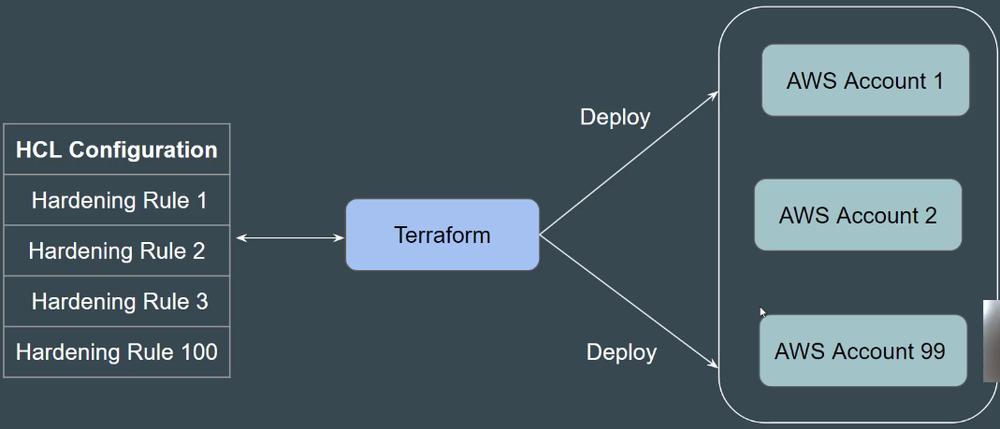
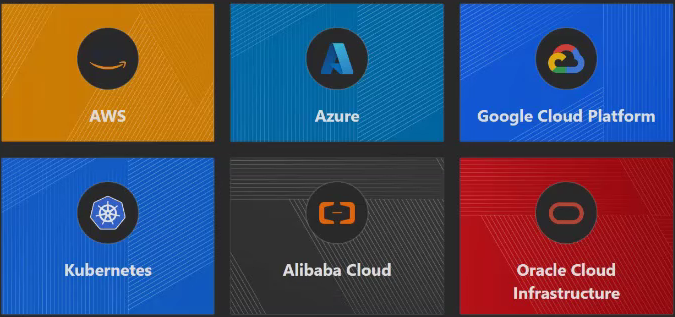
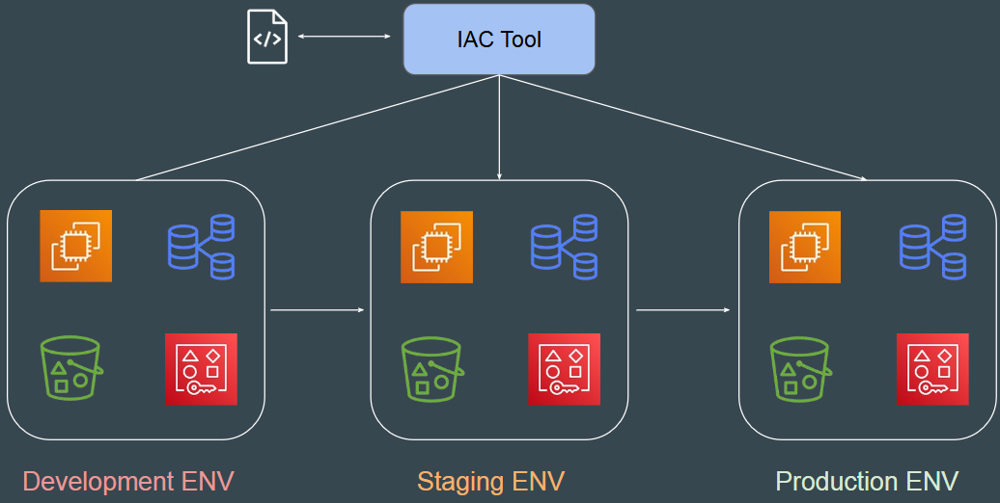
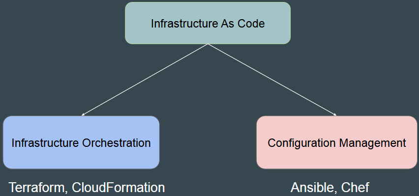
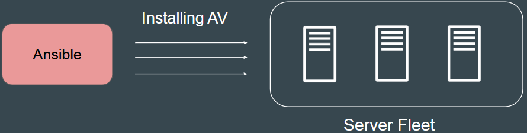
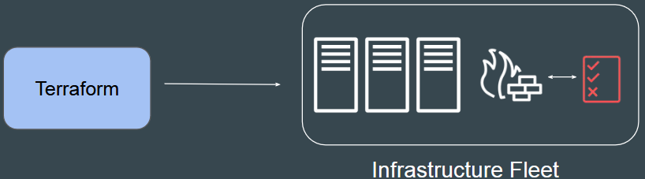
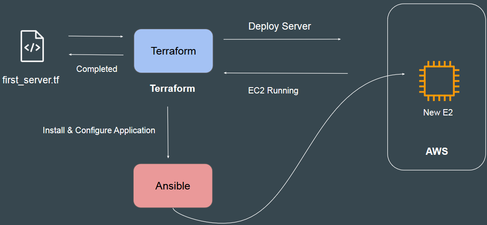

- [Introduction to Terraform and Certification](#introduction-to-terraform-and-certification)
    - [GitHub Repository](#github-repository)
    - [Terraform Overview](#terraform-overview)
    - [Key Concepts](#key-concepts)
    - [Practical Example](#practical-example)
    - [Benefits of Terraform](#benefits-of-terraform)
    - [Certification](#certification)
  - [Basics of Infrasructure as Code (IAC)](#basics-of-infrasructure-as-code-iac)
    - [Infrastructure as Code (IaC) Basics](#infrastructure-as-code-iac-basics)
    - [Key Learnings](#key-learnings)
    - [Infrastructure Deployment](#infrastructure-deployment)
    - [Infrastructure as Code (IaC)](#infrastructure-as-code-iac)
    - [IaC Tools](#iac-tools)
    - [Benefits of IaC](#benefits-of-iac)
    - [Example of a Single Service - Automated Way](#example-of-a-single-service---automated-way)
    - [Practical Demo](#practical-demo)
  - [Choosing the Right IaC Tool](#choosing-the-right-iac-tool)
    - [Two Major Categories](#two-major-categories)
    - [Configuration Management Tools](#configuration-management-tools)
    - [Infrastructure Orchestration Tools](#infrastructure-orchestration-tools)
    - [Integration of IaC and Configuration Management](#integration-of-iac-and-configuration-management)
    - [Choosing an IaC Tool](#choosing-an-iac-tool)
    - [Sample Use Case 1](#sample-use-case-1)
      - [CloudFormation Example](#cloudformation-example)
    - [Sample Use Case 2](#sample-use-case-2)
      - [Terraform Example](#terraform-example)

 

 

# Introduction to Terraform and Certification

### GitHub Repository
Documentation: https://github.com/zealvora/terraform-beginner-to-advanced-resource
Discord: https://discord.com/invite/CbZtnCdm57

### Terraform Overview
* `Reusable Code`: Terraform allows you to create reusable code to deploy identical infrastructure in a repeatable manner.
* `Efficiency`: Once you create the rules in Terraform, you can deploy them across multiple AWS accounts, making management easier.
 

 

### Key Concepts
* `Hardening Rules`: Create hardening rules in Terraform once and deploy them across all AWS accounts.
* `Scalability`: Terraform can handle any number of AWS accounts, whether it's 100, 500, or 1,000.

### Practical Example
* `Demo Setup`: A demo AWS environment is used to show how Terraform can deploy resources.
* `Simple Code`: Example code to create a virtual machine and firewall rules in AWS.
* `Automation`: Terraform reads the configuration and deploys it automatically.

### Benefits of Terraform
* `Supports Multiple Providers`: Works with AWS, Azure, GCP, Kubernetes, Docker, and many more.

* `Unified Concepts`: Core Terraform concepts are the same across all providers.
* `Popularity`: Widely used in DevOps and security for infrastructure management and hardening.

### Certification
* `HashiCorp Certified Terraform Associate`: Certification to validate your Terraform skills.
* `Course Coverage`: The course starts from scratch and covers all topics for the official Terraform exams.

 

 

## Basics of Infrasructure as Code (IAC)

### Infrastructure as Code (IaC) Basics
* `Manual vs. Automation`: Infrastructure can be managed manually or through automation. Automation is preferred in medium to large organizations for efficiency and consistency.
* `Use Case`: A task of taking daily database backups and storing them in Amazon S3 was initially done manually but later automated using Python and Cron.

 

### Key Learnings
* `Automation`: Repeatable tasks should be automated to save time and reduce errors.
* `Tools for Automation`: Depending on the task, different tools can be used, such as Python, Ansible, CloudFormation, and Terraform.

 

### Infrastructure Deployment
* `Single Service Deployment`: Resources like **virtual machines**, **databases**, and **AWS users** need to be created with the same configuration in different environments (development, staging, production).
* `Challenges of Manual Deployment`: Manual deployment is time-consuming and prone to errors, especially when replicating configurations across environments.

 

### Infrastructure as Code (IaC)
* IaC is the **managing** and **provisioning** of **infrastructure** **through code** instead of manual processes.
  * **Example**: Creating a new server in AWS can be done manually or through IaC tools like CloudFormation and Terraform.

 

### IaC Tools
* `CloudFormation`: Specific to **AWS**, used to **create** and **manage** AWS **resources through code**.
* `Terraform`: Preferred in many organisations, supports multiple providers (AWS, Azure, GCP, etc.).

 

### Benefits of IaC
* `Consistency and Standardisation`: IaC ensures that the same configuration is applied every time, reducing the risk of human error and inconsistencies across environments.
* `Automation and Efficiency`: By automating the provisioning and management of infrastructure, IaC saves time and effort, allowing teams to focus on more strategic tasks.
* `Scalability`: IaC makes it easy to scale infrastructure up or down based on demand, ensuring that resources are used efficiently.
* `Version Control`: IaC allows infrastructure configurations to be versioned and tracked, just like application code. This makes it easier to manage changes, roll back to previous versions, and collaborate with team members.
* `Reproducibility`: With IaC, you can recreate environments quickly and accurately, ensuring that development, testing, and production environments are identical.
* `Cost Management`: By automating the provisioning and de-provisioning of resources, IaC helps optimize costs and avoid over-provisioning.
* `Disaster Recovery`: IaC enables quick recovery from failures by allowing you to recreate infrastructure from code, ensuring minimal downtime and data loss.
* `Documentation`: IaC serves as documentation for your infrastructure, providing a clear and up-to-date representation of your environment.
* `Compliance and Security`: IaC helps enforce compliance and security policies by defining and applying them consistently across all environments.
* Speed of Infrastructure Management.
* Low risk of human errors.
* Easy collaboration between teams. 

 

### Example of a Single Service - Automated Way

 

### Practical Demo
* `Manual vs. Automated Deployment`: Demonstration of creating a new server in AWS manually and through CloudFormation.
* `CloudFormation Template`: Uploading a template file to CloudFormation to automate the creation of a server.

 

 

## Choosing the Right IaC Tool
* `Multiple Tools Available`: There are various tools for creating infrastructure as code (IaC), such as Terraform, CloudFormation, Heat, Ansible, SaltStack, Chef, and Puppet.

### Two Major Categories
* `Infrastructure Orchestration`: Tools like Terraform and CloudFormation, specifically designed to create and manage infrastructure.
* `Configuration Management`: Tools like Ansible, Chef, and Puppet, primarily used to maintain the desired configuration of systems but can also create infrastructure.

 

 

### Configuration Management Tools
* Maintain the desired configuration inside servers (e.g., installing applications, antivirus agents).
  * `Example`: Ansible can configure applications and install agents on servers after they are launched.

 

 

### Infrastructure Orchestration Tools
* Create and manage raw infrastructure (e.g., servers, firewall rules).
  * `Example`: Terraform and CloudFormation can create EC2 instances and other resources in AWS.

 

 

### Integration of IaC and Configuration Management
* `Complementary Roles`: IaC tools create infrastructure, while configuration management tools configure the desired state inside servers.
* `Workflow`: IaC tools like Terraform create servers, and configuration management tools like Ansible configure applications and agents on those servers.

 

 

### Choosing an IaC Tool
Considerations:
* `Vendor-Specific`: Is your infrastructure going to be based on a specific vendor (e.g., AWS) for the long term?
* `Multi-Cloud or Hybrid Cloud`: Are you planning to have a multi-cloud or hybrid cloud-based infrastructure?
* `Integration`: How well do you want your IaC tool to integrate with configuration management tools?
* `Price and Support`: Consider the cost and support associated with the IaC tool.

 

### Sample Use Case 1
Requirements:
* `AWS-Based`: The organization will use AWS for the next 25 years.
* `Official Support`: Required for troubleshooting issues.
* `Graphical User Interface`: Supports automatic code generation.

`Recommended Tool`: **CloudFormation** is the perfect choice for this use case, as it meets all the requirements.

#### CloudFormation Example
* `Designer Tool`: CloudFormation has a designer option that allows you to create infrastructure using a graphical interface.
* `Automatic Code Generation`: You can drag and drop resources like EC2 instances and security groups, and the code is automatically generated.
* `Support`: AWS provides support for CloudFormation, helping you troubleshoot issues with your code.

 

### Sample Use Case 2
Requirements:
* `Hybrid Solution`: The organization uses VMware for on-premise setup and AWS, Azure, and GCP for cloud.
* `Official Support`: Required for troubleshooting issues.

`Recommended Tool`: Terraform is the right choice for this use case, as it supports multiple providers and has official support from HashiCorp.

#### Terraform Example
* `Multi-Provider Support`: Terraform supports deploying resources across platforms like AWS, Azure, GCP, and VMware.
* `Official Support`: HashiCorp provides official support for Terraform through its support portal.

 

 
