- [Terr`aform Modules and Workspaces`](#terraform-modules-and-workspaces)
  - [Basics of Terraform Modules](#basics-of-terraform-modules)
    - [Importance of Terraform Modules](#importance-of-terraform-modules)
    - [DRY Principle](#dry-principle)
    - [Challenges Without Modules](#challenges-without-modules)
    - [Solution with Terraform Modules](#solution-with-terraform-modules)
    - [Practical Demonstration](#practical-demonstration)
    - [Using Multiple Modules](#using-multiple-modules)
    - [Terraform Registry](#terraform-registry)
  - [Creating EC2 Instance Using Modules](#creating-ec2-instance-using-modules)
    - [Benefits of Terraform Modules](#benefits-of-terraform-modules)
    - [Practical Demonstration](#practical-demonstration-1)
    - [Example Code](#example-code)
    - [Module Definition](#module-definition)
    - [Running the Module](#running-the-module)
    - [Verification](#verification)
    - [Behind the Scenes:](#behind-the-scenes)
  - [Points to Note - Referencing Terraform Modules](#points-to-note---referencing-terraform-modules)
    - [Direct Module Usage](#direct-module-usage)
    - [Modules Requiring Input](#modules-requiring-input)
    - [Practical Demonstration](#practical-demonstration-2)
    - [Example Code](#example-code-1)
    - [Running the Modules](#running-the-modules)
    - [Module Structure](#module-structure)
    - [Practical Demonstration](#practical-demonstration-3)
  - [Choosing the Right Terraform Module](#choosing-the-right-terraform-module)
    - [Total Downloads](#total-downloads)
    - [GitHub Page](#github-page)
    - [Reported Issues](#reported-issues)
    - [Avoid Single Contributor Modules](#avoid-single-contributor-modules)
    - [Module Documentation](#module-documentation)
    - [Version History](#version-history)
    - [Analyse the Code Quality](#analyse-the-code-quality)
    - [Community Feedback](#community-feedback)
    - [HashiCorp Partner Modules](#hashicorp-partner-modules)
    - [Trusted Modules](#trusted-modules)
    - [Security Considerations](#security-considerations)
    - [Organisational Use](#organisational-use)
  - [Creating Base Module Structure for Custom Module](#creating-base-module-structure-for-custom-module)
    - [Importance of Custom Modules](#importance-of-custom-modules)
    - [Base Module Structure](#base-module-structure)
    - [Contents of Each Subfolder](#contents-of-each-subfolder)
    - [Calling the Module](#calling-the-module)
    - [Practical Demonstration](#practical-demonstration-4)
  - [Creating Custom Module for EC2](#creating-custom-module-for-ec2)
    - [Creating the Module](#creating-the-module)
    - [Steps to Create the Module](#steps-to-create-the-module)
    - [Module Size and Complexity](#module-size-and-complexity)
    - [Referencing the Module](#referencing-the-module)
    - [Comparison with Public Modules](#comparison-with-public-modules)
    - [Example of a Public Module](#example-of-a-public-module)
  - [Module Sources - Calling a Module](#module-sources---calling-a-module)
    - [Module Sources](#module-sources)
    - [Referencing a Module](#referencing-a-module)
    - [Different Source Formats](#different-source-formats)
    - [Documentation](#documentation)
    - [Practical Demonstration](#practical-demonstration-5)
    - [Module Versioning](#module-versioning)
  - [Using Local Paths to Call Custom Module](#using-local-paths-to-call-custom-module)
    - [Module Sources](#module-sources-1)
    - [Referencing a Module](#referencing-a-module-1)
    - [Using Local Paths](#using-local-paths)
    - [Practical Demonstration](#practical-demonstration-6)
    - [Example Code](#example-code-2)
    - [Verification](#verification-1)
  - [Improvements in Custom Module Code](#improvements-in-custom-module-code)
    - [Hardcoded Values](#hardcoded-values)
    - [Practical Demonstration](#practical-demonstration-7)
    - [Provider Improvements](#provider-improvements)
    - [Practical Demonstration](#practical-demonstration-8)
  - [Variables in Terraform Modules](#variables-in-terraform-modules)
    - [Avoid Hard-Coding Values](#avoid-hard-coding-values)
    - [Solution: Using Variables](#solution-using-variables)
    - [Benefits of Using Variables](#benefits-of-using-variables)
    - [Professional Modules](#professional-modules)
    - [Practical Demonstration](#practical-demonstration-9)
  - [Converting Hardcoded Values to Variables in Custom Module](#converting-hardcoded-values-to-variables-in-custom-module)
    - [Removing Hardcoded Values](#removing-hardcoded-values)
    - [Steps to Add Variables](#steps-to-add-variables)
    - [Practical Demonstration](#practical-demonstration-10)
    - [Calling the Module](#calling-the-module-1)
    - [Verification](#verification-2)
  - [Improvements in Provider Configuration in Custom Module](#improvements-in-provider-configuration-in-custom-module)
    - [Avoid Hardcoding the Provider](#avoid-hardcoding-the-provider)
    - [Practical Demonstration](#practical-demonstration-11)
    - [Calling the Module](#calling-the-module-2)
    - [Verification](#verification-3)
  - [Module Outputs](#module-outputs)
    - [Importance of Module Outputs](#importance-of-module-outputs)
    - [Accessing Child Module Outputs](#accessing-child-module-outputs)
    - [Understanding the Challenge](#understanding-the-challenge)
    - [Solution: Using Module Outputs](#solution-using-module-outputs)
    - [Practical Demonstration](#practical-demonstration-12)
    - [Manual Verification](#manual-verification)
    - [Terraform Validation](#terraform-validation)
    - [Key Takeaways](#key-takeaways)
  - [Root Module vs Child Module](#root-module-vs-child-module)
    - [Root Module](#root-module)
    - [Child Module](#child-module)
    - [Practical Demonstration](#practical-demonstration-13)
  - [Standard Module Structure](#standard-module-structure)
    - [Standard Module Structure](#standard-module-structure-1)
    - [Minimal Recommended Structure](#minimal-recommended-structure)
    - [Exploring Popular Modules](#exploring-popular-modules)
    - [Additional Files](#additional-files)
    - [Use Case](#use-case)
    - [Best Practices](#best-practices)
  - [Requirement for Publishing Modules in Terraform Registry](#requirement-for-publishing-modules-in-terraform-registry)
    - [Terraform Registry](#terraform-registry-1)
    - [Requirements for Publishing a Module](#requirements-for-publishing-a-module)
    - [Standard Module Structure](#standard-module-structure-2)
    - [Minimal Module Structure](#minimal-module-structure)
    - [Complete Module Structure](#complete-module-structure)
    - [Requirements for Publishing Module](#requirements-for-publishing-module)
    - [Practical Demonstration](#practical-demonstration-14)
    - [Publishing Process](#publishing-process)
  - [Overview of Terraform Workspaces](#overview-of-terraform-workspaces)
    - [Concept of Workspace](#concept-of-workspace)
    - [Infrastructure and State File](#infrastructure-and-state-file)
    - [Multiple State Files](#multiple-state-files)
    - [Terraform Workspace Feature](#terraform-workspace-feature)
    - [Practical Demonstration](#practical-demonstration-15)
    - [Directory Structure](#directory-structure)
    - [Flexibility in Workspaces](#flexibility-in-workspaces)
  - [Terraform Workspace Practical](#terraform-workspace-practical)
    - [Base Code](#base-code)
    - [Creating and Managing Workspaces](#creating-and-managing-workspaces)
    - [Switching Workspaces](#switching-workspaces)
    - [Modifying Base Code for Flexibility:](#modifying-base-code-for-flexibility)
    - [Verifying Workspace-Specific Configurations](#verifying-workspace-specific-configurations)
    - [Directory Structure](#directory-structure-1)

<br>

<hr style="height:4px;background:black">

<br>

# Terr`aform Modules and Workspaces`

## Basics of Terraform Modules

### Importance of Terraform Modules
* Terraform Modules allows us to **centralise** the **resource configuration** and it makes it easier for multiple projects to **re-use** the Terraform **code** for projects.
* `Usage`: Widely used in mid to large-sized organisations.
* `Efficiency`: Reduces the time spent writing Terraform code for infrastructure.

<br>

### DRY Principle
* DRY stands for "Don't Repeat Yourself."
* `Aim`: Reduce repetition in code to make it smaller, improve performance, and simplify maintenance.

<br>

### Challenges Without Modules
* `Repetition of Code`: Similar code is used across multiple teams.
* `Maintenance`: Any change in the AWS provider requires all teams to update their code.
* `Lack of Standardisation`: Each team may not follow best practices.
* `Management Difficulty`: Hard to manage and use for developers.

### Solution with Terraform Modules
* `Standard Template`: DevOps or security teams create a standard EC2 template in a central location.
* `Reuse`: Teams use the standard template to create their infrastructure.
* `Benefits`: Ensures standardization, simplifies updates, and makes it easier for multiple projects to reuse Terraform code.

<br>

### Practical Demonstration

**Example**: A file demo-modules references a standardised template.

`Code`:

```bash
module "example" {
  source = "path/to/module"
}
```

* `Execution`: Running **terraform plan** shows the infrastructure resource being created using the module.

<br>

### Using Multiple Modules
* `Flexibility`: Multiple modules can be used for a single project.
  * **Example**: Teams can use ready-made EC2 and VPC modules to create their infrastructure.
* Instead of writing code from scratch, we can use multiple ready-made modules available.

For instance,

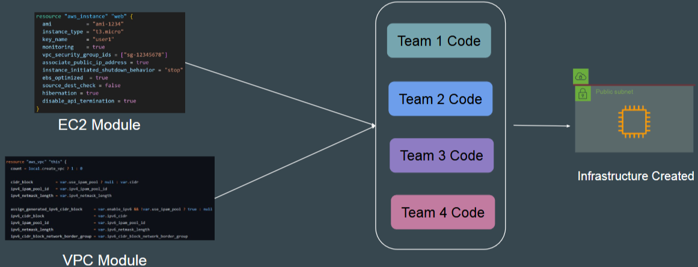

<br> 

### Terraform Registry
* `Availability`: Many modules are available for various infrastructure objects.
  * **Example**: EKS module for creating Kubernetes clusters in AWS.
* `Benefit`: Use ready-made modules instead of writing code from scratch.

<br>

<hr style="height:4px;background:black">

<br>

## Creating EC2 Instance Using Modules

### Benefits of Terraform Modules
* `Efficiency`: Reduces the amount of Terraform code you need to write.
* `Standardisation`: Ensures best practices and security standards are followed.
* `Reusability`: Allows multiple teams to use the same standardized templates.

<br>

### Practical Demonstration
* `Scenario`: Creating a new EC2 instance using a module from the Terraform Registry.

Steps:
1. Search for Modules: Use the Terraform Registry to find modules for creating EC2 instances.
2. Select a Module: Choose a module with high downloads and good reviews.
3. Copy Module Code: Copy the module code provided in the registry.

<br>

### Example Code

### Module Definition

```bash
module "ec2_instance" {
  source = "terraform-aws-modules/ec2-instance/aws"
  version = "~> 3.0"
}
```

* `Save the Code`: Save the module code in a file, e.g., ec2-module.tf.

### Running the Module
* `Initialise Terraform`: Run **terraform init** to download the module and required providers.
* `Plan the Infrastructure`: Run **terraform plan** to see the resources that will be created.
* `Apply the Configuration`: Run **terraform apply -auto-approve** to create the EC2 instance.

### Verification
* `Check AWS Console`: Verify that the EC2 instance is created in the specified region.
* `Destroy Resources`: Run terraform destroy -auto-approve to terminate the EC2 instance and avoid unexpected costs.

### Behind the Scenes:
* `Module Code Download`: Terraform downloads the module code to your local workstation in the .terraform folder.
* `Inspect Module Code`: You can inspect the downloaded module code to understand its implementation.

<br>

<hr style="height:4px;background:black">

<br>

## Points to Note - Referencing Terraform Modules

### Direct Module Usage
* `Behavior`: Some modules allow you to **directly use** the module **calling code**, and the **infrastructure will be created for you**.
  * **Example**: Adding the module code for an EC2 instance in your .tf file and running terraform init and terraform apply will create the EC2 instance.

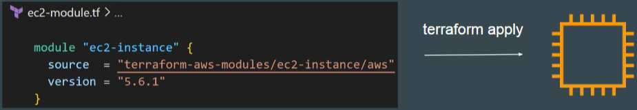

<br>

### Modules Requiring Input
* `Behavior`: **Not all modules** create infrastructure directly. Some require **additional input and values** from the user.
  * **Example**: The EKS module requires subnet IDs and a cluster name before it can create the EKS cluster.

<br>

### Practical Demonstration
* `EC2 Module`: Directly creates an EC2 instance.
* `EKS Module`: Requires additional input like subnet IDs and cluster name.

### Example Code 

`EC2 Module`:

```bash
module "ec2_instance" {
  source  = "terraform-aws-modules/ec2-instance/aws"
  version = "5.6.1"
}
```

<br>

`EKS Module`:
* If you try to use an AWS EKS Module directly and run “terraform apply”, it will throw an error. 

```bash
module "eks_cluster" {
  source       = "terraform-aws-modules/eks/aws"
  cluster_name = "test"
  subnet_ids   = ["subnet-12345678", "subnet-87654321"]
}
```

<br>

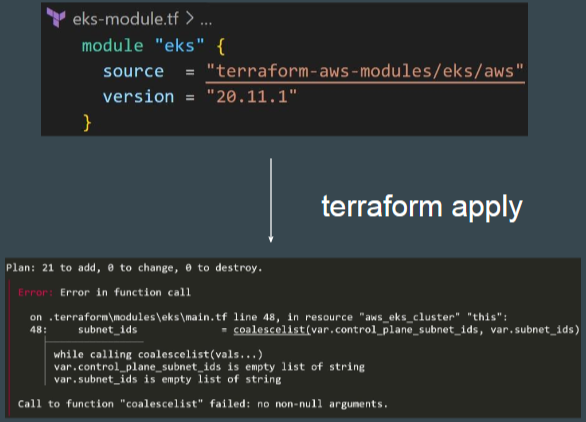

<br>

### Running the Modules
* `Initialise Terraform`: Run **terraform init** to download the module and required providers.
* `Plan the Infrastructure`: Run **terraform plan** to see the resources that will be created.
* `Apply the Configuration`: Run **terraform apply -auto-approve** to create the resources.

<br>

### Module Structure
* `Variation`: The structure of modules can **vary** depending on the module.
  * **Example**: The IAM module has multiple subfolders for different subfeatures like iam-account and iam-assumable-role.
* `Documentation`: Always read the module documentation to understand the structure and required inputs.

<br>

### Practical Demonstration
* `EC2 Module`: Directly creates an EC2 instance without additional input.
* `EKS Module`: Requires additional input like subnet IDs and cluster name.

<br>

<hr style="height:4px;background:black">

<br>

## Choosing the Right Terraform Module

### Total Downloads
* `Importance`: High download numbers indicate that the module is widely used and likely well-maintained.
  * **Example**: A module with 14.4 million downloads is a good indication of reliability.

<br>

### GitHub Page
* `Importance`: Reveals information about contributors, reported issues, and overall maintenance.
  * **Example**: A module with 42 contributors and regular commits is more reliable than one with few contributors and outdated commits.

<br>

### Reported Issues
* `Importance`: Check the number of open and closed issues to gauge how actively the module is maintained.
  * **Example**: A module with 3 open issues and 187 closed issues shows active maintenance.

<br>

### Avoid Single Contributor Modules
* `Reason`: Single contributors may not update the module regularly, leading to potential issues in the future.
  * **Example**: Prefer modules with multiple contributors for better reliability.

<br>

### Module Documentation
* `Importance`: Well-maintained modules have comprehensive documentation, including usage instructions and examples.
  * **Example**: Detailed documentation helps in understanding how to use the module effectively.

<br>

### Version History
* `Importance`: Regular updates indicate that the module is actively maintained.
  * **Example**: A module with a long version history is more reliable than one with only a single version.

<br>

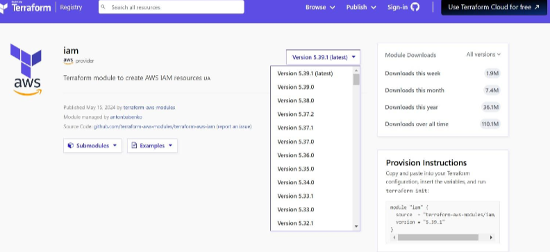

<br>

### Analyse the Code Quality
* `Importance`: Well-structured and clean code is a sign of a well-maintained module.
  * **Example**: Reviewing the main.tf file can give insights into the code quality.

<br>

### Community Feedback
* `Importance`: The number of stars and forks on the GitHub page indicates the module's popularity and community interest.
  * **Example**: A module with many stars and forks is likely to be more reliable.

<br>

### HashiCorp Partner Modules
* `Importance`: Modules maintained by HashiCorp Partners are trusted and reliable.
  * **Example**: Look for the partner badge on the module page to identify these modules.

<br>

### Trusted Modules
* **Example**: Terraform AWS modules are well-maintained and popular in the industry, even if they don't have the partner badge.

<br>

### Security Considerations
* `Avoid Random Modules`: Avoid using random modules that are not actively maintained or look shady.
* `Read Source Code`: Always read the source code to ensure there are no malicious elements.

<br>

### Organisational Use
* `Custom Modules`: Many organizations maintain their own set of custom modules, often forking from public modules and modifying them for their specific use cases.
* `Private Registry`: These custom modules are stored in a private registry for internal use.

<br>

<hr style="height:4px;background:black">

<br>

## Creating Base Module Structure for Custom Module

### Importance of Custom Modules
* `Independence`: Avoid dependency on public modules that are updated on their own timeline.
* `Customisation`: Tailor modules to meet specific organizational requirements.

### Base Module Structure
* `Folder Structure`: Create a base folder with subfolders for each module.

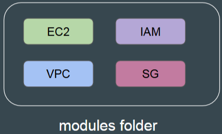

<br>

**Example**:

```bash
kplabs-terraform-modules/
├── modules/
│   ├── ec2/
│   ├── security-group/
├── teams/
│   ├── team-a/
│   ├── team-b/
```

<br>

### Contents of Each Subfolder
* `Module Code`: Each subfolder contains the actual module Terraform code that other projects can reference.
  * **Example**: The ec2 subfolder will have the EC2-related module code.

<br>

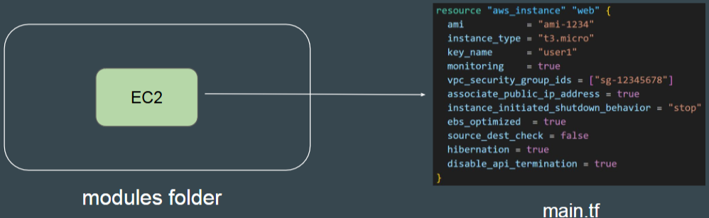

<br>

### Calling the Module
* `Multiple Teams`: Different teams can call various modules based on their requirements.
  * **Example**: Team A can reference the EC2 module to create infrastructure, while Team B can reference the security group module.

<br>

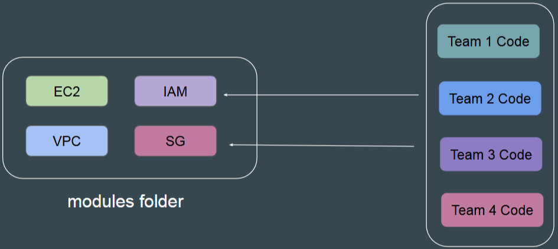

<br>

### Practical Demonstration
1. Create the base folder structure.
2. Create subfolders for modules and teams.
3. Plan to add module code in the subfolders and reference them from the teams' folders.

<br>

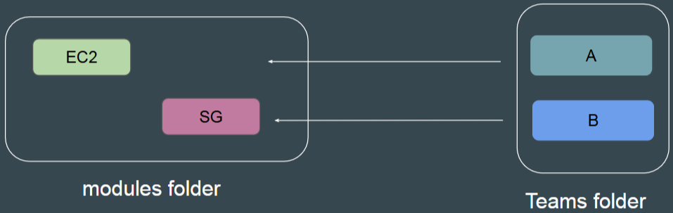

<br>

<hr style="height:4px;background:black">

<br>

## Creating Custom Module for EC2

### Creating the Module
* `Simple Code`: The code to create an EC2 instance is the **same as the code in the modules folder**.
  * **Example Code**: A simple EC2 instance creation code with a hard-coded AMI for the us-east-1 region.

### Steps to Create the Module
1. Navigate to the **modules folder** and **create a subfolder** for the EC2 module.
2. Create a **main.tf** file in the **EC2 subfolder**.
3. Paste the EC2 **instance creation code** into the main.tf file and save it.

### Module Size and Complexity
* `Flexibility`: Modules can be simple or complex, depending on the requirements.
  * **Example**: A module can have a few lines of code or hundreds of lines, based on the options needed.

### Referencing the Module
* The code in the **modules** folder should be **referenced** by various teams **without rewriting the resource code**.
  * **Example**: Team A can reference the EC2 module to create an EC2 instance without writing the resource code again.

### Comparison with Public Modules
* `Public Modules`: Typically contain all options required to create a resource, making them more extensive.
* `Custom Modules`: Contain only the options needed for the organisation's specific use cases, making them more concise.

### Example of a Public Module
* `Main.tfFile`: Public modules have a comprehensive main.tf file with many options.
* `Customisation`: Organisations can customize their modules to include only the necessary options.

<br>

<hr style="height:4px;background:black">

<br>

## Module Sources - Calling a Module

### Module Sources
* `Variety of Locations`: Module source code can be present in various locations such as GitHub, HTTP URLs, S3 buckets, Terraform Registry, and local paths.

**Examples**:
* `GitHub`: Common for modules in the Terraform Registry.
* `Local Path`: Modules stored on your local workstation.
* `S3 Bucket`: Modules stored in AWS S3.

<br>

### Referencing a Module
* `Module Block`: Use the module block to reference a module.
* `Source Argument`: The source argument contains the location of the referenced module.

**Example**:

```bash
module "ec2" {
  source = "../path/to/module"
}
```

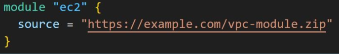

<br>

### Different Source Formats
* `Local Path`: Reference modules stored locally.

```bash
module "ec2" {
  source = "../path/to/module"
}
```

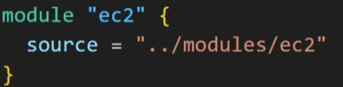

<br>

* `GitHub`: Reference modules stored on GitHub.

```bash
module "ec2" {
  source = "github.com/username/repo"
}
```

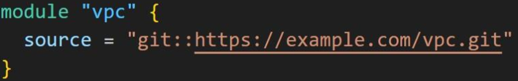

<br>

* `S3 Bucket`: Reference modules stored in S3.

```bash
module "ec2" {
  source = "s3::https://bucket_name/path/to/module"
}
```

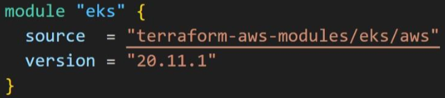

<br>

### Documentation
* `Importance`: The documentation provides clear instructions on how to reference modules from different sources.
  * **Example**: The Terraform documentation includes examples for local paths, GitHub, Bitbucket, HTTP URLs, and S3 buckets.

### Practical Demonstration
**Example**: Referencing a module stored on GitHub.

```bash
module "ec2" {
  source = "github.com/zealvora/sample-kplabs-terraform-ec2-module"
}
```

`Steps`:
* Create a modules.tf file.
* Add the module block with the source argument.
* Run **terraform init** to initialize the module.
* Run **terraform plan** to see the planned infrastructure.

<br>

### Module Versioning
* `Multiple Versions`: A module can have multiple versions.
* `Version Block`: Use the version block to reference a specific version of a module.

**Example**:

```bash
module "eks" {
  source  = "terraform-aws-modules/eks/aws"
  version = "18.8.0"
}
```

<br>

<hr style="height:4px;background:black">

<br>

## Using Local Paths to Call Custom Module

### Module Sources
* `Variety`: Modules can be **stored** in **various locations** such as GitHub, HTTP URLs, S3 buckets, Terraform Registry, and local paths.
* `Local Path`: For modules **stored** on the **local workstation**, the local path is used to reference them.

### Referencing a Module
* `Module Block`: Use the module block with a **source argument** to **specify the location** of the module.

**Example**:

```bash
module "ec2_module" {
  source = "../modules/ec2"
}
```

### Using Local Paths
* `Syntax`: The local path must begin with ./ or ../.
  * **Example**: To reference a module in the modules/ec2 folder from the teams/a folder, use ../modules/ec2.

<br>

### Practical Demonstration
1. Navigate to the teams/a folder and create a module.tf file.
2. Add the module block with the local path to the module.tf file.
3. Run `terraform init` to initialize the module and install the required provider plugins.
4. Run `terraform plan` to see the plan for creating the EC2 instance.

<br>

### Example Code

`Module Block`:

```bash
module "ec2_module" {
  source = "../modules/ec2"
}
```

<br>

### Verification
* `Initialisation`: Ensure terraform init completes **without errors**.
* `Plan`: Verify that terraform plan shows the plan to create the EC2 instance.

> By understanding how to use local paths to call custom modules, you can efficiently manage and reference modules within your organization, making it easier to maintain and scale your infrastructure.

<br>

<hr style="height:4px;background:black">

<br>

## Improvements in Custom Module Code

### Hardcoded Values
* `Issue`: Hardcoded values like ami, instance_type, and region restrict flexibility.
  * **Example**: Developers cannot override these values when calling the module.
* `Solution`: Avoid hardcoding values and use variables instead.

<br>

### Practical Demonstration
* `Current Code`: The module code has **hardcoded** values for ami, instance_type, and region.

**Example**:

```bash
resource "aws_instance" "example" {
  ami           = "ami-12345678"
  instance_type = "t2.micro"
  region        = "us-east-1"
}
```

* `Issue`: Developers cannot change the instance_type to t2.large as it is hardcoded.

<br>

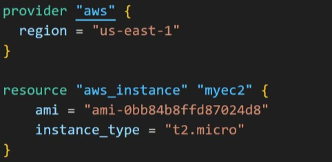

<br>

### Provider Improvements
* `Issue`: Hardcoding the provider and region limits the module to a specific region.
  * **Example**: The module code hardcodes the region to us-east-1.
* `Solution`: Avoid hardcoding the region and use a **required_providers block** with version constraints.

**Example**:

```bash
terraform {
  required_providers {
    aws = {
      source  = "hashicorp/aws"
      version = ">= 3.0"
    }
  }
}
```

<br>

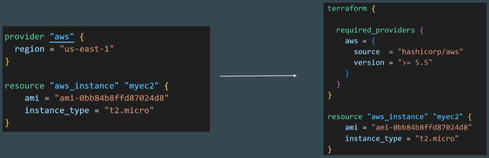

<br>

### Practical Demonstration
* `Current Code`: The module code **hardcodes the region** to us-east-1.

**Example**:

```bash
provider "aws" {
  region = "us-east-1"
}
```

* `Issue`: Developers cannot change the region to ap-south-1 as it is hardcoded.
* `Solution`: Use a required_providers block to specify the provider version and avoid hardcoding the region.

> By understanding and implementing these improvements, you can create more flexible and professional custom modules, making it easier for developers to use and adapt them to their specific requirements.

<br>

<hr style="height:4px;background:black">

<br>

## Variables in Terraform Modules

### Avoid Hard-Coding Values
* `Issue`: Hard-coded values make the module **less flexible** as users cannot override them.
  * **Example**: Hard-coding ami, instance_type, and region restricts customisation.

<br>

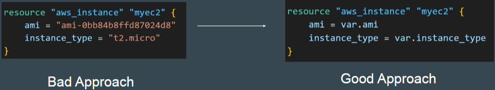

<br>

### Solution: Using Variables
* `Approach`: **Convert** hard-coded values **to variables** to allow users to override them.

**Example**:

```bash
variable "ami" {
  description = "The AMI to use for the instance"
  type        = string
}

variable "instance_type" {
  description = "The type of instance to use"
  type        = string
}

resource "aws_instance" "example" {
  ami           = var.ami
  instance_type = var.instance_type
}
```

<br>

### Benefits of Using Variables
* `Flexibility`: Users can **override variables** to suit their environment.
  * **Example**: Team 1 can set instance_type to t2.micro, while Team 2 can set it to m5.large.

<br>

### Professional Modules
* `Practice`: Professionally written modules extensively use variables to accommodate different user requirements.
  * **Example**: The EC2 instance module in the Terraform Registry uses variables for most arguments.

<br>

### Practical Demonstration
* `Current Code`: The module code has hard-coded values.

**Example**:

```bash
resource "aws_instance" "example" {
  ami           = "ami-12345678"
  instance_type = "t2.micro"
}
```

* `Improved Code`: Convert hard-coded values to variables.

**Example**:

```bash
variable "ami" {
  description = "The AMI to use for the instance"
  type        = string
}

variable "instance_type" {
  description = "The type of instance to use"
  type        = string
}

resource "aws_instance" "example" {
  ami           = var.ami
  instance_type = var.instance_type
}
```

> By understanding and using variables in Terraform modules, you can create more flexible and customisable modules, making it easier for users to adapt them to their specific requirements.

<br>

<hr style="height:4px;background:black">

<br>

## Converting Hardcoded Values to Variables in Custom Module

### Removing Hardcoded Values
* `Issue`: Hardcoded values like ami, instance_type, and region restrict flexibility.
* `Solution`: Replace hardcoded values with variables.

### Steps to Add Variables
1. Open the module code and replace hardcoded values with variables.

**Example**:

```bash
resource "aws_instance" "example" {
  ami           = var.ami
  instance_type = var.instance_type
  region        = var.region
}
```

2. Declare the variables in the module code.

**Example**:

```bash
variable "ami" {
  description = "The AMI to use for the instance"
  type        = string
}

variable "instance_type" {
  description = "The type of instance to use"
  type        = string
}

variable "region" {
  description = "The region to deploy the instance"
  type        = string
}
```

<br>

### Practical Demonstration
* `Current Code`: The module code has hardcoded values.
* `Improved Code`: Replace hardcoded values with variables and declare the variables.

**Example**:

```bash
resource "aws_instance" "example" {
  ami           = var.ami
  instance_type = var.instance_type
  region        = var.region
}

variable "ami" {
  description = "The AMI to use for the instance"
  type        = string
}

variable "instance_type" {
  description = "The type of instance to use"
  type        = string
}

variable "region" {
  description = "The region to deploy the instance"
  type        = string
}
```

<br>

### Calling the Module
1. Open the module.tf file in the team's folder.
2. Add the values for the variables when calling the module.

**Example**:

```bash
module "ec2_module" {
  source        = "../modules/ec2"
  instance_type = "t2.micro"
  ami           = "ami-12345678"
  region        = "ap-south-1"
}
```

<br>

### Verification
* `Initialisation`: Run **terraform init** to initialize the module.
* `Plan`: Run **terraform plan** to verify that the values are correctly overridden.
  * **Example**: Change instance_type to t2.large and verify the plan output.

> By understanding and adding variables to module code, you can create more flexible and customisable modules, making it easier for users to adapt them to their specific requirements. 

<br>

<hr style="height:4px;background:black">

<br>

## Improvements in Provider Configuration in Custom Module

### Avoid Hardcoding the Provider
* `Issue`: Hardcoding the provider and region limits flexibility and can cause issues with different environments.
  * **Example**: Hardcoding the provider block in the module code is not recommended.
* `Solution`: Using Required Providers Block:
* `Approach`: Use the required_providers block to specify the provider and version constraints.

**Example**:

```bash
terraform {
  required_providers {
    aws = {
      source  = "hashicorp/aws"
      version = ">= 5.50"
    }
  }
}
```

<br>

### Practical Demonstration
* `Current Code`: The module code has a hardcoded provider block.
* `Improved Code`: Replace the hardcoded provider block with the required_providers block.

**Example**:

```bash
terraform {
  required_providers {
    aws = {
      source  = "hashicorp/aws"
      version = ">= 5.50"
    }
  }
}
```

<br>

### Calling the Module
1. Open the module.tf file in the team's folder.
2. Remove the hardcoded region variable if it was previously added.
3. Specify the region in the calling code if needed.

**Example**:

```bash
module "ec2_module" {
  source = "../modules/ec2"
  region = "ap-south-1"
}
```

<br>

### Verification
* `Initialisation`: Run **terraform init** to initialize the module.
* `Plan`: Run **terraform plan** to verify that the provider configuration is correct and no warnings are shown.

> By understanding and improving the provider configuration in custom modules, you can create more flexible and compatible modules, making it easier for users to adapt them to their specific requirements.

<br>

<hr style="height:4px;background:black">

<br>

## Module Outputs

### Importance of Module Outputs
* `Output values` make **information** about your **infrastructure** **available** on the
**command line**, and can expose information for other Terraform configurations to
use.
* `Collaboration`: Essential for projects that need to share data and resources.
* `Concept`: Similar to output values in Terraform, but used within modules.

<br>

### Accessing Child Module Outputs
* Ensure to include output values in the module code for better flexibility and integration with other resources and projects.
* Format: `module.<MODULE NAME>.<OUTPUT NAME>`

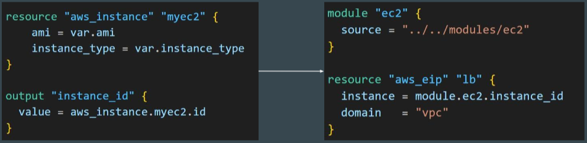

<br>

### Understanding the Challenge
* `Scenario`: A simple module is called **using the module block**, and an additional resource (e.g., elastic IP) needs to reference an attribute from the module.
* `Issue`: Direct referencing without outputs does not work.

### Solution: Using Module Outputs
* `Approach`: Define output values in the module to expose necessary attributes.

**Example**:

```bash
output "instance_id" {
  value = aws_instance.myEC2.id
}
```

<br>

### Practical Demonstration
1. Create an EC2 instance using a module.
2. Create an elastic IP and associate it with the EC2 instance using the module output.

**Example**:

```bash
module "ec2_module" {
  source = "../modules/ec2"
}

resource "aws_eip" "eip" {
  instance = module.ec2_module.instance_id
}
```

<br>

### Manual Verification
1. Manually create an EC2 instance and an elastic IP.
2. Associate the elastic IP with the EC2 instance.
3. Verify the association in the AWS console.

<br>

### Terraform Validation
1. Validate the Terraform configuration to ensure there are no errors.
2. Apply the configuration to create the resources and verify the output.

<br>

### Key Takeaways
* `Module Outputs`: Use module outputs to expose necessary attributes for cross-resource configuration.
* `Syntax`: Use module.<module_name>.<output_name> to reference module outputs.

> By understanding and using module outputs, you can efficiently manage and share data between multiple projects and services, ensuring smooth collaboration and resource management.

<br>

<hr style="height:4px;background:black">

<br>

## Root Module vs Child Module

### Root Module
* The root module resides in your **main Terraform working directory** and **serves** as the **entry point** for your **infrastructure definition**.
  * **Example**: The code block where you call another module using the source argument is referred to as the root module.
* `Importance`: It is the main working directory of your Terraform configuration.

<br>

### Child Module
* A child module is a module that is called by another module.
  * **Example**: When the root module calls an EC2 module using the source argument, the EC2 module is the child module.
* `Importance`: Child modules contain the actual code for specific infrastructure components and are called by the root module.

<br>

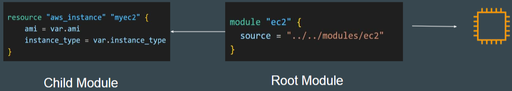

<br>

### Practical Demonstration
* **Example**: In the KP Labs Terraform modules folder, the modules folder contains multiple child modules like EC2 and SG modules.
* `Root Module`: The code from which you call another module is the root module.
* `Child Modules`: The actual modules in the modules folder are the child modules.

<br>

<hr style="height:4px;background:black">

<br>

## Standard Module Structure

### Standard Module Structure
* `Importance`: Following a standard structure ensures consistency, ease of use, and maintainability.

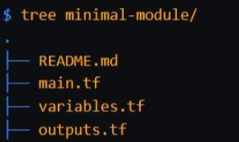

<br>

### Minimal Recommended Structure
* `README.md`: Contains basic documentation about the module.
* `main.tf`: Contains the main configuration code.
* `variables.tf`: Contains variable declarations.
* `outputs.tf`: Contains output declarations.

<br>

### Exploring Popular Modules
* **Example**: Terraform AWS EC2 instance module.
* `Files`: Common files include main.tf, outputs.tf, variables.tf, and README.md.
* `Documentation`: Detailed README files provide important information on how to use the module.

### Additional Files
* `versions.tf`: Contains the required provider block and version constraints.
* `Benefit`: Consistent naming conventions and file structures make it easier for users to navigate and understand the module.

### Use Case
* `Scenario`: A team wants to provision an infrastructure using Terraform.
* `Architecture`: Includes Route 53, VPC, load balancer, firewall, EC2 instances, database, S3, and IAM service.
* `Approach`: Create a collection of modules for each service (e.g., DNS, S3, IAM, database) rather than a single module for the entire infrastructure.

<br>

### Best Practices
* `Modular Approach`: Build separate modules for each service to allow for reuse and easier management.
  * **Example**: A dedicated module for IAM, routing, networking, database, etc.
* `Flexibility`: Teams can use specific modules as needed without rewriting the entire code.

<br>

<hr style="height:4px;background:black">

<br>

## Requirement for Publishing Modules in Terraform Registry

### Terraform Registry
* A platform where users can publish and share Terraform modules.
* `Features`: Supports versioning, automatically generated documentation, browsing version histories, and examples.

### Requirements for Publishing a Module
* `GitHub`: The module must be on GitHub and must be a public repository.
* `Naming Convention`: The repository must use a three-part name format: **terraform-<provider>-<name>**.
* `Repository Description`: The GitHub repository description populates the short description of the module in the Terraform Registry.
* S`tandard Module Structure`: The module must follow a recommended file and directory layout.
* `X.Y.Z Tag for Releases`: The registry uses semantic versioning tags to identify module versions (e.g., v1.0.4 or 0.9.2).

<br>

### Standard Module Structure

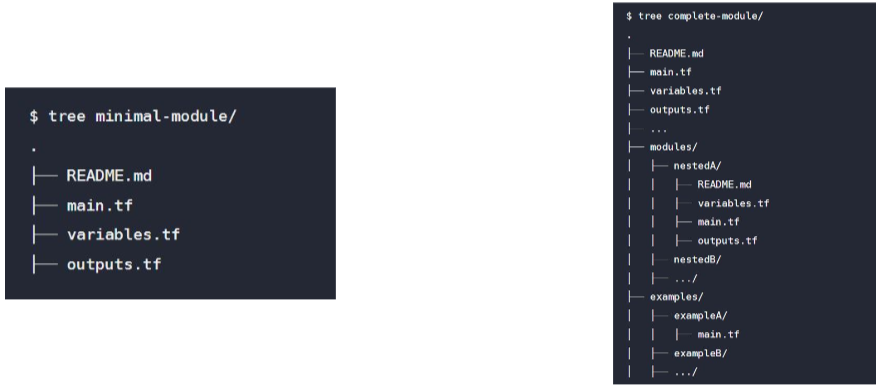

<br>

### Minimal Module Structure
* `README.md`: Contains basic documentation about the module.
* `main.tf`: Contains the main configuration code.
* `variables.tf`: Contains variable declarations.
* `outputs.tf`: Contains output declarations.

### Complete Module Structure
* Includes the minimal structure plus additional directories like modules/ for nested modules and examples/ for usage examples.

<br>

### Requirements for Publishing Module

| Requirement                | Description                                                                                       |
|----------------------------|---------------------------------------------------------------------------------------------------|
| GitHub                     | The module must be on GitHub and must be a public repo. This is only a requirement for the public registry. |
| Named                      | Module repositories must use this three-part name format terraform-<PROVIDER>-<NAME>               |
| Repository description     | The GitHub repository description is used to populate the short description of the module.        |
| Standard module structure  | The module must adhere to the standard module structure.                                          |
| x.y.z tags for releases    | The registry uses tags to identify module versions. Release tag names must be a semantic version, which can optionally be prefixed with a v. For example, v1.0.4 and 0.9.2 |

<br>

### Practical Demonstration
* **Example**: Terraform AWS EC2 instance module.
* `Files`: Common files include main.tf, outputs.tf, variables.tf, and README.md.
* `Additional Files`: versions.tf for required provider block and version constraints, modules/ folder for nested modules, and examples/ folder for usage examples.

### Publishing Process
1. Ensure the module meets all the requirements.
2. Sign in to the Terraform Registry with GitHub.
3. Publish the module following the guidelines.

<br>

<hr style="height:4px;background:black">

<br>

## Overview of Terraform Workspaces

### Concept of Workspace
* `Windows Workspace`: Allows you to **separate your environment** into **multiple desktops**, each with its own set of open windows and applications.
* `Terraform Workspace`: Similar concept applied to Terraform, allowing you to manage multiple environments with separate state files.
  * Terraform workspaces enable us to manage **multiple set of deployments** from the **same sets** of **configuration file**.

<br>

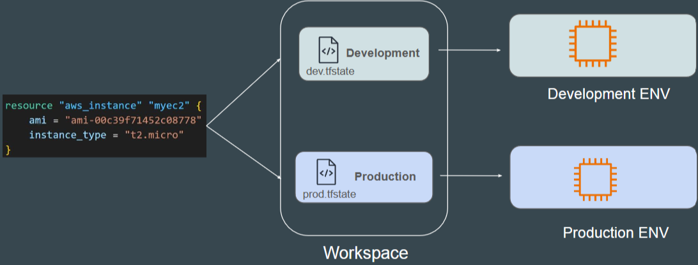

<br>

### Infrastructure and State File
* `Tied Configuration`: Infrastructure created through Terraform is tied to the underlying Terraform configuration and the state file.
  * **Example**: An EC2 instance created through Terraform is tied to a specific configuration and state file.

<br>

### Multiple State Files
* `Possibility`: It is possible to have multiple state files for a single Terraform configuration.
* `Benefits`: Allows you to manage different environments separately, providing flexibility and organization.

<br>

### Terraform Workspace Feature
* Allows you to create multiple environments (e.g., development, production) with separate TF State files for each environment.
  * **Example**: A single configuration file can manage multiple environments by using different workspaces, each with its own state file (e.g., dev.tfstate, prod.tfstate).

<br>

### Practical Demonstration
1. List available workspaces using terraform workspace list.
2. Switch to a different workspace using terraform workspace select <workspace>.
3. Apply the configuration in the selected workspace using terraform apply -auto-approve.
4. Verify the infrastructure created in the selected workspace.

<br>

### Directory Structure
* `Workspace Directories`: When using workspaces, you will have a directory called **terraform.tfstate.d** with subfolders for each workspace (e.g., dev, prod), each containing its own TF State file.

<br>

### Flexibility in Workspaces
* `Different Configurations`: Organisations may need different configurations for different environments (e.g., t2.microfor development, m5.largefor production).
  * **Example**: Depending on the workspace, the instance type can change (e.g., t2.microfor development, m5.largefor production).

<br>

<hr style="height:4px;background:black">

<br>

## Terraform Workspace Practical 

### Base Code
* `File`: workspace.tf contains the base code for creating a simple EC2 instance.
* `AMI ID`: Ensure the AMI ID is appropriate for your region.

### Creating and Managing Workspaces

Commands:
* `terraform workspace show`: Shows the current workspace.
* `terraform workspace new <name>`: Creates a new workspace.
* `terraform workspace list`: Lists all available workspaces.
* `terraform workspace select <name>`: Switches to a different workspace.

**Example**:

```bash
terraform workspace new dev
terraform workspace new prod
terraform workspace list
terraform workspace select dev
```

<br>

### Switching Workspaces
* `Development Workspace`: Switch to the development workspace to create infrastructure in the development environment.
* `Production Workspace`: Switch to the production workspace to create infrastructure in the production environment.

<br>

### Modifying Base Code for Flexibility:
* `Use of Locals`: Define instance types for different workspaces using a map.

**Example**:

```bash
locals {
  instance_type = {
    default = "t2.nano"
    dev     = "t2.micro"
    prod    = "m5.large"
  }
}

resource "aws_instance" "example" {
  ami           = "ami-12345678"
  instance_type = local.instance_type[terraform.workspace]
}
```

<br>

### Verifying Workspace-Specific Configurations
* `Development Workspace`: Instance type should be t2.micro.
* `Production Workspace`: Instance type should be m5.large.

<br>

### Directory Structure
* `Workspace Directories`: terraform.tfstate.d contains subfolders for each workspace (e.g., dev, prod), each with its own TF State file.
* `Default Workspace`: The default workspace does not have a separate folder; its state file is in the main directory.

> By understanding and using Terraform Workspace, you can efficiently manage and organize your infrastructure across multiple environments, making it easier to maintain and scale.

<br>

<hr style="height:4px;background:black">