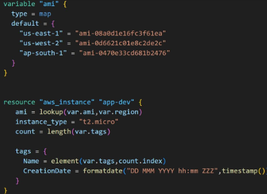
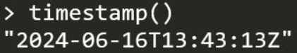
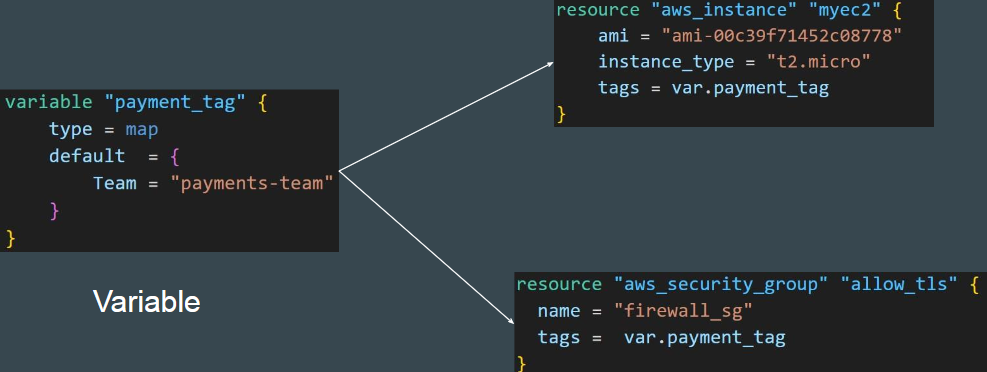
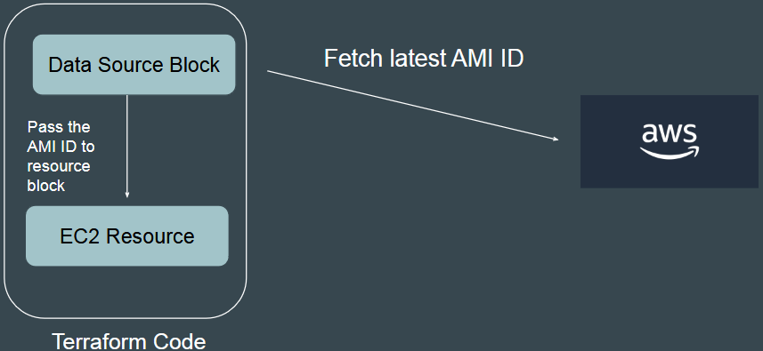
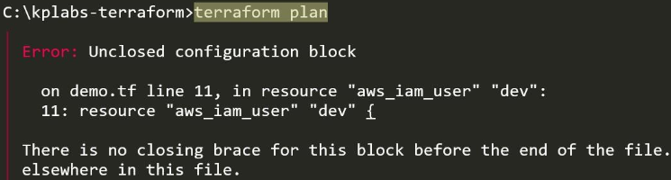
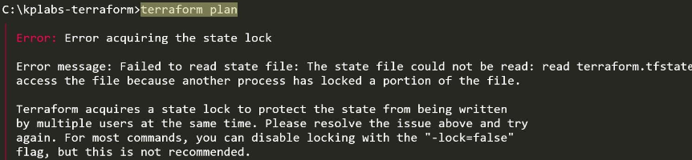
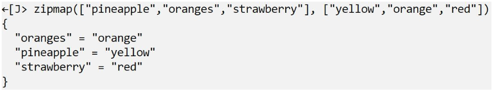

- [Read, Generate, \& Modify Configurations](#read-generate--modify-configurations)
  - [Basics of Firewalls in AWS](#basics-of-firewalls-in-aws)
    - [Understanding Ports](#understanding-ports)
    - [Basics of Firewalls](#basics-of-firewalls)
    - [AWS Security Groups](#aws-security-groups)
    - [Inbound and Outbound Rules](#inbound-and-outbound-rules)
    - [Additional Notes](#additional-notes)
      - [Firewall as a Middleman](#firewall-as-a-middleman)
  - [Creating Firewall Rules Using Terraform](#creating-firewall-rules-using-terraform)
    - [Key Points](#key-points)
      - [Architecture Overview](#architecture-overview)
      - [Finding Terraform Resources](#finding-terraform-resources)
    - [Creating the Terraform Configuration](#creating-the-terraform-configuration)
      - [Attributes](#attributes)
    - [Configuring the Security Group](#configuring-the-security-group)
    - [Running Terraform Commands](#running-terraform-commands)
    - [Adding Inbound and Outbound Rules](#adding-inbound-and-outbound-rules)
      - [Example Configuration](#example-configuration)
    - [Verifying the Security Group](#verifying-the-security-group)
    - [Additional Notes](#additional-notes-1)
      - [Specifying Ports and IP Addresses](#specifying-ports-and-ip-addresses)
      - [Understanding Port Ranges](#understanding-port-ranges)
      - [Security Group ID](#security-group-id)
  - [Dealing with Documentation Code Updates](#dealing-with-documentation-code-updates)
    - [Key Points](#key-points-1)
    - [Example of Security Group Creation](#example-of-security-group-creation)
      - [Newer Approach](#newer-approach)
      - [Older Approach](#older-approach)
    - [Practical Demonstration](#practical-demonstration)
    - [Additional Notes](#additional-notes-2)
  - [Creating Elastic IP with Terraform](#creating-elastic-ip-with-terraform)
    - [What is an Elastic IP?](#what-is-an-elastic-ip)
    - [Creating Elastic IP through AWS Console](#creating-elastic-ip-through-aws-console)
    - [Creating Elastic IP using Terraform](#creating-elastic-ip-using-terraform)
    - [Terraform Configuration](#terraform-configuration)
      - [Example Configuration](#example-configuration-1)
    - [Running Terraform Commands](#running-terraform-commands-1)
    - [Verifying the Elastic IP](#verifying-the-elastic-ip)
    - [Cleaning Up](#cleaning-up)
  - [Basics of Attributes](#basics-of-attributes)
    - [What are Attributes?](#what-are-attributes)
    - [Creating an EC2 instance and an Elastic IP.](#creating-an-ec2-instance-and-an-elastic-ip)
      - [Example Configuration](#example-configuration-2)
    - [Viewing Attributes in the State File:](#viewing-attributes-in-the-state-file)
  - [Cross Resource Attribute References](#cross-resource-attribute-references)
    - [Cross-Resource Attribute References](#cross-resource-attribute-references-1)
    - [Understanding the Workflow](#understanding-the-workflow)
    - [Example Configuration](#example-configuration-3)
      - [Elastic IP Resource](#elastic-ip-resource)
      - [Security Group Resource](#security-group-resource)
      - [Cross-Referencing Syntax](#cross-referencing-syntax)
    - [Practical Demonstration](#practical-demonstration-1)
    - [Terraform Dependency Management](#terraform-dependency-management)
  - [Cross Resource Attribute References - Practical](#cross-resource-attribute-references---practical)
    - [Handling CIDR Block Errors](#handling-cidr-block-errors)
    - [String Interpolation](#string-interpolation)
    - [Example Configuration](#example-configuration-4)
      - [Elastic IP Resource](#elastic-ip-resource-1)
      - [Security Group Resource](#security-group-resource-1)
      - [Security Group Rule Resource with String Interpolation](#security-group-rule-resource-with-string-interpolation)
      - [Running Terraform Commands](#running-terraform-commands-2)
      - [Verifying the CIDR Block](#verifying-the-cidr-block)
    - [Best Practices](#best-practices)
  - [Output Values](#output-values)
    - [What are Output Values?](#what-are-output-values)
    - [Example Scenario](#example-scenario)
      - [Creating Output Values](#creating-output-values)
      - [Running Terraform Commands](#running-terraform-commands-3)
      - [Customising Output Values](#customising-output-values)
      - [Viewing All Attributes](#viewing-all-attributes)
      - [Collaboration Between Projects](#collaboration-between-projects)
      - [State File](#state-file)
  - [Overview of Terraform Variables](#overview-of-terraform-variables)
    - [What are Terraform Variables?](#what-are-terraform-variables)
    - [Example Scenario](#example-scenario-1)
    - [Example Configuration](#example-configuration-5)
      - [Variable Definition](#variable-definition)
      - [Using Variables in Resources](#using-variables-in-resources)
      - [Running Terraform Commands](#running-terraform-commands-4)
    - [Benefits of Using Variables](#benefits-of-using-variables)
    - [Practical Demonstration](#practical-demonstration-2)
  - [Terraform variables - Practical](#terraform-variables---practical)
    - [Identifying Repeated Values](#identifying-repeated-values)
    - [Creating Variables](#creating-variables)
    - [Using Variables in Resources](#using-variables-in-resources-1)
    - [Running Terraform Commands](#running-terraform-commands-5)
    - [Updating Variables](#updating-variables)
    - [Best Practices](#best-practices-1)
  - [Variables Definitions File (TFVARS)](#variables-definitions-file-tfvars)
    - [What is a Variable Definitions File?:](#what-is-a-variable-definitions-file)
    - [Folder Structure](#folder-structure)
    - [Example Folder Structure](#example-folder-structure)
    - [Advantages of .tfvars File](#advantages-of-tfvars-file)
    - [Example Configuration](#example-configuration-6)
      - [Main Configuration File (main.tf)](#main-configuration-file-maintf)
      - [Variables File (variables.tf)](#variables-file-variablestf)
      - [Variable Definitions File (terraform.tfvars)](#variable-definitions-file-terraformtfvars)
    - [Running Terraform Commands](#running-terraform-commands-6)
    - [Handling Default Values](#handling-default-values)
    - [Using Custom .tfvars Files](#using-custom-tfvars-files)
    - [Configuration for Different Environments](#configuration-for-different-environments)
  - [Approaches for Variable Assignment](#approaches-for-variable-assignment)
    - [Defining Variables](#defining-variables)
    - [Handling Undefined Variables](#handling-undefined-variables)
    - [Example Configuration](#example-configuration-7)
      - [Main Configuration File (main.tf)](#main-configuration-file-maintf-1)
      - [Variables File (variables.tf)](#variables-file-variablestf-1)
    - [Approaches to Variable Assignment](#approaches-to-variable-assignment)
      - [Variable Defaults](#variable-defaults)
      - [Variable Definitions File (terraform.tfvars)](#variable-definitions-file-terraformtfvars-1)
      - [Command Line](#command-line)
      - [Environment Variables](#environment-variables)
      - [Running Terraform Commands](#running-terraform-commands-7)
      - [Using Environment Variables](#using-environment-variables)
  - [Setting Environment Variable in Linux](#setting-environment-variable-in-linux)
    - [Setting Up the Environment](#setting-up-the-environment)
    - [Example Configuration](#example-configuration-8)
      - [Main Configuration File (demo.tf)](#main-configuration-file-demotf)
      - [Variables File (variables.tf)](#variables-file-variablestf-2)
      - [Setting Environment Variables](#setting-environment-variables)
    - [Running Terraform Commands](#running-terraform-commands-8)
    - [Adding Credentials](#adding-credentials)
  - [Variable Definition Precedence](#variable-definition-precedence)
    - [Variable Definition Precedence](#variable-definition-precedence-1)
      - [Example Scenario](#example-scenario-2)
      - [Order of Precedence](#order-of-precedence)
    - [Example Configuration](#example-configuration-9)
      - [Main Configuration File (main.tf)](#main-configuration-file-maintf-2)
      - [Variables File (variables.tf)](#variables-file-variablestf-3)
      - [Variable Definitions File (terraform.tfvars)](#variable-definitions-file-terraformtfvars-2)
    - [Practical Demonstration](#practical-demonstration-3)
      - [Running Terraform Commands](#running-terraform-commands-9)
      - [Troubleshooting](#troubleshooting)
  - [Data Types in Terraform](#data-types-in-terraform)
    - [Additional Data Types](#additional-data-types)
    - [Example Configuration](#example-configuration-10)
      - [Main Configuration File (data-types.tf)](#main-configuration-file-data-typestf)
    - [Understanding Data Types in Documentation](#understanding-data-types-in-documentation)
    - [Practical Demonstration](#practical-demonstration-4)
      - [Running Terraform Commands](#running-terraform-commands-10)
  - [Data Type - List](#data-type---list)
    - [What is a List Data Type?](#what-is-a-list-data-type)
    - [Practical Demonstration](#practical-demonstration-5)
      - [Running Terraform Commands](#running-terraform-commands-11)
    - [Specifying Value Types in a List](#specifying-value-types-in-a-list)
      - [Practical Example:](#practical-example)
  - [Data Type - Map](#data-type---map)
    - [What is a Map Data Type?](#what-is-a-map-data-type)
      - [Example Usage](#example-usage)
    - [Practical Demonstration](#practical-demonstration-6)
    - [Handling Errors](#handling-errors)
    - [Specifying Default Values in a Map](#specifying-default-values-in-a-map)
    - [Practical Example](#practical-example-1)
  - [Fetching Data from Maps and List in Variable](#fetching-data-from-maps-and-list-in-variable)
    - [Referencing Values in a Map:](#referencing-values-in-a-map)
    - [Practical Demonstration](#practical-demonstration-7)
    - [Changing the Reference](#changing-the-reference)
    - [Referencing Values in a List](#referencing-values-in-a-list)
    - [Practical Demonstration](#practical-demonstration-8)
    - [Changing the Reference](#changing-the-reference-1)
  - [The Count Meta-Argument](#the-count-meta-argument)
    - [What is The Count Meta-Argument?](#what-is-the-count-meta-argument)
    - [Customisation for Each Resource](#customisation-for-each-resource)
      - [Example Scenario](#example-scenario-3)
    - [Practical Demonstration](#practical-demonstration-9)
    - [Handling Unique Resource Requirements](#handling-unique-resource-requirements)
    - [Practical Demonstration](#practical-demonstration-10)
    - [Understanding the Outcome](#understanding-the-outcome)
  - [Count Index](#count-index)
    - [What is count.index?](#what-is-countindex)
    - [Practical Demonstration](#practical-demonstration-11)
    - [Handling Unique Resource Requirements](#handling-unique-resource-requirements-1)
    - [Practical Demonstration](#practical-demonstration-12)
    - [Using Variables with count.index](#using-variables-with-countindex)
    - [Practical Demonstration](#practical-demonstration-13)
  - [Conditional Expressions](#conditional-expressions)
    - [What are Conditional Expressions?](#what-are-conditional-expressions)
    - [Syntax of Conditional Expressions](#syntax-of-conditional-expressions)
    - [Practical Demonstration](#practical-demonstration-14)
    - [Change the environment variable to "production" and run terraform plan again.](#change-the-environment-variable-to-production-and-run-terraform-plan-again)
    - [Customising Conditional Expressions](#customising-conditional-expressions)
    - [Using Multiple Variables in Conditional Expressions](#using-multiple-variables-in-conditional-expressions)
    - [Running Terraform Commands with Multiple Variables](#running-terraform-commands-with-multiple-variables)
  - [Terraform Functions](#terraform-functions)
    - [What are Functions?](#what-are-functions)
    - [Functions in Terraform](#functions-in-terraform)
    - [Terraform Console](#terraform-console)
    - [Practical Demonstration](#practical-demonstration-15)
    - [Importance of Functions](#importance-of-functions)
    - [Importance of File Function](#importance-of-file-function)
    - [Real-World Example](#real-world-example)
    - [Practical Demonstration](#practical-demonstration-16)
    - [Exploring Terraform Functions](#exploring-terraform-functions)
    - [Important Note](#important-note)
  - [Challenge - Analysing Terraform Code Containing Functions](#challenge---analysing-terraform-code-containing-functions)
    - [Understanding Functions](#understanding-functions)
    - [Challenge Overview](#challenge-overview)
    - [Analysing the Code](#analysing-the-code)
      - [Provider and Variables](#provider-and-variables)
    - [Functions in the Resource Block](#functions-in-the-resource-block)
      - [Resource Block](#resource-block)
    - [Steps to Analyse the Code](#steps-to-analyse-the-code)
  - [Solution - Analysing Terraform Code Containing Functions](#solution---analysing-terraform-code-containing-functions)
    - [Analysing the Code](#analysing-the-code-1)
    - [Functions in the Resource Block](#functions-in-the-resource-block-1)
      - [Resource Block](#resource-block-1)
      - [Lookup Function](#lookup-function)
    - [Practical Demonstration](#practical-demonstration-17)
    - [Length Function](#length-function)
    - [Practical Demonstration](#practical-demonstration-18)
    - [Element Function](#element-function)
    - [Testing Element Function](#testing-element-function)
    - [Analysing TimeStamp Function](#analysing-timestamp-function)
    - [Analysing Formatdate Function](#analysing-formatdate-function)
    - [The Final Result!](#the-final-result)
    - [Steps to Analyse the Code](#steps-to-analyse-the-code-1)
    - [Practical Demonstration](#practical-demonstration-19)
  - [Local Values](#local-values)
    - [Understanding Local Values](#understanding-local-values)
    - [Using Variables to Centralise Values](#using-variables-to-centralise-values)
    - [Practical Demonstration](#practical-demonstration-20)
    - [Using Local Values to Centralise Values](#using-local-values-to-centralise-values)
    - [Practical Demonstration](#practical-demonstration-21)
    - [Benefits of Using Local Values](#benefits-of-using-local-values)
    - [Practical Demonstration](#practical-demonstration-22)
    - [Comparison Between Variables and Local Values](#comparison-between-variables-and-local-values)
  - [Overview of Data Sources](#overview-of-data-sources)
    - [Understanding Data Sources](#understanding-data-sources)
    - [How Data Sources Work](#how-data-sources-work)
    - [Example 1: DigitalOcean Account Information](#example-1-digitalocean-account-information)
      - [Data Source Block](#data-source-block)
    - [Practical Demonstration](#practical-demonstration-23)
    - [Example 2: Reading a Local File](#example-2-reading-a-local-file)
      - [Data Source Block](#data-source-block-1)
    - [Practical Demonstration](#practical-demonstration-24)
    - [Example 3: Fetching EC2 Instance Details](#example-3-fetching-ec2-instance-details)
      - [Data Source Block](#data-source-block-2)
    - [Practical Demonstration](#practical-demonstration-25)
    - [Key Takeaways](#key-takeaways)
  - [Data Sources - Documentation Reference](#data-sources---documentation-reference)
    - [Understanding Data Sources](#understanding-data-sources-1)
    - [Using Documentation to Find Data Sources](#using-documentation-to-find-data-sources)
    - [Exploring Documentation](#exploring-documentation)
    - [AWS Documentation](#aws-documentation)
    - [EC2 Service](#ec2-service)
    - [Azure Documentation](#azure-documentation)
    - [Practical Demonstration](#practical-demonstration-26)
    - [Key Takeaways](#key-takeaways-1)
  - [Data Sources - Format](#data-sources---format)
    - [Understanding Data Sources:](#understanding-data-sources-2)
    - [Basic Format of Data Sources](#basic-format-of-data-sources)
      - [Structure](#structure)
    - [Using Filters in Data Sources](#using-filters-in-data-sources)
    - [Practical Demonstration](#practical-demonstration-27)
    - [Handling Multiple Instances](#handling-multiple-instances)
      - [Data Source for Multiple Instances](#data-source-for-multiple-instances)
    - [Practical Demonstration](#practical-demonstration-28)
    - [Key Takeaways](#key-takeaways-2)
  - [Use-Case: Fetching Latest OS Image Using Data Sources](#use-case-fetching-latest-os-image-using-data-sources)
    - [Understanding the Requirement](#understanding-the-requirement)
    - [Challenges with Hardcoding AMI IDs](#challenges-with-hardcoding-ami-ids)
    - [Practical Demonstration of the Challenge](#practical-demonstration-of-the-challenge)
    - [Dynamic Approach Using Data Sources (Dynamic Configuration)](#dynamic-approach-using-data-sources-dynamic-configuration)
    - [Practical Demonstration of the Dynamic Approach](#practical-demonstration-of-the-dynamic-approach)
    - [Key Takeaways](#key-takeaways-3)
  - [Practical - Fetching Latest OS Image Using Data Sources](#practical---fetching-latest-os-image-using-data-sources)
    - [Understanding the Requirement](#understanding-the-requirement-1)
    - [Challenges with Hardcoding AMI IDs](#challenges-with-hardcoding-ami-ids-1)
    - [Dynamic Approach Using Data Sources](#dynamic-approach-using-data-sources)
    - [Practical Demonstration](#practical-demonstration-29)
    - [Handling Region-Specific AMI IDs](#handling-region-specific-ami-ids)
    - [Key Takeaways](#key-takeaways-4)
  - [Debgugging Terraform](#debgugging-terraform)
    - [What is Debugging?](#what-is-debugging)
    - [Understanding Environment Variables](#understanding-environment-variables)
    - [Setting Environment Variables](#setting-environment-variables-1)
      - [Windows](#windows)
      - [Linux and macOS](#linux-and-macos)
    - [Practical Demonstration](#practical-demonstration-30)
    - [Using TF\_LOG\_PATH](#using-tf_log_path)
      - [Windows](#windows-1)
      - [Linux and macOS](#linux-and-macos-1)
    - [Temporary vs. Permanent Environment Variables:](#temporary-vs-permanent-environment-variables)
    - [Setting Permanent Environment Variables](#setting-permanent-environment-variables)
      - [Windows](#windows-2)
      - [Linux/macOS](#linuxmacos)
  - [Terraform Troubleshooting Model](#terraform-troubleshooting-model)
    - [Types of Issues in Terraform](#types-of-issues-in-terraform)
    - [Language Errors](#language-errors)
    - [State Errors](#state-errors)
    - [Core Errors](#core-errors)
    - [Provider Plugin Errors](#provider-plugin-errors)
    - [Practical Demonstration](#practical-demonstration-31)
    - [Key Takeaways](#key-takeaways-5)
  - [Reporting Terraform Bugs](#reporting-terraform-bugs)
    - [Identifying the Issue](#identifying-the-issue)
    - [Reporting Bugs](#reporting-bugs)
    - [How to Report a Bug](#how-to-report-a-bug)
    - [Practical Demonstration](#practical-demonstration-32)
    - [Example Bug Report](#example-bug-report)
  - [Terraform Format](#terraform-format)
    - [Importance of Code Formatting](#importance-of-code-formatting)
    - [Using terraform fmt](#using-terraform-fmt)
    - [Practical Demonstration](#practical-demonstration-33)
    - [Key Takeaways](#key-takeaways-6)
  - [Load Order \& Semantics](#load-order--semantics)
    - [Load Order in Terraform](#load-order-in-terraform)
    - [Splitting Configuration Files](#splitting-configuration-files)
    - [Practical Demonstration](#practical-demonstration-34)
    - [Benefits of Splitting Configuration Files](#benefits-of-splitting-configuration-files)
    - [Resource Local Names](#resource-local-names)
    - [Practical Demonstration](#practical-demonstration-35)
  - [Dynamic Blocks](#dynamic-blocks)
    - [Understanding Dynamic Blocks](#understanding-dynamic-blocks)
    - [Typical Challenge](#typical-challenge)
    - [Using Dynamic Blocks](#using-dynamic-blocks)
      - [Dynamic Block Structure](#dynamic-block-structure)
      - [Explanation](#explanation)
    - [Practical Demonstration](#practical-demonstration-36)
    - [Using Iterators](#using-iterators)
    - [Configuring Egress Rules](#configuring-egress-rules)
    - [Key Takeaways](#key-takeaways-7)
  - [Validating Terraform Congifuration Files](#validating-terraform-congifuration-files)
    - [Purpose of terraform validate](#purpose-of-terraform-validate)
    - [Common Errors Detected by terraform validate](#common-errors-detected-by-terraform-validate)
    - [Practical Demonstration](#practical-demonstration-37)
    - [Detecting Unsupported Arguments](#detecting-unsupported-arguments)
    - [Detecting Undeclared Variables](#detecting-undeclared-variables)
    - [Validation During terraform plan](#validation-during-terraform-plan)
    - [Key Takeaways](#key-takeaways-8)
  - [Tainting Resources](#tainting-resources)
    - [Understanding Terraform Taint](#understanding-terraform-taint)
    - [Challenges with Manual Changes](#challenges-with-manual-changes)
    - [Solutions](#solutions)
    - [Using Terraform Taint](#using-terraform-taint)
    - [Practical Demonstration](#practical-demonstration-38)
    - [Important Pointers](#important-pointers)
  - [Splat Expressions](#splat-expressions)
    - [Understanding Splat Expressions:](#understanding-splat-expressions)
      - [Example Scenario](#example-scenario-4)
    - [Using Count Index](#using-count-index)
    - [Practical Demonstration](#practical-demonstration-39)
    - [Using Splat Expressions](#using-splat-expressions)
    - [Practical Demonstration](#practical-demonstration-40)
    - [Key Takeaways](#key-takeaways-9)
  - [Terraform Graph](#terraform-graph)
    - [Understanding Terraform Graph](#understanding-terraform-graph)
    - [Example Scenario](#example-scenario-5)
    - [Generating the Graph](#generating-the-graph)
    - [Visualising the Graph Online](#visualising-the-graph-online)
    - [Visualising the Graph Offline](#visualising-the-graph-offline)
    - [Practical Demonstration](#practical-demonstration-41)
    - [Key Takeaways](#key-takeaways-10)
  - [Saving Terraform Plan to File](#saving-terraform-plan-to-file)
    - [Purpose of Saving a Plan to a File](#purpose-of-saving-a-plan-to-a-file)
    - [Workflow](#workflow)
    - [Practical Demonstration](#practical-demonstration-42)
    - [Benefits](#benefits)
    - [Reading the Plan File](#reading-the-plan-file)
    - [Practical Demonstration](#practical-demonstration-43)
    - [Documented Proof of Plan Changes](#documented-proof-of-plan-changes)
    - [Consistency](#consistency)
    - [Key Takeaways](#key-takeaways-11)
  - [Terraform Output](#terraform-output)
    - [Purpose of terraform output](#purpose-of-terraform-output)
    - [Example Scenario](#example-scenario-6)
    - [Practical Demonstration](#practical-demonstration-44)
    - [Retrieving Output Values](#retrieving-output-values)
  - [Terraform Settings](#terraform-settings)
    - [Terraform Settings](#terraform-settings-1)
    - [Provider Block](#provider-block)
    - [Terraform Block](#terraform-block)
    - [Specifying Terraform Version](#specifying-terraform-version)
    - [Specifying Provider Version](#specifying-provider-version)
    - [Practical Demonstration](#practical-demonstration-45)
    - [Flexibility in Settings Block](#flexibility-in-settings-block)
    - [Additional Settings](#additional-settings)
    - [Point to Note](#point-to-note)
  - [Dealing with Larger Infrastructure](#dealing-with-larger-infrastructure)
    - [Resource Limits in Cloud Providers](#resource-limits-in-cloud-providers)
    - [API Throttling](#api-throttling)
    - [Challenges with Large Infrastructure](#challenges-with-large-infrastructure)
    - [Practical Example](#practical-example-2)
    - [Potential Solutions](#potential-solutions)
    - [Practical Demonstration](#practical-demonstration-46)
    - [Key Takeaways](#key-takeaways-12)
    - [Using the refresh=false Flag](#using-the-refreshfalse-flag)
    - [Practical Demonstration](#practical-demonstration-47)
    - [When to Use refresh=false](#when-to-use-refreshfalse)
  - [ZipMap Function](#zipmap-function)
    - [Zipmap Function](#zipmap-function-1)
    - [Practical Demonstration](#practical-demonstration-48)
    - [Use Case](#use-case)
    - [Practical Demonstration](#practical-demonstration-49)
    - [Key Takeaways](#key-takeaways-13)
  - [Comments in Terraform](#comments-in-terraform)
    - [Purpose of Comments](#purpose-of-comments)
    - [Types of Comments in Terraform](#types-of-comments-in-terraform)
      - [Single-Line Comments](#single-line-comments)
      - [Multi-Line Comments](#multi-line-comments)
    - [Practical Demonstration](#practical-demonstration-50)
      - [Single-Line Comments](#single-line-comments-1)
      - [Multi-Line Comments](#multi-line-comments-1)
    - [Use Cases](#use-cases)
    - [Best Practices](#best-practices-2)
  - [Resource Behaviour and Meta Arguments](#resource-behaviour-and-meta-arguments)
    - [Resource Behavior in Terraform](#resource-behavior-in-terraform)
    - [How Terraform Applies a Configuration](#how-terraform-applies-a-configuration)
    - [Changing Default Behavior](#changing-default-behavior)
      - [Example Scenario](#example-scenario-7)
    - [Practical Demonstration](#practical-demonstration-51)
    - [Meta-Arguments](#meta-arguments)
    - [Key Takeaways](#key-takeaways-14)
    - [In-Place Updates vs. Recreation:](#in-place-updates-vs-recreation)
    - [Manual Modifications](#manual-modifications)
    - [Using Meta-Arguments](#using-meta-arguments)
    - [Practical Demonstration](#practical-demonstration-52)
    - [Types of Meta-Arguments](#types-of-meta-arguments)
  - [Meta-Argument - LifeCycle](#meta-argument---lifecycle)
    - [Lifecycle Meta-Argument](#lifecycle-meta-argument)
    - [Arguments in Lifecycle Block](#arguments-in-lifecycle-block)
      - [ignore\_changes](#ignore_changes)
      - [create\_before\_destroy](#create_before_destroy)
      - [prevent\_destroy](#prevent_destroy)
      - [replace\_triggered\_by](#replace_triggered_by)
    - [Practical Demonstration](#practical-demonstration-53)
    - [Key Takeaways](#key-takeaways-15)
  - [Lifecycle Meta-Argument - Create Before Destroy](#lifecycle-meta-argument---create-before-destroy)
    - [Default Behavior](#default-behavior)
    - [Create Before Destroy Argument](#create-before-destroy-argument)
    - [Practical Demonstration](#practical-demonstration-54)
    - [Using Create Before Destroy](#using-create-before-destroy)
    - [Key Takeaways](#key-takeaways-16)
  - [Lifecycle Meta-Argument - Prevent Destroy](#lifecycle-meta-argument---prevent-destroy)
    - [Prevent Destroy Argument](#prevent-destroy-argument)
    - [Practical Demonstration](#practical-demonstration-55)
    - [Important Considerations](#important-considerations)
    - [Key Takeaways](#key-takeaways-17)
  - [Lifecycle Meta-Argument - Ignore Changes](#lifecycle-meta-argument---ignore-changes)
    - [Ignore Changes Argumen](#ignore-changes-argumen)
    - [Practical Demonstration](#practical-demonstration-56)
    - [Ignoring Multiple Attributes](#ignoring-multiple-attributes)
    - [Ignoring All Changes](#ignoring-all-changes)
    - [Important Considerations](#important-considerations-1)
  - [Challenges with Count Meta-Argument](#challenges-with-count-meta-argument)
    - [Count Meta-Argument](#count-meta-argument)
    - [Resource Identification](#resource-identification)
    - [Challenges with Count](#challenges-with-count)
    - [Practical Demonstration](#practical-demonstration-57)
    - [Limitations of Count](#limitations-of-count)
    - [Alternative Solution](#alternative-solution)
    - [Key Takeaways](#key-takeaways-18)
  - [Data Type - SET](#data-type---set)
    - [List Data Type](#list-data-type)
    - [Set Data Type](#set-data-type)
    - [Point to Note](#point-to-note-1)
    - [Practical Demonstration](#practical-demonstration-58)
    - [Unordered Nature of Set](#unordered-nature-of-set)
    - [Comparison with List](#comparison-with-list)
    - [Key Takeaways](#key-takeaways-19)
  - [for\_each in Terraform](#for_each-in-terraform)
    - [Setting the Base](#setting-the-base)
    - [For Each Meta-Argument](#for-each-meta-argument)
      - [Point to Note](#point-to-note-2)
    - [Comparison with Count](#comparison-with-count)
    - [Practical Demonstration](#practical-demonstration-59)
    - [Using For Each with Maps](#using-for-each-with-maps)
    - [Each Object](#each-object)
    - [Key Takeaways](#key-takeaways-20)
- [Quiz](#quiz)

<br>

<hr style="height:4px;background:black">

<br>

# Read, Generate, & Modify Configurations

## Basics of Firewalls in AWS

### Understanding Ports
* A port acts as an **endpoint** of communication to identify a given application or process in an operating system.
  * **Example**: A server with IP address 1.2.3.4 has software running on it, such as SSH (port 22) and HTTP (port 80).
* `Usage`: Clients connect to the server using the server's IP address followed by the port number (e.g., 1.2.3.4:80 for HTTP).

<br>

### Basics of Firewalls
* A firewall is a network security system that **controls incoming and outgoing network traffic** to the **server**.
* `Usage`: Firewalls are used to allow or deny connections based on rules.

<br>

### AWS Security Groups
* In AWS, a security group acts as a **virtual firewall** for **instances** to **control inbound** and **outbound traffic**.
  * **Example**: A security group with rules allowing all traffic (0.0.0.0/0) will permit all connections to the server.
* `Modification`: Changing the security group rules to allow only specific ports (e.g., port 80 for HTTP).

<br>

### Inbound and Outbound Rules
* `Inbound Rules`: Control who can connect to the server.
* `Outbound Rules`: Control which remote systems the server can connect to.

<br>

### Additional Notes
#### Firewall as a Middleman
* A firewall acts as a middleman between the user and the server, **inspecting** and **enforcing rules** on **incoming** and **outgoing traffic**.
  * **Example**: Denying connection to port 22 (SSH) while allowing connection to port 80 (HTTP).

<br>

<hr style="height:4px;background:black">

<br>

## Creating Firewall Rules Using Terraform
Documentation: [Firewall rules](udemy-learning/terraform/hashicorp/doc-mapper/documents/firewall-rules.md).

### Key Points
#### Architecture Overview
* Security Group Name: terraform-firewall.
* Inbound Rule: Allow port 80 from the internet (0.0.0.0/0).
* Outbound Rule: Allow all traffic.

<br>

#### Finding Terraform Resources
1. Search for [Terraform security group](https://registry.terraform.io/providers/hashicorp/aws/latest/docs/resources/security_group) on Google to find the appropriate Terraform documentation.
2. Open the documentation for aws_security_group and review the examples provided.

<br>

### Creating the Terraform Configuration
1. Create a new file named firewall.tf in your Terraform folder.
2. Copy the example code from the documentation and paste it into firewall.tf.

`Understanding the Security Group Block`: The aws_security_group block allows you to **create a security group** in **AWS**.

<br>

#### Attributes
* **name**: The name of the security group (e.g., terraform-firewall).
* **description**: A description of the security group (e.g., Managed from Terraform).
* **vpc_id**: The VPC ID (optional).

<br>

### Configuring the Security Group
1. Set the name to terraform-firewall.
2. Add a description (optional).
3. Remove optional attributes like vpc_id and tags for simplicity.

<br>

### Running Terraform Commands
1. Open the terminal in your Terraform folder.
2. Run `terraform init` to initialize the configuration.
3. Run `terraform plan` to see the planned changes.
4. Run `terraform apply -auto-approve` to create the security group.

<br>

### Adding Inbound and Outbound Rules
1. Use the aws_security_group_rule resource to add rules.
2. Add an inbound rule to allow port 80 from the internet.
3. Add an outbound rule to allow all traffic.

<br>

#### Example Configuration

```bash
resource "aws_security_group" "terraform_firewall" {
  name        = "terraform-firewall"
  description = "Managed from Terraform"
}

resource "aws_security_group_rule" "allow_http" {
  type        = "ingress"
  from_port   = 80
  to_port     = 80
  protocol    = "tcp"
  cidr_blocks = ["0.0.0.0/0"]
  security_group_id = aws_security_group.terraform_firewall.id
}

resource "aws_security_group_rule" "allow_all_outbound" {
  type        = "egress"
  from_port   = 0
  to_port     = 0
  protocol    = "-1"
  cidr_blocks = ["0.0.0.0/0"]
  security_group_id = aws_security_group.terraform_firewall.id
}
```

<br>

### Verifying the Security Group
1. Go to the AWS console and navigate to the security groups section.
2. Verify that the terraform-firewall security group has been created with the specified rules.

<br>

### Additional Notes
#### Specifying Ports and IP Addresses
* `Inbound Rule`: Specify the port (e.g., 80) and the source IP address (e.g., 0.0.0.0/0).
* `Outbound Rule`: Allow all traffic by setting the protocol to -1 and the destination to 0.0.0.0/0.

#### Understanding Port Ranges
* `From Port and To Port`: Used to specify a range of ports (e.g., 80 to 100).
  * **Example**: Allowing a range of ports from 80 to 100: "from_port, to_port".

#### Security Group ID
* Use the security group ID (.id) to associate rules with the security group.
  * **Example**: security_group_id = aws_security_group.terraform_firewall.id.

<br>

<hr style="height:4px;background:black">

<br>

## Dealing with Documentation Code Updates

### Key Points
`Documentation Code Updates`:
* Newer Approach: Create a security group using aws_security_group and then create rules using aws_vpc_security_group_ingress and aws_vpc_security_group_egress.
* Older Approach: Create a security group and specify ingress and egress rules within the same resource block.

`Importance of Documentation`:
* Always refer to the official Terraform documentation for the latest examples and best practices.
* HashiCorp occasionally updates the documentation and example code, which can lead to differences in how resources are created.

<br>

### Example of Security Group Creation

#### Newer Approach

```bash
resource "aws_security_group" "example" {
  name        = "example"
  description = "Managed by Terraform"
}

resource "aws_security_group_rule" "allow_http" {
  type              = "ingress"
  from_port         = 80
  to_port           = 80
  protocol          = "tcp"
  cidr_blocks       = ["0.0.0.0/0"]
  security_group_id = aws_security_group.example.id
}

resource "aws_security_group_rule" "allow_all_outbound" {
  type              = "egress"
  from_port         = 0
  to_port           = 0
  protocol          = "-1"
  cidr_blocks       = ["0.0.0.0/0"]
  security_group_id = aws_security_group.example.id
}
```

<br>

#### Older Approach

```bash
resource "aws_security_group" "example" {
  name        = "example"
  description = "Managed by Terraform"

  ingress {
    from_port   = 80
    to_port     = 80
    protocol    = "tcp"
    cidr_blocks = ["0.0.0.0/0"]
  }

  egress {
    from_port   = 0
    to_port     = 0
    protocol    = "-1"
    cidr_blocks = ["0.0.0.0/0"]
  }
}
```

<br>

### Practical Demonstration
1. Rename the existing Terraform file to avoid conflicts.
2. Run `terraform init` to download the latest provider version.
3. Run `terraform plan` to verify the configuration.
4. Run `terraform apply -auto-approve` to create the security group and rules.

<br>

### Additional Notes
`Switching Provider Versions`:
* Example: If the current version is 5.38.0, you can switch to an older version like 5.31.0 to see the previous example usage.
* URL Change: The URL changes slightly when switching between versions, which is important to remember.

`Organizational Practices`:
* Stability: Organizations may stick to a specific Terraform and provider version if everything is working well.
* No Need to Upgrade: There is no need to upgrade to the latest version unless required.

`Legacy Code`:
* Understanding Legacy Code: When working with legacy code, refer to the previous provider documentation to understand the code block designed in the earlier provider plugin-based approach.

<br>

<hr style="height:4px;background:black">

<br>

## Creating Elastic IP with Terraform
Documentation: [Elastic IP](udemy-learning/terraform/hashicorp/doc-mapper/documents/elastic-ip.md).

### What is an Elastic IP?
* A **static** IPv4 address in AWS.
* `Usage`: Can be associated with an EC2 instance to provide a public IP address.

### Creating Elastic IP through AWS Console
1. Go to the `Elastic IP` page in the AWS Console.
2. Click on "Allocate Elastic IP address".
3. The Elastic IP gets created and can be associated with an EC2 instance.

### Creating Elastic IP using Terraform
1. Search for "Elastic IP Terraform AWS" on Google to find the appropriate Terraform documentation.
2. Open the documentation for aws_eip and copy the sample usage code.

### Terraform Configuration
1. Create a new file named **eip.tf** in your Terraform folder.
2. Paste the copied code into eip.tf.
3. Remove the instance argument if no association is required.
4. Add a provider block with the region set to **us-east-1**.

<br>

#### Example Configuration

```bash
provider "aws" {
  region = "us-east-1"
}

resource "aws_eip" "example" {
  vpc = true
}
```

<br>

### Running Terraform Commands
1. Open the terminal in your Terraform folder.
2. Run `terraform init` to initialize the configuration.
3. Run `terraform plan` to see the planned changes.
4. Run `terraform apply -auto-approve` to create the Elastic IP.

### Verifying the Elastic IP
1. Go to the **AWS Console** and navigate to the** Elastic IPs** section.
2. Verify that the Elastic IP has been created and note the public IP address.

### Cleaning Up
1. Release the Elastic IP from the AWS Console to avoid unnecessary charges.
2. Run terraform destroy -auto-approve to remove the Elastic IP resource.

<br>

<hr style="height:4px;background:black">

<br>

## Basics of Attributes
Documentation: https://developer.hashicorp.com/terraform/language/expressions/references#references-to-resource-attributes

File: The basics of [attributes](udemy-learning/terraform/hashicorp/doc-mapper/documents/attribute-basics.md). 

###  What are Attributes?
* Attributes are fields in a resource that hold values and are stored in the state file.
  * **Example**: For an EC2 instance, attributes can include ID, public_ip, private_ip, and private_dns.

<br>


<br>

### Creating an EC2 instance and an Elastic IP.
Tasks:
1. Create an **Elastic IP** and an EC2 instance using Terraform.
2. Run `terraform apply -auto-approve` to create the resources.
3. Verify the resources in the AWS Console.

#### Example Configuration

```bash
provider "aws" {
  region = "us-east-1"
}

resource "aws_eip" "example" {
  vpc = true
}

resource "aws_instance" "example" {
  ami           = "ami-0c55b159cbfafe1f0"
  instance_type = "t2.micro"
}
```

<br>

### Viewing Attributes in the State File:
1. Open the terraform.tfstate file.
2. Look for the aws_eip and aws_instance resources.
3. Check the attributes section for each resource to see values like public_ip and ID.

`Example Attributes`:
* Elastic IP: public_ip
* EC2 Instance: ID, public_ip

`Practical Use`:
* Checking the public IP of an Elastic IP or EC2 instance directly from the state file without accessing the AWS Console.

<br>

<hr style="height:4px;background:black">

<br>

## Cross Resource Attribute References
File: [Crossed reference attributes](udemy-learning/terraform/hashicorp/doc-mapper/documents/crossed-ref-attributes.md). 

Documentation:
* https://registry.terraform.io/providers/hashicorp/aws/latest/docs/resources/eip
* https://registry.terraform.io/providers/hashicorp/aws/latest/docs/resources/instance

<br>

### Cross-Resource Attribute References
* Referencing the attribute of one resource to be used in another resource.
* Essential for integrating multiple resources in a Terraform configuration.

`Example Scenario`:
* Resources: Elastic IP and Security Group.
* Requirement: Whitelist the public IP of the Elastic IP in the Security Group.

`Solution`:
* Attributes: Use the public_ip attribute of the Elastic IP resource.
* Refer to the Terraform documentation to find the relevant attributes for the resource.

<br>

### Understanding the Workflow

<br>


<br>

### Example Configuration

#### Elastic IP Resource

```bash
resource "aws_eip" "lb" {
  vpc = true
}
```

#### Security Group Resource

```bash
resource "aws_security_group" "attribute_firewall" {
  name        = "attribute_firewall"
  description = "Managed by Terraform"
}

resource "aws_security_group_rule" "allow_https" {
  type              = "ingress"
  from_port         = 443
  to_port           = 443
  protocol          = "tcp"
  cidr_blocks       = [aws_eip.lb.public_ip]
  security_group_id = aws_security_group.attribute_firewall.id
}
```

#### Cross-Referencing Syntax
* Format: resource_type.resource_local_name.attribute
  * **Example**: aws_eip.lb.public_ip


<br>

### Practical Demonstration
1. Define the Elastic IP and Security Group resources in a Terraform file.
2. Use the public_ip attribute of the Elastic IP in the Security Group rule.
3. Run terraform apply -auto-approve to create the resources.
4. Verify the resources in the AWS Console.

<br>

### Terraform Dependency Management
* Terraform understands dependencies and creates resources in the correct order.
  * **Example**: Elastic IP is created first, followed by the Security Group and its rules.

`Additional Cross-Reference`:
* Reference the id attribute of the Security Group in the Security Group rule.
  * **Example**: aws_security_group.attribute_firewall.id

<br>

<hr style="height:4px;background:black">

<br>

## Cross Resource Attribute References - Practical

### Handling CIDR Block Errors
* When adding an IP address directly, you may encounter an error stating that the CIDR block has to be specified.
  * **Solution**: Specify the exact CIDR block, such as /32 for a single IP address.

### String Interpolation
* A method to **dynamically insert values** into **strings**.
* `Usage`: Used to compute the value of an attribute and append /32 to it.
* `Syntax`: ${resource_type.resource_local_name.attribute}/32

<br>

### Example Configuration

#### Elastic IP Resource

```bash
resource "aws_eip" "lb" {
  vpc = true
}
```

#### Security Group Resource

```bash
resource "aws_security_group" "attribute_sg" {
  name        = "attribute-sg"
  description = "Managed by Terraform"
}
```

#### Security Group Rule Resource with String Interpolation

```bash
resource "aws_security_group_rule" "allow_https" {
  type              = "ingress"
  from_port         = 443
  to_port           = 443
  protocol          = "tcp"
  cidr_blocks       = ["${aws_eip.lb.public_ip}/32"]
  security_group_id = aws_security_group.attribute_sg.id
}
```

<br>

#### Running Terraform Commands
1. Run `terraform apply -auto-approve` to create the resources.
2. Verify the resources in the AWS Console.

#### Verifying the CIDR Block
1. Check the security group in the AWS Console.
2. Ensure the inbound rule shows the Elastic IP followed by /32.

<br>

### Best Practices
* Ensure Terraform creates the entire infrastructure in one go.
* Use string interpolation to dynamically compute and format values.

`Additional Notes`:
* **String Interpolation Placeholder**: ${} is used to calculate and replace the value dynamically.
  * String interpolation is not always required, but it is useful when additional formatting is needed.

<br>

<hr style="height:4px;background:black">

<br>

## Output Values
File: [output-values](udemy-learning/terraform/hashicorp/doc-mapper/documents/output-values.md). 

### What are Output Values?
* Output values make **information** about your **infrastructure** available **on the command line** and can be exposed to other Terraform configurations.
* **Example**: Requesting Terraform to provide the public IP of an EC2 instance after it is created.

### Example Scenario
* Resources: Creating an Elastic IP.
* Requirement: Output the public IP of the Elastic IP after it is created.

#### Creating Output Values
1. Define the Elastic IP resource.

```bash
resource "aws_eip" "lb" {
  vpc = true
}
```

2. Define the output value.

```bash
output "public-ip" {
  value = aws_eip.lb.public_ip
}
```

<br>

#### Running Terraform Commands
1. Run `terraform apply -auto-approve` to create the resources.
2. Verify the output value on the command line.

<br>

#### Customising Output Values
**Example**: Adding a URL format to the output value.

```bash
output "public-ip" {
  value = "https://${aws_eip.lb.public_ip}:8080"
}
```

<br>

#### Viewing All Attributes
1. Define the output value without specifying an attribute.

```bash
output "public-ip" {
  value = aws_eip.lb
}
```

2. Run `terraform apply` to see all associated attributes.

<br>

#### Collaboration Between Projects
* Scenario: Project B requires details from Project A.
  * **Solution**: Project B can fetch information from the output values of Project A's state file.

#### State File
* Section: The terraform.tfstate file contains a specific section related to output values.
  * **Example**: The public-ip output value is stored in the state file and can be accessed by other projects.

<br>

<hr style="height:4px;background:black">

<br>

## Overview of Terraform Variables
File: [Terraform variables](udemy-learning/terraform/hashicorp/doc-mapper/documents/var-definitions.md).

### What are Terraform Variables?
* Variables in Terraform are used to **pass values** from **outside the configuration**, allowing for **dynamic** and **reusable code**.
* Avoids repeated static values and reduces manual work.

<br>

###  Example Scenario
* `Resources`: Whitelisting a VPN server IP address in firewall rules for multiple ports.
* `Challenge`: Avoiding repeated static values for the VPN IP address across multiple rules.

`Solution with Variables`:
* **Central Location**: Define the static value (e.g., VPN IP) in a central location.
* **Reference in Code**: Use variables to reference the central value in the Terraform code.

<br>

### Example Configuration

#### Variable Definition

```bash
variable "vpn_ip" {
  default = "192.168.1.1"
}

variable "app_port" {
  default = 8080
}
```

<br>

#### Using Variables in Resources

```bash
resource "aws_security_group" "example" {
  name        = "attribute-sg"
  description = "Managed by Terraform"
}

resource "aws_security_group_rule" "allow_https" {
  type              = "ingress"
  from_port         = var.app_port
  to_port           = var.app_port
  protocol          = "tcp"
  cidr_blocks       = [var.vpn_ip]
  security_group_id = aws_security_group.example.id
}
```

<br>

#### Running Terraform Commands
1. Run `terraform plan` to see the planned changes.
2. Run `terraform apply -auto-approve` to create the resources.

<br>

### Benefits of Using Variables
* `Centralized Updates`: Update important values in a central place, saving time and reducing potential mistakes.
* `Avoiding Human Errors`: No need to touch the core configuration file, minimizing the risk of human errors.

<br>

###  Practical Demonstration
1. Define variables in a central file (e.g., variables.tf).
2. Reference variables in the Terraform configuration.
3. Run Terraform commands to see the values being computed and applied automatically.

<br>

<hr style="height:4px;background:black">

<br>

## Terraform variables - Practical
File: [Variable Definitions File (TFVARS)](). 

### Identifying Repeated Values
* **Example**: In a security group configuration, the same IP address is used in multiple rules.
* `Solution`: Use variables to avoid hard-coding the repeated values.

### Creating Variables
1. Create a new file named variables.tf.
2. Define the variables with default values.

```bash
variable "vpn_ip" {
  default = "192.168.1.1"
}

variable "app_port" {
  default = 8080
}

variable "ssh_port" {
  default = 22
}

variable "ftp_port" {
  default = 21
}
```

<br>

### Using Variables in Resources
1. Reference the variables in the Terraform configuration.

```bash
resource "aws_security_group" "example" {
  name        = "attribute-sg"
  description = "Managed by Terraform"
}

resource "aws_security_group_rule" "allow_https" {
  type              = "ingress"
  from_port         = var.app_port
  to_port           = var.app_port
  protocol          = "tcp"
  cidr_blocks       = [var.vpn_ip]
  security_group_id = aws_security_group.example.id
}

resource "aws_security_group_rule" "allow_ssh" {
  type              = "ingress"
  from_port         = var.ssh_port
  to_port           = var.ssh_port
  protocol          = "tcp"
  cidr_blocks       = [var.vpn_ip]
  security_group_id = aws_security_group.example.id
}

resource "aws_security_group_rule" "allow_ftp" {
  type              = "ingress"
  from_port         = var.ftp_port
  to_port           = var.ftp_port
  protocol          = "tcp"
  cidr_blocks       = [var.vpn_ip]
  security_group_id = aws_security_group.example.id
}
```

<br>

### Running Terraform Commands
1. Run `terraform plan` to see the planned changes.
2. Run `terraform apply -auto-approve` to create the resources.

<br>

### Updating Variables
* `Scenario`: If the VPN IP changes, update the variable in variables.tf.
  * **Example**: Change vpn_ip to a new IP address and run terraform apply to update all rules.

<br>

### Best Practices
* `Centralised Updates`: Use variables to update important values in a central place, saving time and reducing potential mistakes.
* `Avoiding Human Errors`: Minimise changes to the main Terraform configuration file to avoid errors.
* `Standard Naming Convention`: Use a standard naming convention like variables.tf for the variable file.

<br>

<hr style="height:4px;background:black">

<br>

## Variables Definitions File (TFVARS)
File: Variables - [TFVARS](udemy-learning/terraform/hashicorp/doc-mapper/documents/var-definitions.md).

### What is a Variable Definitions File?:
* A .tfvars file used to **define** the **values** of **variables** in a Terraform project.
* Helps manage variables in a structured and organised manner.

### Folder Structure
* `Main Configuration File`: Contains the core Terraform configuration.
* `Variables File` (variables.tf): Defines all the variables without their values.
* `Variable Definitions File` (terraform.tfvars): Defines the values for the variables.

<br>

### Example Folder Structure
* `main.tf`: Main configuration file.
* `variables.tf`: Defines variables.

```bash
variable "ami" {
  description = "AMI for Mumbai region"
}
```

* `terraform.tfvars`: Defines values for the variables.

```bash
ami = "ami-12345678"
```

<br>


<br>

### Advantages of .tfvars File
* `Centralised Values`: Keeps variable values in a central place, making it easier to manage and update.
* `Multiple Environments`: Allows for different .tfvars files for different environments (e.g., dev.tfvars, prod.tfvars).

<br>

### Example Configuration

#### Main Configuration File (main.tf)

```bash
resource "aws_instance" "example" {
  ami           = var.ami
  instance_type = "t2.micro"
}
```

<br>

#### Variables File (variables.tf)

```bash
variable "ami" {
  description = "AMI for Mumbai region"
}
```

<br>

#### Variable Definitions File (terraform.tfvars)

```bash
ami = "ami-12345678"
```

<br>

### Running Terraform Commands
1. Run `terraform plan` to see the planned changes.
2. Run `terraform apply -auto-approve` to create the resources.

<br>

### Handling Default Values
* `Scenario`: If a variable has a default value and a value in .tfvars, the value in .tfvars takes precedence.

`Example`:

```bash
variable "ami" {
  default = "ami-1234"
}
```

<br>

### Using Custom .tfvars Files
* `Scenario`: If the .tfvars file is named differently (e.g., prod.tfvars), specify it explicitly in the command.
* **Command**: `terraform plan -var-file="prod.tfvars"`.

### Configuration for Different Environments


<br>

<hr style="height:4px;background:black">

<br>

## Approaches for Variable Assignment
File: [variable assignment](udemy-learning/terraform/hashicorp/doc-mapper/documents/var-assignment.md).

### Defining Variables
* When defining a variable in your configuration file, you must also **set a value** for that variable.
  * **Example**: If you have a variable instance_type, you need to define its value.

### Handling Undefined Variables
* `Scenario`: If a variable is defined but has no value, Terraform will prompt you to provide the value during the plan or apply operation.

<br>


<br>

### Example Configuration

#### Main Configuration File (main.tf)

```bash
resource "aws_instance" "example" {
  ami           = "ami-12345678"
  instance_type = var.instance_type
}
```

<br>

#### Variables File (variables.tf)

```bash
variable "instance_type" {
  description = "Type of instance"
}
```

<br>

### Approaches to Variable Assignment

#### Variable Defaults
* Define a default value within the variable definition.

```bash
variable "instance_type" {
  default = "t2.micro"
}
```

<br>

#### Variable Definitions File (terraform.tfvars) 
* Define variable values in a separate file.

```bash
instance_type = "t2.micro"
```

<br>

#### Command Line
* Use the `-var` option to set variable values directly in the command line.

```bash
terraform plan -var="instance_type=m5.large"
```

<br>

#### Environment Variables
* Set variable values using environment variables with a specific naming convention.

```bash
export TF_VAR_instance_type="t2.large"
```


<br>

#### Running Terraform Commands
1. Run `terraform plan` to see the planned changes.
2. Run `terraform apply -auto-approve` to create the resources.

<br>

#### Using Environment Variables
* `Naming Convention`: Environment variables must follow the naming convention TF_VAR_<variable_name>.
  * **Example**: Setting the environment variable for instance_type in Windows.

<br>

1. Open the Run utility and enter sysdm.cpl.
2. Go to `Advanced` > `Environment Variables`.
3. Add a new variable TF_VAR_instance_type with the value t2.large.
4. Restart the command prompt and run `terraform plan`.

<br>

<hr style="height:4px;background:black">

<br>

## Setting Environment Variable in Linux
File: [environment variable assignment](udemy-learning/terraform/hashicorp/doc-mapper/documents/env-var.md).

### Setting Up the Environment
* `EC2 Instance`: Launch a new EC2 instance with Amazon Linux.
* `Install Terraform`: Follow the steps to install Terraform on the EC2 instance.

```bash
sudo yum install -y yum-utils
sudo yum-config-manager --add-repo https://rpm.releases.hashicorp.com/AmazonLinux/hashicorp.repo
sudo yum -y install terraform
```

<br>

### Example Configuration

#### Main Configuration File (demo.tf)

```bash
resource "aws_instance" "example" {
  ami           = "ami-12345678"
  instance_type = var.instance_type
}
```

<br>

#### Variables File (variables.tf)

```bash
variable "instance_type" {
  description = "Type of instance"
}
```

<br>

#### Setting Environment Variables
* Use the export command to set the environment variable.

```bash
export TF_VAR_instance_type="t2.large"
```

* Use the **echo** command to check the value of the environment variable.

```bash
echo $TF_VAR_instance_type
```

<br>

### Running Terraform Commands
1. Run `terraform init` to initialise the configuration.
2. Run `terraform plan` to see the planned changes.

> If the environment variable is set correctly, Terraform will not prompt for the variable value.

`Handling Errors`:
* **Scenario**: If Terraform prompts for the variable value, ensure the environment variable follows the correct naming convention (TF_VAR_<variable_name>).
  * **Example**: Correctly set the environment variable as TF_VAR_instance_type.

<br>

### Adding Credentials
* `Scenario`: If you encounter errors related to credentials, ensure the provider block includes the access and secret keys.

```bash
provider "aws" {
  access_key = "your_access_key"
  secret_key = "your_secret_key"
  region     = "us-west-2"
}
```

<br>

<hr style="height:4px;background:black">

<br>

## Variable Definition Precedence
File: [Variable definition precedence](udemy-learning/terraform/hashicorp/doc-mapper/documents/var-precedence.md).

### Variable Definition Precedence
* The **order** in which Terraform **loads variable values**, with later sources taking precedence over earlier ones.
* Helps determine which value Terraform will use when variables are defined in multiple places.

<br>


<br>

#### Example Scenario
* `Variable`: instance_type
* `Defined in Multiple Places`: Default value, terraform.tfvars file, environment variable, and command line.

<br>

#### Order of Precedence
* `Environment Variable`: Highest precedence.
* `terraform.tfvars` File: Next in precedence.
* `terraform.tfvars.json` File: Follows terraform.tfvars.
* `Auto-Loaded Variable` Files: .auto.tfvars or .auto.tfvars.json.
* Command Line: `-var` or `-var-file` options have the highest precedence.

<br>

### Example Configuration

#### Main Configuration File (main.tf)

```bash
resource "aws_instance" "example" {
  ami           = "ami-12345678"
  instance_type = var.instance_type
}
```

<br>

#### Variables File (variables.tf)

```bash
variable "instance_type" {
  default = "t2.micro"
}
```

<br>

#### Variable Definitions File (terraform.tfvars)

```bash
instance_type = "t2.large"
```

<br>

### Practical Demonstration
1. **Define** the variable in the configuration file.
2. Set the **default value** in variables.tf.
3. Set the **value** in terraform.tfvars.
4. Set the **environment variable**.

```bash
export TF_VAR_instance_type="t2.small"
```

5. Use the -var option in the command line.

```bash
terraform plan -var="instance_type=m5.large"
```

<br>

#### Running Terraform Commands
1. Run `terraform plan` to see the planned changes.
2. Verify which value Terraform takes based on the order of precedence.

<br>

#### Troubleshooting
* `Scenario`: If the value set in terraform.tfvars is not taking effect, check other sources that might have higher precedence.
  * **Example**: Ensure no environment variables or command line options are overriding the value.

<br>

<hr style="height:4px;background:black">

<br>

## Data Types in Terraform
File: [Data types](udemy-learning/terraform/hashicorp/doc-mapper/documents/data-types.md).

### Additional Data Types
* `Boolean`: Represents true or false values.
* `List`: A sequence of values.
* `Set`: A collection of unique values.
* `Map`: A collection of key-value pairs.
* `Null`: Represents a null value.

<br>

| Data Types | Description                                                                 |
|------------|-----------------------------------------------------------------------------|
| string     | a sequence of Unicode characters representing some text, like "hello".      |
| number     | A Numeric value                                                             |
| bool       | a boolean value, either true or false                                       |
| list       | a sequence of values, like ["us-west-1a", "us-west-1c"]                     |
| set        | a collection of unique values that do not have any secondary identifiers or ordering. |
| map        | a group of values identified by named labels, like {name = "Mabel", age = 52}. |
| null       | a value that represents absence or omission                                 |

<br>

### Example Configuration

#### Main Configuration File (data-types.tf)

```bash
resource "aws_instance" "example" {
  ami           = "ami-12345678"
  instance_type = "t3.micro"
  tags = {
    Name = "Hello World"
  }
  vpc_security_group_ids = ["sg-12345678"]
}
```

<br>

### Understanding Data Types in Documentation
* `Tags`: The data type required is a map.
* `VPC Security Group IDs`: The data type required is a list.

### Practical Demonstration
1. **Define** the **resource** in the configuration file.
2. Refer to the documentation to understand the required data type for each argument.
3. Use the **correct data type** (e.g., map for tags, list for VPC security group IDs).
4. Run `terraform plan` to see the planned changes and ensure there are no errors.

<br>

#### Running Terraform Commands
1. Run `terraform init` to initialize the configuration.
2. Run `terraform plan` to see the planned changes.
3. If there are errors related to data types, refer to the documentation to correct them.

<br>

<hr style="height:4px;background:black">

<br>

## Data Type - List
File: data types - [list](udemy-learning/terraform/hashicorp/doc-mapper/documents/data-type-lists.md). 

### What is a List Data Type?
* A list data type allows you to **store a collection of values** for a single variable or argument.
* Represented by square brackets `[]` with values separated by commas.

`Example Usage`:
* **Single Value**: instance_type = "t3.micro"
* **Multiple Values**: vpc_security_group_ids = ["sg-12345678", "sg-87654321"]

<br>


<br>

### Practical Demonstration
1. Define a variable with the list data type.

```bash
variable "my_list" {
  type = list
}
```

<br>

2. Use the variable in a resource.

```bash
resource "aws_instance" "example" {
  ami                    = "ami-12345678"
  instance_type          = "t3.micro"
  vpc_security_group_ids = var.my_list
}
```
<br>

#### Running Terraform Commands
1. Run `terraform init` to initialize the configuration.
2. Run `terraform plan` to see the planned changes.
3. Provide a list value when prompted.

```bash
terraform plan
# Enter value: ["sg-12345678", "sg-87654321"]
```

<br>

`Handling Errors`:
* **Scenario**: If a single value is provided instead of a list, Terraform will throw an error.
* **Solution**: Ensure the value is provided in the correct list format with square brackets.

<br>

### Specifying Value Types in a List
* **Example**: Restricting the list to only accept numbers.

```bash
variable "my_list" {
  type = list(number)
}
```

#### Practical Example:
1. Define the variable with a specific type.

```bash
variable "my_list" {
  type = list(number)
}
```

2. Provide a list of numbers when prompted.

```bash
terraform plan
# Enter value: [1, 2, 3]
```

<br>

<hr style="height:4px;background:black">

<br>

## Data Type - Map
File: data tyle - [Map](udemy-learning/terraform/hashicorp/doc-mapper/documents/data-types-map.md).

### What is a Map Data Type?
* A map data type represents a **collection of key-value pair** elements.
* Represented by curly braces `{}` with key-value pairs separated by commas.

<br>


<br>

#### Example Usage

Variable Definition:

```bash
variable "instance_tags" {
  type = map
  default = {
    name        = "app_server"
    environment = "development"
    team        = "payments"
  }
}
```

<br>

### Practical Demonstration
1. Define a variable with the map data type.

```bash
variable "my_map" {
  type = map
}
```

<br>

2. Use the variable in a resource.

```bash
resource "aws_instance" "example" {
  ami           = "ami-12345678"
  instance_type = "t3.micro"
  tags          = var.my_map
}
```

<br>

`Running Terraform Commands`:
1. Run **terraform init** to initialize the configuration.
2. Run **terraform plan** to see the planned changes.
3. Provide a map value when prompted.

```bash
terraform plan
# Enter value: { team = "payments", location = "US" }
```

<br>

### Handling Errors
* **Scenario**: If a list value is provided instead of a map, Terraform will throw an error.
* **Solution**: Ensure the value is provided in the correct map format with curly braces.

### Specifying Default Values in a Map
**Example**: Adding default values to a map variable.

```bash
variable "my_map" {
  type = map
  default = {
    name = "Alice"
    team = "payments"
  }
}
```

<br>

### Practical Example
1. Define the variable with default values.

```bash
variable "my_map" {
  type = map
  default = {
    name = "Alice"
    team = "payments"
  }
}
```

<br>

2. Run `terraform apply` to see the output with the default values.

```bash
terraform apply -auto-approve
```

<br>

<hr style="height:4px;background:black">

<br>

## Fetching Data from Maps and List in Variable
File: [Fetch values variables](doc-mapper/documents/fetch-values-var.md). 

### Referencing Values in a Map:
* Scenario: You have a variable of type map and need to reference a specific value.
  * **Example**: Referencing the instance type for a specific region.

```bash
variable "types" {
  type = map
  default = {
    "us-west-2" = "t2.nano"
    "ap-south-1" = "t2.small"
  }
}

resource "aws_instance" "example" {
  ami           = "ami-12345678"
  instance_type = var.types["us-west-2"]
}
```

<br>

### Practical Demonstration
1. Define the variable with the map data type.
2. Reference a specific key within the map.
3. Run `terraform plan` to see the planned changes.

```bash
terraform plan
# Output: instance_type = "t2.nano"
```

<br>

### Changing the Reference
* `Scenario`: Change the region to reference a different value.
  * **Example**: Changing the region to "ap-south-1".

```bash
resource "aws_instance" "example" {
  ami           = "ami-12345678"
  instance_type = var.types["ap-south-1"]
}
```

<br>

1. Update the reference in the configuration.
2. Run `terraform plan` to see the updated changes.

```bash
terraform plan
# Output: instance_type = "t2.small"
```

<br>

### Referencing Values in a List
* `Scenario`: You have a variable of type list and need to reference a specific value by its position.
  * **Example**: Referencing the first value in the list.

```bash
variable "types" {
  type = list
  default = ["m5.large", "m5.xlarge", "m5.2xlarge"]
}

resource "aws_instance" "example" {
  ami           = "ami-12345678"
  instance_type = var.types[0]
}
```

<br>

### Practical Demonstration
1. Define the variable with the list data type.
2. Reference a specific position within the list.
3. Run `terraform plan` to see the planned changes.

```bash
terraform plan
# Output: instance_type = "m5.large"
```

<br>

### Changing the Reference
* `Scenario`: Change the position to reference a different value.
  * **Example**: Changing the position to 1.

```bash
resource "aws_instance" "example" {
  ami           = "ami-12345678"
  instance_type = var.types[1]
}
```

<br>

1. Update the reference in the configuration.
2. Run `terraform plan` to see the updated changes.

```bash
terraform plan
# Output: instance_type = "m5.xlarge"
```

<br>

<hr style="height:4px;background:black">

<br>

## The Count Meta-Argument
File: The [count meta-argument](udemy-learning/terraform/hashicorp/doc-mapper/documents/count-meta.md).

### What is The Count Meta-Argument?
* A feature that allows you to **create multiple identical resources** with minimal code. 
* It accepts a **whole number** and **creates that many instances** of the specified resource. 
* This is particularly useful when you need to deploy multiple instances of the same resource, such as EC2 instances, without duplicating the resource block multiple times.

<br>


<br>

### Customisation for Each Resource
* `Challenge`: Resources created with count are identical copies, which may not always be desirable.
* `Solution`: Customize each resource using tags or other attributes.

#### Example Scenario
* `Tags for EC2 Instances`: Adding tags to EC2 instances to set a name.

```bash
resource "aws_instance" "example" {
  count         = 3
  ami           = "ami-12345678"
  instance_type = "t3.micro"
  tags = {
    Name = "payments-system"
  }
}
```

<br>

### Practical Demonstration
1. Define the resource with the count argument and tags.
2. Run `terraform apply -auto-approve` to create the resources.

```bash
terraform apply -auto-approve
```

3. Verify that all EC2 instances have the same name in the AWS console.

<br>

### Handling Unique Resource Requirements
* `Challenge`: Some resources, like IAM users, require unique names.

<br>


<br>

**Example**: Creating IAM users with unique names.

```bash
resource "aws_iam_user" "example" {
  count = 3
  name  = "payments-user"
}
```

<br>

### Practical Demonstration
1. Define the IAM user resource with the count argument.
2. Run `terraform plan` to see the planned changes.

```bash
terraform plan
# Output: 3 users to add with the same name
```

<br>

3. Run `terraform apply -auto-approve` to create the resources.

```bash
terraform apply -auto-approve
# Output: Error due to duplicate user names
```

<br>

### Understanding the Outcome
* `Result`: Only one user is created successfully, and subsequent attempts to create users with the same name result in errors due to the uniqueness requirement.

<br>

<hr style="height:4px;background:black">

<br>

## Count Index
File: [Count index](udemy-learning/terraform/hashicorp/doc-mapper/documents/count-index.md).

### What is count.index?
* count.index holds a **distinct index number** starting from zero **for each resource created** using the count meta-argument.
* Allows for unique customisation of each resource by referencing its index.

<br>


<br>

`Example Scenario`:

Creating Multiple EC2 Instances: Using count.index to assign **unique** names to each instance.

```bash
resource "aws_instance" "example" {
  count         = 3
  ami           = "ami-12345678"
  instance_type = "t3.micro"
  tags = {
    Name = "payment-system-${count.index}"
  }
}
```

<br>


<br>

### Practical Demonstration
1. Define the resource with the count argument and use count.index for customisation.
2. Run `terraform plan` to see the planned changes.

```bash
terraform plan
# Output: 3 instances with unique names (payment-system-0, payment-system-1, payment-system-2)
```

<br>

3. Run `terraform apply -auto-approve` to create the resources.

```bash
terraform apply -auto-approve
# Output: 3 instances created with unique names
```

<br>

### Handling Unique Resource Requirements

**Example**: Creating IAM users with unique names using count.index.

```bash
resource "aws_iam_user" "example" {
  count = 3
  name  = "payments-user-${count.index}"
}
```

<br>

### Practical Demonstration
1. Define the IAM user resource with the count argument and use count.index for unique names.
2. Run `terraform plan` to see the planned changes.

```bash
terraform plan
# Output: 3 users with unique names (payments-user-0, payments-user-1, payments-user-2)
```

<br>

3. Run `terraform apply -auto-approve` to create the resources.

```bash
terraform apply -auto-approve
# Output: 3 users created with unique names
```

<br>

### Using Variables with count.index
* `Scenario`: Using a list of names to assign unique names to resources.
  * **Example**: Creating IAM users with names from a list.

```bash
variable "users" {
  type    = list
  default = ["Alice", "Bob", "Johncorner"]
}

resource "aws_iam_user" "example" {
  count = 3
  name  = var.users[count.index]
}
```

<br>


<br>

### Practical Demonstration
1. Define the variable with a list of names.
2. Use the variable and count.index to assign unique names.
3. Run `terraform plan` to see the planned changes.

```bash
terraform plan
# Output: 3 users with names (Alice, Bob, Johncorner)
```

<br>

4. Run `terraform apply -auto-approve` to create the resources.

```bash
terraform apply -auto-approve
# Output: 3 users created with names (Alice, Bob, Johncorner)
```

<br>

<hr style="height:4px;background:black">

<br>

## Conditional Expressions
File: [Conditional Expressions](udemy-learning/terraform/hashicorp/doc-mapper/documents/conditional-expressions.md).

### What are Conditional Expressions?
* Conditional expressions allow you to **choose** between **two values** **based** on a **condition**.
  * **Example**: If the environment is development, launch a small server; if the environment is production, launch a large server.

<br>


<br>

### Syntax of Conditional Expressions
* If condition is `true` then the result is `true_val`. 
* If condition is `false` then the result is `false_val`. 

```Hcl
Format: condition ? true_value : false_value
```


**Example**:

```hcl
var.environment == "development" ? "t2.micro" : "m5.large"
```

<br>

### Practical Demonstration
1. Define a variable for the environment.

```bash
variable "environment" {
  default = "development"
}
```

2. Use the conditional expression in the resource block.

```bash
resource "aws_instance" "example" {
  ami           = "ami-12345678"
  instance_type = var.environment == "development" ? "t2.micro" : "m5.large"
}
```


<br>

`Running Terraform Commands`:
1. Run terraform plan to see the planned changes.

```bash
terraform plan
# Output: instance_type = "t2.micro"
```

<br>

### Change the environment variable to "production" and run terraform plan again.

```bash
variable "environment" {
  default = "production"
}
```

```bash
terraform plan
# Output: instance_type = "m5.large"
```

<br>


<br>

### Customising Conditional Expressions
**Example**: Using the not equal to (!=) operator.

```bash
var.environment != "development" ? "m5.large" : "t2.micro"
```

**Example**: Checking for an empty value.

```bash
var.environment == "" ? "t2.micro" : "m5.large"
```

<br>

### Using Multiple Variables in Conditional Expressions
* `Scenario`: Use multiple variables to determine the instance type.

**Example**:

```bash
variable "environment" {
  default = "production"
}

variable "region" {
  default = "us-east-1"
}

resource "aws_instance" "example" {
  ami           = "ami-12345678"
  instance_type = var.environment == "production" && var.region == "us-east-1" ? "m5.large" : "t2.micro"
}
```

<br>

### Running Terraform Commands with Multiple Variables
1. Ensure both conditions are met and run terraform plan.

```bash
terraform plan
# Output: instance_type = "m5.large"
```

2. Change one condition and run terraform plan again.

```bash
variable "region" {
  default = "ap-south-1"
}
```

```bash
terraform plan
# Output: instance_type = "t2.micro"
```

<br>

<hr style="height:4px;background:black">

<br>

## Terraform Functions
* File: [Terraform Functions](udemy-learning/terraform/hashicorp/doc-mapper/documents/terraform-functions.md).
* Documentaion: https://developer.hashicorp.com/terraform/language/functions

<br>

### What are Functions?
* A function is a **block of code** that **performs a specific task**.
  * **Example**: In Python, the max function returns the largest item in an iterable or the largest of two or more arguments.

### Functions in Terraform
* `Max Function`: Takes one or more numbers and returns the greatest number.

```Hcl
max(10, 20, 30) # Output: 30
```


<br>

* `File Function`: Reads the contents of a file at a given path and returns them as a string.

```hcl
file("random-file.txt") # Output: Contents of the file
```


<br>

### Terraform Console
* Terraform Console provides an **interactive environment** specifically **designed to test functions** and **experiment with expressions** before integrating them into your main code.


<br>

### Practical Demonstration
1. Create a test file.

```bash
echo "This is a random file for testing." > random-file.txt
```

2. Use the Terraform console to test functions.

```sh
terraform console
max(10, 20, 30) # Output: 30
file("random-file.txt") # Output: This is a random file for testing.
```

<br>

### Importance of Functions
* `Efficiency`: Functions reduce the need to write repetitive code by providing built-in functionalities.
  * **Example**: Using the file function to load contents from external sources, reducing the size of Terraform code.

<br>

### Importance of File Function
* file **reads the contents** of a file at the given path and **returns them as a string**.

<br>

### Real-World Example
* `Scenario`: Creating an IAM policy with a large JSON code.
* `Before`: Embedding the entire JSON code in the Terraform configuration.

```bash
resource "aws_iam_policy" "example" {
  name   = "demo-user-policy"
  policy = <<EOF
  {
    "Version": "2012-10-17",
    "Statement": [
      {
        "Action": "ec2:*",
        "Effect": "Allow",
        "Resource": "*"
      }
    ]
  }
  EOF
}
```

* `After`: Using the file function to load the JSON code from an external file.

```bash
resource "aws_iam_policy" "example" {
  name   = "demo-user-policy"
  policy = file("ec2-policy.json")
}
```

<br>


<br>

### Practical Demonstration
1. Create the JSON file with the policy.

```bash
echo '{
  "Version": "2012-10-17",
  "Statement": [
    {
      "Action": "ec2:*",
      "Effect": "Allow",
      "Resource": "*"
    }
  ]
}' > ec2-policy.json
```

2. Use the file function in the Terraform configuration.

```bash
resource "aws_iam_policy" "example" {
  name   = "demo-user-policy"
  policy = file("ec2-policy.json")
}
```

3. Run `terraform apply` to create the policy.

<br>

### Exploring Terraform Functions
* `Categories`: Terraform functions are **grouped into multiple categories** such as numeric functions, string functions, collection functions, and more.
* `Documentation`: The [Terraform](https://developer.hashicorp.com/terraform/language/functions) documentation provides detailed descriptions and examples for each function.

<br>

Functions are grouped into categories. Some of these include:

| Function Categories   | Functions Available                                  |
|-----------------------|------------------------------------------------------|
| Numeric Functions     | abs, ceil, floor, max, min                           |
| String Functions      | concat, replace, split, tolower, toupper             |
| Collection Functions  | element, keys, length, merge, sort                   |
| Filesystem Functions  | file, filebase64, dirname                            |

<br>

### Important Note
* `User-Defined Functions`: Terraform language does not support user-defined functions. Only built-in functions are available for use.

<br>

<hr style="height:4px;background:black">

<br>

## Challenge - Analysing Terraform Code Containing Functions
* File: Analysing Terraform Code Containing Functions - [Challenge and Solution](udemy-learning/terraform/hashicorp/doc-mapper/documents/challenge-solution.md). 

### Understanding Functions
* A function is a **block of code** that **performs a specific task**.
  * **Example**: Functions like lookup, length, element, formatdate, and timestamp are used in Terraform to perform various tasks.

### Challenge Overview
* `Objective`: Analyse the given Terraform code containing functions without running terraform apply.

`Steps`:
1. Analyse the code to understand what it does.
2. Use the Terraform console to test the functions.
3. Make a note of what each function does.
4. Run terraform apply to verify your findings.

<br>



<br>

### Analysing the Code

#### Provider and Variables

```bash
provider "aws" {
  region = var.region
}

variable "region" {
  default = "us-east-1"
}

variable "tag" {
  type    = list
  default = ["tag1", "tag2"]
}

variable "ami" {
  type = map
  default = {
    "us-east-1" = "ami-12345678"
    "us-west-2" = "ami-87654321"
  }
}
```

<br>

### Functions in the Resource Block

#### Resource Block

```bash
resource "aws_instance" "example" {
  ami           = lookup(var.ami, var.region)
  count         = length(var.tag)
  tags          = {
    Name = element(var.tag, count.index)
  }
  CreationDate  = formatdate("YYYY-MM-DD", timestamp())
}
```

<br>

### Steps to Analyse the Code

1. Identify the functions used in the code.
   * lookup
   * length
   * element
   * formatdate
   * timestamp

2. Use the **Terraform console** to test the functions.

```bash
terraform console
lookup({"us-east-1" = "ami-12345678", "us-west-2" = "ami-87654321"}, "us-east-1") # Output: "ami-12345678"
length(["tag1", "tag2"]) # Output: 2
element(["tag1", "tag2"], 0) # Output: "tag1"
formatdate("YYYY-MM-DD", timestamp()) # Output: Current date in "YYYY-MM-DD" format
```

3. Make a note of the function outcomes.

4. Run `terraform apply` to verify your findings.

<br>

<hr style="height:4px;background:black">

<br>

## Solution - Analysing Terraform Code Containing Functions
File: Analysing Terraform Code Containing Functions: [Solution](udemy-learning/terraform/hashicorp/doc-mapper/documents/challenge-solution.md).

<br>

### Analysing the Code

`Provider and Variables`:

```bash
provider "aws" {
  region = var.region
}

variable "region" {
  default = "us-east-1"
}

variable "tag" {
  type    = list
  default = ["tag1", "tag2"]
}

variable "ami" {
  type = map
  default = {
    "us-east-1" = "ami-12345678"
    "us-west-2" = "ami-87654321"
  }
}
```

<br>

### Functions in the Resource Block

#### Resource Block

```bash
resource "aws_instance" "example" {
  ami           = lookup(var.ami, var.region)
  count         = length(var.tag)
  tags          = {
    Name = element(var.tag, count.index)
  }
  CreationDate  = formatdate("YYYY-MM-DD", timestamp())
}
```

<br>

#### Lookup Function
* **Retrieves** the **value** of a **single element** from a map, given its key.

**Example**:

```bash
lookup({"us-east-1" = "ami-12345678", "us-west-2" = "ami-87654321"}, "us-east-1") # Output: "ami-12345678"
```


<br>

### Practical Demonstration
* To test lookup function, **add** the **details** that are **part of the map associated** with **variable of ami** and the **default value of variable of region**. 

```bash
terraform console
lookup({"us-east-1" = "ami-12345678", "us-west-2" = "ami-87654321"}, "us-east-1") # Output: "ami-12345678"
```

<br>


<br>

### Length Function
* **Determines the length** of a given list, map, or string.

**Example**:

```bash
length(["tag1", "tag2"]) # Output: 2
```


* Code: count = length(var.tags)


<br>

### Practical Demonstration

```bash
terraform console
length(["tag1", "tag2"]) # Output: 2
```

<br>

### Element Function
* **Retrieves a single element** from a list based on its index.
* Format: `element(list, index)`.


**Example**:

```bash
element(["tag1", "tag2"], 0) # Output: "tag1"
```

<br>

### Testing Element Function

```bash
terraform console
element(["tag1", "tag2"], 0) # Output: "tag1"
```

<br>


<br>

### Analysing TimeStamp Function
Formatdate and Timestamp Functions
* `Timestamp Function`: Returns the **current timestamp** in UTC.
  * Timestamp returns a UTC timestamp string in RFC 3339 format.

```bash
terraform console
timestamp() # Output: Current timestamp in RFC 3339 format
```



<br>

### Analysing Formatdate Function
* `Formatdate Function`: **Converts** the **timestamp** to a **readable date format**.

**Code Block**: 


<br>

```bash
terraform console
formatdate("YYYY-MM-DD", timestamp()) # Output: Current date in "YYYY-MM-DD" format
```


<br>

### The Final Result!
1. Two set of EC2 instances will be created.
2. Name of EC2 will be firstec2, and secondec2.
3. EC2 will have a tag of creation date with the timestamp value.

<br>

### Steps to Analyse the Code
1. Identify the functions used in the code.
   * lookup
   * length
   * element
   * formatdate
   * timestamp

2. Use the Terraform console to test the functions.
3. Make a note of the function outcomes.
4. Run `terraform apply` to verify your findings.

<br>

### Practical Demonstration
1. Validate the Terraform configuration.

```bash
terraform validate
```

2. Apply the Terraform configuration.

```bash
terraform apply -auto-approve
```

3. Verify the created resources in the AWS console.

<br>

<hr style="height:4px;background:black">

<br>

## Local Values
File: [Local Values](udemy-learning/terraform/hashicorp/doc-mapper/documents/local-values.md).

### Understanding Local Values
* Local values allow you to **store data centrally** and **reference** it across **multiple resources** in your configuration.
  * **Example**: Instead of hardcoding repeated values, you can use local values to centralise them.
* Various resources in your project can have **common values** like **tags**.
* **Repeating** these **values** across **multiple resource blocks** **increases** the **code length** and makes it **difficult to manage** in larger projects.

<br>


<br>

### Using Variables to Centralise Values
* One solution is to **centralise** these common values using **Variables**.
* When you centralise values using variables, you **define the common values** once in a **variable** and then **reference** that variable **wherever needed**. 
  * This way, if you need to update the value, you only have to change it in one place

**Example**:

```bash
variable "tags" {
  type = map
  default = {
    Team = "security-team"
  }
}

resource "aws_security_group" "app_firewall" {
  tags = var.tags
}

resource "aws_security_group" "db_firewall" {
  tags = var.tags
}
```

<br>



<br>

### Practical Demonstration
1. **Define** the variable.
2. **Reference** the variable in the **resource blocks**.
3. Run `terraform apply -auto-approve` to apply the configuration.

<br>

### Using Local Values to Centralise Values

**Example**:

```bash
locals {
  default = {
    Team = "security-team"
  }
}

resource "aws_security_group" "app_firewall" {
  tags = local.default
}

resource "aws_security_group" "db_firewall" {
  tags = local.default
}
```

<br>

### Practical Demonstration
1. Define the **local** values.
2. **Reference** the local values in the **resource blocks**.
3. Run `terraform apply -auto-approve` to apply the configuration.

<br>

### Benefits of Using Local Values
* `Dynamic Computation`: Local values allow you to add expressions and compute values dynamically.

**Example**: Adding a creation date to the tags.

```bash
locals {
  default = {
    Team = "security-team"
    CreationDate = formatdate("DD-MM-YYYY", timestamp())
  }
}
```

<br>


<br>

### Practical Demonstration
1. **Define** the **local values** with **dynamic computation**.
2. **Reference** the local values in the **resource blocks**.
3. Run `terraform apply -auto-approve` to apply the configuration.
4. **Verify** the creation date in the tags.

<br>

### Comparison Between Variables and Local Values

`Variables`:
* Can be **overridden** from various places like terraform.tfvars, environment variables, CLI, etc.
* Useful for **automation** and **flexibility**.

`Local Values`:
* **Cannot be overridden** from CLI or environment variables.
* Useful for **avoiding repeated expressions** and **dynamic computations**.

<br>

<hr style="height:4px;background:black">

<br>

## Overview of Data Sources
File: [Local Values](udemy-learning/terraform/hashicorp/doc-mapper/documents/data-sources.md).

### Understanding Data Sources
* Data sources allow Terraform to **use or fetch information** that is **defined outside** of Terraform.
  * **Example**: Fetching details of EC2 instances in a specific AWS region.

<br>


<br>

### How Data Sources Work
* `Data Source Block`: Define a **data source block** in your code to **fetch information** from a **provider or external source**.

**Example**:

```bash
data "aws_instance" "example" {
  filter {
    name   = "instance-state-name"
    values = ["running"]
  }
}
```

<br>

### Example 1: DigitalOcean Account Information

#### Data Source Block
* The following data source code is used to **get information** on your **DigitalOcean account**.

```bash
data "digitalocean_account" "example" {}
```

<br>

### Practical Demonstration
1. **Define** the **provider** and **data source block**.
2. Run `terraform init` to **download** the required provider plugins.
3. Run `terraform apply -auto-approve` to **fetch** the information.
4. Check the **terraform.tfstate** file for the fetched information.

<br>

### Example 2: Reading a Local File

#### Data Source Block
* The following data source allows you to **read contents** of a file in your **local filesystem**.
* `${path.module}` **returns** the current **file system path** where your **code is located**.

```bash
data "local_file" "example" {
  filename = "${path.module}/demo.txt"
}
```

<br>

### Practical Demonstration
1. Create a file named **demo.txt** with some content.
2. Define the **data source block** to read the file.
3. Run `terraform init` to ensure the right provider plugins are available.
4. Run `terraform apply -auto-approve` to read the file content.
5. Check the **terraform.tfstate** file for the fetched information.

<br>

### Example 3: Fetching EC2 Instance Details

#### Data Source Block
* The following data source code is used to **fetch details** about the **EC2 instance** in
your **AWS region**.

```bash
data "aws_instances" "example" {}
```

<br>

### Practical Demonstration
1. Define the provider and data source block.
2. Run `terraform init` to download the required provider plugins.
3. Run `terraform apply -auto-approve` to fetch the information.
4. Check the **terraform.tfstate** file for the fetched information.

<br>

### Key Takeaways
* `Data Sources`: Allow you to fetch information from external sources, making your Terraform code more flexible.
* `No Resource Creation`: Data sources do not create resources; they only fetch information.
* `State File`: The fetched information is stored in the terraform.tfstate file.

<br>

<hr style="height:4px;background:black">

<br>

## Data Sources - Documentation Reference
Documentation: https://registry.terraform.io/providers/hashicorp/aws/latest/docs/resources/ami

### Understanding Data Sources
* Data sources allow Terraform to **fetch information defined outside of Terraform**.
  * **Example**: Fetching details of a DigitalOcean account or reading information from a local file.

<br>

### Using Documentation to Find Data Sources
* `Importance`: Documentation helps identify what information a data source can fetch from a provider.
* `Structure`: Documentation is divided into two main sections:
* `Resources`: Allows you to create resources in a specific provider.
* `Data Sources`: Allows you to fetch information from a specific provider.

<br>

### Exploring Documentation
* `Example Providers`: AWS, GCP, and Azure.

### AWS Documentation
* `Services`: AWS has many services categorized under different sections like analytics, blockchain, compute, etc.

### EC2 Service
* `Resources Section`: Allows you to create resources like aws_ami.
* `Data Sources Section`: Allows you to fetch information like aws_ami details.

### Azure Documentation
* `Example Service`: CDN.
* `Resources Section`: Allows you to create resources.
* `Data Sources Section`: Allows you to fetch information from the provider.

<br>

### Practical Demonstration
1. **Identify** the **provider** and **service** you are working with.
2. Explore the **documentation** to find relevant data sources.
3. Use the **data source block** in your Terraform code to **fetch the required information**.

<br>

### Key Takeaways
* `Documentation`: Essential for finding the right data sources for your use case.
* `Resources vs. Data Sources`: Resources create infrastructure, while data sources fetch information.

<br>

<hr style="height:4px;background:black">

<br>

## Data Sources - Format
File: Data Sources - [Format](udemy-learning/terraform/hashicorp/doc-mapper/documents/data-sources.md).

### Understanding Data Sources:
* Data sources are **accessed** via a special kind of resource known as a **data resource**, **declared using the data block**.
* The following data block requests that Terraform **read from a given data source** ("aws_instance") and **export the result** under the **given local name** ("foo").

**Example**:

```bash
data "aws_instance" "example" {}
```


<br>

### Basic Format of Data Sources

#### Structure

```bash
data "provider_name" "local_name" {
  # Configuration
}
```

**Example**:

```bash
data "aws_instance" "example" {
  instance_id = "i-1234567890abcdef0"
}
```

<br>

### Using Filters in Data Sources
* Filters allow you to **query specific resources** within your environment.
* Within the block body (between { and }) are **query constraints** defined by the data source.

**Example**:

```bash
data "aws_instance" "example" {
  filter {
    name   = "tag:team"
    values = ["production"]
  }
}
```


<br>

### Practical Demonstration
1. Define the data source block with filters.

```bash
data "aws_instance" "example" {
  filter {
    name   = "tag:team"
    values = ["production"]
  }
}
```

2. Run `terraform apply -auto-approve` to fetch the information.
3. Check the **terraform.tfstate** file for the fetched information.

<br>

### Handling Multiple Instances

#### Data Source for Multiple Instances 

```bash
data "aws_instances" "example" {}
```

<br>

### Practical Demonstration
1. Define the **data source block** for **multiple instances**.
2. Run `terraform apply -auto-approve` to fetch the information.
3. Check the **terraform.tfstate** file for the fetched information.

<br>

### Key Takeaways
* `Data Sources`: Allow you to fetch specific information from your infrastructure.
* `Filters`: Help you query specific resources based on criteria like tags.
* `Documentation`: Essential for understanding the attributes and usage of each data source.

<br>

<hr style="height:4px;background:black">

<br>

## Use-Case: Fetching Latest OS Image Using Data Sources
File: Fetching [Latest OS Image Using](udemy-learning/terraform/hashicorp/doc-mapper/documents/os-image.md) Data Sources.

### Understanding the Requirement
* `Objective`: Create a Terraform code that **launches a new server** using the latest operating system image (e.g., Amazon Linux, Ubuntu, Windows Server).
* `Traditional Approach`: **Manually fetch** the **latest AMI ID** from the EC2 console and hardcode it in the Terraform code.

### Challenges with Hardcoding AMI IDs
* `Static Value Issue`: Hardcoded AMI IDs are **static** and **specific to a region**.
  * Hardcoding static details in your Terraform code will lead you to **repeatedly modify** your code to meet changing requirements.
* `Region-Specific AMI IDs`: AMI IDs **differ across regions**, making the **code inflexible**.
  * **Example**: An AMI ID for Ubuntu in the Mumbai region will differ from the AMI ID for the same OS in the Singapore region.

<br>

### Practical Demonstration of the Challenge
1. Define a resource block with a **hardcoded** AMI ID.

```bash
resource "aws_instance" "example" {
  ami           = "ami-12345678"
  instance_type = "t2.micro"
}
```

<br>


<br>

2. Specify the **provider** and **region**.

```bash
provider "aws" {
  region = "ap-south-1" # Mumbai region
}
```

3. Run `terraform plan` and `terraform apply -auto-approve` to see the error due to the invalid AMI ID.

<br>

### Dynamic Approach Using Data Sources (Dynamic Configuration)
* `Objective`: Make the code dynamic by fetching the latest AMI ID **automatically**.
* `Data Source Block`: Fetch the latest AMI ID from AWS.
  * Data sources allow Terraform to use **information defined outside** of Terraform and we can **use** that **information to provision resources**.

```bash
data "aws_ami" "latest_amazon_linux" {
  most_recent = true
  owners      = ["amazon"]
  filter {
    name   = "name"
    values = ["amzn2-ami-hvm-*-x86_64-gp2"]
  }
}
```

* `Resource Block`: Use the fetched AMI ID to create the EC2 instance.

```bash
resource "aws_instance" "example" {
  ami           = data.aws_ami.latest_amazon_linux.id
  instance_type = "t2.micro"
}
```

<br>



<br>

### Practical Demonstration of the Dynamic Approach
1. **Define** the data source block to fetch the latest AMI ID.
2. **Reference** the data source in the resource block.
3. Run `terraform apply -auto-approve` to create the EC2 instance using the latest AMI ID.

<br>

### Key Takeaways
* `Avoid Hardcoding`: Static values like AMI IDs should be avoided to ensure flexibility.
* `Use Data Sources`: Data sources help fetch dynamic information, making your Terraform code adaptable to changes.

<br>

<hr style="height:4px;background:black">

<br>

## Practical - Fetching Latest OS Image Using Data Sources
File: Fetching [Latest OS Image Using](udemy-learning/terraform/hashicorp/doc-mapper/documents/os-image.md) Data Sources.

### Understanding the Requirement
* `Objective`: Create a Terraform code that launches a new server using the latest operating system image (e.g., Amazon Linux, Ubuntu, Windows Server).
* `Traditional Approach`: Manually fetch the latest AMI ID from the EC2 console and hardcode it in the Terraform code.

<br>

### Challenges with Hardcoding AMI IDs
* `Static Value Issue`: Hardcoded AMI IDs are static and specific to a region.
* `Region-Specific AMI IDs`: AMI IDs differ across regions, making the code inflexible.

<br>

### Dynamic Approach Using Data Sources
* `Objective`: Make the code dynamic by fetching the latest AMI ID automatically.
* `Data Source Block`: Fetch the latest AMI ID from AWS.

```bash
data "aws_ami" "myimage" {
  most_recent = true
  owners      = ["amazon"]
  filter {
    name   = "name"
    values = ["ubuntu/images/hvm-ssd/ubuntu-jammy-22.04-*"]
  }
}
```

* `Resource Block`: Use the fetched AMI ID to create the EC2 instance.

```bash
resource "aws_instance" "example" {
  ami           = data.aws_ami.myimage.image_id
  instance_type = "t2.micro"
}
```

<br>

### Practical Demonstration
1. **Define** the data source block to fetch the latest AMI ID.
2. **Reference** the data source in the resource block.
3. Run `terraform plan` to verify the AMI ID is fetched correctly.
4. Run `terraform apply -auto-approve` to create the EC2 instance using the latest AMI ID.

<br>

### Handling Region-Specific AMI IDs
* **Example**: Changing the region to fetch the latest AMI ID for a different region.

```bash
provider "aws" {
  region = "ap-south-1" # Mumbai region
}
```

<br>

### Key Takeaways
* `Avoid Hardcoding`: Static values like AMI IDs should be avoided to ensure flexibility.
* `Use Data Sources`: Data sources help fetch dynamic information, making your Terraform code adaptable to changes.

<br>

<hr style="height:4px;background:black">

<br>

## Debgugging Terraform
File: [Debgugging Terraform](udemy-learning/terraform/hashicorp/doc-mapper/documents/debugging.md).

### What is Debugging?
* Debugging is the process of **finding the root cause** of a specific issue.
* One of the important requirement in Debugging is getting **detailed Log**.
  * Depending on the application, the approach to get detailed logs will differ.

<br>

### Understanding Environment Variables
* Terraform has detailed logs that you can enable by setting the TF_LOG environment variable to any value.
* You can set **TF_LOG** to one of the **log levels** (in order of decreasing verbosity).

| Log Level |
|-----------|
| TRACE     |
| DEBUG     |
| INFO      |
| WARN      |
| ERROR     |


* `TF_LOG`: Controls the **verbosity** of Terraform logs.
* `TF_LOG_PATH`: Specifies the **file path** where Terraform **logs should be stored**.

<br>

### Setting Environment Variables

#### Windows
* Use the set command to set environment variables.

**Example**:

```bash
set TF_LOG=info
```

#### Linux and macOS
* Use the export command to set environment variables.

**Example**:

```bash
export TF_LOG=info
```

<br>

### Practical Demonstration
1. Create a simple **Terraform file** (tf.tf) that **creates a new file** (foo.txt).
2. Run `terraform init` to initialize the configuration.
3. Run `terraform plan` to see the normal output.
4. Set the **TF_LOG** environment variable to info and run `terraform plan` to see detailed logs
5. Set the **TF_LOG** environment variable to **trace for more detailed logs** and run `terraform plan`.

<br>

### Using TF_LOG_PATH
* Store logs in a **specific file** instead of displaying them in the standard output.

**Example**:

#### Windows

```bash
set TF_LOG_PATH=terraform.txt
```

#### Linux and macOS

```bash
export TF_LOG_PATH=terraform.log
```

1. Set the TF_LOG_PATH environment variable.
2. Run terraform plan to generate logs in the specified file.
3. Check the log file (terraform.txt or terraform.log) for detailed logs.

<br>

### Temporary vs. Permanent Environment Variables:
* `Temporary`: Set using **set** (Windows) or **export** (Linux/macOS) commands. 
  * Effective only for the **current session**.
* `Permanent`: Set through **system settings** (Windows) or **profile files** (Linux/macOS). 
  * Effective for **all sessions**.

<br>

### Setting Permanent Environment Variables

#### Windows
* Go to Advanced `System Settings` > `Environment Variables`.
* Add a new environment variable (TF_LOG) with the desired value (info).

#### Linux/macOS
* Add the export command to profile files like .bashrc or .zshrc.

<br>

<hr style="height:4px;background:black">

<br>

## Terraform Troubleshooting Model

### Types of Issues in Terraform
* `Language Errors`: Issues related to mistakes in your Terraform code, such as syntax errors or incorrect configurations.
* `State Errors`: Issues related to the Terraform state file, such as the state being out of sync or locked.
* `Core Errors`: Issues related to the main Terraform application, which may include bugs in the Terraform core binary.
* `Provider Plugin Errors`: Issues related to the provider plugins, which are managed separately from the Terraform core.

<br>


<br>

### Language Errors
* `Common Causes`: Syntax errors, incorrect configurations, or mistakes in the HashiCorp Configuration Language (HCL).
* `Solution`: Review and correct your Terraform code.



<br>

### State Errors
* `Common Causes`: State file being out of sync, locked state file.
  * If state is locked, you will also be blocked from running write operations.
* `Solution`: Use commands like terraform state to manage and unlock the state file.



<br>

### Core Errors
* `Common Causes`: Bugs in the Terraform core application.
* `Solution`: Check the Terraform GitHub repository for known issues and bugs. Report new issues if necessary.
  * **Example**: HashiCorp Terraform GitHub repository has around 1800 open issues, some of which are labeled as bugs.


<br>

### Provider Plugin Errors
* `Common Causes`: Bugs in the provider plugins.
* `Solution`: Check the provider plugin's GitHub repository for known issues and bugs. Update the provider plugins to the latest version.
  * **Example**: Terraform AWS provider GitHub repository has around 3500 open issues.


<br>

### Practical Demonstration
1. Identify the **type** of **error** (language, state, core, or provider plugin).
2. **Troubleshoot** your Terraform code for **language errors**.
3. Check and **manage** the Terraform **state file** for state errors.
4. Explore the Terraform **GitHub repository** for **core errors**.
5. Explore the **provider plugin's GitHub repository** for provider plugin errors.

<br>

### Key Takeaways
* `Troubleshooting Model`: Helps identify and resolve different types of errors in Terraform.
* `Documentation and Community`: Utilize GitHub repositories and community resources to find and report issues.

<br>

<hr style="height:4px;background:black">

<br>

## Reporting Terraform Bugs

### Identifying the Issue
* `Core Terraform Version`: If you encounter an error related to the Terraform binary itself, it is important to **report it to the HashiCorp Terraform team**.

### Reporting Bugs
* `Terraform Core GitHub Page`: Go to the Terraform Core GitHub page to report bugs related to the core Terraform version.
* `Provider Plugins GitHub Page`: If the bug is related to provider plugins, go to the GitHub page related to the specific provider plugin.

<br>


<br>

### How to Report a Bug
1. Go to the HashiCorp Terraform repository on GitHub.
2. Click on the "Issues" tab to see existing issues and bugs.


3. Click on "New Issue" to create a new bug report.


4. Select "Bug Report" and click on "Get Started".


5. Fill out the bug report template with the following information:
   * **Title**: Provide a clear and concise title for the bug. 
   * **Terraform Version**: Specify the version of Terraform you are using.
   * **Terraform Configuration Files**: Include the relevant configuration files.
   * **Debug Output**: Set the TF_LOG environment variable to trace and include the debug output.
   * **Expected Behavior**: Describe what you expected to happen.
   * **Actual Behavior**: Describe what actually happened.
   * **Steps to Reproduce**: Provide steps to reproduce the issue.
   * **Additional Context**: Include any additional information that may be helpful.

<br>


<br>

### Practical Demonstration
1. Go to the **Terraform Core GitHub repository**.
2. Click on the "Issues" tab to see existing issues.
3. Click on "New Issue" and select "Bug Report".
4. Fill in the bug report template with the required information.
5. Submit the bug report.

<br>

### Example Bug Report
* **Terraform Version**: 1.9.4
* **Terraform Configuration Files**: Include the relevant configuration files.
* **Debug Output**: Provide the debug output generated by setting TF_LOG to trace.
* **Expected Behavior**: Describe the expected behavior.
* **Actual Behavior**: Describe the actual behavior.
* **Steps to Reproduce**: Provide detailed steps to reproduce the issue.

<br>

<hr style="height:4px;background:black">

<br>

## Terraform Format
File: [Terraform Format](doc-mapper/documents/tf-format.md).

### Importance of Code Formatting
* `Readability`: Properly formatted code is easier to read and understand.
* `Systematic Arrangement`: Ensures that code elements are aligned and indented correctly.

### Using terraform fmt
* The `terraform fmt` command rewrites Terraform configuration files to ensure proper formatting.

**Example**:
* `Before terraform fmt`: Code may have inconsistent indentation and alignment.
* `After terraform fmt`: Code is neatly formatted with consistent indentation and alignment.

<br>


<br>

### Practical Demonstration
1. Create a sample Terraform file (test-fmt.tf) with unformatted code.

```bash
provider "aws" {
  region     = "us-west-2"
  access_key = "your-access-key"
  secret_key = "your-secret-key"
  version    = "~> 2.0"
}

resource "aws_instance" "example" {
  ami           = "ami-12345678"
  instance_type = "t2.micro"
}```

<br>

2. Run the terraform fmt command.

```bash
terraform fmt
```

3. Check the modified file to see the improved formatting.

```bash
provider "aws" {
  region     = "us-west-2"
  access_key = "your-access-key"
  secret_key = "your-secret-key"
  version    = "~> 2.0"
}

resource "aws_instance" "example" {
  ami           = "ami-12345678"
  instance_type = "t2.micro"
}
```

<br>

### Key Takeaways
* `Consistency`: terraform fmt ensures that your Terraform code is **consistently formatted**.
* `Ease of Use`: Running the terraform fmt command is **simple** and helps **maintain clean code**.

<br>

<hr style="height:4px;background:black">

<br>

## Load Order & Semantics
File: [Load Order & Semantics](udemy-learning/terraform/hashicorp/doc-mapper/documents/load-order.md).

### Load Order in Terraform
* `Alphabetical Order`: Terraform loads all configuration files within the specified directory in alphabetical order.
* `File Extensions`: Files must end in either .tf or .tf.json to be recognized by Terraform.

### Splitting Configuration Files
* Splitting configuration files helps **maintain cleaner** and more **manageable code**.
  * **Example**: Instead of putting all configurations in a single file, split them into multiple files based on their purpose.
* `Provider Block`: Create a file named **provider.tf** for provider configurations.
* `Variable Block`: Create a file named **variables.tf** for variable definitions.
* `Resource Blocks`: Create separate files for different **types of resources** (e.g., ec2.tf for EC2 instances, iam_user.tf for IAM users).

The files loaded must end in either .tf or .tf.json to specify the format that is in use. For example:


<br>

### Practical Demonstration
1. Create a folder named load-order and add a file named semantics.tf with the following content:

```bash
provider "aws" {
  region = "us-west-2"
}

variable "instance_type" {
  default = "t2.micro"
}

resource "aws_instance" "myec2" {
  ami           = "ami-12345678"
  instance_type = var.instance_type
}

resource "aws_iam_user" "myuser" {
  name = "myuser"
}
```

<br>

2. Split the content into multiple files:

a. `provider.tf`:

```bash
provider "aws" {
  region = "us-west-2"
}
```

b. `variables.tf`:

```bash
variable "instance_type" {
  default = "t2.micro"
}
```

c. `ec2.tf`:

```bash
resource "aws_instance" "myec2" {
  ami           = "ami-12345678"
  instance_type = var.instance_type
}
```

d. `iam_user.tf`:

```bash
resource "aws_iam_user" "myuser" {
  name = "myuser"
}
```

<br>

### Benefits of Splitting Configuration Files
* `Organisation`: Makes it easier to manage and update specific parts of the configuration.
* `Collaboration`: Team members can work on different parts of the configuration without conflicts.

<br>

### Resource Local Names
* `Uniqueness`: Each resource block must have a unique local name to avoid conflicts.

**Example**:
* aws_instance.myec2
* aws_instance.newec2

<br>

### Practical Demonstration
1. Define two resource blocks with the same local name:

```bash
resource "aws_instance" "myec2" {
  ami           = "ami-12345678"
  instance_type = var.instance_type
}

resource "aws_instance" "myec2" {
  ami           = "ami-87654321"
  instance_type = var.instance_type
}
```

2. Run `terraform plan` to see the error.
3. Rename the second resource block to a unique name and run `terraform plan` again:

```bash
resource "aws_instance" "newec2" {
  ami           = "ami-87654321"
  instance_type = var.instance_type
}
```

<br>

<hr style="height:4px;background:black">

<br>

## Dynamic Blocks
File: [Dynamic Blocks](doc-mapper/documents/dynamic-blocks.md).

### Understanding Dynamic Blocks
* Dynamic blocks allow you to dynamically **construct repeatable nested blocks** within resources, data, provider, and provisioner blocks.
  * **Example**: Security groups with multiple ingress and egress rules.

### Typical Challenge
* `Static Blocks`: **Manually defining** multiple ingress or egress blocks can lead to long and difficult-to-manage code.
  * **Example**: Defining 40 ingress rules for a security group requires 40 separate ingress blocks.

<br>

### Using Dynamic Blocks

#### Dynamic Block Structure

```bash
variable "sg_ports" {
  type    = list(number)
  default = [8200, 8201, 9200, 9500]
}

resource "aws_security_group" "dynamicsg" {
  name = "dynamicsg"

  dynamic "ingress" {
    for_each = var.sg_ports
    content {
      from_port   = ingress.value
      to_port     = ingress.value
      protocol    = "tcp"
      cidr_blocks = ["0.0.0.0/0"]
    }
  }
}
```


<br>

#### Explanation
* `Variable`: sg_ports contains a **list of port numbers**.
* `Dynamic Block`: Iterates over each value in sg_ports and **creates an ingress block for each port**.

<br>

### Practical Demonstration
1. Define the **variable** and **dynamic block** in the Terraform configuration file.
2. Run `terraform plan` to see the dynamically generated blocks.
3. Run `terraform apply` to create the security group with the defined rules.

<br>

### Using Iterators
* The iterator argument sets the **name** of a **temporary variable** **representing** the **current element of a complex value**.
  * The iterator argument (optional) sets the **name of a temporary variable** that represents the **current element** of the complex value.
  * If omitted, the **name** of the **variable** **defaults** to the **label** of the **dynamic block** ("ingress" in the example above).

<br>


<br>

**Example**:

```bash
dynamic "ingress" {
  for_each = var.sg_ports
  iterator = port
  content {
    from_port   = port.value
    to_port     = port.value
    protocol    = "tcp"
    cidr_blocks = ["0.0.0.0/0"]
  }
}
```

<br>

### Configuring Egress Rules

**Example**:

```bash
dynamic "egress" {
  for_each = var.sg_ports
  content {
    from_port   = egress.value
    to_port     = egress.value
    protocol    = "tcp"
    cidr_blocks = ["0.0.0.0/0"]
  }
}
```

<br>

### Key Takeaways
* **Efficiency**: Dynamic blocks reduce the need for repetitive code, making it easier to manage.
* **Flexibility**: Allows for dynamic construction of nested blocks based on variable values.

<br>

<hr style="height:4px;background:black">

<br>

## Validating Terraform Congifuration Files

### Purpose of terraform validate
* `Syntax Check`: Ensures that the configuration file is **syntactically correct**.
* `Error Detection`: Identifies **unsupported arguments**, **undeclared variables**, and other issues.

### Common Errors Detected by terraform validate
* `Unsupported Arguments`: Arguments that are **not supported** by a specific resource.
* `Undeclared Variables`: Variables that are **referenced but not declared**.

<br>

### Practical Demonstration
1. Create a Terraform file (terraform-validate.tf) with valid configuration.

```bash
provider "aws" {
  region = "us-west-2"
}

resource "aws_instance" "example" {
  ami           = "ami-12345678"
  instance_type = "t2.micro"
}
```

2. Run the `terraform validate` command to check the configuration.

```bash
terraform validate
```

* `Expected Output`: Success message indicating the configuration is valid.

<br>

### Detecting Unsupported Arguments
* **Example**: Add an unsupported argument to the resource block.

```bash
resource "aws_instance" "example" {
  ami           = "ami-12345678"
  instance_type = "t2.micro"
  sky           = "blue" # Unsupported argument
}
```

1. Save the file and run `terraform validate` again.
   * `Expected Output`: Error message indicating the unsupported argument.

<br>

### Detecting Undeclared Variables
   * **Example**: Reference an undeclared variable in the resource block.

```bash
resource "aws_instance" "example" {
  ami           = "ami-12345678"
  instance_type = var.instancetype # Undeclared variable
}
```

1. Save the file and run `terraform validate`.
   * `Expected Output`: Error message indicating the undeclared variable.

<br>

### Validation During terraform plan

> Note: The validation also occurs during the terraform plan command, ensuring that the configuration is correct before applying changes.

### Key Takeaways
* `Early Detection`: terraform validate helps detect errors early in the development process.
* `Consistency`: Ensures that your Terraform configuration files are consistent and error-free.

<br>

<hr style="height:4px;background:black">

<br>

## Tainting Resources
File: [Tainting Resources](doc-mapper/documents/tainting-resources.md).

### Understanding Terraform Taint
* Terraform Taint helps **recreate resources** that have been **manually modified** or need to be **reset** to their **original state**.
* `Common Scenario`: Team members manually edit resources, causing discrepancies between the Terraform-managed state and the actual infrastructure.

<br>

### Challenges with Manual Changes
* `Manual Edits`: Users may make manual changes to infrastructure, which are not tracked by Terraform.
* `Recreating Environments`: Manual changes make it difficult to recreate similar resources in different environments using Terraform.

### Solutions
* `Import Changes`: **Import manual changes** into Terraform to keep the **state consistent**.
* `Delete and Recreate`: Use Terraform Taint to **delete** and **recreate resources** to **revert** to the **original state**.

<br>

### Using Terraform Taint
* `Command`: terraform apply -replace="resource_address"
* The `-replace` option with terraform apply to **force** Terraform to **replace an object**
even though there are no configuration changes that would require it.

**Example**:

```bash
terraform apply -replace="aws_instance.myec2"
```

* `Process`: This command **forces Terraform** to **destroy** the **specified resource** and **recreate it based on the configuration file**.

<br>


<br>

### Practical Demonstration
1. Create a Terraform file (taint.tf) with a resource block for an EC2 instance.

```bash
provider "aws" {
  region = "us-west-2"
}

resource "aws_instance" "myec2" {
  ami           = "ami-12345678"
  instance_type = "t2.micro"
}
```

2. Run `terraform init` to initialize the configuration.
3. Run `terraform apply` to create the EC2 instance.
4. Simulate manual changes to the EC2 instance.
5. Run `terraform apply -replace="aws_instance.myec2"` to recreate the EC2 instance.

<br>

### Important Pointers
* `Terraform Version`: From Terraform version 0.15.2 and later, use the -replace option with terraform apply instead of the older terraform taint command.
* `Recreating Resources`: The -replace option helps ensure that resources are recreated based on the original configuration, maintaining consistency.

<br>

<hr style="height:4px;background:black">

<br>

## Splat Expressions
File: [Splat Expressions](doc-mapper/documents/splat-expression.md).

### Understanding Splat Expressions:
* Splat expressions help retrieve a **list** of **all attributes for resources created** with the count parameter.
  * **Example**: Retrieving the ARN attribute for multiple IAM users created with count.

#### Example Scenario
* Define a resource of type aws_iam_user with a count of 3.

```bash
resource "aws_iam_user" "lb" {
  count = 3
  name  = "user-${count.index}"
}
```

* The aws_iam_user resource has attributes like arn, name, and unique_id.

<br>

### Using Count Index
* The count.index starts from 0 and increments for each resource created.
  * **Example**: Accessing the ARN attribute for the first IAM user.

```bash
output "first_user_arn" {
  value = aws_iam_user.lb[0].arn
}
```

<br>

### Practical Demonstration
1. Define the resource block with count and count.index.
2. Run `terraform plan` to see the planned resources.
3. Run `terraform apply` to create the resources.
4. Check the output for the ARN attribute of the first IAM user.

<br>

### Using Splat Expressions
* Retrieve attributes for all resources created with count.
  * **Example**: Using Splat expression to get the ARN attribute for all IAM users.

```bash
output "all_user_arns" {
  value = aws_iam_user.lb[*].arn
}
```

<br>

### Practical Demonstration
1. Define the output block with the Splat expression.
2. Run `terraform apply` to see the output with all ARNs.
3. `Expected Output`: List of ARNs for all IAM users created.

<br>

### Key Takeaways
* `Efficiency`: Splat expressions simplify the process of retrieving attributes for multiple resources.
* `Flexibility`: Allows for dynamic access to resource attributes without manually specifying each index.

<br>

<hr style="height:4px;background:black">

<br>

## Terraform Graph
File: [Terraform Graph](doc-mapper/documents/tf-graph.md).

### Understanding Terraform Graph
* The Terraform Graph feature helps **visualise** the **dependency relationships** between resources in your Terraform configuration.
  * **Example**: A graph showing dependencies between AWS provider, EC2 instances, Elastic Load Balancer (ELB), and Route 53.
* It can **improve** your overall **workflow** by aiding in **planning**, **debugging**, and
**managing complex infrastructure** configurations.


<br>

### Example Scenario
* A sample Terraform file (sample-file.tf) with resources like Elastic IP, Security Group, EC2 instance, and Security Group Rule.

```bash
resource "aws_eip" "example" {
  instance = aws_instance.example.id
}

resource "aws_security_group" "example" {
  name = "example"
}

resource "aws_instance" "example" {
  ami           = "ami-12345678"
  instance_type = "t2.micro"
}

resource "aws_security_group_rule" "example" {
  type        = "ingress"
  from_port   = 80
  to_port     = 80
  protocol    = "tcp"
  cidr_blocks = [aws_eip.example.public_ip]
  security_group_id = aws_security_group.example.id
}
```

<br>

### Generating the Graph
* `Command`: Use the **terraform graph** command to generate the dependency graph.

```bash
terraform graph
```

* `Output`: The command generates a **DOT language** representation of the graph.

<br>

### Visualising the Graph Online
1. Copy the DOT language output.
2. Use online tools like Graphviz to visualise the graph.

**Example**: Paste the DOT output into an online Graphviz tool to see the visual representation of dependencies.

<br>

### Visualising the Graph Offline
1. Install Graphviz on your local machine.

`Linux`: Use the command apt install graphviz.

2. Generate the graph image using the DOT command.

```bash
terraform graph | dot -Tpng > graph.png
```

3. View the generated image file (graph.png).

<br>

### Practical Demonstration
1. Create a sample Terraform file with resources.
2. Run `terraform init` to initialize the configuration.
3. Run `terraform graph` to generate the DOT output.
4. Use Graphviz to visualize the graph online or offline.

<br>

### Key Takeaways
* `Visualisation`: Terraform Graph is a valuable tool for visualizing and understanding the relationships between resources.
* `Planning and Debugging`: Helps in planning, debugging, and managing complex infrastructure configurations.

<br>

<hr style="height:4px;background:black">

<br>

## Saving Terraform Plan to File
File: [Saving Terraform Plan to File](doc-mapper/documents/saving-tf.md).

### Purpose of Saving a Plan to a File
* `Consistency`: Ensures that the **infrastructure** created **matches the plan**, even if the resource configuration changes.
* `Review`: Allows for **detailed review** and **approval** of the plan before applying changes.

<br>

### Workflow
1. Save the plan to a file using the terraform plan command with the -out flag.

```bash
terraform plan -out=infra.plan
```

2. Apply the plan from the saved file using the terraform apply command.

```bash
terraform apply infra.plan
```


<br>

### Practical Demonstration
1. Create a Terraform file (local_file.tf) with a resource block.

```bash
resource "local_file" "example" {
  filename = "terraform.txt"
  content  = "Hello World"
}
```

2. Run `terraform init` to initialize the configuration.
3. Save the plan to a file.

```bash
terraform plan -out=infra.plan
```

4. Modify the resource block.

```bash
resource "local_file" "example" {
  filename = "terraform2.txt"
  content  = "NEW CONTENT"
}
```

5. Apply the plan from the saved file.

```bash
terraform apply infra.plan
```

* `Expected Output`: The file terraform.txt with content "Hello World" is created, as per the saved plan.

<br>

### Benefits
* `Ensures Consistency`: The infrastructure created matches the plan, even if the configuration changes.
* `Approval Process`: Allows for detailed review and approval before applying changes.

<br>

### Reading the Plan File
* `Binary File`: The saved plan file is a binary file.
* `Use terraform show`: To read the contents of the plan file.

```bash
terraform show infra.plan
```

* JSON Output: Use the -json flag for JSON output.

```bash
terraform show -json infra.plan
```


<br>

### Practical Demonstration
1. Run `terraform show infra.plan` to see the plan details.
2. Use JSON format for detailed output.

```bash
terraform show -json infra.plan | jq
```

<br>

### Documented Proof of Plan Changes
* `Importance`: Organizations, especially enterprises, often require documented proof of plan changes before implementation.
* `Change Management`: Ensures that changes are reviewed and approved before being applied.

<br>

### Consistency
* `Ensuring Consistency`: Running the apply from the saved plan ensures that the changes made are exactly the same as those documented for review and approval.
* `Desired State`: Helps maintain the consistent desired state of the infrastructure.

<br>

### Key Takeaways
* `Consistency and Review`: Saving a plan to a file ensures consistency and allows for detailed review before applying changes.
* `Production Environments`: This approach is especially beneficial in production environments where consistency and approval are critical.

<br>

<hr style="height:4px;background:black">

<br>

## Terraform Output

### Purpose of terraform output
* `Extract Values`: The terraform output command is used to **extract** the **values** of **specific output variables** from the state file.
* `Syntax`: The basic syntax is `terraform output <output_variable>`.

For example,


<br>

### Example Scenario
* `Resource Definition`: Create a resource block for 3 IAM users.

```bash
resource "aws_iam_user" "lb" {
  count = 3
  name  = "user-${count.index}"
}
```

`Output Definition`: **Define output variables** using Splat Expressions to **extract** the **name** and **arn** **attributes** for all IAM users.

```bash
output "iam_names" {
  value = aws_iam_user.lb[*].name
}

output "iam_arn" {
  value = aws_iam_user.lb[*].arn
}
```

<br>

### Practical Demonstration
1. Define the resource and output blocks in the Terraform configuration file.
2. Run `terraform apply` to create the resources and see the output values.
3. Check the output values for iam_names and iam_arn.

<br>

### Retrieving Output Values
* **Method 1**: Run `terraform apply` again to see the output values.
* **Method 2**: Inspect the **.tfstate** file to find the output values.
* **Method 3**: Use the `terraform output` command to retrieve specific output values.

```bash
terraform output iam_arn
terraform output iam_names
```

<br>

<hr style="height:4px;background:black">

<br>

## Terraform Settings
File: [Terraform Settings](doc-mapper/documents/tf-settings.md).

### Terraform Settings
* Terraform settings provide **additional customisation options** for Terraform projects, beyond what the provider block offers.
* `Common Use Case`: Specifying version requirements for Terraform and provider plugins.
  * We can use the **provider block** to **define various aspects** of the provider, like region, credentials and so on.

For example:


<br>

### Provider Block
* `Basic Configuration`: Specifies **region**, **credentials**, and other basic settings for resources.
* `Limitation`: Does **not** allow for specifying **version constraints** for Terraform or provider plugins.

<br>

### Terraform Block
* Used to **configure** **project-specific** Terraform **behavior**, such as version requirements.
* `Structure`: Contains settings like required Terraform version and provider version constraints.


<br>

### Specifying Terraform Version
* If your code is **compatible** with specific versions of Terraform, you can use the required_version block to add your constraints.

**Example**: Specifying a Required Terraform Version

```bash
terraform {
  required_version = "1.8"
}
```

* `Purpose`: Ensures that the specified Terraform version is used for the project.


<br>

### Specifying Provider Version
* The required_providers block can be used to **specify all of the providers required** by your Terraform code.
* You can further fine-tune to include a specific version of the provider plugins.

**Example**: Specifying Provider Requirements

```bash
terraform {
  required_providers {
    aws = {
      source  = "hashicorp/aws"
      version = "5.54.1"
    }
  }
}
```

* `Purpose`: Ensures that the specified provider version is used for the project.


<br>

### Practical Demonstration
1. Create a Terraform file (tf-settings.tf) with the required Terraform and provider versions.
2. Run `terraform init` to initialise the configuration.
3. Run `terraform plan` to verify the configuration.

<br>

### Flexibility in Settings Block
* There are a wide variety of options that can be specified in the Terraform block.


<br>

### Additional Settings
* `Backend Configuration`: Specifies where Terraform state is stored.
* `Experimental Features`: Enables experimental features for testing.
* `Metadata`: Passes metadata to providers.

Documentation:
* `Reference`: Terraform settings documentation provides detailed information on available settings and their usage.

<br>

### Point to Note
* It is a good practice to include the terraform `{ }` block to include details like required_providers as part of your project.
* The provider `{ }` block is still important to specify various other aspects like regions, credentials, alias and others.

<br>

<hr style="height:4px;background:black">

<br>

## Dealing with Larger Infrastructure
File: Dealing with [Larger Infrastructure](doc-mapper/documents/large-infrastructure.md).

### Resource Limits in Cloud Providers
* `Quotas`: Each cloud provider (AWS, GCP, Azure) has **resource limits** or **quotas**.
* `Adjustability`: Some limits can be **increased by requesting support**, while others are non-adjustable.

<br>

### API Throttling
* Cloud providers **limit** the **number of API calls** that can be made within a certain period.
* `Impact`: Exceeding the limit results in **throttling**, where additional **API calls are denied or delayed**.

<br>

### Challenges with Large Infrastructure
* `High API Calls`: Large infrastructure managed by Terraform can lead to a **high number of API calls**, especially during operations like `terraform plan`.
* `Impact on Production`: Excessive API calls can **impact production environments**, causing **delays** or **failures**.

<br>

### Practical Example
* `Scenario`: Creating a VPC infrastructure with multiple resources (VPC, subnets, NAT gateway, VPN gateway, security groups).
* `Observation`: Running terraform plan or terraform apply on large infrastructure results in numerous API calls to the cloud provider.

<br>

### Potential Solutions
* `Divide Projects`: Split a large project into multiple smaller projects to reduce the number of API calls in each project.
  * **Example**: Separate projects for VPC, IAM, EC2, and security groups.
* `Resource Targeting`: Use the **-target flag** to **apply changes** to **specific resources**, reducing the overall number of API calls.
  * **Example**: Apply changes to EC2 instances first, then security groups, and so on.

<br>

### Practical Demonstration
1. Create a Terraform file (larger-infra.tf) with multiple resources.
2. Run `terraform init` to initialise the configuration.
3. Run `terraform plan` to observe the number of resources and API calls.
4. Apply the changes using `terraform apply`.

<br>

### Key Takeaways
* `API Throttling`: Be mindful of API limits and throttling when managing large infrastructure with Terraform.
* `Divide and Conquer`: Split large projects into smaller ones and use resource targeting to manage API calls effectively.

<br>

### Using the refresh=false Flag
* The refresh=false flag **prevents** Terraform from **performing an explicit refresh** of the state **during the terraform plan** operation.
  * Operate on isolated portions of very large configurations.
* `Benefit`: Saves a significant number of API calls, especially useful when dealing with hundreds of resources.

**Example**:

```bash
terraform plan -refresh=false
```

`Impact`: The plan operation executes faster and reduces the number of API calls made to the cloud provider.


<br>

### Practical Demonstration
* `Default Behavior`: Running terraform plan by default performs a refresh for all resources.
* `Using refresh=false`: Running terraform plan -refresh=false skips the refresh, saving API calls and time.

<br>

### When to Use refresh=false
* `Appropriate Use`: Use refresh=false when you are **certain** that the **state file** is in **sync** with the **real-world infrastructure**.
* `Caution`: Avoid using refresh=false if there is any doubt about the state file's accuracy, as it may lead to inconsistencies.

<br>

<hr style="height:4px;background:black">

<br>

## ZipMap Function
File: [ZipMap Function](doc-mapper/documents/zipmap-functions.md).

### Zipmap Function
* Constructs a map from a list of keys and a corresponding list of values.
* `Syntax`: zipmap(keylist, valuelist)

**Example**:
* `Keys`: ["pineapple", "orange", "strawberry"]
* `Values`: ["yellow", "orange", "red"]
* `Result`: {"pineapple": "yellow", "orange": "orange", "strawberry": "red"}

<br>


<br>

### Practical Demonstration
1. Open the Terraform console.
2. Use the Zipmap function with example keys and values.

```bash
zipmap(["pineapple", "orange", "strawberry"], ["yellow", "orange", "red"])
```

`Expected Output`: {"pineapple": "yellow", "orange": "orange", "strawberry": "red"}. 

<br>



<br>

### Use Case
* `Scenario`: Creating multiple IAM users and needing an output that maps IAM names to ARNs.

**Example**:

```bash
output "combined" {
  value = zipmap(aws_iam_user.lb[*].name, aws_iam_user.lb[*].arn)
}
```

<br>


<br>

### Practical Demonstration
1. Define a resource block to create three IAM users.
2. Define output variables for IAM names and ARNs.
3. Use the Zipmap function to create a combined output mapping IAM names to ARNs.
4. Run `terraform apply` with auto-approve to see the combined output.

<br>

### Key Takeaways
* `Efficiency`: Zipmap function simplifies the process of creating a map from two lists.
* `Readability`: Makes it easier to read and understand the relationship between keys and values in the output.

<br>

<hr style="height:4px;background:black">

<br>

## Comments in Terraform
File: [Comments in Terraform](doc-mapper/documents/tf-comments.md).

### Purpose of Comments
* Comments provide **explanatory information** about the code, making it easier to understand.
* `Readability`: Helps in understanding the **purpose** and **function** of the code without reading the actual code.

### Types of Comments in Terraform

| Type  | Description                                                                 |
|-------|-----------------------------------------------------------------------------|
| #     | begins a single-line comment, ending at the end of the line.                |
| //    | also begins a single-line comment, as an alternative to #.                  |
| /* and */ | are start and end delimiters for a comment that might span over multiple lines. |

#### Single-Line Comments
* `Hash` (#): Begins a single-line comment.

```bash
# This is a single-line comment
```

* `Double Slash` (//): Alternative way to begin a single-line comment.

```bash
// This is another single-line comment
```

<br>

#### Multi-Line Comments
* `Slash-Asterisk` (/ ... /): Used for comments that span multiple lines.

```bash
/*
This is a multi-line comment
spanning multiple lines.
*/
```

<br>

### Practical Demonstration

#### Single-Line Comments

**Example**:

```bash
# We are running Null Provisioner
resource "null_resource" "example" {
  provisioner "local-exec" {
    command = "echo Hello, World!"
  }
}
```

<br>

#### Multi-Line Comments

**Example**:

```bash
/*
This is a multi-line comment
that spans multiple lines.
*/
resource "null_resource" "example" {
  provisioner "local-exec" {
    command = "echo Hello, World!"
  }
}
```

<br>

### Use Cases
* `Temporarily Disabling Code`: Comment out a resource block to temporarily disable it.
* `Documentation`: Provide detailed explanations and documentation within the code.

### Best Practices
* `Use Hash (#) for Single-Line Comments`: Recommended for single-line comments.
* `Use Multi-Line Comments for Longer Explanations`: Use /* ... */ for comments that span multiple lines.

<br>

<hr style="height:4px;background:black">

<br>

## Resource Behaviour and Meta Arguments
File: [Resource Behaviour and Meta Arguments](doc-mapper/documents/resource-and-meta.md).

### Resource Behavior in Terraform
* `Resource Block`: Declares that a specific infrastructure object should exist with the given settings.


* `Creation and Destruction`: Terraform creates resources that exist in the configuration but not in the state, and destroys resources that exist in the state but not in the configuration.
* `In-Place Updates`: Terraform updates resources whose arguments have changed.
* `Recreation`: Terraform destroys and recreates resources whose arguments have changed but cannot be updated in place due to API limitations.

<br>

### How Terraform Applies a Configuration
* **Create** resources that exist in the configuration but are not associated with a real infrastructure object in the state.
* **Destroy** resources that exist in the state but no longer exist in the configuration.
* **Update** in-place resources whose arguments have changed.
* Destroy and **re-create** resources whose arguments have changed but which cannot be updated in-place due to remote API limitations.

<br>

### Changing Default Behavior
* `Manual Modifications`: If a resource is manually modified outside of Terraform, Terraform will try to **revert those changes** during the **next apply**.
* `Ignoring Changes`: Meta-arguments allow you to change this default behavior and **ignore specific manual changes**.

#### Example Scenario
* `Initial Configuration`: Creating an EC2 instance with a tag name = "HelloWorld".
* `Manual Modification`: Adding a tag Env = "production" manually.
* `Default Behavior`: Terraform removes the manually added tag during the next apply.
* `Desired Behavior`: Use meta-arguments to ignore the manual change and keep the tag.

<br>

### Practical Demonstration
1. Create a Terraform file (lifecycle-meta-argument.tf) with a resource block for an EC2 instance.

```bash
resource "aws_instance" "example" {
  ami           = "ami-12345678"
  instance_type = "t2.micro"
  tags = {
    Name = "HelloWorld"
  }
}
```

2. Run `terraform apply` to create the EC2 instance.
3. Manually add a tag to the EC2 instance in the AWS console.
4. Run `terraform apply` again to observe the default behavior of removing the manual tag.

<br>

### Meta-Arguments
* Meta-arguments allow you to **modify** the **default behavior** of **resources** in Terraform.
  * **Example**: Using the lifecycle meta-argument to ignore changes to tags.

```bash
resource "aws_instance" "example" {
  ami           = "ami-12345678"
  instance_type = "t2.micro"
  tags = {
    Name = "HelloWorld"
  }

  lifecycle {
    ignore_changes = [tags]
  }
}
```

<br>


<br>

### Key Takeaways
* `Flexibility`: Meta-arguments provide flexibility in managing resources and handling manual changes.
* `Customisation`: Allows for customization of resource behavior to fit specific use cases.

<br>

### In-Place Updates vs. Recreation:
* `In-Place Updates`: When certain aspects of a resource are changed, Terraform performs an in-place update without destroying the resource.
  * **Example**: Changing a tag from name = "HelloWorld" to name = "HelloEarth".
* `Recreation`: When changes cannot be applied in place due to API limitations, Terraform destroys and recreates the resource.
  * **Example**: Changing the AMI ID from a Linux AMI to a Windows AMI.

<br>

### Manual Modifications
* `Default Behavior`: Terraform reverts manual modifications to match the configuration.
  * **Example**: Adding a tag Env = "production" manually will be removed by Terraform during the next apply.

<br>

### Using Meta-Arguments
* Meta-arguments allow **customisation** of **resource behavior** in Terraform.
  * **Example**: Using the lifecycle meta-argument to ignore changes to tags.

```bash
resource "aws_instance" "example" {
  ami           = "ami-12345678"
  instance_type = "t2.micro"
  tags = {
    Name = "HelloWorld"
  }
  lifecycle {
    ignore_changes = [tags]
  }
}
```

<br>

### Practical Demonstration
1. Add a tag manually to the EC2 instance.
2. Run `terraform plan` to see Terraform attempting to remove the manual tag.
3. Add the lifecycle meta-argument to ignore changes to tags.
4. Run `terraform plan` again to see Terraform ignoring the manual tag change.

<br>

### Types of Meta-Arguments
* `depends_on`: Specifies dependencies between resources.
* `count`: Creates multiple instances of a resource.
* `for_each`: Iterates over a set of values to create multiple instances of a resource.
* `lifecycle`: Customizes the lifecycle behavior of a resource.
* `provider`: Overrides the provider configuration for a specific resource.

<br>

| Meta-Argument | Description                                                                                     |
|---------------|-------------------------------------------------------------------------------------------------|
| depends_on    | Handle hidden resource or module dependencies that Terraform cannot automatically infer.        |
| count         | Accepts a whole number, and creates that many instances of the resource.                        |
| for_each      | Accepts a map or a set of strings, and creates an instance for each item in that map or set.    |
| lifecycle     | Allows modification of the resource lifecycle.                                                  |
| provider      | Specifies which provider configuration to use for a resource, overriding Terraform's default behavior of selecting one based on the resource type name. |

<br>

<hr style="height:4px;background:black">

<br>

## Meta-Argument - LifeCycle

### Lifecycle Meta-Argument
* Provides **customisation** and **flexibility** in managing the default behavior of resources in Terraform.
  * Some details of the default resource behavior can be customised using the special **nested lifecycle block** within a resource block body. 

For example,


<br>

`Common Use`
* Allows for ignoring changes.
* Creating resources before destroying old ones.
* Preventing resource destruction.
* Replacing resources based on changes in referenced items.

<br>

### Arguments in Lifecycle Block

#### ignore_changes
* Ignores changes to specified attributes, preventing Terraform from reverting manual modifications.
  * **Example**: Ignoring changes to tags.

#### create_before_destroy
* Creates a new replacement object before destroying the old one.
* `Use Case`: Ensures minimal downtime by creating the new resource first.

#### prevent_destroy
* Prevents the resource from being destroyed using the terraform destroy command.
* `Use Case`: Protects important resources like databases in production environments from accidental termination.

#### replace_triggered_by
* Replaces the resource when any of the referenced items change.
* `Use Case`: Useful for handling hard dependencies in production environments.

<br>


<br>

| Arguments            | Description                                                                                           |
|----------------------|-------------------------------------------------------------------------------------------------------|
| create_before_destroy | New replacement object is created first, and the prior object is destroyed after the replacement is created. |
| prevent_destroy      | Terraform to reject with an error any plan that would destroy the infrastructure object associated with the resource. |
| ignore_changes       | Ignore certain changes to the live resource that do not match the configuration.                      |
| replace_triggered_by | Replaces the resource when any of the referenced items change.                                        |

<br>

### Practical Demonstration
1. Define a resource block with the lifecycle meta-argument.
2. Use the ignore_changes argument to ignore changes to tags.

```bash
resource "aws_instance" "example" {
  ami           = "ami-12345678"
  instance_type = "t2.micro"
  tags = {
    Name = "HelloWorld"
  }
  lifecycle {
    ignore_changes = [tags]
  }
}
```

3. Use the create_before_destroy argument to create a new resource before destroying the old one.

```bash
resource "aws_instance" "example" {
  ami           = "ami-12345678"
  instance_type = "t2.micro"
  lifecycle {
    create_before_destroy = true
  }
}
```

4. Use the prevent_destroy argument to prevent the resource from being destroyed.

```bash
resource "aws_instance" "example" {
  ami           = "ami-12345678"
  instance_type = "t2.micro"
  lifecycle {
    prevent_destroy = true
  }
}
```

5. Use the replace_triggered_by argument to replace the resource based on changes in referenced items.

```bash
resource "aws_instance" "example" {
  ami           = "ami-12345678"
  instance_type = "t2.micro"
  lifecycle {
    replace_triggered_by = [aws_ami.example.id]
  }
}
```

<br>

### Key Takeaways
* **Customisation**: Lifecycle meta-arguments provide flexibility in managing resource behavior.
* **Protection**: Arguments like prevent_destroy help protect critical resources from accidental deletion.
* **Efficiency**: Arguments like create_before_destroy ensure minimal downtime during resource updates.

<br>

<hr style="height:4px;background:black">

<br>

## Lifecycle Meta-Argument - Create Before Destroy
File: [Create Before Destroy](udemy-learning/terraform/hashicorp/doc-mapper/documents/create.md).

### Default Behavior
* `Resource Update`: When a resource argument that cannot be updated in place is changed, Terraform **destroys the existing object** and then **creates a new one**.
  * **Example**: Changing the AMI ID of an EC2 instance from Linux to Windows results in the destruction of the existing instance and creation of a new one.

<br>

### Create Before Destroy Argument
* Ensures that the **new replacement** object is **created before** the **prior object is destroyed**.
* `Use Case`: Important in production environments to **minimise downtime** by having the new resource ready before the old one is removed.

<br>


<br>

### Practical Demonstration
1. Define a resource block for an EC2 instance.

```bash
resource "aws_instance" "example" {
  ami           = "ami-12345678"
  instance_type = "t2.micro"
}
```

2. Change the AMI ID to a different operating system (e.g., from Amazon Linux to Ubuntu).
3. Run `terraform plan` to see the planned changes (one instance to add, one to destroy).
4. Run `terraform apply` to observe the default behavior (destroy first, then create).

<br>

### Using Create Before Destroy
1. Add the create_before_destroy argument under the lifecycle block.

```bash
resource "aws_instance" "example" {
  ami           = "ami-12345678"
  instance_type = "t2.micro"
  lifecycle {
    create_before_destroy = true
  }
}
```

2. Change the AMI ID back to the original (e.g., from Ubuntu to Amazon Linux).
3. `Run terraform plan` to see the planned changes.
4. Run `terraform apply` to observe the new behavior (create first, then destroy).

<br>

### Key Takeaways
* `Minimise Downtime`: The create_before_destroy argument helps minimize downtime by ensuring the new resource is ready before the old one is removed.
* `Flexibility`: Provides flexibility in managing resource updates, especially in production environments.

<br>

<hr style="height:4px;background:black">

<br>

## Lifecycle Meta-Argument - Prevent Destroy
File: [Prevent Destroy](doc-mapper/documents/prevent-destroy.md). 

### Prevent Destroy Argument
* **Prevents the destruction** of a resource when commands like `terraform destroy` are executed.
* `Use Case`: Important for protecting critical resources, such as databases, from accidental deletion.

<br>

### Practical Demonstration
1. Define a resource block for an EC2 instance.

```bash
resource "aws_instance" "example" {
  ami           = "ami-12345678"
  instance_type = "t2.micro"
}
```

2. Run `terraform apply` to create the EC2 instance.
3. Attempt to destroy the resource using `terraform destroy`.
4. Add the prevent_destroy argument under the lifecycle block.

```bash
resource "aws_instance" "example" {
  ami           = "ami-12345678"
  instance_type = "t2.micro"
  lifecycle {
    prevent_destroy = true
  }
}
```

<br>


<br>

5. Run `terraform destroy` again to observe the error preventing the destruction.

<br>

### Important Considerations
* `Safety Measure`: The prevent_destroy argument acts as a **safety measure** against accidental replacement of costly resources.
* `Configuration Requirement`: The argument must be present in the configuration for the protection to apply.
* `Limitations`: If the entire resource block is removed from the configuration, Terraform will not know to prevent the destruction.

<br>

### Key Takeaways
* `Protection`: The prevent_destroy argument helps protect critical resources from accidental deletion.
* `Configuration Dependency`: The protection only applies if the **argument is present** in the configuration.

<br>

<hr style="height:4px;background:black">

<br>

## Lifecycle Meta-Argument - Ignore Changes
File: LifeCycle - [Ignore Changes](udemy-learning/terraform/hashicorp/doc-mapper/documents/ignore-changes.md).

### Ignore Changes Argumen
* Allows you to **ignore specific changes** to a resource that are **made outside** of Terraform.
* `Use Case`: Useful when certain configurations of a resource are modified manually or by other automated processes, and you want Terraform to ignore these changes.
* In cases where settings of a **remote object is modified** by processes **outside** of Terraform, the Terraform would attempt to "fix" on the next run.
* In order to change this behavior and ignore the manually applied change, we can make use of ignore_changes argument under lifecycle.

<br>


<br>

### Practical Demonstration
1. Define a resource block for an EC2 instance.

```bash
resource "aws_instance" "example" {
  ami           = "ami-12345678"
  instance_type = "t2.micro"
  tags = {
    Name = "HelloEarth"
  }
}
```

2. Run `terraform apply` to create the EC2 instance.
3. Manually add a tag to the EC2 instance.
4. Run `terraform plan` to see Terraform attempting to remove the manual tag.
5. Add the ignore_changes argument under the lifecycle block to ignore changes to tags.

```bash
resource "aws_instance" "example" {
  ami           = "ami-12345678"
  instance_type = "t2.micro"
  tags = {
    Name = "HelloEarth"
  }
  lifecycle {
    ignore_changes = [tags]
  }
}
```

6. Run `terraform plan` again to observe Terraform ignoring the manual tag change.

<br>

### Ignoring Multiple Attributes
* **Example**: Ignoring changes to both tags and instance type.

```bash
resource "aws_instance" "example" {
  ami           = "ami-12345678"
  instance_type = "t2.micro"
  tags = {
    Name = "HelloEarth"
  }
  lifecycle {
    ignore_changes = [tags, instance_type]
  }
}
```

<br>

### Ignoring All Changes
* `Special Keyword`: Use the keyword `all` to ignore all changes to the resource.
* Instead of a list, the special keyword `all` may be used to instruct Terraform to ignore **all attributes**, which means that Terraform can create and destroy the remote object but will **never propose updates** to it.

```bash
resource "aws_instance" "example" {
  ami           = "ami-12345678"
  instance_type = "t2.micro"
  tags = {
    Name = "HelloEarth"
  }
  lifecycle {
    ignore_changes = [all]
  }
}
```

<br>


<br>

### Important Considerations
* **Flexibility**: The ignore_changes argument provides flexibility in managing resources, especially in production environments.
* **Configuration Updates**: When using ignore_changes = [all], Terraform will not propose updates to the resource, even if the configuration changes.

<br>

<hr style="height:4px;background:black">

<br>

## Challenges with Count Meta-Argument
File: [Challenges with Count](udemy-learning/terraform/hashicorp/doc-mapper/documents/count-challenges.md).

### Count Meta-Argument
* Creates multiple instances of a resource based on a specified count.
  * **Example**: Creating multiple IAM users using a list of names and the count meta-argument.

<br>

### Resource Identification
* `Index Value`: Resources are identified by their index value in the list, starting from zero.
  * **Example**: The first user in the list is identified by index 0, the second by index 1, and so on.

<br>


<br>

### Challenges with Count
* `Order of Elements`: Changing the order of elements in the list can impact all other resources.
  * **Example**: Adding a new user at the start of the list changes the index values of all existing users, leading to potential resource updates or recreations.
* If distinctive values are needed in the arguments, usage of for_each is recommended.


<br>

### Practical Demonstration
1. Define a variable list of IAM names and a resource block to create IAM users.

```bash
variable "iam_names" {
  type    = list(string)
  default = ["user01", "user02", "user03"]
}

resource "aws_iam_user" "example" {
  count = length(var.iam_names)
  name  = var.iam_names[count.index]
}
```

2. Run `terraform apply` to create the IAM users.
3. Add a **new user** at the **end of the list** and observe the changes.
4. Add a new user at the start of the list and observe the impact on existing resources.

<br>

### Limitations of Count
* `Identical Resources`: The count meta-argument is recommended for resources that are almost identical.
* `Distinctive Values`: When resources need distinctive values (e.g., different instance types), the count meta-argument may not be ideal.

<br>

### Alternative Solution
* `for_each Meta-Argument`: Use the for_each meta-argument for scenarios where resources need distinctive values.
  * **Example**: Creating multiple EC2 instances with different instance types.

<br>

### Key Takeaways
* `Flexibility`: The count meta-argument is useful for creating multiple identical resources but has limitations when resources need distinctive values.
* `Best Practices`: Use the for_each meta-argument for more flexibility and to avoid issues with changing index values.

<br>

<hr style="height:4px;background:black">

<br>

## Data Type - SET
File: Data Type - [SET](udemy-learning/terraform/hashicorp/doc-mapper/documents/data-type-set.md).

### List Data Type
* Stores **multiple items** in a single variable.
* Allows **duplicate** items.
* Items are **indexed**, starting from zero.

**Example**:

```bash
variable "my_list" {
  type    = list(string)
  default = ["hello", "world", "hello"]
}
```

<br>

### Set Data Type
* Stores **multiple unique items** in a single variable.
* Does not allow duplicate items; **duplicates** are **automatically removed**.
* Does **not** **store the order** of elements.
* Requires specifying the **type** of **values** (e.g., string, number).

**Example**:

```bash
variable "my_set" {
  type    = set(string)
  default = ["hello", "world", "hello"]
}
```

<br>


<br>

### Point to Note
* While defining a SET, you need to also define the type of value that is expected.


<br>

### Practical Demonstration
1. Define a variable with a list data type and observe the output.

```bash
variable "my_list" {
  type    = list(string)
  default = ["hello", "world", "hello"]
}

output "my_list" {
  value = var.my_list
}
```

2. Define a variable with a set data type and observe the output.

```bash
variable "my_set" {
  type    = set(string)
  default = ["hello", "world", "hello"]
}

output "my_set" {
  value = var.my_set
}
```

3. Run terraform apply to see the differences in output between list and set.

<br>

### Unordered Nature of Set
* **Example**: Changing the order of items in a set does not affect the output.

```bash
variable "my_set" {
  type    = set(string)
  default = ["john", "alice", "bob"]
}
```

* `Observation`: The order of items in the set does not matter; only the presence of unique items is tracked.

<br>

### Comparison with List
* `List`: Order of items matters; changing the order affects the output.
* `Set`: Order of items does not matter; only unique items are stored.

<br>

### Key Takeaways
* `Uniqueness`: Use set data type when you need to store unique items.
* `Order`: Use list data type when the order of items matters.
* `Flexibility`: Understanding the differences between list and set helps in choosing the right data type for your use case.

<br>

<hr style="height:4px;background:black">

<br>

## for_each in Terraform
File: [for_each](udemy-learning/terraform/hashicorp/doc-mapper/documents/tf-for_each.md) in Terraform.

### Setting the Base
* By default, a resource block **configures** **one real infrastructure object**.
* However, sometimes you want to **manage several similar objects** (like a fixed pool of compute instances) **without writing a separate block** for each one.
* Terraform has two ways to do this: count and for_each.


<br>

### For Each Meta-Argument
* Creates **multiple instances** of a resource **based** on a **map** or **set of strings**.
* `Use Case`: Useful when you need to **manage multiple similar objects** with slight configuration differences.

<br>


<br>

#### Point to Note
* In blocks where for_each is set, an additional each object is available.
* These object has two attributes.

| Each Object | Description                                                   |
|-------------|---------------------------------------------------------------|
| each.key    | The map key (or set member) corresponding to this instance.   |
| each.value  | The map value corresponding to this instance.                 |

<br>

### Comparison with Count
* `Count`: Used for creating multiple identical resources.
* `For Each`: Used for creating multiple similar resources with different configurations.

<br>

### Practical Demonstration
1. Define a variable with a set of strings.

```bash
variable "user_names" {
  type    = set(string)
  default = ["Alice", "Bob", "John"]
}
```

2. Define a resource block for IAM users using the for_each meta-argument.

```bash
resource "aws_iam_user" "example" {
  for_each = var.user_names
  name     = each.value
}
```

3. Run `terraform apply` to create the IAM users.

<br>

### Using For Each with Maps
* **Example**: Define a variable with a map of key-value pairs.

```bash
variable "my_map" {
  type = map(string)
  default = {
    dev  = "ami-12345678"
    prod = "ami-87654321"
  }
}
```

1. Define a resource block for EC2 instances using the for_each meta-argument.

```bash
resource "aws_instance" "example" {
  for_each = var.my_map
  ami      = each.value
  tags = {
    Name = each.key
  }
}
```

2. Run `terraform apply` to create the EC2 instances.

<br>

### Each Object
* `Attributes`: The each object has two attributes: key and value.
* `Usage`: each.key is useful when working with maps, while each.value is used for both sets and maps.

<br>

### Key Takeaways
* `Flexibility`: The for_each meta-argument provides flexibility in managing multiple similar resources with different configurations.
* `Efficiency`: Helps in avoiding repetitive resource blocks and keeps the configuration concise.

<br>

<hr style="height:4px;background:black">

<br>

# Quiz

1. From the following list, how can Matt fetch the city name of Mumbai?

```bash
variable "city_list" {
   type = list
   default = ["surat", "chennai", "mumbai", "tokyo", "delhi"]
}
```

* var.city_list[2]
* Remember that first value in a list starts with reference of 0 and hence 3rd value of Mumbai will be referenced with number 2.

<br>

2. Suresh has copied a sample terraform code from a GitHub repository to his local terraform configuration file.

There are certain formatting issues in the code.

```bash
resource "aws_instance" "kplabs-ec2" {
 ami =        "ami-090fa75af13c156b4"
 instance_type =        "m5.large"
 count =             5
}
```

Which command can Suresh run to ensure that code is automatically formatted?

* terraform fmt.

<br>

3. Following is the snippet of Terraform code that is part of the AWS VPC Module.

```bash
variable "vpc_cidr_block" {
  type = map
  default = {
    us-east-1 = "192.168.10.0/24"
    ap-south-1 = "192.168.20.0/24"
    us-west-2  = "10.77.0.0/16"
  }
}
```

If there is a requirement to fetch the value of 10.77.0.0/16 associated with a specific variable?

* None of the above.
* To reference to value from map, we have to make use of it's associated key. For this example, it should be "us-west-2".

<br>

4. James is having an issue with his Terraform code. As part of the troubleshooting process, he intends to enable debugging.
   * What is the way to do that?

* Create an environment variable of TF_LOG=TRACE.

<br>

5. Alice has written a following Terraform code that includes a count parameter along with conditional expression.
   * If the condition is met and true, how many EC2 instances will be created?

```bash
resource "aws_instance" "kplabs-ec2" {
 ami = "ami-090fa75af13c156b4"
 instance_type = "m5.large"
 count = var.kplabs == true ? 3 : 0
}
```

* 3.
* Syntax of Conditional Expression: condition ? true_val : false_val

<br>

6. Matthew is new to terraform. He is creating an EC2 instance. 
   * To fetch the Public IP of the EC2, Matthew needs to manually login to the EC2 console and search for EC2 or search through Terraform state file.
   * Matthew wants to IP address of the instance to show in output automatically once the EC2 instance is created. **Which terraform feature can be used?**

* Terraform Outputs. 

<br>

7. Alice is writing a VPC module in AWS and a variable needs to be defined in the following format:
```bash
az=["ap-south-1a","ap-south-1b"]
```
What is the data type that alice can use to match this type of data?

* List.
* list (or tuple): a sequence of values, like ["us-west-1a", "us-west-1c"].

<br>

8. Following is an exert of the code which Alice has written. There is a reference to count.index in Tags.

```bash
variable "tags" {
  type = list
  default = ["firstec2","secondec2","thirdec2"]
}
 
  tags = {
     Name = element(var.tags,count.index)
   }
```

If count.index is set to 1, which of the following value will be used?

* secondec2.
* count.index counts the distinct index number (starting with 0).

<br>

9. Alice wants to create a DOT file in Terraform.
    * Which terraform command can be used to create it?

* terraform graph.

<br>

10. There is a requirement to save a terraform plan to a specific file.
    * Which of the following command can be used to achieve this use-case?

* `terraform plan -out=<filename>`
* ou can use the optional -out=FILE option to save the generated plan to a file on disk, which you can later execute by passing the file to terraform apply as an extra argument.

<br>
