- [Remote State Management](#remote-state-management)
  - [Integrating with GIT for Team Management](#integrating-with-git-for-team-management)
    - [Local Changes](#local-changes)
    - [Centralised Management](#centralised-management)
    - [Using BitBucket](#using-bitbucket)
    - [Setting Up Git](#setting-up-git)
    - [Practical Demonstration](#practical-demonstration)
    - [Verification](#verification)
  - [Security Challenges in Commiting TFState to GIT](#security-challenges-in-commiting-tfstate-to-git)
    - [Storing Secrets in Git](#storing-secrets-in-git)
    - [Interpolation Function](#interpolation-function)
    - [Sensitive Data in TFState](#sensitive-data-in-tfstate)
    - [Committing TFState to Git](#committing-tfstate-to-git)
    - [Best Practices](#best-practices)
    - [Practical Demonstration](#practical-demonstration-1)
  - [Terraform and .gitignore](#terraform-and-gitignore)
    - [.gitignore File](#gitignore-file)
    - [Recommended Files to Ignore](#recommended-files-to-ignore)
    - [GitHub GitIgnore Repository](#github-gitignore-repository)
    - [Practical Demonstration](#practical-demonstration-2)
  - [Terraform Backend](#terraform-backend)
    - [Terraform Backend](#terraform-backend-1)
    - [Challenges of Local Backend](#challenges-of-local-backend)
    - [Ideal Architecture - Central Backend](#ideal-architecture---central-backend)
    - [Popular Backends](#popular-backends)
    - [Practical Demonstration](#practical-demonstration-3)
    - [Verification](#verification-1)
    - [Important Notes](#important-notes)
    - [Basic Working](#basic-working)
  - [Implementing S3 Backend](#implementing-s3-backend)
    - [Understanding State Lock](#understanding-state-lock)
    - [Central Backend](#central-backend)
    - [Using S3 as Backend](#using-s3-as-backend)
    - [Configuration Files](#configuration-files)
    - [Authentication Credentials](#authentication-credentials)
    - [Installing AWS CLI](#installing-aws-cli)
    - [Practical Demonstration](#practical-demonstration-4)
    - [Verification](#verification-2)
    - [Point to Note](#point-to-note)
    - [Force Unlocking State](#force-unlocking-state)
  - [State File Locking](#state-file-locking)
    - [State Locking](#state-locking)
    - [Error Message](#error-message)
    - [Project Collaboration](#project-collaboration)
    - [Practical Demonstration](#practical-demonstration-5)
    - [Lock Info File](#lock-info-file)
    - [Important Points](#important-points)
    - [Force Unlocking](#force-unlocking)
  - [Integrating DynamoDB with S3 for State Locking](#integrating-dynamodb-with-s3-for-state-locking)
    - [State Locking with S3 Backend](#state-locking-with-s3-backend)
    - [Architecture](#architecture)
    - [Configuration](#configuration)
    - [Practical Demonstration](#practical-demonstration-6)
      - [Without DynamoDB](#without-dynamodb)
      - [With DynamoDB](#with-dynamodb)
  - [Verification](#verification-3)
    - [Important Notes](#important-notes-1)
  - [Terraform State Management](#terraform-state-management)
    - [Setting the Base](#setting-the-base)
    - [Importance of State File](#importance-of-state-file)
    - [Alternative Approach](#alternative-approach)
    - [Terraform State Commands](#terraform-state-commands)
      - [Table of Terraform State Commands](#table-of-terraform-state-commands)
    - [Practical Demonstration](#practical-demonstration-7)
      - [List](#list)
      - [Show](#show)
      - [Pull](#pull)
      - [Remove (RM)](#remove-rm)
      - [Move (MV)](#move-mv)
      - [Replace Provider](#replace-provider)
      - [Commands](#commands)
    - [Removing Resources from State](#removing-resources-from-state)
    - [Moving Resources in State](#moving-resources-in-state)
    - [Replacing Providers](#replacing-providers)
  - [Cross-project Collaboration Using Remote State Data Source](#cross-project-collaboration-using-remote-state-data-source)
    - [Remote State Data Source](#remote-state-data-source)
    - [Typical Challenge](#typical-challenge)
    - [Practical WorkFlow Steps](#practical-workflow-steps)
      - [Setup](#setup)
      - [Files](#files)
      - [Commands](#commands-1)
    - [Verification](#verification-4)
    - [Automation vs. Manual Approach](#automation-vs-manual-approach)
  - [Remote State Data Source Practical](#remote-state-data-source-practical)
    - [Setup](#setup-1)
    - [Networking Team Configuration](#networking-team-configuration)
    - [Security Team Configuration](#security-team-configuration)
    - [Verification](#verification-5)
    - [Automation vs. Manual Approach](#automation-vs-manual-approach-1)
    - [Defining Remote State Source](#defining-remote-state-source)
  - [Overview of Terraform Import](#overview-of-terraform-import)
    - [Challenges with Manual Resources](#challenges-with-manual-resources)
    - [Terraform Import Functionality](#terraform-import-functionality)
    - [Points to Note](#points-to-note)
    - [Practical Demonstration](#practical-demonstration-8)
    - [Important Pointers](#important-pointers)
  - [Practical Implementation of Terraform Import](#practical-implementation-of-terraform-import)
    - [Creating a Resource Manually](#creating-a-resource-manually)
    - [Using the Import Block](#using-the-import-block)
    - [Generating Configuration](#generating-configuration)
    - [Applying Configuration](#applying-configuration)
    - [Verification](#verification-6)

<br>

<hr style="height:4px;background:black">

<br>

# Remote State Management

## Integrating with GIT for Team Management

### Local Changes
* `Issues`: Storing Terraform code and state files locally can lead to data loss due to hardware failure, viruses, or malware.
* `Collaboration`: Local storage does not support team collaboration, making it difficult for multiple team members to work on the same codebase.

### Centralised Management
* `Solution`: Push the Terraform code to a central repository using Git.
* `Benefits`: Allows team members to pull the code from the repository and collaborate effectively.

<br>

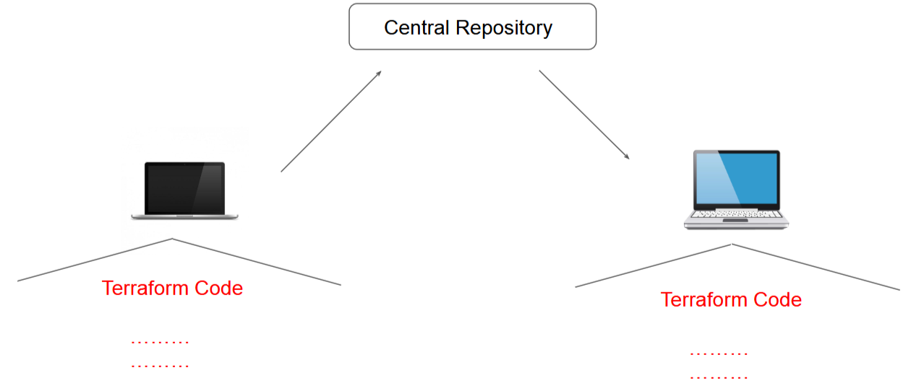

<br>

### Using BitBucket
* `Preference`: BitBucket is a preferred Git solution, offering free repositories with certain restrictions.

<br>

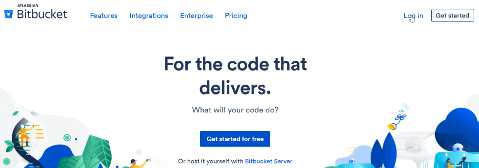

<br>

`Steps`:
1. **Create** a repository on BitBucket.

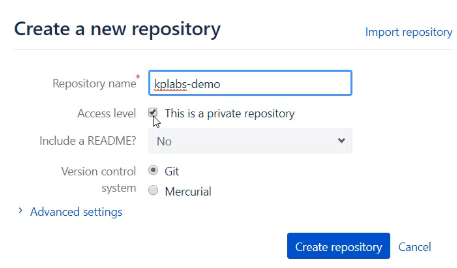

2. **Clone** the repository to your local machine.

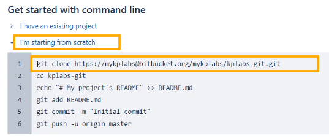

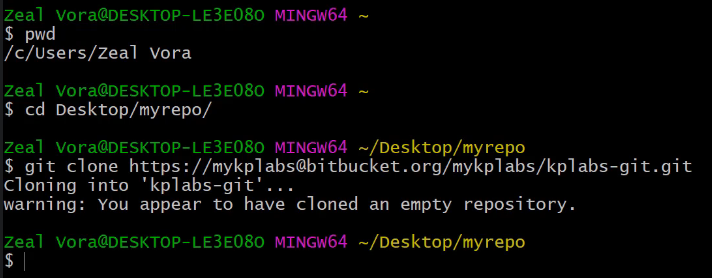

<br>

3. Add and **commit** your Terraform code to the repository.

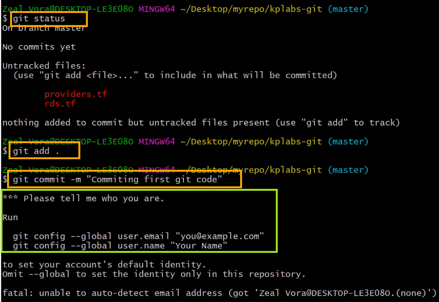

<br>

4. **Push** the changes to the central repository.

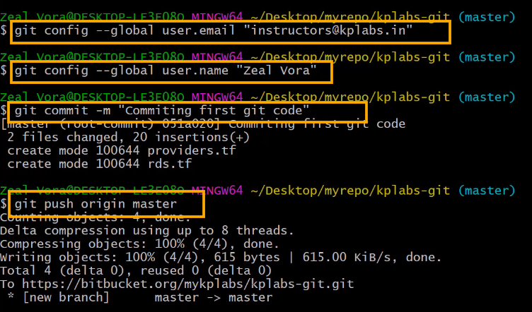

<br>

### Setting Up Git
* `Installation`: Install Git on your machine (e.g., yum install git for Linux, brew install git for Mac, download from git-scm for Windows).
* `Configuration`: Configure Git with your user information and repository details.

<br>

### Practical Demonstration
1. **Create** a repository on BitBucket named kplabs-git.
2. **Clone** the repository to a local directory named myrepo.
3. **Add** Terraform **files** (e.g., provider.tf, rds.tf) to the repository.
4. **Commit** the changes and push them to the central repository.

<br>

### Verification

* `Refreshing BitBucket`: Refresh the BitBucket repository to see the committed files.
* `Source Files`: Verify that the Terraform files are now part of the source in the BitBucket repository.

> By using Git for centralised management, you can ensure better collaboration, data security, and version control for your Terraform projects.

<br>

<hr style="height:4px;background:black">

<br>

## Security Challenges in Commiting TFState to GIT

### Storing Secrets in Git
* `Issue`: Storing passwords or any secrets within a Git repository is **not secure**.
  * **Example**: An RDS configuration file (rds.tf) containing a username and password should not be committed to Git.

### Interpolation Function
* `Approach`: Using an **interpolation** function to **read secrets** from a file **outside** the Git **repository**.

**Example**:

```bash
resource "aws_db_instance" "example" {
  username = "myusername"
  password = file("${path.module}/rds_password.txt")
}
```

* `File`: **rds_password.txt** contains the password and is not committed to the repository.

<br>

### Sensitive Data in TFState
* `Issue`: Even with interpolation, sensitive data like **passwords** are **stored** in **clear text** within the TFState file.
  * **Example**: The TFState file contains the password in clear text, which is not secure.

<br>

### Committing TFState to Git
* `Problem`: Committing the TFState file to Git exposes sensitive data, even if the password is not directly in the code.
  * **Example**: The TFState file should not be committed to the repository as it contains sensitive information.

<br>

### Best Practices
* `Avoid Committing TFState`: **Do not commit** the TFState file to the Git repository.
* `Alternative Approaches`: Use **remote state management** solutions to **securely store** and **manage** the **TFState file**.

<br>

### Practical Demonstration
1. **Create** an **RDS** configuration **file** with an **interpolation function** for the password.

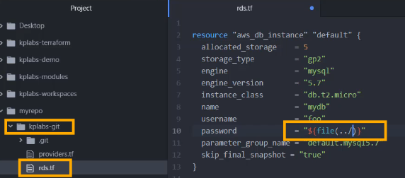

<br>

2. **Store** the **password** in a separate file (rds_password.txt) outside the repository.

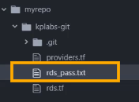

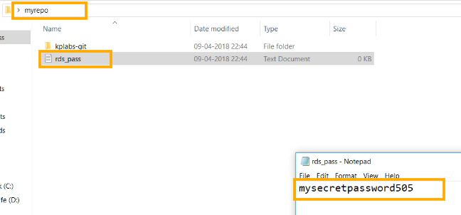

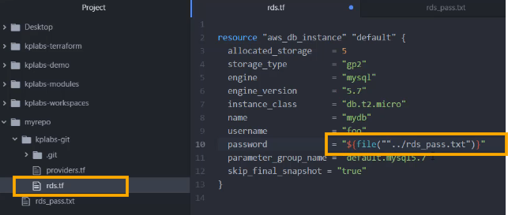

<br>

3. Terraform **Initialise** and **apply** the Terraform configuration.

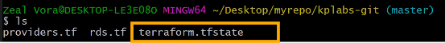

<br>

4. Verify that the password is stored in clear text in the TFState file.
5. **Commit the changes** to Git and observe the security risks.
   * DO NOT COMMIT THE TFSTATE. OTHERWISE YOUR PASSWORDS WILL SHOW. 

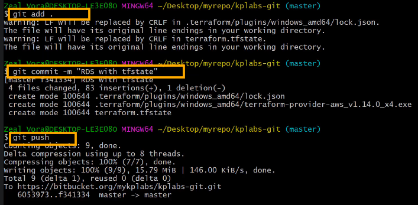

<br>

6. You should find your push on BitBucket.

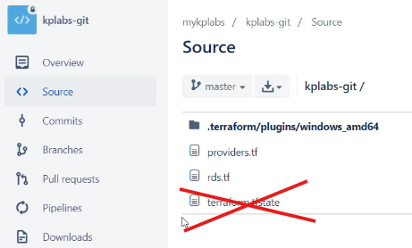

<br>

<hr style="height:4px;background:black">

<br>

## Terraform and .gitignore
Documentation: https://github.com/github/gitignore/blob/main/Terraform.gitignore

### .gitignore File
* A text file that **tells Git** which **files or folders** to **ignore** in the project.
* `Usage`: Specify the exact folders or files that should not be committed to the Git repository.

<br>

### Recommended Files to Ignore
* `.terraform Directory`: This directory is **re-created** when you run terraform init and can be large due to provider plugins.
* `terraform.tfvars`: This file can **contain sensitive data** like usernames, passwords, and secrets. Ignoring it depends on the environment.
* `terraform.tfstate`: This file should ideally be **stored remotely** and can contain **sensitive information**.
* `crash.log`: If Terraform **crashes**, **logs are stored** in this file. It can be added to .gitignore.

<br>

| Files to Ignore      | Description                                                                 |
|----------------------|-----------------------------------------------------------------------------|
| .terraform           | This file will be recreated when `terraform init` is run.                   |
| terraform.tfvars     | Likely to contain sensitive data like usernames/passwords and secrets.      |
| terraform.tfstate    | Should be stored in the remote side.                                        |
| crash.log            | If Terraform crashes, the logs are stored to a file named `crash.log`.      |

<br>

### GitHub GitIgnore Repository
* **Example**: The GitHub GitIgnore repository contains .gitignore files for various technologies, including Terraform.

`Common Entries`:
```bash
.terraform/
*.tfstate
crash.log
*.tfvars
```

<br>

### Practical Demonstration
1. Clone a Git **repository** (e.g., tmp-repo).
2. Create a new **example.tfvars** file with sensitive data.

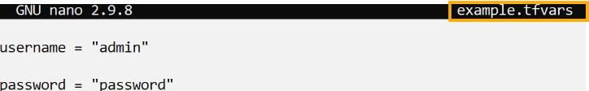

<br>

3. Run `terraform apply` to generate the state files.

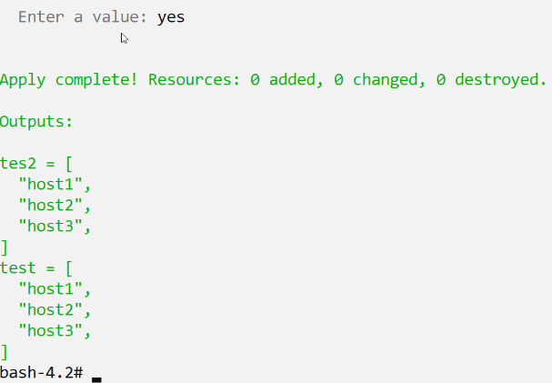

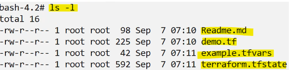

<br>

4. Initialise the folder. 

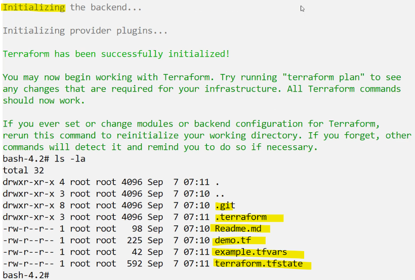

<br>

5. Create a **.gitignore file** and add entries for: .terraform, *.tfvars, and terraform.tfstate.

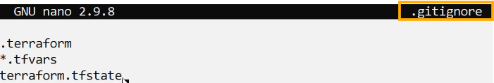

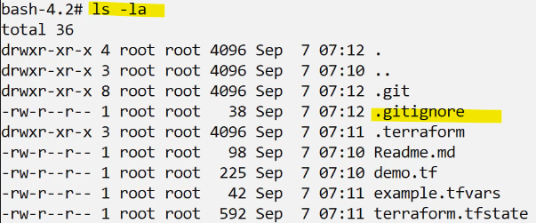

<br>

6. Check **git status** to ensure the specified files are ignored.

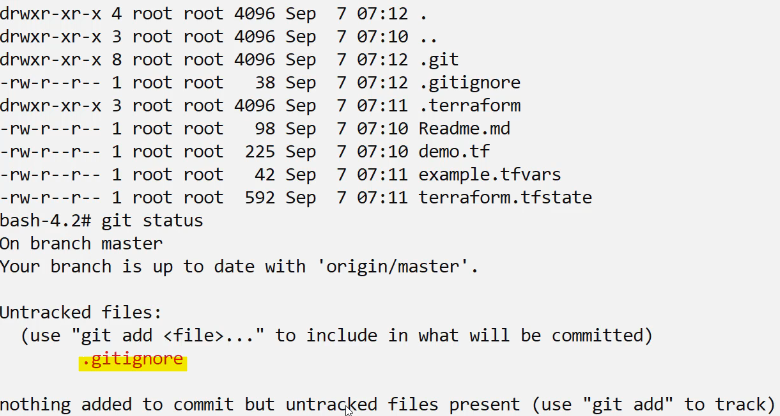

<br>

> By using a .gitignore file with Terraform, you can ensure that sensitive data and unnecessary files are not committed to your Git repository, enhancing security and efficiency.

<br>

<hr style="height:4px;background:black">

<br>

## Terraform Backend

### Terraform Backend
* Determines where Terraform **stores** its **state file**.
* `Local Backend`: By default, Terraform uses a **local backend** to store the state file on a disk.

<br>

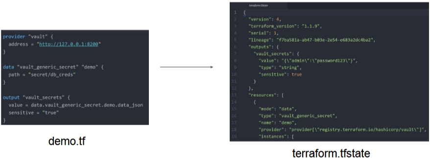

<br>

### Challenges of Local Backend
* `Collaboration`: Storing the state file **locally** does **not** allow for team collaboration.
* `Issues`: Storing the state file in a Git repository can **create issues** with the overall **state file**.

<br>

### Ideal Architecture - Central Backend
* `Solution`: Store Terraform code in a **central** Git repository and the **state file** in a **central backend**.
* `Benefits`: Allows project collaborators to access both the Terraform code and the state file from central locations.

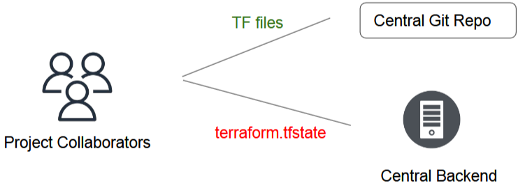

<br>

### Popular Backends
* **Examples**: S3, Consul, Azurerm, Kubernetes, HTTP, ETCD, and more.
* `Functionality`: Supports **remote service-related operations** and **stores** the state file in a **central location**.

<br>

### Practical Demonstration
* **Example Resource**: aws_eip creates a Public IP address in AWS.
* `Backend Configuration`: Use **backend.tf** to configure the S3 backend.

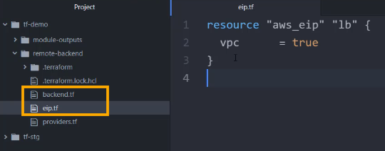

<br>

* `Command`: Run **terraform apply -auto-approve** to create the resource and store the state file in **S3** (backend).

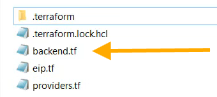

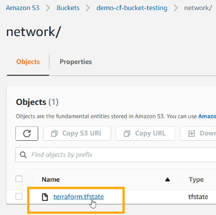

<br>

### Verification
* `S3 Bucket`: Check the S3 bucket to confirm the presence of the terraform.tfstate file.
* `State File`: Download and inspect the state file to verify the resource details.

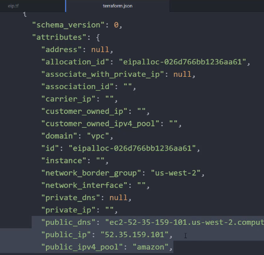

<br>

### Important Notes
* `Access Credentials`: Accessing state in a remote service requires access credentials (e.g., access secret key for S3).
* `State File Locking`: Ensure the backend supports locking of the state file to prevent conflicts and inconsistencies.

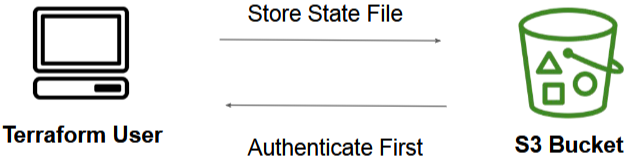

<br>

### Basic Working

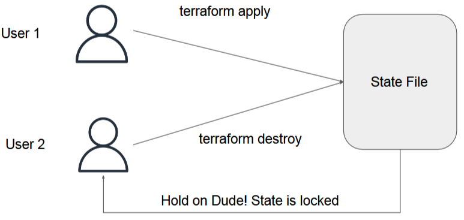

<br>

> By understanding and using Terraform Backend, you can improve project collaboration and securely manage your state files in a central location.

<br>

<hr style="height:4px;background:black">

<br>

## Implementing S3 Backend
Documentation: 
* https://registry.terraform.io/providers/scaleway/scaleway/latest/docs/guides/backend_guide
* S3 backend: https://developer.hashicorp.com/terraform/language/backend/s3

### Understanding State Lock
* Whenever you are **performing write operation**, terraform would **lock the state file**.
* This is very important as otherwise during your ongoing terraform apply operations, if others also try for the same, it can corrupt your state file.

<br>

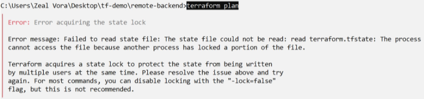

<br>

### Central Backend
* Store Terraform state files in a **central location** for better collaboration and management.
* `Types`: Multiple types of backends are available, each with its own benefits.

<br>

### Using S3 as Backend
* **Example Configuration**: Terraform provides example configurations for different backends, including S3.

`Steps`:
* Create an S3 bucket to store the state files on AWS.

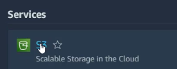

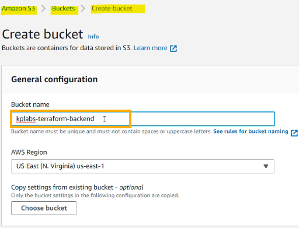

<br>

* Optionally, create subfolders within the bucket for different teams or resources.

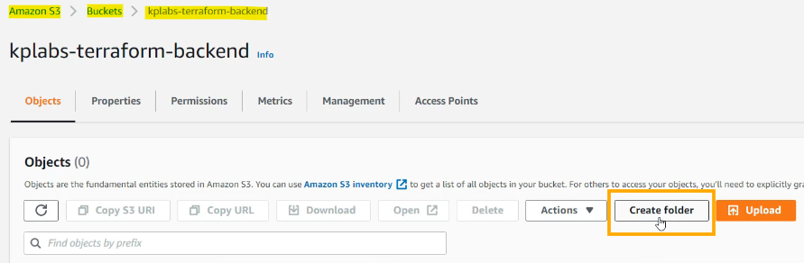

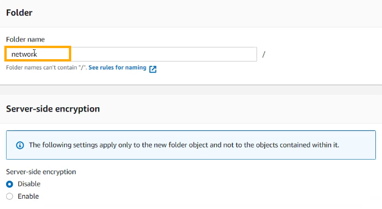


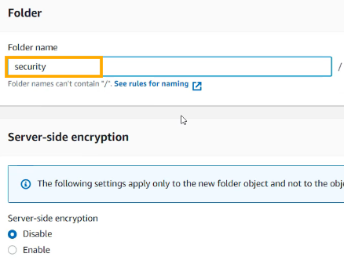


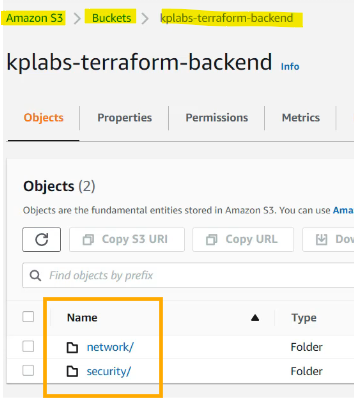

<br>

### Configuration Files

`Files`:
* **eip.tf**: Contains the resource definition for creating an Elastic IP in AWS.
* **providers.tf**: Contains provider configuration.
* **backend.tf**: Contains the backend configuration for S3.

Make another file called "backend.tf".

**[Example](https://developer.hashicorp.com/terraform/language/backend/s3)**:

```bash
terraform {
  backend "s3" {
    bucket = "kplabs-terraform-backend"
    key    = "network/terraform.tfstate"
    region = "us-east-1"
  }
}
```

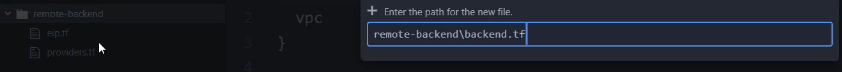

<br>

### Authentication Credentials

`Methods`:
* Store access and secret keys in the configuration file.
* Use AWS CLI to configure credentials in ~/.aws/config and ~/.aws/credentials.
* **Command**: Run aws configure to set up access and secret keys.

<br>

### Installing AWS CLI
* `Windows`: Download and install the MSI package.
* `Linux`: Use package manager commands to install AWS CLI.
* `Verification`: Use AWS CLI commands to verify access to the S3 bucket.
  * aws configure

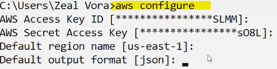

<br>

### Practical Demonstration
1. **Initialise** the Terraform configuration with **terraform init**.

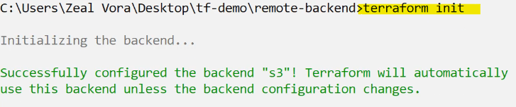

<br>

2. Apply the configuration with `terraform apply -auto-approve`.
3. **Verify** that the state file is stored in the **S3 bucket**.

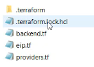

<br>

### Verification
* `Local Directory`: Check that the terraform.tfstate file is not present locally.
* `S3 Bucket`: Confirm that the terraform.tfstate file is created in the specified S3 bucket and subfolder.

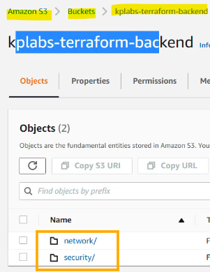

<br>

### Point to Note
* State locking happens **automatically** on b that could **write state**. You won't see any message that it is happening.
* If state locking **fails**, Terraform will **not continue**.
* Not all backends support locking. The documentation for each backend includes details on whether it supports locking or not.

<br>

### Force Unlocking State
* Terraform has a force-unlock command to **manually unlock the state** if unlocking failed.
* If you unlock the state when someone else is holding the lock it could **cause multiple writers**.
* Force unlock should only be used to unlock **your own lock** in the situation where automatic unlocking failed.

<br>

<hr style="height:4px;background:black">

<br>

## State File Locking
Documentation: 
* https://registry.terraform.io/providers/scaleway/scaleway/latest/docs/guides/backend_guide
* S3 backend: https://developer.hashicorp.com/terraform/language/backend/s3

### State Locking
* Terraform locks the state file **during write operations** to **prevent corruption**.
* `Importance`: Prevents multiple users from performing write operations simultaneously, which can corrupt the state file.

<br>


<br>

### Error Message
* **Example**: "Error acquiring the state lock" indicates that another user is performing an operation on the state file.


<br>

### Project Collaboration
* `Scenario`: Multiple users working on the same project may perform conflicting operations (e.g., terraform apply and terraform destroy).
* `Solution`: State Locking ensures that only **one user** can perform write operations **at a time**.

<br>

### Practical Demonstration
1. Create a directory (tmp) and a file (sleep.tf) with a resource block (time_sleep) that sleeps for 300 seconds.

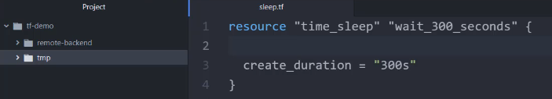

<br>

2. Run `terraform init` to initialize the configuration.
3. Run `terraform apply -auto-approve` to apply the configuration and initiate the sleep operation.

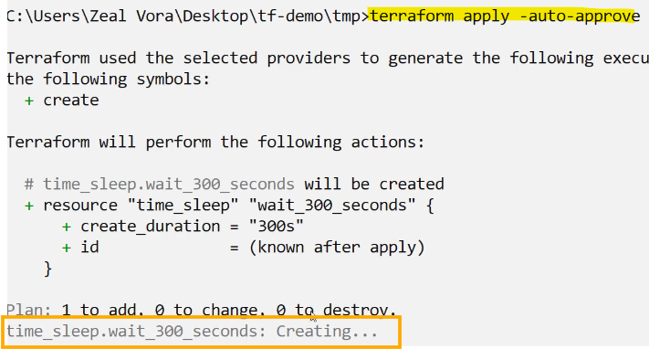

<br>

4. From a second terminal, run `terraform plan` to observe the state lock error.

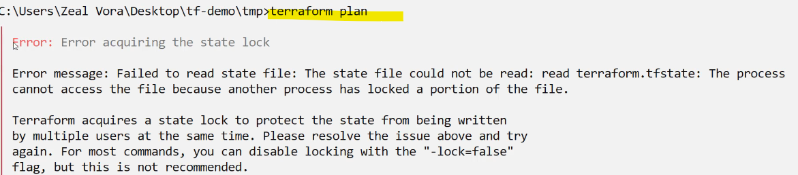

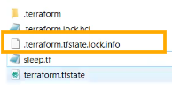

<br>

### Lock Info File
* `File`: terraform.tfstate.lock.info contains **information about the lock**, including LockID, user details, creation date, and path.

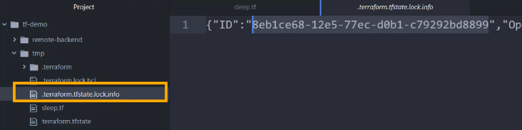

* `Removal`: The lock file is automatically removed once the operation is complete.

<br>

### Important Points
* `Automatic Locking`: State locking happens automatically during write operations.
* `Failure Handling`: If state locking fails, Terraform will not continue the operation.
* `Backend Support`: Not all backends support state locking. Check the documentation for details.

### Force Unlocking
* `Command`: terraform force-unlock can be used to manually unlock the state if the automatic unlocking process fails.
* `Caution`: Use this command cautiously to avoid causing multiple writers.

> By understanding and using State Locking in Terraform, you can prevent state file corruption and ensure smooth collaboration in your projects.

<br>

<hr style="height:4px;background:black">

<br>

## Integrating DynamoDB with S3 for State Locking
Documentation: 
* https://registry.terraform.io/providers/scaleway/scaleway/latest/docs/guides/backend_guide
* S3 backend: https://developer.hashicorp.com/terraform/language/backend/s3

### State Locking with S3 Backend
* `Default Behavior`: S3 Backend alone does **not** support state locking.
* `Solution`: Use **DynamoDB** to **store state lock** information.

### Architecture
* `S3 Bucket`: Stores the Terraform state file (terraform.tfstate).
* `DynamoDB Table`: Stores state lock information, including lock ID and other details.

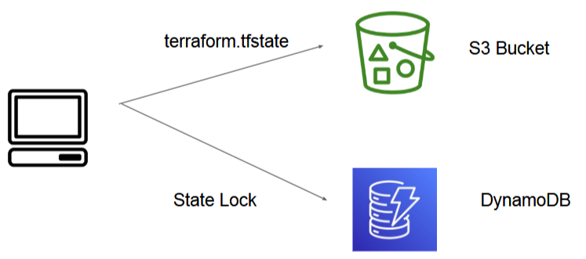

<br>

### Configuration

**Example**:

```bash
terraform {
  backend "s3" {
    bucket         = "kplabs-terraform-backend"
    key            = "network/tmp.tfstate"
    region         = "us-east-1"
    dynamodb_table = "terraform-state-locking"
  }
}
```

<br>

### Practical Demonstration

#### Without DynamoDB
1. Create a simple configuration with a time_sleep resource.

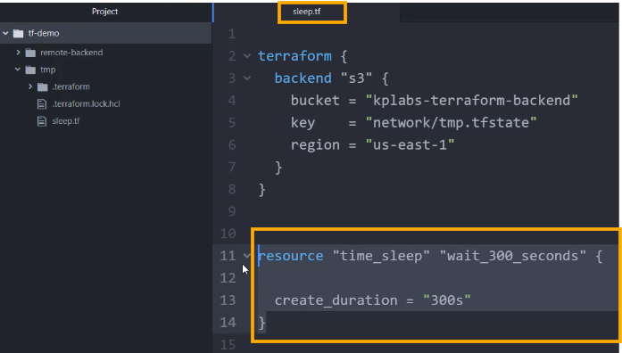

<br>

2. Store the state file in S3 without DynamoDB.

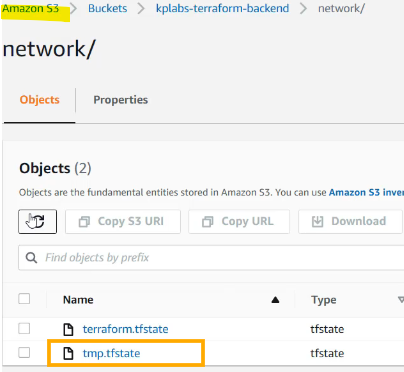

<br>

3. Run `terraform apply -auto-approve` and `terraform plan` from another terminal to observe no state lock error.

<br>

#### With DynamoDB
1. Create a **DynamoDB table** with a **partition key** named LockID of type string.

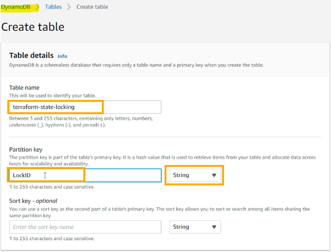

<br>

2. Update the backend configuration to **include dynamodb_table** with the name you gave your table.


<br>

3. Run `terraform init -reconfigure` and `terraform apply -auto-approve`.
4. Observe the state lock message and verify the lock information in DynamoDB.

<br>

## Verification
* `DynamoDB Table`: Check the table for lock information, including lock ID, user details, and operation type.
  * DynamoDB > Items: terraform-state-locking > Item editor.


* `State File`: Confirm that the state file is stored in the specified S3 bucket.

<br>

### Important Notes
* `State Locking`: Ensures that only one user can perform write operations at a time, preventing state file corruption.
* `Force Unlock`: Use terraform force-unlock cautiously to manually unlock the state if the automatic unlocking process fails.

> By understanding and implementing state locking with S3 Backend and DynamoDB, you can ensure secure and efficient management of Terraform state files in a collaborative environment.

<br>

<hr style="height:4px;background:black">

<br>

## Terraform State Management

### Setting the Base
* As your Terraform usage becomes more advanced, there are some cases where you may need to **modify the Terraform state**.
* It is **NOT** recommended to modify the state file manually.

### Importance of State File
* `Critical Role`: The state file is a crucial part of your Terraform project.
* `Avoid Manual Modification`: Modifying the state file manually can lead to corruption and is not recommended.

### Alternative Approach
* `Terraform State Commands`: HashiCorp provides a set of commands for advanced state management, avoiding the need for manual modifications.

<br>

### Terraform State Commands

#### Table of Terraform State Commands

| Sub-Commands       | Description                                                      |
|--------------------|------------------------------------------------------------------|
| list               | List resources within terraform state file.                      |
| mv                 | Moves item within terraform state.                               |
| pull               | Manually download and output the state from remote state.        |
| push               | Manually upload a local state file to remote state.              |
| rm                 | Remove items from the Terraform state.                           |
| show               | Show the attributes of a single resource in the state.           |
| replace-provider   | Used to replace the provider for resources in a Terraform state. |

<br> 

### Practical Demonstration
* `Example Configuration`: Creates an IAM user and a security group in AWS, with the state stored in an S3 bucket.

<br>


<br>

#### List
* `Command`: **terraform state list**
* `Purpose`: Lists all resources that are part of the Terraform state.
  * **Example**: Shows resources like AWS IAM user and AWS security group.


<br>

#### Show
* The terraform state show command is used to **show the attributes** of a **single resource** in the state.
* Useful for **debugging** and understanding the current attributes of a resource.
* `Command`: **terraform state show <resource>**
  * e.g., terraform state show aws_security_group.prod


<br>

* `Purpose`: Displays attributes of a single resource in the state.
  * **Example**: Shows attributes like ARN, description, security group ID, owner ID, and VPC ID.

<br>


<br>

#### Pull
* The terraform state pull command is used to **pull the state** from a **remote backend** and **output it to stdout**.
* Useful to **view** or **backup** the **current state** stored in a remote backend.

<br>


<br>

* `Command`: **terraform state pull**
* `Purpose`: Pulls the state from a remote backend and outputs it to stdout.
  * **Example**: Retrieves the entire state file from an S3 backend.

<br>


<br>

#### Remove (RM)
* The terraform state rm command is used to **remove items from the state**.
* Use this when you need to **remove a resource** from Terraform’s state management **without destroying it**.

<br>


<br>

* `Command`: **terraform state rm <resource>**
* `Purpose`: Removes an item from the state file.
  * **Example**: Removes a resource that has been modified manually and is difficult to manage via Terraform. We have created an inbound rule so that we can remove it. 

<br>


<br>

* Now when you `terraform state pull`, you can see they have been removed from the state.

<br>


<br>

#### Move (MV)
* The terraform state mv command is used to **move an item** in the state to a **different address**.
* `Command`: **terraform state mv <source> <destination>**
* `Purpose`: Moves an item in the state to a different address.
  * **Example**: Changes the name of a resource without destroying and recreating it (from "dev" to prod".)

<br>

If you change the name manually:


<br>

* From the command line, `terraform plan`. You can see that it's trying to destroy the resource and make a new one.


<br>

Using the mv command correctly:
*  Copy the exact address.dev and specify the new address of prod (aws_iam_user.prod).


*  `Terraform state mv aws_iam_user.dev aws_iam_user.prod`


<br>

#### Replace Provider
* The terraform state replace-provider command is used to **replace the provider** for resources in a Terraform state.
* `Command`: **terraform state replace-provider <current> <new>**
* `Purpose`: Replaces the provider for resources in the state.
  * **Example**: Changes the provider from hashicorp/aws to a custom provider.

<br>


<br>

* You need to specify the **current provider** and the **new provider** that you want to use.
* So the current provider is HashiCorp, AWS and the new provider address you can add, for example, `kplabs.in/internal/aws`.


<br>

#### Commands
* `terraform init`: Initializes the configuration.
* `terraform apply -auto-approve`: Applies the configuration.
* `terraform state list`: Lists the resources in the state.
* `terraform state show <resource>`: Shows attributes of a resource.
* `terraform state pull`: Pulls the state file from the S3 backend.
* `terraform state rm <resource>`: Removes a resource from the state.
* `terraform state mv <source> <destination>`: Moves a resource to a different address.
* `terraform state replace-provider <current> <new>`: Replaces the provider for resources.

<br>

### Removing Resources from State
* `Scenario`: A resource has been **modified** too many times and is difficult to manage via Terraform.
* `Solution`: Use **terraform state rm** to remove the resource from the state without destroying it.
  * **Example**: Remove a security group and its rules from the state file.

<br>

### Moving Resources in State
* `Scenario`: **Changing the name of a resource** without destroying and recreating it.
* `Solution`: Use terraform state mv to move the resource to a new address.
  * **Example**: Change the name of an IAM user from dev to prod.

<br>

### Replacing Providers
* `Scenario`: **Switching** from a default **provider** to a custom provider.
* `Solution`: Use terraform state replace-provider to replace the provider for resources in the state.
  * **Example**: Replace hashicorp/aws with a custom provider.

> By understanding and using these Terraform state commands, you can effectively manage your state file without risking corruption.

<br>

<hr style="height:4px;background:black">

<br>

## Cross-project Collaboration Using Remote State Data Source

### Remote State Data Source
* A feature in Terraform that allows **different teams** to **access** and **share** **state data stored remotely**.
* `Importance`: Extensively used in medium to large scale organizations for efficient infrastructure management.

### Typical Challenge
* `Scenario`: Multiple teams **managing different aspects** of infrastructure (e.g., networking team managing public IP addresses, security team managing firewall rules).
* `Problem`: Security Team wants that all the IP addresses added as part of Output Values in tfstate file of Networking Team project should be whitelisted in Firewall
* `Solution`: **Remote State Data Source**: Allows Terraform code from one team to connect to the remote backend of another team to fetch values from the state file.

<br>


<br>

`Steps`:
* **Connect to S3 Bucket**: Security team's code connects to the S3 bucket where the networking team's state file is stored.
* **Fetch Output Values**: Security team's code fetches the IP addresses from the output values in the state file.
* **Whitelist IP Addresses**: Security team's code whitelists the fetched IP addresses in the firewall rules.

<br>

### Practical WorkFlow Steps
1. Create **two folders** for networking-team and security-team
2. Create **Elastic IP resource** in Networking Team and Store the State file in **S3 bucket**. 
   * Output values should have information of EIP.
3. In Security Team, use Terraform **Remote State data source** to **connect** to the **tfstate file** of Networking Team.
4. Use the **Remote State** to **fetch EIP** and **whitelist** it in Security Group rule.

<br>

#### Setup
* `Networking Team`: Creates public IP addresses and stores the state file in an S3 bucket.
* `Security Team`: Fetches the IP addresses from the networking team's state file and whitelists them in the firewall rules.

#### Files
* `eip.tf`: Creates an Elastic IP address and defines output values.
* `backend.tf`: Configures the remote backend (S3) for storing the state file.

#### Commands
* `terraform init`: Initializes the configuration.
* `terraform apply -auto-approve`: Applies the configuration.
* `terraform plan`: Plans the changes and verifies the fetched IP addresses.

<br>

### Verification
* `Networking Team`: Confirms the creation of the Elastic IP address and its storage in the S3 bucket.
* `Security Team`: Verifies that the IP addresses are fetched from the remote state and whitelisted in the firewall rules.

<br>

### Automation vs. Manual Approach
* `Manual Approach`: Copying and pasting IP addresses manually from the state file to the security group rules.
* `Automation`: Using Terraform code to automatically connect to the S3 bucket, **fetch the IP addresses**, and **whitelist them**.
  * The **terraform_remote_state** data source allows us to fetch output values from a specific state backend.

<br>


<br>

> By understanding and using the remote state data source feature in Terraform, teams can efficiently share and access state data, ensuring smooth collaboration and management of infrastructure.

<br>

<hr style="height:4px;background:black">

<br>

## Remote State Data Source Practical

### Setup
* `Folders`: Create **two folders**, one for the **networking team** and one for the **security team**.
* `Networking Team`: Responsible for creating public IP addresses and storing the state file in an S3 bucket.
* `Security Team`: Fetches the IP addresses from the networking team's state file and uses them in their configuration.

<br>

### Networking Team Configuration

Files:
* `eip.tf`: Creates an Elastic IP address and defines output values.
* `backend.tf`: Configures the remote backend (S3) for storing the state file.

Steps:
1. Create an S3 bucket to store the state file.
2. Define the Elastic IP resource and output values in eip.tf.
3. Configure the remote backend in backend.tf with the S3 bucket details.
4. **Initialise** and **apply** the configuration using terraform init and terraform apply -auto-approve.

<br>

### Security Team Configuration

Files:
* `sg.tf`: Creates a security group and an inbound rule.
* `data.tf`: Defines the remote state data source to fetch the IP address from the networking team's state file.

`Steps`:
1. Define the remote state data source in data.tf with the S3 bucket details.
2. Use the fetched IP address in the security group rule in sg.tf.
3. **Initialise** and **apply** the configuration using terraform init and terraform apply -auto-approve.

<br>

### Verification
* `Networking Team`: Confirms the creation of the Elastic IP address and its storage in the S3 bucket.
* `Security Team`: Verifies that the IP addresses are fetched from the remote state and used in the security group rules.

<br>

### Automation vs. Manual Approach
* `Manual Approach`: Copying and pasting IP addresses manually from the state file to the security group rules.
* `Automation`: Using Terraform code to automatically connect to the S3 bucket, fetch the IP addresses, and whitelist them.

<br>

### Defining Remote State Source
1. Specify the remote state backend in the security team's configuration.

**Example**:

```bash
data "terraform_remote_state" "vpc" {
  backend = "s3"
  config = {
    bucket = "kplabs-networking-bucket-demo"
    key    = "eip.tfstate"
    region = "us-east-1"
  }
}
```

2. Use the data block to fetch the IP address from the remote state.

**Example**:

```bash
resource "aws_security_group_rule" "allow_eip" {
  cidr_blocks = ["${data.terraform_remote_state.vpc.outputs.eip_addr}/32"]
  ...
}
```

> By understanding and implementing the remote state data source feature in Terraform, teams can efficiently share and access state data, ensuring smooth collaboration and management of infrastructure.

<br>

<hr style="height:4px;background:black">

<br>

## Overview of Terraform Import

### Challenges with Manual Resources
* `Scenario`: Organizations have **manually created resources** that need to be **managed by Terraform**.
* `Problem`: Transitioning these resources to Terraform management can be time-consuming and complex.

<br>

### Terraform Import Functionality

Older Approach:
* `State File Only`: The import functionality would only create the state file for the resources.
* `Manual Configuration`: Users had to manually write the Terraform configuration files.

Newer Approach:
* `State File and Configuration`: The **import functionality** now generates both the **state file** and the Terraform **configuration files** **automatically**.
* `Efficiency`: This reduces the time and effort required to transition to Terraform management.

<br>


<br>

### Points to Note
* Terraform **1.5** introduces **automatic code generation** for imported resources.
* This dramatically reduces the amount of time you need to spend writing code to match the imported.
* This feature is not available in the older version of Terraform.

<br>

### Practical Demonstration
* **Example**: Importing a manually created security group in AWS.

`Steps`:
1. Specify the ID of the manually created resource in the import.tf file.
2. Run terraform plan with the generate config out option to create the configuration file.
3. Run terraform apply to create the state file and manage the resource with Terraform.
4. Modify the resource using Terraform and verify the changes in the AWS console.

<br>

### Important Pointers
* `Version Requirement`: The automatic code generation feature is available from Terraform version 1.5 onwards.
* `Benefits`: Drastically reduces the time spent writing code and simplifies the transition to Terraform management.
* `Version Check`: Use the terraform version command to check the version being used. Upgrade to the latest version if necessary.

> By understanding and using the Terraform import functionality, organizations can efficiently transition manually created resources to Terraform management, ensuring better infrastructure management and automation.

<br>

<hr style="height:4px;background:black">

<br>

## Practical Implementation of Terraform Import
Documentation: https://developer.hashicorp.com/terraform/language/import

### Creating a Resource Manually
* **Example**: Creating a security group in AWS manually.

`Steps`:
1. Go to the EC2 service in the AWS Management Console.
2. Create a security group with specific **inbound** and **outbound** rules.
   * Inbound:
     * port 80: 0.0.0.0/0: allow HTTP from internet.
     * port 443: 0.0.0.0/0: allow HTTPS from internet.
     * port 22: add a very specific CIDR block (170.31.0.0/16).
   * Outbound:
     * All traffic: 0.0.0.0/0.

> Note the security group ID for later use.

<br>


<br>

### Using the Import Block
* `Syntax`: The [import block](https://developer.hashicorp.com/terraform/language/import) requires the **resource address** and the **ID** of the **manually created resource**.

<br>

**Example**:
* Copy the secuity group ID. 


<br>

```bash
import {
  to = aws_security_group.mysg
  id = "sg-0123456789abcdef"
}
```

<br>


<br>

### Generating Configuration
* `Command`: Use terraform plan with the **generate-config-out** option to create the configuration file.

**Example**:


<br>

```bash
terraform plan -generate-config-out mysg.tf
```

<br>


<br>

* And at this stage it has automatically generated the configuration file.
* You'll see a new file called **mysg.tf** has been created.

<br>


<br>

### Applying Configuration
* **Command**: Run `terraform apply` to create the state file and manage the resource with Terraform.

**Example**:

```bash
terraform apply -auto-approve
```

<br>


<br>

### Verification
* `Modify Resource`: Edit the configuration file to change a rule and apply the changes.
  * **Example**: Change the CIDR block for port 80 and verify the update in the AWS console.

> By understanding and using the Terraform import functionality, organizations can efficiently transition manually created resources to Terraform management, ensuring better infrastructure management and automation.

<br>

<hr style="height:4px;background:black">
