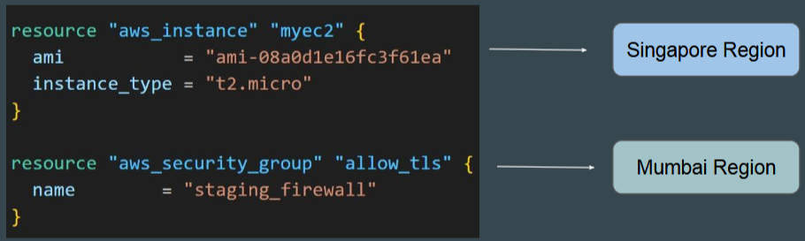

- [Security Primer](#security-primer)
  - [Multiple Provider Configuration](#multiple-provider-configuration)
    - [Scenario](#scenario)
    - [Single Provider Configuration](#single-provider-configuration)
    - [Alias Meta Argument](#alias-meta-argument)
      - [Explanation](#explanation)
    - [Associating Resources with Providers](#associating-resources-with-providers)
      - [Explanation](#explanation-1)
    - [Practical Demonstration](#practical-demonstration)
    - [Example Configuration](#example-configuration)
  - [Sensitive Parameter](#sensitive-parameter)
    - [Sensitive Information Exposure](#sensitive-information-exposure)
    - [Sensitive Parameter](#sensitive-parameter-1)
    - [Practical Demonstration](#practical-demonstration-1)
    - [Without Sensitive Parameter](#without-sensitive-parameter)
    - [Local Sensitive File Resource](#local-sensitive-file-resource)
    - [Referencing Sensitive Values in Outputs](#referencing-sensitive-values-in-outputs)
    - [Point to Note](#point-to-note)
    - [Benefits of Mature Providers](#benefits-of-mature-providers)
    - [Verification](#verification)
    - [State File Considerations](#state-file-considerations)
    - [Automatic Redaction by Providers](#automatic-redaction-by-providers)
  - [Overview of HashiCorp Vault](#overview-of-hashicorp-vault)
    - [Secrets Management Challenges](#secrets-management-challenges)
    - [Dynamic Secrets](#dynamic-secrets)
    - [User Interface](#user-interface)
    - [Demo of HashiCorp Vault](#demo-of-hashicorp-vault)
    - [Additional Features](#additional-features)
    - [Integration with Backends](#integration-with-backends)
  - [Terraform and Vault Integration](#terraform-and-vault-integration)
    - [Vault Provider](#vault-provider)
    - [Example Configuration](#example-configuration-1)
    - [Practical Demonstration](#practical-demonstration-2)
      - [Commands](#commands)
    - [AWS Engine in Vault](#aws-engine-in-vault)
    - [Security Considerations](#security-considerations)
  - [Dependency Lock File](#dependency-lock-file)
    - [Dependency Lock File](#dependency-lock-file-1)
    - [Provider Plugins and Terraform Release Cycle](#provider-plugins-and-terraform-release-cycle)
    - [Version Dependencies](#version-dependencies)
    - [Initialisation and Lock File Creation](#initialisation-and-lock-file-creation)
    - [Practical Demonstration](#practical-demonstration-3)
    - [Handling Version Updates](#handling-version-updates)
    - [Security Considerations](#security-considerations-1)
    - [Important Points](#important-points)

<br>

<hr style="height:4px;background:black">

<br>

# Security Primer

## Multiple Provider Configuration

### Scenario
* `Requirement`: Deploy **different resource** types in **different regions** using a single Terraform file.
  * **Example**: Deploy an EC2 instance in Singapore and a security group in Mumbai.

<br>



<br>

### Single Provider Configuration
* `Limitation`: All resources are deployed in the same region specified in the provider block.
  * **Example**: If the region is set to **ap-southeast-1**, all resources will be created in Singapore.
  * In below code, both resources will be created in **Singapore** region.

<br>


<br>

### Alias Meta Argument
* Each provider can have **one default configuration**, and any **number** of **alternate configurations** that include an extra name segment (or "alias")
* `Solution`: Use the alias meta argument to define multiple provider configurations with different regions.

<br>


<br>

**Example**:

```bash
provider "aws" {
  region = "ap-southeast-1"
}

provider "aws" {
  alias  = "mumbai"
  region = "ap-south-1"
}

provider "aws" {
  alias  = "usa"
  region = "us-east-1"
}
```

#### Explanation
* The **first** provider block sets the default region to **Singapore** (ap-southeast-1).
* The **second** provider block sets the region to **Mumbai** (ap-south-1) and assigns it an alias mumbai.
* The **third** provider block sets the region to **Virginia** (us-east-1) and assigns it an alias usa.

<br>


<br>

### Associating Resources with Providers
* `Syntax`: Use the provider argument in the resource block to specify the provider alias.

**Example**:

```bash
resource "aws_instance" "example" {
  provider = aws.mumbai
  ...
}

resource "aws_security_group" "example" {
  provider = aws.usa
  ...
}
```

#### Explanation
* The **aws_instance** resource is **associated** with the provider block that has the **alias mumbai**, so it will be **created** in the** Mumbai region**.
* The **aws_security_group** resource is **associated** with the provider block that has the **alias usa**, so it will be **created** in the **Virginia region**.

<br>

### Practical Demonstration

**Steps**:
* `Define Multiple Provider Blocks`: Create multiple provider blocks with different regions and aliases.
* `Associate Resources with Providers`: Use the provider argument in the resource blocks to specify which provider block to use.
* `Validate Configuration`: Run terraform validate to ensure the configuration is correct.
* `Apply Configuration`: Run terraform apply -auto-approve to create the resources in the specified regions.
* `Verification`: Check the AWS console to confirm that resources are created in the specified regions.

<br>

### Example Configuration

`Provider Blocks`:

```bash
provider "aws" {
  region = "ap-southeast-1"
}

provider "aws" {
  alias  = "mumbai"
  region = "ap-south-1"
}

provider "aws" {
  alias  = "usa"
  region = "us-east-1"
}
```

`Resource Blocks`:

```bash
resource "aws_security_group" "prod_firewall" {
  provider = aws.usa
  name     = "prod_firewall"
  ...
}

resource "aws_security_group" "staging_firewall" {
  provider = aws.mumbai
  name     = "staging_firewall"
  ...
}
```

<br>

> By understanding and using the multiple provider configuration feature in Terraform, organizations can efficiently manage and deploy resources across different regions, ensuring better infrastructure management and flexibility.

<br>

<hr style="height:4px;background:black">

<br>

## Sensitive Parameter

### Sensitive Information Exposure
* `Issue`: When running commands like terraform plan or terraform apply, Terraform **displays the values of attributes in the CLI output**, which can include sensitive information.
  * **Example**: A local file resource showing the content supersecretpassw0rd in plain text.

<br>


<br>

### Sensitive Parameter
* To **prevent** sensitive information from being **exposed** in the CLI output and logs.
* `Usage`: Add the sensitive = true parameter to the variable definition.

**Example**:

```bash
variable "sensitive_content" {
  default   = "supersecretpassw0rd"
  sensitive = true
}
```

<br>


<br>

### Practical Demonstration

`Initial Setup`:
* Define a local file resource with sensitive content.

**Example**:

```bash
resource "local_file" "example" {
  filename = "password.txt"
  content  = var.sensitive_content
}
```

* If you try to reference sensitive value in output values, Terraform will immediately give you an **error**.

<br>


<br>

### Without Sensitive Parameter
* Running terraform plan shows the sensitive content in plain text.

`With Sensitive Parameter`:
* Adding **sensitive = true** to the variable definition hides the sensitive content in the CLI output.

**Example**:

```bash
variable "sensitive_content" {
  default   = "supersecretpassw0rd"
  sensitive = true
}
```

<br>


<br>

### Local Sensitive File Resource
* HashiCorp provides specific resource types that **inherently handle sensitive information**.

**Example**:

```bash
resource "local_sensitive_file" "example" {
  filename = "password.txt"
  content  = "supersecretpassw0rd"
}
```

* This approach automatically marks the content as sensitive **without needing** the **sensitive = true** parameter.

<br>

### Referencing Sensitive Values in Outputs
* `Issue`: Terraform will give an error if you try to reference a sensitive value in the output values.
* `Solution`: Mark the output as sensitive to avoid errors.

**Example**:

```bash
output "pass" {
  value     = local.sensitive_file.foo.content
  sensitive = true
}
```

<br>

### Point to Note
* Sensitive parameter will **NOT** protect / redact information from State file.


<br>

### Benefits of Mature Providers
* Various providers like AWS will **automatically considers** the password argument for any database instance as **sensitive** and will **redact it** as a **sensitive value**.

<br>


<br>

### Verification

`Commands`:
* Run terraform init to initialize the configuration.
* Run terraform plan to see the output and verify that sensitive information is hidden.
* Run terraform apply -auto-approve to apply the configuration and check the output.

<br>

### State File Considerations
* `Issue`: Sensitive information is still visible in the state file.
* `Solution`: Use the sensitive parameter to protect CLI output and logs, but additional measures are needed to protect the state file.

<br>

### Automatic Redaction by Providers
* **Example**: The AWS provider automatically redacts sensitive information like database passwords in the CLI output.
* `Usage`: Define resources like aws_db_instance and observe that sensitive values are hidden by default.

**Example**:

```bash
resource "aws_db_instance" "example" {
  identifier = "example-db"
  username   = var.db_user
  password   = "supersecretpassw0rd"
  ...
}
```

<br>


<br>

> By understanding and using the sensitive parameter in Terraform, you can ensure that sensitive information is not exposed in the CLI output or logs, enhancing the security of your infrastructure management.

<br>

<hr style="height:4px;background:black">

<br>

## Overview of HashiCorp Vault

### Secrets Management Challenges
* `Common Issues`: Many users **store secrets** like database passwords, AWS access keys, API tokens, and encryption keys in insecure places like notepads.
* `Solution`: HashiCorp Vault provides a **secure way** to **store** and **manage** these **secrets**.

<br>

### Dynamic Secrets
* `Feature`: Vault can **generate** and **send database credentials** or access keys to users **dynamically**.
  * **Example**: Developers can request database credentials that are valid for a limited time (e.g., 24 hours), reducing the risk of breaches and data leaks.
* `Rotation`: Vault ensures that secrets are rotated regularly.

<br>


<br>

### User Interface
* `Initial CLI-Based Tool`: Vault was initially a CLI-based tool, which was challenging for new users.
* `Introduction of GUI`: HashiCorp introduced a graphical user interface (GUI) to make learning and managing Vault easier.

<br>

### Demo of HashiCorp Vault
* `AWS Access Keys`: Developers can generate AWS access and secret keys through the Vault GUI.

<br>


<br>

* `Database Credentials`: Developers can request database credentials with a limited lease duration (e.g., 1 hour).
* Command: vault read database/creds/readonly

<br>


<br>

* `Linux Instance Login`: Developers can request login credentials for Linux instances.
  * Example command: vault write ssh/creds/otp_key_role ip=54.85.165.98

<br>


<br>

### Additional Features
* `Encryption`: Vault can **encrypt** and **decrypt data** for applications, eliminating the need for custom encryption logic.
* `Hashing and Random Data Generation`: Vault provides features for **hashing data** and **generating random data**.

<br>

### Integration with Backends
* `Benefit`: Once integrated with necessary backends, Vault **simplifies access management** and allows teams to focus on their core tasks.
  * **Example**: Vault can manage database credentials, Linux credentials, and AWS access keys for hundreds of developers, reducing the workload on database administrators.

> By understanding and using HashiCorp Vault, organizations can enhance their security posture by securely managing secrets and automating access management.

<br>

<hr style="height:4px;background:black">

<br>

## Terraform and Vault Integration

### Vault Provider
* Allows Terraform to read from, write to, and configure HashiCorp Vault.
* Use Case: Fetching database credentials stored in Vault to use in Terraform configurations.

<br>


<br>

### Example Configuration

`Vault Setup`:
* Create a secret in Vault with the path** secret/db_creds** containing database credentials.

**Example**:

```bash
provider "vault" {
  address = "http://127.0.0.1:8200"
}

data "vault_generic_secret" "demo" {
  path = "secret/db_creds"
}

output "vault_secret" {
  value = data.vault_generic_secret.db_creds.data_json
  sensitive = "true"
}
```

<br>

### Practical Demonstration

`Steps`:
* **Initialise Vault**: Ensure Vault is running and create a secret with database credentials.
* **Terraform Configuration**: Define the Vault provider and specify the path to the secret.
* **Fetch Secret**: Use Terraform to fetch the secret and output the values.

#### Commands
* `terraform init`: Initialize the Terraform configuration.
* `terraform apply`: Apply the configuration to fetch the secret from Vault.

<br>

### AWS Engine in Vault
* Allows Vault to generate IAM user credentials dynamically.


<br>

* `Integration with Terraform`: Terraform can use these dynamically generated credentials to **perform operations** on AWS **without hardcoding** access keys.

<br>

### Security Considerations
* `State File`: Secrets read from Vault are stored in the Terraform state file.
* `Recommendation`: Ensure the Terraform state file is secured to prevent exposure of sensitive information.

<br>

> By understanding and using the Vault provider in Terraform, organizations can securely manage secrets and integrate them into their Terraform configurations, enhancing security and automation.

<br>

<hr style="height:4px;background:black">

<br>

## Dependency Lock File

### Dependency Lock File
* Ensures that the **same version** of **provider plugins** is **used** across **different environments**, preventing issues caused by version discrepancies.
* `File Name`: terraform.lock.hcl

<br>

### Provider Plugins and Terraform Release Cycle
* `Independent Release Cycles`: Provider plugins and Terraform have **separate release cycles** and are **managed independently**.
  * **Example**: Terraform might be on version 1.2 while the AWS provider plugin could have multiple versions (e.g., 1, 2, 3) released independently.

<br>


<br>

### Version Dependencies
* Specify the **versions** of **provider plugins** that the code is tested and **compatible** with.
  * After selecting a specific version of each dependency, Terraform r**emembers the decisions** it made in a **dependency lock file** so that it can (by default), **make the same decisions again** in the future. 
* `Syntax`: Define version constraints in the required_providers block.

**Example**:

```bash
terraform {
  required_providers {
    aws = {
      source  = "hashicorp/aws"
      version = "~> 4.0"
    }
  }
}

# Configure the AWS provider
provider "aws"{
    region = "eu-east-1"
}
```

<br>


<br>

### Initialisation and Lock File Creation
* When terraform init is run, Terraform **selects a version of the provider plugin** that **matches the constraints** and **records it in the lock file**.
  * **Example**: If the version constraint is >= 4.0, < 5.0, Terraform might select version 4.62.0 and record it in terraform.lock.hcl.

<br>

### Practical Demonstration

`Steps`:
1. Define version constraints in the **demo.tf** file.


<br>

2. Run **terraform init** to initialise the configuration and create the lock file.
   * `terraform init`: Initializes the configuration and **creates the lock file**.


   * `terraform apply`: **Applies the configuration** using the **locked provider version**.
3. Verify the lock file (terraform.lock.hcl) to see the recorded version and hashes.

<br>

### Handling Version Updates
* `Scenario`: If the code is updated to specify a **different version** that does **not match the lock file**, Terraform will give an **error**.

<br>


<br>

* `Solution`: Use the **-upgrade** option with terraform init to update the provider version.

**Example**:

```bash
terraform init -upgrade
```

<br>

### Security Considerations
* `Hashes`: The lock file includes **cryptographic hashes** to ensure the **integrity** and **authenticity** of the provider plugins.
* `Verification`: Terraform verifies the provider plugins against these hashes during initialisation.

<br>

### Important Points
* `Provider Dependencies`: The dependency lock file currently **tracks** only the **provider dependencies**.
* `Remote Modules`: The **lock file** does **not remember** the **version selection for remote modules**. 
  * Terraform will always select the **newest available module** version based on the version constraints.

> By understanding and using the dependency lock file in Terraform, organizations can ensure consistent and reliable use of provider plugins, enhancing the stability and security of their infrastructure management.

<br>

<hr style="height:4px;background:black">

<br>