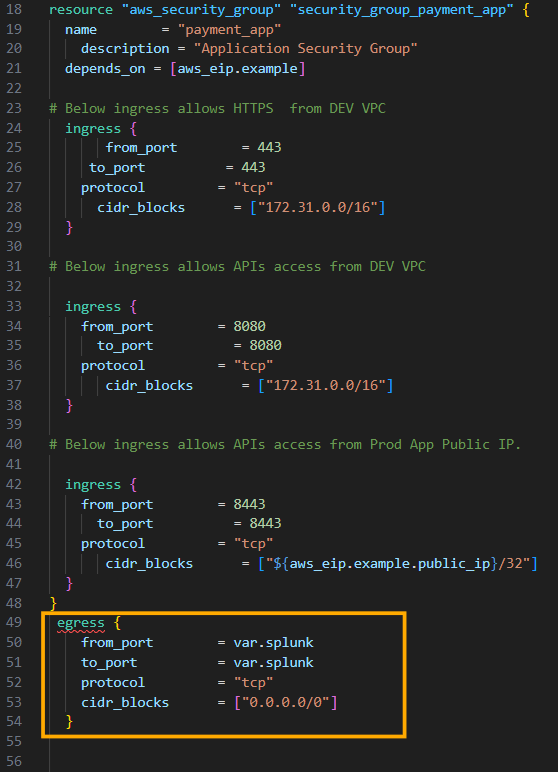

- [Terraform Challenges](#terraform-challenges)
  - [Challenge 1](#challenge-1)
    - [Challenge Description](#challenge-description)
    - [Steps to Complete the Challenge](#steps-to-complete-the-challenge)
    - [Sample Code](#sample-code)
    - [Learning Outcome](#learning-outcome)
  - [Challenge 1 - Solution](#challenge-1---solution)
    - [Creating Infrastructure with Provided Code](#creating-infrastructure-with-provided-code)
    - [Using Older Terraform Version](#using-older-terraform-version)
    - [Configuring AWS Credentials](#configuring-aws-credentials)
    - [Modifying Code for Latest Terraform Version](#modifying-code-for-latest-terraform-version)
    - [Handling Deprecation Warnings](#handling-deprecation-warnings)
    - [Final Verification](#final-verification)
  - [Challenge 2](#challenge-2)
    - [Challenge Description](#challenge-description-1)
    - [Files Provided](#files-provided)
    - [Conditions to Meet](#conditions-to-meet)
    - [Steps to Complete the Challenge](#steps-to-complete-the-challenge-1)
  - [Challenge 2 - Solution](#challenge-2---solution)
    - [Ensuring Code Functionality](#ensuring-code-functionality)
    - [Fixing the Egress Block Error](#fixing-the-egress-block-error)
    - [Updating Provider Versions](#updating-provider-versions)
    - [Handling Deprecation Warnings](#handling-deprecation-warnings-1)
    - [Optimising Code Indentation](#optimising-code-indentation)
    - [Using Variables and tfvars File](#using-variables-and-tfvars-file)
    - [Adding Tags to Resources](#adding-tags-to-resources)
    - [Modifying Variable Values Without Changing Code](#modifying-variable-values-without-changing-code)
    - [Adding Descriptions to Resources](#adding-descriptions-to-resources)
    - [Organising Code into Separate Files](#organising-code-into-separate-files)
  - [Challenge 3](#challenge-3)
    - [Challenge Description](#challenge-description-2)
    - [Conditions to Meet](#conditions-to-meet-1)
    - [Steps to Complete the Challenge](#steps-to-complete-the-challenge-2)
    - [Example Scenario](#example-scenario)
    - [Folder Structure](#folder-structure)
  - [Challenge 3 - Solution](#challenge-3---solution)
    - [Using for\_each Loop](#using-for_each-loop)
    - [Example Code](#example-code)
    - [Understanding for\_each](#understanding-for_each)
    - [Verifying the Solution](#verifying-the-solution)
    - [Handling Changes in the Map](#handling-changes-in-the-map)
    - [Example Scenario](#example-scenario-1)
    - [Modifying Instance Types](#modifying-instance-types)
  - [Challenge 4](#challenge-4)
    - [Challenge Description](#challenge-description-3)
    - [Requirements](#requirements)
    - [Requirement 1: Creating AWS Users](#requirement-1-creating-aws-users)
    - [Requirement 2: Displaying User Names](#requirement-2-displaying-user-names)
    - [Requirement 3: Counting Total Users](#requirement-3-counting-total-users)
    - [Steps to Complete the Challenge](#steps-to-complete-the-challenge-3)
  - [Challenge 4 - Solution](#challenge-4---solution)
    - [Requirement 2: Displaying User Names](#requirement-2-displaying-user-names-1)
    - [Example Code](#example-code-1)
    - [Requirement 3: Counting Total Users](#requirement-3-counting-total-users-1)
    - [Example Code](#example-code-2)
    - [Requirement 1: Creating AWS Users](#requirement-1-creating-aws-users-1)
    - [Example Code](#example-code-3)
    - [Verifying the Solution](#verifying-the-solution-1)
    - [Handling Errors](#handling-errors)
    - [Final Verification](#final-verification-1)

<br>

<hr style="height:4px;background:black">

<br>

# Terraform Challenges
* [GitHub](https://github.com/zealvora/kplabs-terraform-challenges) link. 

## Challenge 1
* [Documentation](udemy-learning/terraform/hashicorp/tf-challenges/challenge-1.tf).

### Challenge Description
* `Scenario`: A developer at Sample Small Corp has created a Terraform file for creating resources. The code was written a few years back based on an older Terraform version.
* `Objective`: Refactor the legacy code to ensure it works with the latest version of Terraform and provider plugins.

### Steps to Complete the Challenge
1. Create the infrastructure using the provided code without modification, except for the access and secret key to create resources in your environment.
2. Verify if the code works with the latest version of Terraform and provider plugins.
3. Modify and fix the code to ensure compatibility with the latest versions.
4. Feel free to edit the code as needed to achieve the results of step three.

<br>

### Sample Code

`File`: tf-challenge-1.tf

`Contents`:
* Provider definitions with explicit versions.
* Required version set to 0.12.
* Resource definition for aws_eip to create a public IP in AWS.

### Learning Outcome
* `Skills`: Gain hands-on experience in refactoring Terraform code, understanding versioning, and ensuring compatibility with the latest versions.
* `Practical Application`: Apply the knowledge to real-world scenarios where legacy code needs to be updated for modern environments.

<br>

<hr style="height:4px;background:black">

<br>

## Challenge 1 - Solution
Documentation
* `Install Terraform`: https://developer.hashicorp.com/terraform/install
* `Terraform Versions`: https://releases.hashicorp.com/terraform/
* `DigitalOcean`: https://registry.terraform.io/providers/digitalocean/digitalocean/latest/docs
* `aws_eip`: https://registry.terraform.io/providers/hashicorp/aws/latest/docs/resources/eip

<br>

### Creating Infrastructure with Provided Code
* The provided code includes two providers, a Terraform version lock (0.12.31), and a resource for creating an Elastic IP.

### Using Older Terraform Version
* `Issue`: The latest Terraform version will cause an error.
* `Solution`: Download and use Terraform version 0.12.31 from the HashiCorp releases page.

`Steps`:
1. Download the appropriate Terraform [binary](https://developer.hashicorp.com/terraform/install) for your operating system.
2. Place the binary in the **challenge** directory.
3. Check the version that you've installed.


<br> 

1. Run **terraform init** to initialise the configuration.


<br>

### Configuring AWS Credentials
* `Options`: Add access and secret keys in the provider block or configure AWS CLI with the credentials.
* `Best Practice`: Use AWS CLI to avoid hardcoding credentials.

`Steps`:
1. Create or reuse an **AWS user** with appropriate permissions.


<br>

2. Configure **AWS CLI** with the access and secret keys.


<br>

3. Run `terraform plan` and `terraform apply` to create the **Elastic IP**.
4. Verify the creation in the AWS EC2 console.


<br>

### Modifying Code for Latest Terraform Version

`Steps`:
1. Remove the older Terraform binary and **download** the **latest version**.
2. **Replace** the **binary** in the challenge directory.


<br>

3. **Reinitialise** the terminal to use the latest Terraform version.


<br>

4. Modify the code to ensure compatibility with the latest Terraform and provider versions: [DigitalOcean](https://registry.terraform.io/providers/digitalocean/digitalocean/latest/docs).

Example:

```bash
provider "aws" {
  region  = "us-east-1"
}

terraform {
  required_providers {
    digitalocean = {
      source  = "digitalocean/digitalocean"
    }
  }
}

resource "aws_eip" "kplabs_app_ip" {
  vpc     = true
}
```

<br>


<br>

* By removing our original line of code "version = "~> 2.5", we can eliminate this warning.


<br>

5. Run `terraform plan` and `terraform apply` with the latest version to ensure the code works correctly.

<br>

### Handling Deprecation Warnings
* `Issue`: Deprecated arguments in the code (e.g., VPC = true).
* `Solution`: Update the code to match the latest provider documentation (e.g., use domain = VPC).

`Steps`:
1. Identify **deprecated arguments** from the error messages.
   * vpc = true.
   * [aws_eip](https://registry.terraform.io/providers/hashicorp/aws/latest/docs/resources/eip) documentation.


<br>

2. Refer to the latest provider documentation for the correct syntax.


<br>

3. Update the code and re-run `terraform apply` to ensure no warnings.

Example:

```bash
provider "aws" {
  region  = "us-east-1"
}

terraform {
  required_providers {
    digitalocean = {
      source  = "digitalocean/digitalocean"
    }
  }
}

resource "aws_eip" "kplabs_app_ip" {
  domain   = "vpc"
}
```

<br>

### Final Verification

`Steps`:
1. Ensure the infrastructure is created **without** any **deprecation warnings**.


<br>

2. Verify the creation of resources in the **AWS EC2 console**.


<br>

3. Destroy the infrastructure after verification to avoid unnecessary charges.

<br>

> By following these steps, learners can successfully complete Terraform Challenge 1, gaining practical experience in handling versioning and refactoring Terraform code. Happy learning!

<br>

<hr style="height:4px;background:black">

<br>

## Challenge 2
`Documentation`:
* Terraform file for [challenge 2](udemy-learning/terraform/hashicorp/tf-challenges/challenge-2.tf).

<br>

### Challenge Description
* `Objective`: Optimise the provided Terraform code following best practices.
* `Sample Code`: The code creates certain AWS resources, including a security group and an Elastic IP (EIP).

<br>

### Files Provided
* [TF-Challenge-2.tf](udemy-learning/terraform/hashicorp/tf-challenges/challenge-2.tf): Contains the Terraform code with provider and resource definitions.
* `terraform.lock.hcl`: Contains the dependency lock file.

<br>

For example:

```bash
# This file is maintained automatically by "terraform init".
# Manual edits may be lost in future updates.

provider "registry.terraform.io/hashicorp/aws" {
  version     = "2.70.4"
  constraints = "~> 2.7"
  hashes = [
    "h1:0ALZ1dGL41uYi6Ooc0mT52FAcYMEvozpFNx8AQKvatY=",
    "zh:45f528103c5580623b15e7ac3986b72baa5d33cabc66c902594d666c7607a8f2",
    "zh:538793ad294171370cc0c280c98cb5c8eb77669d0917c2ab727090016ec2626e",
    "zh:631d5aea6ec7b13d8973f13fc70dc36ecc5e5614793c5141ccd254773bc4ec36",
    "zh:7861c5e12c322717ff9684ac658be590d12906a9549204b6337f3f8d55bf0640",
    "zh:8adfe014d0a0552a9a6b358cc0d7e3d0c660bc15aa5524e771525b0e5d14b20f",
    "zh:9d81089842c0990d410bffc5702dec719145951c3f5cbc85c3bf8968985d50cc",
    "zh:a4b0922e0fddccbb84958d4909896e8009c57885a41cc2e1c37dcdc56e2da796",
    "zh:a6dcd0292e807d8d5b8a922d2e0cc3c6949461e18603cb48005c967329abe574",
    "zh:ae07e0dae4e700c1f6623bd0b66ab4153d0b498ffd5f6681117101d2020815bc",
    "zh:bd07ba17501b8b57d4455329770f4f520e709d12f8b0c364821f39d1b2df1a89",
    "zh:ddbf1a0b63ac84462da002b44b249f86180804670f1070109785d00a19f88e16",
    "zh:e2291e9efbd0100c555d3bae8f2b2af4d416f80105c250747cb5fd8f0b17062f",
    "zh:e5d8e0ad489547118fd76f300d1cb6dd516997cf919dc0bbaedaacb5c91e697a",
    "zh:eae90e616cec391546bf4ecf294e8a3ae56ce7c90ac0e1d45ebf2907957b9f16",
  ]
}
```

<br>

### Conditions to Meet
* `Condition 1`: Ensure the code works and the resources are created successfully. 
  * Fix any errors encountered during terraform plan.
* `Condition 2`: Do not delete the existing terraform.lock.hcl file, but it can be modified as needed.
* `Condition 3`: Demonstrate the ability to **modify the variable** splunk from 8088 to 8089 without modifying the Terraform code directly. 
  * This means not changing the value in the .tf file or using a .tfvars file.

<br>

### Steps to Complete the Challenge
1. Verify the provided code and identify any errors.
2. Fix the errors to ensure the code works with the latest Terraform version.
3. Modify the splunk variable value using methods outside the Terraform code files, such as environment variables or command-line arguments.

<br>

<hr style="height:4px;background:black">

<br>

## Challenge 2 - Solution
Documentation: 
* Terraform file for [challenge 2](udemy-learning/terraform/hashicorp/tf-challenges/challenge-2.tf).
* Terraform [aws_security_group](https://registry.terraform.io/providers/hashicorp/aws/latest/docs/resources/security_group).
* Terraform [input variables](https://developer.hashicorp.com/terraform/language/values/variables).


<br>

### Ensuring Code Functionality
* `Objective`: Verify that the provided code works and the resources are created successfully.

`Steps`:
1. Navigate to the kplabs-terraform-challenges folder and open [challenge number two](udemy-learning/terraform/hashicorp/tf-challenges/challenge-2.tf).
2. Run terraform init to initialise the configuration.

<br>


<br>

3. Fix any errors encountered during initialisation, such as the egress block error.

<br>

### Fixing the Egress Block Error
* `Issue`: The egress block is defined outside of the security group resource, causing an error.
* `Solution`: Move the egress block inside the security group resource.

`Steps`:
1. Identify the opening and closing curly braces for the security group resource.

<br>



<br>

2. Cut and paste the egress block inside the security group resource.


<br>

3. Save the changes and re-run `terraform init`.


<br>

### Updating Provider Versions
* `Issue`: The AWS provider version installed is outdated (2.70.4).
* `Solution`: Update to the latest version of the provider plugin.

`Steps`:
1. Run `terraform validate` to verify. 
   * Because we know the code is right, it tells us that it's the version of Terraform that is letting us down.

<br> 


<br>

2. Run `terraform init -upgrade` to install the latest version of the provider plugin.

<br>


<br>

3. Verify that the **terraform.lock.hcl** file is updated with the latest version.


<br>

### Handling Deprecation Warnings
* `Issue`: Deprecated arguments in the code (e.g., domain = vpc in aws_eip resource).
* `Solution`: Update the code to match the latest provider documentation.

`Steps`:
1. Refer to the latest provider documentation for the correct syntax.
2. Update the code and re-run `terraform plan` to ensure no warnings.

<br>

### Optimising Code Indentation
* `Objective`: Ensure the code is properly indented for readability and maintainability.

`Steps`:
1. Use the `terraform fmt <file name>` command to format the entire code automatically.


<br>

2. Verify that the code is properly indented and formatted.
   * You check this manually.

For example:


<br>

### Using Variables and tfvars File
* `Objective`: Replace hardcoded values with variables for better maintainability.

`Steps`:
1. Create a **variables.tf** file and define variables for ports and CIDR blocks.


<br>

2. Create a **terraform.tfvars** file and assign values to the variables.


<br>

3. Update the main Terraform code to use the defined variables.

For example:


<br>

### Adding Tags to Resources
* `Objective`: Add tags to resources for better identification and management.

`Steps`:
1. Add tags to the security group and EIP resources in the Terraform code.
   * Terraform [aws_security_group](https://registry.terraform.io/providers/hashicorp/aws/latest/docs/resources/security_group) documentation.
2. Define tags such as **name**, **team**, and **environment** for better organisation.


<br>

### Modifying Variable Values Without Changing Code
* `Objective`: Demonstrate the ability to modify a variable value without changing the Terraform code.
  * Terraform [input variables](https://developer.hashicorp.com/terraform/language/values/variables).

<br>


<br>

`Steps`:
* Use the -var option in the CLI to override the variable value.
  * **Example**: terraform apply -var="splunk=8089"


<br>

### Adding Descriptions to Resources
* `Objective`: Add descriptions to security group rules for better clarity.

`Steps`:
1. Add a description field to each ingress and egress rule in the security group resource.

For example: 


<br>

2. Ensure the descriptions are clear and informative.
3. You may come into an error, if so, use this command: `terraform apply -var="splunk=8089" -auto-approve`.


<br>

### Organising Code into Separate Files
* `Objective`: Improve code organisation by separating resources into different files.

<br>

`Steps`:
1. Create separate files for providers, security groups, and EIP resources.
2. Move the relevant code blocks into their respective files.

For example:


<br>

3. Verify that the code structure is clear and maintainable.

<br>

<hr style="height:4px;background:black">

<br>

## Challenge 3 

### Challenge Description
* `Objective`: Write Terraform code to create and manage EC2 instances based on a map variable.
* `Variable`: instance_config of type map.

**Example**:

```bash
variable "instance_config" {
  type = map(object({
    instance_type = string
    ami           = string
  }))
  default = {
    instance1 = {
      instance_type = "t2.micro"
      ami           = "ami-12345678"
    }
    instance2 = {
      instance_type = "t2.micro"
      ami           = "ami-87654321"
    }
  }
}
```

<br>

### Conditions to Meet
* `Condition 1`: Based on the values specified in the map, EC2 instances should be created accordingly.
* `Condition 2`: If a key-value pair is removed from the map, the corresponding EC2 instance should be destroyed.

<br>

### Steps to Complete the Challenge
1. Create a Terraform code that **reads** all **key-value pairs** from the map and **creates EC2 instances** accordingly.
2. Ensure that if a key-value pair is removed from the map, the corresponding EC2 instance is destroyed during the next terraform apply.

<br>

### Example Scenario

`Initial Map`:

```bash
instance_config = {
  instance1 = {
    instance_type = "t2.micro"
    ami           = "ami-12345678"
  }
  instance2 = {
    instance_type = "t2.micro"
    ami           = "ami-87654321"
  }
}
```

<br>

`Updated Map`:

```bash
instance_config = {
  instance1 = {
    instance_type = "t2.micro"
    ami           = "ami-12345678"
  }
  instance3 = {
    instance_type = "t2.large"
    ami           = "ami-11223344"
  }
}
```

* `Outcome`: Instance2 should be destroyed, and Instance3 should be created.

<br>

### Folder Structure

`Files`:
* **providers.tf**: Contains provider configurations.
* **variables.tf**: Contains the instance_config variable definition.

<br>

<hr style="height:4px;background:black">

<br>

## Challenge 3 - Solution
Documentation:
* Terraform [aws_instance](https://registry.terraform.io/providers/hashicorp/aws/latest/docs/resources/instance).
* Terraform [for_each](https://developer.hashicorp.com/terraform/language/meta-arguments/for_each).

<br>

### Using for_each Loop
* `Objective`: Create an EC2 instance for each member in the map variable instance_config.

`Steps`:
1. Define the aws_instance resource.

For example:

```bash
resource "aws_instance" "web" {
  ami           = data.aws_ami.ubuntu.id
  instance_type = "t3.micro"
}
```

<br>


<br>

2. Use [for_each](https://developer.hashicorp.com/terraform/language/meta-arguments/for_each) to iterate through the key-value pairs in the map.
   * We need to specify the variable that needs to be iterated as part of the for_each loop.

For example:

```bash
resource "aws_instance" "web" { 
  for_each = var.instance_config

  ami           = data.aws_ami.ubuntu.id
  instance_type = "t3.micro"
}
```

<br>

3. Fetch the values for **ami** and **instance_type** from the map using **each.value**.

For example:

```bash
resource "aws_instance" "web" { 
  for_each = var.instance_config

  ami           = each.value.ami
  instance_type = each.value.instance_type
}
```

<br>

### Example Code

`Resource Definition`:

```bash
resource "aws_instance" "web" {
  for_each = var.instance_config
  ami           = each.value.ami
  instance_type = each.value.instance_type
}
```

<br>

### Understanding for_each
* `Documentation`: Refer to the HashiCorp developer documentation for detailed examples and explanations.
* `Map and Set`: for_each works with maps and sets, making it suitable for this challenge.

<br>

### Verifying the Solution
* `Initialisation`: Run **terraform init** to initialise 
* the configuration.


<br>

* `Planning`: Run **terraform plan** to ensure two EC2 instances are created based on the map.


<br>

* `Applying`: Run **terraform apply -auto-approve** to create the instances and verify their creation in the AWS console.


<br>

### Handling Changes in the Map
* `Objective`: Ensure that if a key-value pair is removed from the map, the corresponding EC2 instance is destroyed.

`Steps`:
1. Modify the map by removing a key-value pair and adding a new one.
2. Run `terraform plan` to verify that one instance is destroyed and a new one is created.
3. Run `terraform apply` to apply the changes.


<br>

### Example Scenario

`Initial Map`:

```bash
variable "instance_config" {
  type = map
  default = {
    instance1 = { instance_type = "t2.micro", ami = "ami-03a6eaae9938c858c" }
    instance2 = { instance_type = "t2.small", ami = "ami-053b0d53c279acc90" }
  }
}
```

<br>

`Updated Map`:

```bash
variable "instance_config" {
  type = map
  default = {
    instance1 = { instance_type = "t2.micro", ami = "ami-03a6eaae9938c858c" }
    instance3 = { instance_type = "t2.small", ami = "ami-053b0d53c279acc90" }
  }
}
```

* `Outcome`: Instance2 is destroyed, and Instance3 is created.


<br>

### Modifying Instance Types
* `Objective`: Demonstrate that modifying values in the map results in changes to the corresponding instances.

`Steps`:
1. Change the instance type for a key in the map.


<br>

2. Run `terraform plan` to verify the modification.


<br>

3. Run `terraform apply` to apply the changes.
4. Optionally, run `terraform destroy -auto-approve` to avoid extra charges. 

<br>

<hr style="height:4px;background:black">

<br>

## Challenge 4

### Challenge Description
* `Objective`: Write Terraform code to create AWS users with specific naming conventions and display user information.

<br>

### Requirements
1. Create AWS users with names following the syntax `admin-user-<account_number>`.
2. Display the names of all users in the AWS account.
3. Calculate and display the total number of users.

<br>

### Requirement 1: Creating AWS Users
* Syntax: `admin-user-<account_number>`

**Example**:
* For AWS account number 12345, the user should be named admin-user-12345.
* For AWS account number 67890, the user should be named admin-user-67890.

<br>

### Requirement 2: Displaying User Names
* `Objective`: Show the names of all users in the AWS account.
  * **Example**: If there are four or five users, the output should list all their names.

<br>

### Requirement 3: Counting Total Users
* `Objective`: Calculate and display the total number of users.
  * **Example**: If there are 200 users, the output should show the number 200.

<br>

### Steps to Complete the Challenge
1. Write Terraform code to create AWS users with the specified naming convention.
2. Implement logic to list the names of all users in the AWS account.
3. Implement logic to count and display the total number of users.

<br>

<hr style="height:4px;background:black">

<br>

## Challenge 4 - Solution
Documentation:
* Terraform [aws provider](https://registry.terraform.io/providers/hashicorp/aws/latest/docs).
* Terraform [IAM User](https://registry.terraform.io/providers/hashicorp/aws/latest/docs/resources/iam_user).
* Terraform [Functions](https://developer.hashicorp.com/terraform/language/functions).
* Terraform data source [account id](https://registry.terraform.io/providers/hashicorp/aws/latest/docs/data-sources/caller_identity).

<br>

### Requirement 2: Displaying User Names
* `Objective`: Show the names of all users in the AWS account.

`Steps`:
1. Use the **aws_iam_users** data source to fetch information about all IAM users.


<br>

2. Define an **output value** to display the list of user names.


<br>

### Example Code

```bash
data "aws_iam_users" "users" {}

output "user_names" {
  value = data.aws_iam_users.users.names
}
```

<br>

### Requirement 3: Counting Total Users
* `Objective`: Calculate and display the total number of users.


<br>

`Steps`:
1. Use the length [function](https://developer.hashicorp.com/terraform/language/functions) to determine the number of users.


<br>

2. Define an output value to display the total number of users.


<br>

### Example Code

```bash
output "total_users" {
  value = length(data.aws_iam_users.users.names)
}
```

<br>

### Requirement 1: Creating AWS Users
* `Objective`: Create AWS users with names following the syntax `admin-user-<account_number>`.
  * Documentation: Terraform data source [account id](https://registry.terraform.io/providers/hashicorp/aws/latest/docs/data-sources/caller_identity).

<br>


<br>

`Steps`:
1. Use the aws_caller_identity data source to fetch the AWS account ID.


<br>

2. Define the aws_iam_user resource to create users with the specified naming convention.


<br>

### Example Code

```bash
data "aws_caller_identity" "current" {}

resource "aws_iam_user" "admin_user" {
  name = "admin-user-${data.aws_caller_identity.current.account_id}"
}
```

<br>

### Verifying the Solution
* `Initialisation`: Run terraform init to initialize the configuration.
* `Planning`: Run terraform plan to ensure the correct resources and outputs are defined.
* `Applying`: Run terraform apply to create the users and verify the outputs.

<br>

### Handling Errors
* `Issue`: Error stating that data.aws_caller_identity.current is an object with multiple attributes.
* `Solution`: Specify the account_id attribute to fetch the correct value.

`Steps`:
1. Update the aws_iam_user resource to use data.aws_caller_identity.current.account_id.
2. Re-run terraform plan to verify the correct user name format.

<br>

### Final Verification
* `Objective`: Ensure the IAM user is created with the correct name format.

`Steps`:
1. Run terraform apply with auto-approve to create the IAM user.
2. Verify the user creation in the AWS IAM console.

<br>

<hr style="height:4px;background:black">

<br>
