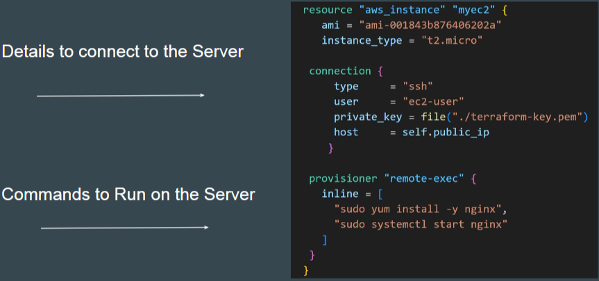

- [Terraform Provisioners](#terraform-provisioners)
  - [Overview of Provisioners](#overview-of-provisioners)
    - [Purpose of Provisioners](#purpose-of-provisioners)
      - [Use Cases](#use-cases)
    - [How Provisioners Work](#how-provisioners-work)
      - [Two Stages](#two-stages)
    - [Practical Demonstration](#practical-demonstration)
    - [Flexibility](#flexibility)
  - [Type of Provisioners in Terraform](#type-of-provisioners-in-terraform)
    - [Types of Provisioners](#types-of-provisioners)
    - [Local-Exec Provisioner](#local-exec-provisioner)
    - [Workflow](#workflow)
    - [Remote-Exec Provisioner](#remote-exec-provisioner)
    - [Workflow](#workflow-1)
    - [Practical Demonstration](#practical-demonstration-1)
    - [Verification](#verification)
    - [Key Takeaways](#key-takeaways)
  - [Format of Defining Provisioners](#format-of-defining-provisioners)
    - [Provisioners Inside Resource Blocks](#provisioners-inside-resource-blocks)
    - [1. Defining Provisioners - inside](#1-defining-provisioners---inside)
    - [2. Defining Provisioners - followed by type](#2-defining-provisioners---followed-by-type)
    - [3. Defining Provisioners - Local Provisioner Approach](#3-defining-provisioners---local-provisioner-approach)
    - [4. - Remote Exec Provisioner Approach](#4---remote-exec-provisioner-approach)
    - [Format of Provisioners](#format-of-provisioners)
    - [Local-Exec Provisioner](#local-exec-provisioner-1)
    - [Remote-Exec Provisioner](#remote-exec-provisioner-1)
    - [Documentation Perspective](#documentation-perspective)
  - [Practical - local-exec Provisioner](#practical---local-exec-provisioner)
    - [Defining Provisioners Inside Resource Blocks](#defining-provisioners-inside-resource-blocks)
    - [Format of Provisioners](#format-of-provisioners-1)
    - [Local-Exec Provisioner](#local-exec-provisioner-2)
    - [Understanding Self](#understanding-self)
      - [Practical Demonstration](#practical-demonstration-2)
      - [Use Cases](#use-cases-1)
  - [Practical - remote-exec Provisioner](#practical---remote-exec-provisioner)
    - [Defining Provisioners Inside Resource Blocks](#defining-provisioners-inside-resource-blocks-1)
    - [Remote-Exec Provisioner](#remote-exec-provisioner-2)
    - [Format of Remote-Exec Provisioner](#format-of-remote-exec-provisioner)
    - [Connection Block](#connection-block)
    - [Creating a Key Pair](#creating-a-key-pair)
    - [Security Group](#security-group)
    - [Using the File Function](#using-the-file-function)
    - [Practical Demonstration](#practical-demonstration-3)
    - [Troubleshooting](#troubleshooting)
  - [Points to Note](#points-to-note)
    - [Provisioners Inside Resource Blocks](#provisioners-inside-resource-blocks-1)
    - [Defining Provisioners for Different Resource Types](#defining-provisioners-for-different-resource-types)
    - [Practical Demonstration](#practical-demonstration-4)
    - [Multiple Provisioners in a Single Resource Block](#multiple-provisioners-in-a-single-resource-block)
    - [Practical Demonstration](#practical-demonstration-5)
  - [Creation-Time and Destroy-Time Provisioners](#creation-time-and-destroy-time-provisioners)
    - [Creation-Time Provisioners](#creation-time-provisioners)
    - [Practical Demonstration](#practical-demonstration-6)
    - [Destroy-Time Provisioners](#destroy-time-provisioners)
    - [Practical Demonstration](#practical-demonstration-7)
    - [Practical Demonstration](#practical-demonstration-8)
    - [Tainting of Resources](#tainting-of-resources)
    - [Practical Demonstration](#practical-demonstration-9)
  - [Failure Behaviour for Provisioners](#failure-behaviour-for-provisioners)
    - [Default Behavior](#default-behavior)
    - [Flexibility with On Failure Setting](#flexibility-with-on-failure-setting)
    - [Practical Demonstration](#practical-demonstration-10)
    - [Example Code](#example-code)
      - [Fail Behavior](#fail-behavior)
      - [Continue Behavior](#continue-behavior)

<br>

# Terraform Provisioners

## Overview of Provisioners

### Purpose of Provisioners
* `Execute Scripts`: Run scripts or commands on virtual machines (local or remote).
* `End-to-End Solutions`: Enable complete setup of infrastructure and applications.

For example: After VM is launched, install software package required for application.

<br>


<br>

#### Use Cases
* `Install Software`: After launching a virtual machine, install necessary software packages.
* `Configuration Management`: Ensure the VM is ready for application deployment.

<br> 

### How Provisioners Work

#### Two Stages
* `Launch`: Terraform creates the virtual machine.
* `Install`: Terraform logs into the VM using SSH and installs the required software.

**Example**:
* `Provisioner File`: A file (provisioner.tf) contains the logic to launch a server and install software.
* `SSH Key`: A file (terraform-key.pem) is used for SSH access.

<br>

### Practical Demonstration
1. Run `terraform apply` to create the EC2 instance.
2. Terraform logs into the EC2 instance using SSH.
3. Terraform installs the required software packages.

* `Result`: The VM is ready with the necessary software, and a default website is displayed.

### Flexibility
* Provisioners offer a lot of flexibility in managing infrastructure and applications.
* They can be used for various tasks, such as **software installation**, **configuration management**, and more.

<br>

<hr style="height:4px;background:black">

<br>

## Type of Provisioners in Terraform

### Types of Provisioners
* `Local-Exec`: Executes commands on the local machine where Terraform is running.
* `Remote-Exec`: Executes commands on the remote machine that Terraform has created.
* `File`: Transfers files to the remote machine (not covered in this video).

<br>

### Local-Exec Provisioner
* Runs commands **locally** after a resource is created.
  * **Example**: Fetching the IP address of an EC2 instance and storing it in a local file (server_ip.txt).

For example: After EC2 is launched, fetch the IP and store it in file server_ip.txt


<br>

### Workflow
* Terraform creates a virtual machine.
* Terraform creates a local file and stores the VM's IP address in it.

### Remote-Exec Provisioner
* Runs commands on the **remote** machine.
  * **Example**: Installing software (e.g., Nginx) on an EC2 instance.


<br>

### Workflow
* Terraform creates a virtual machine.
* Terraform logs into the VM using SSH.
* Terraform installs the required software on the VM.

### Practical Demonstration
1. Define a provisioner file (provisioner.tf) and an SSH key file (terraform-key.pem).
2. Run `terraform apply` to create the EC2 instance.
3. Terraform uses the remote-exec provisioner to install Nginx on the EC2 instance.
4. Terraform uses the local-exec provisioner to store the public IP address of the EC2 instance in a local file (private_ips.txt).

<br>


<br>

### Verification
* `Check the EC2 Instance`: Verify that the EC2 instance is created and Nginx is installed.
* `Check the Local File`: Verify that the public IP address is stored in the private_ips.txt file.
* `Access the Website`: Open the public IP address in a browser to see the default Nginx website.

<br>

### Key Takeaways
* `Local-Exec`: Runs commands locally, useful for tasks like storing IP addresses or running local scripts.
* `Remote-Exec`: Runs commands on remote machines, useful for tasks like software installation and configuration.

<br>

<hr style="height:4px;background:black">

<br>

## Format of Defining Provisioners

### Provisioners Inside Resource Blocks
* Provisioners must be defined **inside** a specific **resource block**.
  * **Example**: For an EC2 instance resource, the provisioner is placed within the opening and closing curly braces of the resource block.

<br>

### 1. Defining Provisioners - inside
* Provisioners are defined inside a specific resource.


<br>

### 2. Defining Provisioners - followed by type
* Provisioners are defined by “provisioner” followed by type of provisioner.


<br>

### 3. Defining Provisioners - Local Provisioner Approach
* For local provisioners, we have to specify command that needs to be run locally.


<br>

### 4. - Remote Exec Provisioner Approach
* Since commands are executed on remote-server, we have to provide way for Terraform to connect to remote server.



<br>

### Format of Provisioners
* `Syntax`: Use the **keyword provisioner** followed by the **type of provisioner**.
* `Types`: Examples include **local-exec**, **remote-exec**, and **file**.

**Example**:

```bash
provisioner "local-exec" {
  command = "echo 'Server has been created through Terraform'"
}
```

<br>

### Local-Exec Provisioner
* Executes commands on the **local machine** where Terraform is running.
* `Command`: Specify the command to be executed locally.

**Example**:

```bash
provisioner "local-exec" {
  command = "echo 'Server has been created through Terraform'"
}
```

<br>

### Remote-Exec Provisioner
* Executes commands on the **remote server** created by Terraform.
* `Commands`: Specify the commands to be executed on the remote server.
* `Connection Block`: Define the connection details, including protocol, user, private key, and server IP address.

**Example**:

```bash
provisioner "remote-exec" {
  inline = [
    "yum -y install nginx",
    "systemctl start nginx"
  ]
}

connection {
  type        = "ssh"
  user        = "ec2-user"
  private_key = file("path/to/private-key.pem")
  host        = aws_instance.example.public_ip
}
```

<br>

### Documentation Perspective
* `Local-Exec`: Defined **inside** the resource block with the command to be **executed locally**.
* `Remote-Exec`: Defined **inside** the resource block with **both** the **provisioner** block (commands) and the **connection** block (connection details).

<br>

<hr style="height:4px;background:black">

<br>

## Practical - local-exec Provisioner

### Defining Provisioners Inside Resource Blocks
* Provisioners must be defined inside a specific resource block.
  * **Example**: For an EC2 instance resource, the provisioner is placed within the opening and closing curly braces of the resource block.

### Format of Provisioners
* `Syntax`: Use the keyword provisioner followed by the type of provisioner.

**Example**:

```bash
provisioner "local-exec" {
  command = "echo ${self.public_ip} > server_ip.txt"
}
```

<br>

### Local-Exec Provisioner
* Executes commands on the local machine where Terraform is running.
* `Command`: Specify the command to be executed locally.

**Example**:

```bash
provisioner "local-exec" {
  command = "echo ${self.public_ip} > server_ip.txt"
}
```

<br>

### Understanding Self
* `Self`: Refers to the resource to which the provisioner is associated.
* **Example**: ${self.public_ip} refers to the public IP address of the EC2 instance.

#### Practical Demonstration
1. Define the provisioner inside the EC2 instance resource block.
2. Run `terraform apply` to create the EC2 instance.
3. The local-exec provisioner fetches the public IP of the EC2 instance and stores it in a file called server_ip.txt.

* `Verification`: Check the server_ip.txt file to see the stored IP address.

#### Use Cases
* `Running Local Scripts`: Execute scripts locally after the instance is created.
* `Integration with Tools`: Run tools like Ansible after a server gets created.

<br>

<hr style="height:4px;background:black">

<br>

## Practical - remote-exec Provisioner

### Defining Provisioners Inside Resource Blocks
* Provisioners must be **defined inside** a specific **resource block**.
  * **Example**: For an EC2 instance resource, the provisioner is placed within the opening and closing curly braces of the resource block.

### Remote-Exec Provisioner
* Executes commands on the **remote server** created by Terraform.
* `Commands`: Specify the commands to be executed on the remote server.
* `Connection Block`: Define the connection details, including protocol, user, private key, and server IP address.

<br>

### Format of Remote-Exec Provisioner
* `Syntax`: Use the keyword provisioner followed by **remote-exec**.

**Example**:

```bash
provisioner "remote-exec" {
  inline = [
    "yum -y install nginx",
    "systemctl start nginx"
  ]
}

connection {
  type        = "ssh"
  user        = "ec2-user"
  private_key = file("path/to/terraform-key.pem")
  host        = self.public_ip
}
```

<br>

### Connection Block
* `Type`: Specify the connection type (e.g., ssh for Linux, winrm for Windows).
* `User`: The username for the SSH connection (e.g., ec2-user for Amazon Linux).
* `Private Key`: The private key file used for SSH authentication.
* `Host`: The public IP address of the EC2 instance.

<br>

### Creating a Key Pair
1. Create a key pair in AWS and download the .pem file.
2. Place the .pem file in the same folder as your Terraform code.
3. Reference the key pair in the Terraform configuration.

<br>

### Security Group
* `Requirement`: Ensure that the security group allows SSH (port 22) and HTTP (port 80) access.

**Example**:

```bash
resource "aws_security_group" "provisioner_sg" {
  name        = "provisioner-sg"
  description = "Allow SSH and HTTP"
  
  ingress {
    from_port   = 22
    to_port     = 22
    protocol    = "tcp"
    cidr_blocks = ["0.0.0.0/0"]
  }

  ingress {
    from_port   = 80
    to_port     = 80
    protocol    = "tcp"
    cidr_blocks = ["0.0.0.0/0"]
  }
}
```

<br>

### Using the File Function
* Load the contents of the SSH key from a file on disk.

**Example**:

```bash
private_key = file("path/to/terraform-key.pem")
```

<br>

### Practical Demonstration
1. Define the provisioner and connection blocks inside the EC2 instance resource block.
2. Run `terraform apply` to create the EC2 instance.
3. Terraform uses SSH to connect to the EC2 instance and installs Nginx.

* `Verification`: Check the EC2 instance to ensure Nginx is installed and running.

<br>

### Troubleshooting
* `Manual SSH Connection`: If Terraform cannot connect to the EC2 instance, manually try to connect using SSH to identify the issue.
* `Superuser Privilege`: Use sudo for commands that require administrative privileges.

<br>

<hr style="height:4px;background:black">

<br>

## Points to Note

### Provisioners Inside Resource Blocks
* Provisioners must be **defined inside** a specific resource block.
  * **Example**: Provisioners can be defined for various resource types, not just aws_instance. For instance, you can define a provisioner for aws_iam_user.

<br>


<br>

### Defining Provisioners for Different Resource Types
* `Flexibility`: Provisioners can be associated with **different resource types**.
  * **Example**: A local-exec provisioner can be defined for an aws_iam_user resource to execute commands after the IAM user is created.

<br>

### Practical Demonstration

```bash
resource "aws_iam_user" "example" {
  name = "example-user"

  provisioner "local-exec" {
    command = "echo 'local-exec provisioner is starting'"
  }
}
```

* `Verification`: Running terraform apply will create the IAM user and execute the local-exec provisioner.

<br>

### Multiple Provisioners in a Single Resource Block
* `Flexibility`: You can add **multiple** provisioners within a **single resource** block.
  * **Example**: Combining multiple local-exec provisioners or mixing local-exec and remote-exec provisioners.

For example:


<br>

### Practical Demonstration

```bash
resource "aws_iam_user" "example" {
  name = "example-user"

  provisioner "local-exec" {
    command = "echo 'local-exec provisioner is starting'"
  }

  provisioner "local-exec" {
    command = "echo 'local-exec provisioner is starting for second time'"
  }
}
```

* `Verification`: Running terraform apply will execute both local-exec provisioners sequentially.

<br>

<hr style="height:4px;background:black">

<br>

## Creation-Time and Destroy-Time Provisioners

### Creation-Time Provisioners
* Provisioners that **run after** the **resource is created**.
* `Behavior`: These provisioners only **run during the creation** of the resource and do not run during updates.
  * **Example**: If you create an EC2 instance with a provisioner, it will run when the instance is first created but not during updates.

<br>

### Practical Demonstration

```bash
resource "aws_iam_user" "example" {
  name = "example-user"

  provisioner "local-exec" {
    command = "echo 'This is a creation-time provisioner'"
  }
}
```

<br>

### Destroy-Time Provisioners
* Provisioners that **run before** the **resource is destroyed**.
* `Behavior`: These provisioners **run during** the **destruction** of the resource.
* `Syntax`: Add **when = "destroy"** to the provisioner block.
  * **Example**: De-linking antivirus software before an EC2 instance is terminated.

<br>


<br>

### Practical Demonstration

```bash
resource "aws_iam_user" "example" {
  name = "example-user"

  provisioner "local-exec" {
    when    = "destroy"
    command = "echo 'This is a destroy-time provisioner'"
  }
}
```

<br>

### Practical Demonstration
1. Define both creation-time and destroy-time provisioners inside the resource block.
2. Run `terraform apply` to create the resource and execute the creation-time provisioner.
3. Run `terraform destroy` to delete the resource and execute the destroy-time provisioner.

<br>

### Tainting of Resources
* If a **creation-time** provisioner **fails**, the resource is marked as **tainted**.
* `Behavior`: A tainted resource will be **planned for destruction** and **recreation** upon the **next terraform apply**.
  * **Example**: If a software installation fails during the creation of an EC2 instance, the instance is marked as tainted.

<br>

### Practical Demonstration

```bash
resource "aws_iam_user" "example" {
  name = "example-user"

  provisioner "local-exec" {
    command = "invalid-command"
  }
}
```

* `Verification`: Check the terraform.tfstate file to see the tainted status.

<br>


<br>

<hr style="height:4px;background:black">

<br>

## Failure Behaviour for Provisioners

### Default Behavior
* `Failure Impact`: By default, if a provisioner fails, the entire terraform apply will fail.
* `Tainted Resource`: The resource will be marked as tainted, leading to its destruction and recreation in the next apply.
  * **Example**: If a provisioner command like echo1 fails, the apply process fails, and the resource is tainted.

<br>

### Flexibility with On Failure Setting
* Allows you to control the behavior when a provisioner fails.
* `Default Value`: The default value is fail, which raises an error and stops applying.
* `Continue Option`: The continue option ignores the error and continues with the creation or destruction of resources.

**Example**:

```bash
provisioner "local-exec" {
  command    = "echo1"
  on_failure = "continue"
}
```

<br>

### Practical Demonstration
1. Define a provisioner with a command that will fail (e.g., echo1).
2. Run `terraform apply` to see the default failure behavior.
3. Modify the provisioner to use on_failure = "continue" and run `terraform apply` again.

* `Verification`: Check that the apply process completes successfully and the resource is not marked as tainted.

<br>

### Example Code

#### Fail Behavior

```bash
resource "aws_iam_user" "example" {
  name = "example-user"

  provisioner "local-exec" {
    command = "echo1"
  }
}
```

#### Continue Behavior

```bash
resource "aws_iam_user" "example" {
  name = "example-user"

  provisioner "local-exec" {
    command    = "echo1"
    on_failure = "continue"
  }
}
```

> By understanding the failure behavior in provisioners and how to use the on_failure setting, you can make your Terraform configurations more robust and flexible.

<br> 