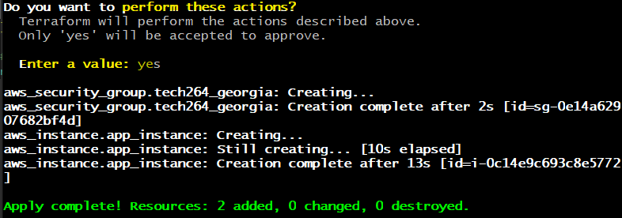
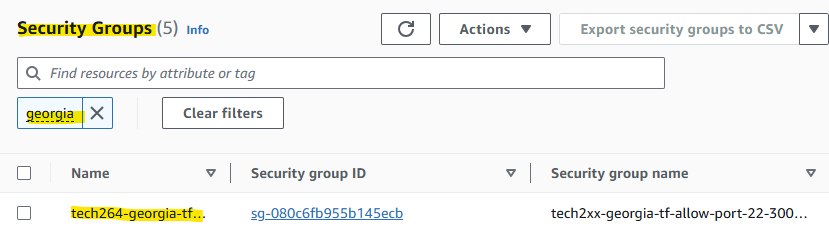
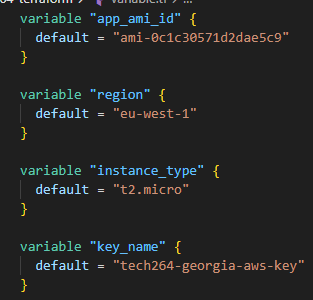
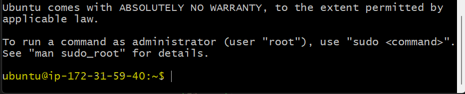

- [Task: Use Terraform add an AWS security group](#task-use-terraform-add-an-aws-security-group)
  - [AWS security group](#aws-security-group)
- [Task: Use variables for all values supplied to app EC2 instance](#task-use-variables-for-all-values-supplied-to-app-ec2-instance)
  - [Can you SSH in?](#can-you-ssh-in)


## Writing Terraform Code
For reference, see main.tf file. 
* create an EC2 instance.
  * Where to create - provide the provider.
  * which region to use to create infrastructure
  * which service/resources to create.
  * which AMI ID ami-0c1c30571d2dae5c9 (for ubuntu 22.04 lts).
  * what type of instance to lauch -t2.micro.
  * add a public IP to this instance. 
  * give a name to the service/resource we create

```bash
# aws_access_key= xxxx MUST NEVER DO THIS  
# aws_secret_key = xxx MUST NEVER DO THIS
# syntax often used in HCL is key = value

# create an EC2 instance.
# Where to create - provide the provider.

provider "aws" {
  # which region to use to create infrastructure
  region = "eu-west-1"
}

# which service/resources to create.

resource "aws_instance" "app_instance" {
  # which AMI ID ami-0c1c30571d2dae5c9 (for ubuntu 22.04 lts)).
  ami = "ami-0c1c30571d2dae5c9"

  # what type of instance to lauch -t2.micro.
  instance_type = "t2.micro"

  # add a public IP to this instance. 
  associate_public_ip_address = true

  # give a name to the service/resource we create
  tags = {
    Name = "tech264-georgia-tf-app-instance"
  }

}
```

<br>

## Using the 4 commands.

* Make sure your work on VSC is saved, otherwise it can't initialise. 
* `terraform init`
* Go into your tech264-terraform repo and `ls` to check you main.tf file is present. 


<br>

* Make sure everything is saved on VSC.
* `terraform fmt`
* This is to make sure your formatting within the main.tf file is correct, ensuring that Terraform can read it. 


<br>

* Make sure everything is saved on VSC.
* `terraform plan`
* This can take a moment, please be patient. 


* If we were dong a CICD pipeline, it would be a good idea to save the plan.

<br> 

* Make sure everything is saved on VSC.
* `terraform apply`


* Enter a value: "yes" (if you're happy with the plan). 
* Now it's creating the EC2 instance. 


* Go to AWS > EC2 > Instances to check if it's worked!


<br>

* time to destroy everything!
* `terraform destroy`
* "Enter a value": yes
  * You'll notice that on AWS, the instance does not exist anymore. 


<br>

# Task: Use Terraform add an AWS security group
Using Terraform and Terraform official documentation:

## AWS security group
* In your Create an AWS security group named tech2xx-firstname-tf-allow-port-22-3000-80 (tf so you know it was created by Terraform)
  * Allow port 22 from localhost
  * Allow port 3000 from all
  * Allow port 80 from all

```bash
# create an EC2 instance.
# Where to create - provide the provider.

provider "aws" {
  # which region to use to create infrastructure
  region = "eu-west-1"
}

# which service/resources to create.
resource "aws_security_group" "tech264_georgia" {
  name        = "tech2xx-georgia-tf-allow-port-22-3000-80"
  description = "Security group created by Terraform"

  ingress {
    description = "Allow SSH from localhost"
    from_port   = 22
    to_port     = 22
    protocol    = "tcp"
    cidr_blocks = ["0.0.0.0/0"]
  }

  ingress {
    description = "Allow HTTP"
    from_port   = 80
    to_port     = 80
    protocol    = "tcp"
    cidr_blocks = ["0.0.0.0/0"]
  }

  ingress {
    description = "Allow application traffic on port 3000"
    from_port   = 3000
    to_port     = 3000
    protocol    = "tcp"
    cidr_blocks = ["0.0.0.0/0"]
  }

  egress {
    from_port   = 0
    to_port     = 0
    protocol    = "-1"
    cidr_blocks = ["0.0.0.0/0"]
  }
  tags = {
    Name = "tech264-georgia-tf-app-instance"
  }
}
```

* Make sure the folder has been `terraform init`.
* format: `terraform fmt`
* plan: `terraform plan`
* apply: `terraform apply`
* 


* Check its been created on AWS security groups



* destroy: `terraform destroy`

<br>

* Modify the EC2 instance created in main.tf:
  * Attach the key to be used with EC2 instance
  * Use security group you created
  * Test infrastructure was created as intended

```bash
# create an EC2 instance.
# Where to create - provide the provider.

provider "aws" {
  # which region to use to create infrastructure
  region = "eu-west-1"
}

resource "aws_instance" "app_instance" {
  # which AMI ID ami-0c1c30571d2dae5c9 (for ubuntu 22.04 lts)).
  ami = var.app_ami_id

  # what type of instance to lauch -t2.micro.
  instance_type = "t2.micro"

  # ssh key (.prm on file)
  key_name = "tech264-georgia-aws-key"

  # add security group 
  vpc_security_group_ids = [aws_security_group.tech264_georgia.id]


  # give a name to the service/resource we create
  tags = {
    Name = "tech264-georgia-tf-app-instance"
  }

}
```


<br>

# Task: Use variables for all values supplied to app EC2 instance 
* go to main.tf file. 
* add a variables to main.tf
> Below are some examples.




<br> 

## Can you SSH in?
* Go to AWS Instance and "Connect". 
* SSH into the instance.
  * cd > .ssh
  * paste connection key. 



<br>

