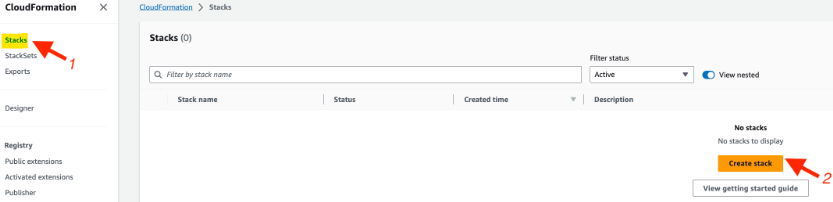
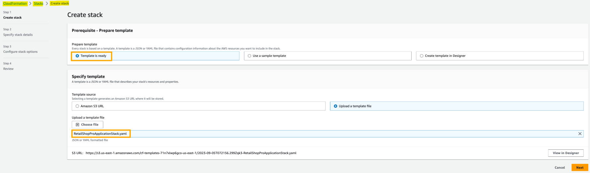

- [Build Automated Solutions in Large-Scale Environments using AWS Systems Manager](#build-automated-solutions-in-large-scale-environments-using-aws-systems-manager)
  - [Documentation](#documentation)
  - [Lab scenario](#lab-scenario)
    - [Objectives](#objectives)
  - [Create the IAM Role Required for Managing the Application Infrastructure via AWS Systems Manager](#create-the-iam-role-required-for-managing-the-application-infrastructure-via-aws-systems-manager)
  - [Create the Template for the Application Infrastructure Using AWS CloudFormation](#create-the-template-for-the-application-infrastructure-using-aws-cloudformation)
    - [Documentation](#documentation-1)
  - [Manage the Inventory for the Application Infrastructure Using AWS Systems Manager Inventory](#manage-the-inventory-for-the-application-infrastructure-using-aws-systems-manager-inventory)
    - [Documentation](#documentation-2)
  - [Patch the Application Infrastructure Using AWS Systems Manager Patch Manager](#patch-the-application-infrastructure-using-aws-systems-manager-patch-manager)
    - [Documentation](#documentation-3)
  - [Monitor and Report the Compliance Status of the Application Infrastructure](#monitor-and-report-the-compliance-status-of-the-application-infrastructure)
    - [Documentation](#documentation-4)
  - [Clean up!](#clean-up)

 

# Build Automated Solutions in Large-Scale Environments using AWS Systems Manager

## Documentation
* Introduction to AWS [systems manager](https://aws.amazon.com/systems-manager/).
* Configure [instance permissions](https://docs.aws.amazon.com/systems-manager/latest/userguide/setup-instance-permissions.html) for systems manager. 

## Lab scenario
* In this lab, you will be a DevOps engineer working at a large retail company called RetailTechX, known for its innovative technology products. 
* RetailTechX has recently launched a new product called "RetailShopPro", an advanced **shopping assistant** that uses **AI** to **enhance** the shopping **experience**. 
* As part of your role, you are tasked with designing and building automated solutions for complex tasks in large-scale environments using AWS Systems Manager Inventory Manager and Patch Manager to ensure the smooth operations. 
* You will also report on the infrastructure governance/compliance of the RetailShopPro application.

 

### Objectives
* Create the **IAM role** required for managing the application infrastructure via AWS Systems Manager.
* Create the **template** for the **application infrastructure** using AWS CloudFormation.
* Manage the **inventory** for the application infrastructure using AWS Systems Manager Inventory.
* **Automate the patching** for the application infrastructure using AWS Systems Manager Patch Manager.
*** Monitor and report** the compliance **status** of the application infrastructure.

 

## Create the IAM Role Required for Managing the Application Infrastructure via AWS Systems Manager
* Create the IAM role required for managing the application infrastructure via AWS Systems Manager. 
* This task allows AWS Systems Manager to manage the EC2 instances for inventory management, patching and compliance reporting purposes.

1. Make sure that you are in the **N.Virginia** AWS Region. 
   * Search for `IAM` on the AWS Management Console.

2. Click on the `Roles` link on the left sidebar.

3. Click on the `Create role` button.

4. Select AWS service as the entity type and select EC2 as the use case. 
   * Click on the `Next` button.

5. Add **permissions** by typing in `AmazonSSMManagedInstanceCore` in the permissions policy search box and hit enter. 
   * This policy allows the AWS Systems Manager service to operate on EC2 instances as managed instances.

6. Select the `AmazonSSMManagedInstanceCore` policy and click on `Next`.

7. Enter `EC2RoleforAWSSystemsManager` as the role name and leave the other values unchanged. 
   * Click on the `Create role` button.

8. You should see that the role has been created successfully.

 

## Create the Template for the Application Infrastructure Using AWS CloudFormation
* Create the application infrastructure using AWS CloudFormation service. 
* This task ensures that the EC2 instances with the desired instance profilehave been created for managing the inventory for the application infrastructure via AWS Systems Manager.

### Documentation
* Using EC2 instance [profiles](https://docs.aws.amazon.com/IAM/latest/UserGuide/id_roles_use_switch-role-ec2_instance-profiles.html). 
* Overview of AWS [CloudFormation](https://docs.aws.amazon.com/AWSCloudFormation/latest/UserGuide/Welcome.html). 

1. Make sure that you are in the N.Virginia AWS Region. 
   * Search for `CloudFormation` on the AWS Management Console.

2. Select the `Stacks` link on the left sidebar and then click on the `Create stack` button.

3. Now let's configure the details for preparing the template.
   * Select the `Prepare template` option that says **Template is ready** and upload the **RetailShopProApplicationStack.yaml** file provided as an asset herewith. 
   * The details for creating the stack should be as shown below. 
   * Click on the `Next` button.

* The YAML file refers to the `EC2RoleforAWSSystemsManager` role already created which is, in turn, associated with the EC2 Instance Profile. 
* This would also mark these instances as managed instances under AWS Systems Manager. 
* You should note that the template provisions a t2.small type EC2 instance which would act as the prod-server for the lab (the template uses the tag key Patch Group with the value as prod-server for this instance). 
* The template also provisions a t2.micro type EC2 instance which would act as the dev-server for the lab (the template uses the tag key Patch Group with the value as dev-server for this instance).

 

4. While specifying the stack details, enter the stack name as "RetailShopProStack". 
   * The LatestAmiId parameter default value points to the latest AMI ID. 
   * If there is a requirement to use a different AMI, then update the value. 
   * Click on the `Next` button.

5. While configuring the stack options, leave the default options unchanged and click on the `Next` button.
6. Review the details for creating the RetailShopProStack stack.
7. Select the checkbox that allows AWS CloudFormation to create AWS resources and click on the Submit button.

8. You should see that the `RetailShopProStack` stack has been created successfully.

 

## Manage the Inventory for the Application Infrastructure Using AWS Systems Manager Inventory
* Leverage the AWS Systems Manager Inventory to create the inventory for the application infrastructure. 
* Select both the managed instances under AWS Systems Manager and mark them as eligible for inventory management.

### Documentation
* Overview of AWS [systems manager](https://docs.aws.amazon.com/systems-manager/latest/userguide/what-is-systems-manager.html).
* AWS systems manager [inventory](https://docs.aws.amazon.com/systems-manager/latest/userguide/systems-manager-inventory.html). 

1. Make sure that you are in the **N.Virginia** AWS Region. 
   * Search for `Systems Manager` on the AWS Management Console.

2. Select the `Inventory` link on the left sidebar and then click on the `Setup Inventory` button.

3. While providing the inventory details, enter the name as "InventoryRetailShopPro" and select all managed instances as the target.

4. Leave the other values unchanged and click on the `Setup Inventory` button.
5. You should see that the request to set up the inventory has been successfully completed.

6. Within a few minutes, you should see that the dashboard has the information regarding the managed instances for which inventory has been enabled.

For example:

7. If you scroll down, you should also see the listing of managed instances that are part of the inventory.

 

## Patch the Application Infrastructure Using AWS Systems Manager Patch Manager
* Leverage the AWS Systems Manager Patch Manager to create a custom patch policy that patches the EC2 instances designated as the prod-servers with a daily patch frequency. 
* This would automate the patching for the application infrastructure using AWS Systems Manager Patch Manager.

### Documentation
* Overview of AWS systems manager [patch manager](https://docs.aws.amazon.com/systems-manager/latest/userguide/patch-manager.html).
* Using [quick setup](https://docs.aws.amazon.com/systems-manager/latest/userguide/patch-manager-policies.html) patch policies for AWS systems manager. 

1. Make sure that you are in the N.Virginia AWS Region. 
   * Search for `Systems Manager` on the AWS Management Console.

2. Select the `Patch Manager` link on the left sidebar and then click on the `Create Patch Policy` button.
3. Use the **AWS Quick Setup workflow** to create the Patch Policy.
   * Select the **us-east-1** AWS Region and click on the `Get started` button.

4. While creating the Patch Policy, set the following details:
   * Enter the configuration name as "RetailShopProPatchPolicy".

* For scanning and installing the patches, select a custom scan schedule that sets the scanning frequency as daily. 
  * You can schedule it to run at +15 minutes from the current UTC (For example, if the current UTC is 10.30am, you can set the schedule to run at 10.45am daily). 

Make sure that all other inputs match the selections as shown below:

* Likewise, select a custom install schedule that sets the installation frequency as daily. 

5. Configure **Patch baseline** as **Use recommended defaults**. 
   * Uncheck the checkbox to write the patch logs to Amazon S3.

6. Configure the `Targets` in the **Current Region** by selecting the **Specify node tag** option. 
   * Set the **tag key as Patch Group** and the **value as prod-server**.

7. Leave the **Rate control** options unchanged. 
   * Select the checkbox to add the required IAM policies to the existing instance profile. 
   * Click on the `Create` button.

8. You should see that the Patch Manager Quick Setup has been initiated successfully.
9. You need to wait for the scheduled scan and install operations to finish per your configuration (usually within ~40 minutes of initiating the patching schedule as prescribed earlier). 
    * Once all processes are executed, you should see that the Configuration status shows success. 
    * Click on the `View details` button.

10. You should be able to see the list of operations carried out during the patching process.

 

## Monitor and Report the Compliance Status of the Application Infrastructure
* Leverage the compliance reporting tab of the AWS Systems Monitor Patch Manager to monitor and report the compliance status of the application infrastructure.

### Documentation
* Overview of AWS systems manager [compliance](https://docs.aws.amazon.com/systems-manager/latest/userguide/systems-manager-compliance.html).
* Patching managed [nodes on demand](https://docs.aws.amazon.com/systems-manager/latest/userguide/patch-manager-patch-now-on-demand.html). 

1. Make sure that you are in the N.Virginia AWS Region. 
   * Search for `Systems Manager` on the AWS Management Console.

2. Click the `Patch Manager` link on the left sidebar.

3. Select the Compliance reporting tab. 
   * You should see that the `RetailShopProPatchPolicy` configuration is associated with the prod-server and the compliance status also shows as Compliant. 
   * The compliance status of the dev-server shows as **Never reported**. 
   * This is expected since the `RetailShopProPatchPolicy` was not configured for the dev server.

4. Explore how you can leverage the Patch now feature for ad-hoc patching of instances. 
   * You can use the dev-server to implement this step. 
   * Select the `Dashboard` tab and click on the `Patch now` button.

5. While configuring, set `Scan and install` as the patching operation and opt for rebooting the instance if needed. 
   * Use tags to select the instances eligible for patching. 
   * Specify **Patch Group** as the tag key and dev-server as the tag value. 
   * Click on the `Add` button.

6. Click on the `Patch now` button to complete the configuration.
7. Within a few minutes, you should see that the operation is completed successfully.
8. The patching status also shows up on the **Dashboard**.
9. Select the `Compliance reporting` tab. 
    * You should see that the compliance status of the dev-server also shows as Compliant now.

 

## Clean up!