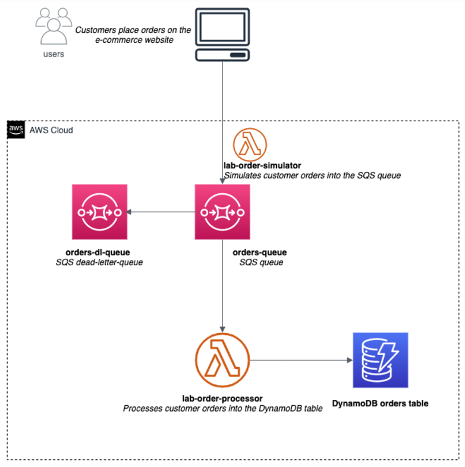
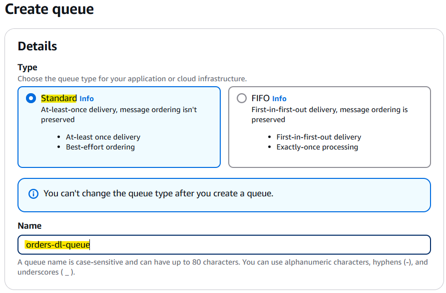
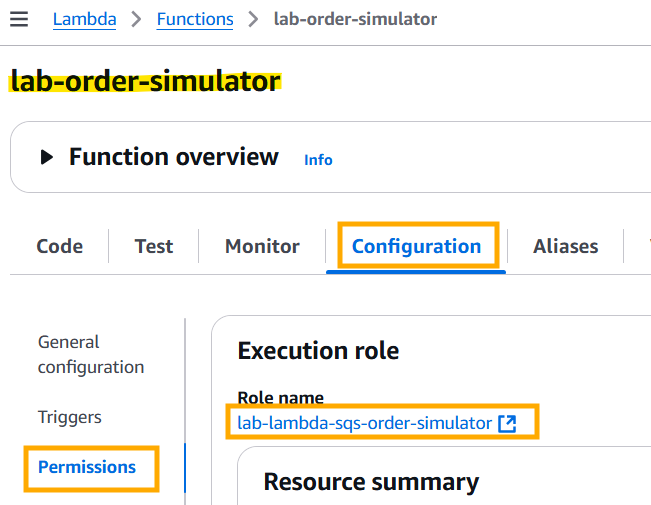

- [Create a Decoupled Backend Architecture Using Lambda, SQS and DynamoDB](#create-a-decoupled-backend-architecture-using-lambda-sqs-and-dynamodb)
  - [Lab Scenario](#lab-scenario)
  - [Project Assignment](#project-assignment)
    - [What you need to do](#what-you-need-to-do)
    - [Objectives](#objectives)
    - [What you'll learn](#what-youll-learn)
  - [Decoupled Backend Architecture](#decoupled-backend-architecture)
- [1. Create SQS standard queue to sedn, store, and recieve order messages](#1-create-sqs-standard-queue-to-sedn-store-and-recieve-order-messages)
- [Create DynamoDB Table to Capture the Processed Order Data](#create-dynamodb-table-to-capture-the-processed-order-data)
- [Create a Lambda Function to Simulate Orders into the SQS Queue](#create-a-lambda-function-to-simulate-orders-into-the-sqs-queue)
- [Create a Lambda Function to Process Orders into DynamDB Table](#create-a-lambda-function-to-process-orders-into-dynamdb-table)
- [Validate the end-to-end Decoupled Backend Architecture](#validate-the-end-to-end-decoupled-backend-architecture)
- [Clean up the resources created in Task 1 through Task 5](#clean-up-the-resources-created-in-task-1-through-task-5)

 

# Create a Decoupled Backend Architecture Using Lambda, SQS and DynamoDB
Udemy Learning

## Lab Scenario
* In this lab, you will experience what its like to be a backend engineer working for an e-commerce company. 
* The company is gearing up for the Thanksgiving sale that is the biggest annual shopping event for the company. 
* Your job is to **implement a decoupled backend architecture** that is able to **handle the spike in traffic** for the duration of the sale and ensure that none of the customer orders are lost.

## Project Assignment
* Our team has been given a mandate to recommend an upgrade for the backend architecture to prepare for the upcoming Thanksgiving sale. 
* Historically, our company has seen a 5X traffic spike for e-commerce for the duration of this sale. 
* In the past, there have been cases where the system went down and customer orders were lost, leading to significant revenue loss for the company. 
* We need you to devise a decoupled serverless backend architecture that is able to handle the spike in traffic for the duration of the sale.

### What you need to do
* To build your solution, you will leverage an **SQS standard queue** to **send**, **store**, and **receive** **order messages** and then configure the SQS Event Source to **trigger the Lambda function** which in turn **processes the orders into a DynamoDB table**.

### Objectives
* Create SQS standard queue.
* Develop Lambda function to process orders into DynamoDB table.
* Configure SQS Event Source to trigger the Lambda function.
* Demonstrate decoupled backend architecture.

### What you'll learn
* Decoupled Backend Architectures.
* Fault-tolerant systems.
* Serverless backends.
* Lambda, SQS, DynamoDB.

 

## Decoupled Backend Architecture

 

# 1. Create SQS standard queue to sedn, store, and recieve order messages
* You will need to create an **SQS standard queue** to **process the customer orders** captured on the **e-commerce website**. 
* You are also required to **create a dead-letter-queue** to ensure that you **don't lose any orders** that might have missing data or badly formatted data. 
  * Dead-letter queues are important because they provide **a way to reprocess failed orders** and **debug application issues**.

 

1. Make sure that you are in the **N.Virginia AWS Region** on the AWS Management Console. 
   * Enter SQS in the search bar and select `Simple Queue Service`.

2. Click "Create queue"

3. Lets create a **SQS standard queue** which will be used as a **dead-letter-queue** to ensure that we **dont lose any orders** that might have missing data or badly formatted data to process the customer orders. 
   * You can create this queue by filling in the values as shown below:
     * Select the **Standard** type
     * Enter queue name as **orders-dl-queue**
     * Leave the **default values** unchanged for the Configuration, Access policy, Encryption, Dead-letter queue and Tags sections. 
   * Then click on "Create queue" to set up the queue.

4. You should see that your orders-dl-queue has been successfully created. 
   * Now lets create the SQS standard queue to process the customer orders. 
   * Click on the "Queues" link shown below to go back and then click on the "Create queue" button.

5. Let's fill in the values for the customer orders queue as shown below:
   * Select the **Standard** type.
   * Enter queue name as **orders-queue**.
   * Leave the default values unchanged for the Configuration, Access policy, Encryption and Tags sections.

* For the **Dead-letter queue** section, you should **enable** the option to **receive undeliverable messages**. 
* Then, you should **select the orders-dl-queue queue** that you created in Step 3. 
* Lastly, you should also note that the **Maximum receives is set to 3**. 
* Then click on "Create queue" button.

6. You should see that your orders-queue has been successfully created

 

# Create DynamoDB Table to Capture the Processed Order Data
* You need to create a **DynamoDB Table** to capture the processed order data. 
* You can use the **default settings** for creating the table in provisioned mod.

1. Make sure that you are in the **N.Virginia AWS Region** on the AWS Management Console. 
   * Enter **DynamoDB** in the search bar and select "DynamoDB service".

2. Click on the "Create table" button

3. Enter the required values for the table as follows:
   * Table name: `orders`
   * Primary key: `id`
   * Make sure that you select the type as `Number` for the Primary key id.
   * Select the **Default settings** option from the **Table settings section**.

* Click "Create table" button to complete the configuration for the table. 

4. You should see that the orders table has been successfully created.

 

# Create a Lambda Function to Simulate Orders into the SQS Queue
* You will need to create a **Lambda function** to put some customer **order messages into the designated SQS queue**.
* These messages would later be used to **trigger the order processing** lambda that will eventually **store the order data in the DynamoDB table**.

1. Make sure that you are in the **N.Virginia AWS Region** on the AWS Management Console. 
   * Enter `Lambda` in the search bar and select "Lambda service".

* Click on the "Create function" button.

2. Lets create the Lambda function by filling in the following values:
   * Select the **Author from scratch** template
   * Function name: `lab-order-simulator`
   * Runtime: `Python 3.9`

* For execution role, `Change default execution role` > select the option that says "Create a new role from AWS policy templates".
* Role name: `lab-lambda-sqs-order-simulator`
* Click "Create function" to complete this step.

3. Configure the Lambda to **modify the permissions** for its execution role.
   * Select the `Configuration` tab and click on the "Permissions" link on the left sidebar. 
   * Then, click on the hyperlink for the execution role.

* You will notice that only the **AWSLambdaBasicExecutionRole** policy is attached to the Lambda in the Permissions tab. 
* Click on the `Add permissions` button and then select the `Attach policies` option.

* Enter SQS in the search bar and select the policy `AmazonSQSFullAccess` for the Lambda so that it can **write order messages into the SQS queue**. 
* Click on the `Attach policy` button to add this policy.

* You should see a confirmation message that says that the AmazonSQSFullAccess policy has been attached to the Lambda.

4. Configure the Lambda to set up the **environment variable for the target SQS queue**.
   * Go to the **SQS queue orders-queue** created in Task 1 and **copy the queue URL**.
   * Example: https://sqs.us-east-1.amazonaws.com/620968853885/orders-queue

* Select the `Configuration` tab and click on the `Environment variables` link and then click on the `Edit` button.
  * Lambda > lab-order-simulator > Configuration > Environment Variables.

* Click "Add environment variable".

* Enter `ORDERS_QUEUE_URL` as the Key. 
* Paste the orders-queue URL that you copied into the Value field. 
* Click on `Save`.

5. Click on the `Code` tab and then select the **lambda_function.py** file. 
   * Now **copy the code** from the lab-order-simulator.py file provided in the assets and paste in the **Lambda function code editor** and click `Deploy`.
   * Code is on training website. Copy from VSC.

 

# Create a Lambda Function to Process Orders into DynamDB Table
* You need to create a **Lambda function** that **processes each SQS message containing the order data**. 
* You also need to **configure the Lambda function** to **use the customer orders queue as the event source**. 
* The Lambda function will **complete the order processing** by writing the **order data into a DynamoDB table**.

1. Make sure that you are in the **N.Virginia AWS Region** on the AWS Management Console. 
   * Enter `Lambda` in the search bar and select `Lambda service`.
   * Click on "Create function" button.

2. Lets create the Lambda function by filling in the following values:
   * Select the **Author from scratch template**.
   * Function name: `lab-order-processor`.
   * Runtime: `Python 3.9`.

* For execution role, select the option that says **Create a new role from AWS policy templates**.
* Role name: `lab-lambda-sqs-order-processor`.
* Click "Create function" to complete this step.

3. Configure the Lambda to **modify the permissions** for its execution role.
   * Select the `Configuration` tab and click on the `Permissions` link on the left sidebar. 
   * Then, click on the `hyperlink` for the execution role.

* You will notice that only the **AWSLambdaBasicExecutionRole** policy is attached to the Lambda in the Permissions tab.
* Click on the `Add Permissions` button and then select the `Attach policies` option.
* Enter `SQS` in the search bar and select the policy `AmazonSQSFullAccess` so that the **queue can trigger the AWS Lambda function**. 
* Click on the `Attach policy` button to add this policy.

* On the `Permissions` tab, click again on the `Add Permissions` button and then select the `Attach policies` option. 
* Enter `DynamoDB` in the search bar and select the policy `AmazonDynamoDBFullAccess` for the Lambda so that it can **write the order data into the DynamoDB table**. 
* Click on the `Attach policy` button to add this policy.

* You should be able to see that all policies are attached to the Lambda function.

4. Configure the Lambda to set up a trigger from SQS.
   * Go to the `Function` overview section of the Lambda and click on `Add trigger`.

* Set the values for the Trigger configuration as follows:
* Trigger source: `SQS`.
* SQS queue: select the `orders-queue` as the source queue.
* Select the `Activate trigger` checkbox.
* Batch size: `10`.
* Batch window: `0`.
* Click on the `Add` button to complete this step.

* You should be able to see that trigger has been set up successfully.

* Scroll down to the Triggers section and refresh your Triggers.
* You'll now see that it's in an "Enabled" state.

5. Configure the Lambda to **set up the environment variable for the DynamoDB table** used to store the order data.
   * Click on the `Configuration` tab and select the `Environment variables` link in the left sidebar. 
   * Click on the `Edit` button.
   * Click on the `Add environment` variable button.
     * Enter **DYNAMODB_ORDERS_TABLE** as the Key. 
     * Put **orders** as the Value. 
   * Click on `Save`.

6. Click on the `Code` tab and then select the **lambda_function.py** file. 
   * Now copy the code from the **lab-order-processor.py** file provided in the assets and paste in the Lambda function code editor and click `Deploy`.

 

# Validate the end-to-end Decoupled Backend Architecture
* To **test** your **end-to-end architecture**, you need to **create customer orders** by **executing the order simulator Lambda** (created in Task 3) which puts customer orders into the SQS queue. 
* This, in turn, **triggers the order processor** Lambda (created in Task 4) that finally **captures the customer order data in a DynamoDB table**. 
* Thus, the given architecture decouples the order-creating component with the order-processing component. 
* The architecture can also handle any missing data or badly formatted data without breaking the workflow.

 

1. Make sure that you are in the **N.Virginia AWS Region** on the AWS Management Console. 
   * Enter **Lambda** in the search bar and select **Lambda service**.
   * Search and select the `lab-order-simulator` lambda.

2. Before creating the orders, lets make sure that there are **no messages in the queues** and the DynamoDB orders **table has no records**.
   * Search `SQS` > `Queues`. 

3. To invoke the lab-order-simulator lambda, you need to **configure a test event**. 
   * Click on the dropdown menu arrow next to **Test** and click on `Configure test event`.

* Select `Create new test event` and enter **SimulateOrders** as the event name. 
* Provide a key and value as shown below. 
* Click on `Create` to complete the set up.

4. Now that the test event is ready, click on `Test`. 

You should notice the following:
* The execution results show that the Lambda ran successfully.

Amazon SQS:
* Go to `SQS` and check the summary stats for the queues. 
* For this run, we see that the orders-queue shows there are 3 messages in flight. 
* These are the 3 messages which have an err value as the price_per_item and therefore rejected by the order processor Lambda. 
* Please note that this number may be higher or lower for you as the value err is randomly generated. 
* We will look at the actual messages in a later step.

DynamoDB:
* Go to `DynamoDB` and check the record count in the orders table. 
  * For this run, we see that the orders table shows that there are 17 records. 
  * This makes sense, as 3 out of the 20 records created were erroneous. 
  * As mentioned earlier, these numbers may vary a little for you.
* `DynamoDB` > `Tables` > `orders` > `Items Summary` > `Get live item count`.

* `DynamoDb` > `Explore items` (on the left).

* Lets go back to SQS and within a couple of minutes, you should see that the 3 erroneous in-flight messages for the **orders-queue** are now available in the **dead-letter-queue orders-dl-queue**.

* Click on the `orders-dl-queue` to inspect the messages in this dead-letter-queue. 
* Then click on the Send and receive messages button.

* Click on `Poll for messages` to view the messages.

You should see the list of messages available in the dead-letter-queue:

* Click on each of the messages to ascertain that each message has the value **err for price_per_item key**.

 

# Clean up the resources created in Task 1 through Task 5
Lets clean up the resources created for this lab:
* Delete the two lambda functions - lab-order-simulator and lab-order-processor.
* Delete the two SQS queues - orders-queue and orders-dl-queue.
* Delete the DynamoDB orders table.

