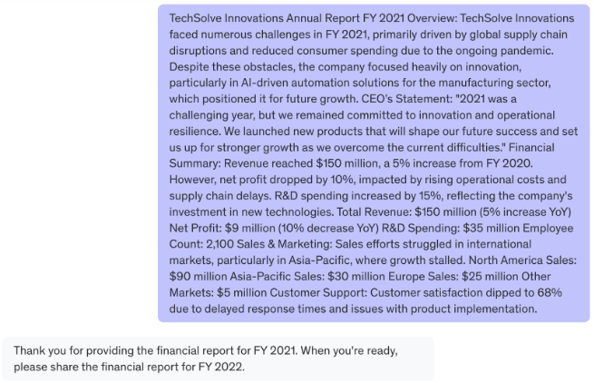
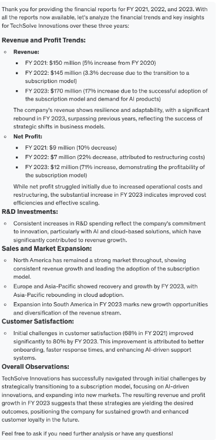
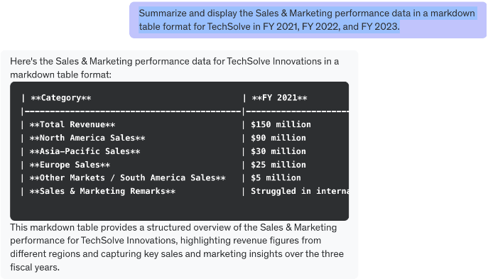

- [Prompt Engineering for Summarisation and Inference using OpenAI](#prompt-engineering-for-summarisation-and-inference-using-openai)
    - [Lab scenario](#lab-scenario)
    - [Objectives](#objectives)
    - [What you'll learn](#what-youll-learn)
  - [Introduction to Prompt Engineering](#introduction-to-prompt-engineering)
    - [Understanding the Data and Reports](#understanding-the-data-and-reports)
    - [Making Inferences based on Report Data](#making-inferences-based-on-report-data)
    - [Comparative Analysis for Multiple Reports](#comparative-analysis-for-multiple-reports)
    - [Summerising Inferences for Stakeholder Presentations](#summerising-inferences-for-stakeholder-presentations)
    - [Refining Prompts for Improved Summerisation and Inference](#refining-prompts-for-improved-summerisation-and-inference)

 

# Prompt Engineering for Summarisation and Inference using OpenAI

### Lab scenario
* In this lab, participants will take on the role of a prompt engineer working for a consulting firm. 
* Your task is to assist clients by analyzing complex reports and providing actionable insights through summarization and inference. 
* Throughout the lab, you will use OpenAI's GPT model to automate key parts of this workflow, including generating summaries, making data-driven inferences, and extracting insights for client reports. 
* By the end of this lab, you will have developed a strong foundation in prompt engineering techniques tailored to summarization and inference tasks.

 

### Objectives
* Generate concise and accurate summaries using GPT, tailored to specific business needs.
* Derive actionable insights and make informed inferences by leveraging prompt engineering techniques to extract relevant patterns and trends.
* Customize AI-generated outputs for various audiences, such as creating executive summaries that focus on high-level insights.
* Create and document reusable prompt workflows, making it easier to handle similar tasks efficiently in the future.

 

### What you'll learn
* Effective Prompt Engineering for Summarization: Develop the ability to craft precise and concise prompts that extract key information.
* Data-Driven Inference Generation: Learn how to design prompts that generate meaningful inferences and insights based on trends and patterns within complex data.
* Customizing AI Outputs for Different Audiences: Gain skills in tailoring AI-generated content, such as summaries and inferences.
* Building Efficient AI-Powered Workflows: Gain experience in creating automated workflows to streamline summarization and inference processes.

 

## Introduction to Prompt Engineering
Source: https://platform.openai.com/docs/guides/prompt-engineering

### Understanding the Data and Reports
* In this task, you will begin by thoroughly reviewing the financial reports of a fictitious company - TechSolve Innovations - for the financial years 2021, 2022, and 2023.
* These reports are available in the "TechSolve Innovations - Financial Reports.pdf" provided to you as part of the lab assets. 
* Your objective is to familiarize yourself with the structure and content of these reports, including the key financial figures, department performance, and strategic directions outlined in each. 
* You'll extract essential data points, such as total revenue, net profit, and R&D spending, to create a foundation for deeper analysis. 
* Using GPT, you'll design prompts to extract this information efficiently and organize it into a clear summary that reflects TechSolve's financial health over the three years. 
* By the end of this task, you will have a detailed understanding of the company's performance trends, setting the stage for more advanced summarization and inference work.

 

1. Create the initial prompt for GPT by providing the relevant context about the financial performance of the fictitious company - TechSolve Innovations - for the financial years 2021, 2022, and 2023. This would provide GPT the relevant information to help you review, summarize and analyze the financial performance of the company.

> Example Prompt: "I want you to help with the financial analytics of a fictitious company. The financial information of the company is in the form of annual financial reports for the financial years 2021, 2022, and 2023. I will provide the financial report of the company for FY 2021 in the next prompt. Do not provide any analysis unless you have received the financial reports for the three years. You should just ask for the subsequent year’s report until you have the entire data available for the three years. Are you ready?"

 

2. Input the prompt into GPT and observe the output.

Example Output:

 

3. Open the "TechSolve Innovations - Financial Reports.pdf" provided to you as part of the lab assets.
   * Copy the content for the financial year 2021. 
   * Observe the output once you enter this financial information into the prompt.

Example Output:

 

* Copy the content for the financial year 2022. 
* Observe the output once you enter this financial information into the prompt.

Example Output:

 

* Copy the content for the financial year 2023. 
* Observe the output once you enter this financial information into the prompt.

Example Output:

 

4. Review the "Overview" sections of the FY 2021, FY 2022, and FY 2023 reports to get an overall sense of the company’s performance trends.

> Example Prompt: “Summarize the Overview sections from the TechSolve FY 2021, FY 2022, and FY 2023 reports, highlighting major themes like revenue, growth, and challenges.”

Example Output:

 

5. Identify and highlight key financial figures for each year (total revenue, net profit, R&D spending, etc.).

> Example Prompt: “Extract total revenue, net profit, R&D spending, and operating expenses for TechSolve in FY 2021, FY 2022, and FY 2023.”

Example Output:

 

* Example Prompt: “Can you calculate the operating expenses for each financial year?”

Example Output:

 

6. Extract performance data from the Sales & Marketing department for each year.

> Example Prompt: “Summarize and display the Sales & Marketing performance data in a markdown table format for TechSolve in FY 2021, FY 2022, and FY 2023.”

Example Output:

 

7. Analyze the CEO’s statements to understand strategic goals over the three financial years.

> Example Prompt: “Summarize the key messages from the CEO’s statements in FY 2021, FY 2022, and FY 2023, focusing on the company’s strategic priorities.”

Example Output:

 

8. Prepare a consolidated short report based on the financial performance of the company over the three years.

> Example Prompt: “Summarize TechSolve’s financial performance from FY 2021 to FY 2023 in one paragraph.”

Example Output:

 

### Making Inferences based on Report Data
* In this task, you’ll leverage GPT to derive actionable inferences from TechSolve's financial reports. 
* These financial reports are available in the "TechSolve Innovations - Financial Reports.pdf" provided to you as part of the lab assets. 
* You will analyze trends in key metrics, such as revenue growth, R&D spending, and customer satisfaction, and use these insights to predict future performance. 
* Through a series of refined prompts, you’ll ask GPT to make observations and generate insights that can inform strategic decisions for the company. 
* Your focus will be on identifying potential growth areas, addressing challenges, and making informed predictions about the company's future performance. 
* The inferences generated will be compiled into a report to assist stakeholders in understanding how past performance can guide future strategy.

 

> Note - In case, you are starting this task in a new session, you need to execute the steps 1 through 3 of Task 1. This ensures that GPT has the relevant context about the financial performance of TechSolve Innovations for the last 3 years. If you are continuing the session from the previous task, you don't need to do anything.

 

1. Start by reviewing trends in key financial metrics, such as revenue, R&D spending, and customer satisfaction, across the three years. Understanding these trends will help you make informed inferences about the company’s future.

> Example Prompt: "Analyze the revenue and profit growth trends across FY 2021, FY 2022, and FY 2023, focusing on significant shifts."

Example Output:

 

2. Create a prompt for GPT that asks it to generate inferences based on these trends, focusing on future growth potential. For instance, you could ask GPT to predict how the company’s investment in R&D might affect its product development in the future.

> Example Prompt: "What inferences can be made about TechSolve’s future growth based on its R&D spending trends from FY 2021 to FY 2023?"

 

3. Review GPT’s inferences and check for alignment with the data. You want to ensure that the model’s predictions make logical sense based on the financial trends observed.

> Example Prompt: "Summarize GPT’s inference about TechSolve’s long-term growth based on its recent financial data, and check if it aligns with past trends."

 

4. Refine the GPT output to ensure it provides deeper insights and more targeted predictions. This might involve asking GPT to focus more narrowly on certain data points or strategic initiatives.

> Example Prompt: "Provide more specific inferences about how TechSolve’s cloud-based product development will affect revenue growth over the next three years."

 

5. Write a new prompt to generate inferences related to customer support and satisfaction, particularly based on the changes seen in FY 2022 and FY 2023. This can help predict future trends in customer satisfaction.

> Example Prompt: "What inferences can be made about TechSolve’s future customer satisfaction based on improvements in FY 2023 and its investment in AI-driven support tools?"

 

6. Summarize all the inferences generated by GPT into a cohesive report that explains the potential future outcomes for the company. This report will serve as a predictive analysis that stakeholders can use for strategic decision-making.

> Example Prompt: "Compile GPT’s inferences into a predictive report outlining potential growth areas, customer satisfaction trends, and product development outcomes."

 

7. Use the inferences generated to make strategic recommendations for FY 2024. These recommendations should be based on data-driven insights and support the company’s long-term growth and success.

> Example Prompt: "Present data-driven recommendations to the executive team, using GPT’s inferences as a foundation for strategic decisions in FY 2024."

 

### Comparative Analysis for Multiple Reports
* This task will require you to compare financial data and performance metrics across the three financial years provided. 
* These financial reports are available in the "TechSolve Innovations - Financial Reports.pdf" provided to you as part of the lab assets. 
* Using GPT, you’ll develop prompts to analyze trends such as changes in revenue, profit margins, and departmental performance over time. 
* The aim is to highlight key turning points, such as the decline in FY 2022 and subsequent recovery in FY 2023, as well as shifts in customer support and satisfaction. 
* By comparing these insights across the years, you’ll provide a comprehensive analysis that stakeholders can use to understand the company’s long-term trajectory. 
* The output will be a presentation that synthesizes the comparative data, offering actionable insights for decision-makers.

 

> Note - In case, you are starting this task in a new session, you need to execute the steps 1 through 3 of Task 1. This ensures that GPT has the relevant context about the financial performance of TechSolve Innovations for the last 3 years. If you are continuing the session from the previous task, you don't need to do anything.

 

1. Begin by gathering key financial data from the FY 2021, FY 2022, and FY 2023 reports. This includes metrics like total revenue, net profit, R&D spending, and employee headcount.

> Example Prompt: "List the total revenue, net profit, R&D spending, and employee headcount for TechSolve in FY 2021, FY 2022, and FY 2023."

Example Output:

 

2. Create a prompt that asks GPT to compare revenue and profit trends across the three years. You’re looking to identify key differences, such as the revenue dip in FY 2022 and recovery in FY 2023.

> Example Prompt: "Compare TechSolve’s total revenue and net profit for FY 2021, FY 2022, and FY 2023, and identify key differences."

Example Output:

 

3. Review GPT’s comparison and ensure it captures the most important trends, such as the impact of the subscription model on revenue. If necessary, refine the prompt to focus more on specific aspects of the data.

> Example Prompt: "Revise the comparison to highlight how the shift to a subscription model in FY 2022 affected revenue and profit."

Example Output:

 

4. Analyze GPT’s output and refine the prompt if needed to get more granular insights. For example, you could ask it to focus on specific markets or product lines.

> Example Prompt: "Provide more detailed analysis on how TechSolve’s market expansion in the Asia-Pacific region affected overall revenue growth."

Example Output:

 

5. Develop a prompt to compare customer support metrics across the three years. This should include metrics like customer satisfaction scores.

> Example Prompt: "Compare customer satisfaction scores for TechSolve in FY 2021, FY 2022, and FY 2023 while highlighting key trends."

 

6. Review GPT’s analysis of customer support trends and refine the prompt as needed to capture more nuanced insights, such as how AI-driven support tools impacted customer satisfaction.

> Example Prompt: "Analyze how TechSolve’s AI-driven customer support tools impacted customer satisfaction scores in FY 2022 and FY 2023."

 

7. Summarize the comparative analysis into a report that highlights key trends in financial performance, department operations, and customer satisfaction. This report will serve as a comprehensive overview of the company’s performance over the three years.

> Example Prompt: "Summarize the comparative analysis of TechSolve’s financial performance, department performance, and customer support trends from FY 2021 to FY 2023."

 

8. Use the findings from the comparative analysis to make recommendations for the company’s strategy moving forward. These recommendations should be based on the trends identified in the data.

> Example Prompt: "Develop strategic recommendations for TechSolve’s leadership team based on the insights gained from the comparative analysis."

 

### Summerising Inferences for Stakeholder Presentations
* In this task, you will focus on translating the inferences and insights you’ve generated into a format suitable for executive-level stakeholders. 
* Using GPT, you’ll create prompts that summarize key financial and operational insights in a clear, concise manner. 
* The relevant financial reports are available in the "TechSolve Innovations - Financial Reports.pdf" provided to you as part of the lab assets. 
* These summaries should be tailored to an executive audience, emphasizing actionable takeaways without overwhelming them with technical details. 
* The goal is to present the company’s financial trajectory and strategic outlook in a way that supports decision-making at the highest level. 
* By the end of this task, you will have created a polished, executive-ready report that synthesizes the key findings from your analysis.

 

> Note - In case, you are starting this task in a new session, you need to execute the steps 1 through 3 of Task 1. This ensures that GPT has the relevant context about the financial performance of TechSolve Innovations for the last 3 years. If you are continuing the session from the previous task, you don't need to do anything.

 

1. Create a prompt that asks GPT to summarize the high-level financial trends and key operational insights concisely, focusing on actionable insights for decision-makers. Ensure that the language used is suitable for an executive-level audience.

> Example Prompt: "Summarize the key financial and operational inferences from TechSolve’s FY 2021 to FY 2023 reports in 150 words, focusing on actionable insights for executives."

Example Output:

 

2. Tailor the summary specifically for an executive presentation. This means emphasizing the key takeaways that will help executives make strategic decisions without overwhelming them with too many details.

> Example Prompt: "Ensure that the summary for the key financial and operational insights is concise, focusing on high-level trends and strategic recommendations without going into excessive detail."

Example Output:

 

3. Create additional prompts to highlight specific financial and strategic insights, such as how R&D spending is expected to impact future product development or how customer satisfaction trends might influence sales.

> Example Prompt: "Highlight the impact of R&D spending on TechSolve’s future product development and competitive positioning in the market."

Example Output:

 

4. Review GPT’s recommendations and ensure they align with the company’s strategic goals. This is important to ensure the recommendations make sense in the context of the company’s long-term vision.

> Example Prompt: "Create recommendations for FY 2024 that align with TechSolve’s strategic goals, and adjust as needed."

Example Output:

 

5. Combine the financial insights and strategic recommendations into a final executive summary report. The report should be easy to read, concise, and focused on the key points.

> Example Prompt: "Create a final executive summary that highlights TechSolve’s key financial trends, operational insights, and strategic recommendations for FY 2024."

 

6. Review the report for brevity and precision. Ensure that all key points are clearly communicated and that the document is polished and professional.

> Example Prompt: "Edit the executive summary for brevity and ensure it is polished and ready for presentation."

Example Output:

 

7. Present the final  report to stakeholders, ensuring that the most important takeaways are highlighted. This will help guide the strategic decision-making process for the company’s leadership team.

> Example Prompt: "Prepare the executive summary for a leadership presentation, focusing on the most actionable insights and recommendations, while ensuring that the most important takeaways are highlighted."

 

### Refining Prompts for Improved Summerisation and Inference
* In this task, you will focus on enhancing the accuracy and relevance of your GPT prompts through an iterative refinement process. 
* Starting with a review of the initial outputs, you will identify areas where the summarization or inferences were unclear, incomplete, or not detailed enough. 
* By adjusting the prompts with more specific instructions, testing the changes, and introducing conditional prompts, you will improve the quality of the AI-generated outputs for processing the financial data of TechSolve. 
* The relevant financial reports are available in the "TechSolve Innovations - Financial Reports.pdf" provided to you as part of the lab assets. 
* Additionally, you'll explore breaking complex prompts into smaller, more focused parts, incorporating feedback from stakeholders, and documenting your refinements for future use. 
* Finally, you will test the improved prompts on new data to ensure they are flexible and reliable across various contexts.

> Note - In case, you are starting this task in a new session, you need to execute the steps 1 through 3 of Task 1. This ensures that GPT has the relevant context about the financial performance of TechSolve Innovations for the last 3 years. If you are continuing the session from the previous task, you don't need to do anything.

 

1. Create a refined prompt that asks GPT to include the missing details or clarify unclear sections. Ensure that the revised prompt is more specific and targeted to capture all necessary information.

> Example Prompt: "Summarize TechSolve’s FY 2022 financial report, ensuring that revenue, net profit, R&D spending, and the impact of the subscription model transition are clearly detailed."

Example Output:

 

2. Test the refined prompt by generating a new summary or inference. Compare the new output with the original to see if the prompt adjustment resulted in a more accurate and complete response.

> Example Prompt: "Generate a revised summary of the FY 2022 report, ensuring that the subscription model transition and R&D spending are highlighted."

Example Output:

 

3. Repeat this process for any other sections or inferences where the output was not sufficiently detailed or relevant. You may need to iterate multiple times to reach the desired level of detail and clarity.

> Example Prompt: "Generate inferences about TechSolve’s revenue growth in FY 2023, focusing on how increased R&D spending and cloud adoption influenced growth."

Example Output:

 

4. Introduce conditional prompts to guide GPT in generating more nuanced outputs. This can help the model focus on specific aspects of the data that need more attention.

> Example Prompt: "If TechSolve’s R&D spending increased by 10% in FY 2023, how would this likely impact its product development and future revenue?"

Example Output:

 

5. Experiment with different prompt structures, such as breaking down a single prompt into multiple smaller, more focused prompts. This can help isolate specific details that were previously overlooked in broader prompts.

> Example Prompt: "First, summarize TechSolve’s financial performance in FY 2023, focusing only on revenue and profit. Then summarize the Customer Support department’s performance."

Example Output:

 

6. Use feedback from stakeholders or team members to further refine your prompts. Understanding how the outputs are being used can help you fine-tune the prompts to meet specific requirements.

> Example Prompt: "Summarize TechSolve’s FY 2022 customer support performance. Focus on areas that would interest stakeholders looking to improve customer engagement"

Example Output:

 

7. Document the refinements and the rationale behind each adjustment. This will serve as a guide for future prompt engineering tasks, ensuring that the improvements you’ve made can be easily replicated by others.

> Example Prompt: "Document the refinements made to the FY 2022 financial summary prompt, including the steps taken to improve the accuracy of revenue and R&D spending details."

Example Output:

 

8. 