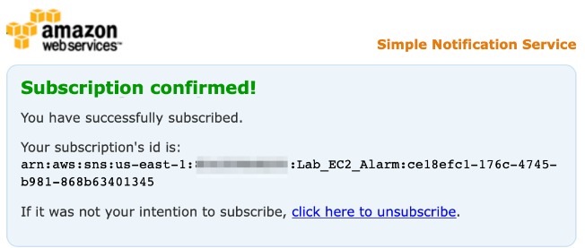

- [Build and Monitor a Resilient System Architecture Using EC2, RDS Multi-AZ, CloudWatch and SNS](#build-and-monitor-a-resilient-system-architecture-using-ec2-rds-multi-az-cloudwatch-and-sns)
  - [Lab scenario](#lab-scenario)
    - [Objectives](#objectives)
    - [Documentation](#documentation)
    - [Launch EC2 Instance that acts as the frontend of the system](#launch-ec2-instance-that-acts-as-the-frontend-of-the-system)
    - [Provision RDS database instance in a Multi-AZ configuration for high availability and failover](#provision-rds-database-instance-in-a-multi-az-configuration-for-high-availability-and-failover)
    - [Configure CloudWatch Monitoring of the EC2 Instance](#configure-cloudwatch-monitoring-of-the-ec2-instance)
    - [Simulate hardware failure for EC2 instance to kick-off EC2 auto-recovery](#simulate-hardware-failure-for-ec2-instance-to-kick-off-ec2-auto-recovery)
    - [Simulate RDS database instance failover to the standby database instance](#simulate-rds-database-instance-failover-to-the-standby-database-instance)

<br>

# Build and Monitor a Resilient System Architecture Using EC2, RDS Multi-AZ, CloudWatch and SNS

## Lab scenario
* In this lab, you will experience what its like to be a cloud architect working for an IT company. 
* Recently, the company has seen cases of malfunctioning of EC2 instances and databases leading to service outage. 
* You have been tasked with designing and implementing a resilient system that supports auto-recovery of EC2 instances and EBS from failures. 
* The system must also support Multi-AZ deployment of RDS database instances for high availability and failover support. 
* You will use CloudWatch and SNS for monitoring the EC2 instances as well as the RDS instances.

<br>


<br>

### Objectives
* Provision RDS in Multi-AZ configuration for high availability and failover.
* Set up monitoring of EC2 instances and RDS databases.
* Configure auto-recovery of EC2 instance and EBS from failures.
* Create CloudWatch events to send SNS notifications.

### Documentation
* [Amazon VPC and subnets](https://docs.aws.amazon.com/vpc/latest/userguide/how-it-works.html).
* [Amazon EC2 security groups for Linux instances](https://docs.aws.amazon.com/AWSEC2/latest/UserGuide/ec2-security-groups.html).
* [What is Amazon EC2?](https://docs.aws.amazon.com/AWSEC2/latest/UserGuide/concepts.html)
* [Using service-linked roles](https://docs.aws.amazon.com/IAM/latest/UserGuide/id_roles_create-service-linked-role.html). 

<br>

### Launch EC2 Instance that acts as the frontend of the system
* To facilitate this step, you need to create a public subnet in the default VPC, then create a service role for EC2 instance to invoke a CloudWatch alarm for simulating a hardware failure. 
* You also need to create a security group that would allow users to SSH into the instance and also allow HTTP connections into the instance. 
* You will then need to launch an EC2 instance in the public subnet that acts as the frontend of the system. 
* The EC2 instance will connect to a Multi-AZ RDS database in a private subnet.

<br>

1. Make sure that you are in the **N.Virginia** AWS Region on the AWS Management Console. Enter `VPC` in the search bar and select `VPC service`.


<br>

2. Select **Subnets** from the left sidebar and click **Create subnet**.


<br>

3. You can create the subnet by filling in the **Subnet name** as Lab-Public-Subnet, select the **Availability Zone** as us-east-1a and enter the value for **IPv4 CIDR block** as 172.31.128.0/20.


<br>

4. To create the service role for the EC2 instance, you need to navigate to the `IAM service`. Enter **IAM** in the search bar and select **IAM service**.


* Click on **Roles**.


* Click on **Create roles**. 


<br>

5. Select `AWS Service` as the type of trusted entity and choose **EC2** as the service.


<br>

6. Enter **CloudWatchFullAccess** in the search bar for permissions policies and Select **CloudWatchFullAccess** from the results. Click on **Next**.


<br>

7. Enter **Role Name** as LabEC2CloudWatchRole and **Role description** as "Allows EC2 instances to call CloudWatch services on your behalf".


<br>

8. Lets create the security group for the EC2 instance.
   * Navigate back to EC2 service on the AWS console and select **Security Groups** from the left sidebar.


* Click on the Create security group button.
* Enter **Security group name** as Lab-EC2-web-ssh, enter **Description** as Lab-EC2-web-ssh and then select your default VPC.


* Create Inbound rules for HTTP port 80 and SSH port 22 from any source like so. 

> Note - For production systems, you should allow SSH only from your own public IP. Make sure that there is an outbound rule that allows all traffic to any destination. 

* Click on the **Create security group** button.

<br>

9. With all the building blocks in place, lets provision the EC2 Instance.
    * Navigate to EC2 service on AWS Console and click on **Launch instances** button and select the **Launch instance** option.
    * Choose a name for your EC2 instance.
    * Choose Amazon Linux 2 AMI and select t2.micro as the instance type.
    * Proceed without a key-pair as we shall use EC2 connect for connecting to the instance later.
    * In the Network setting tab, click on the Edit button. 
    * Set the following options:
      * Subnet:  Lab-Public-Subnet
      * Auto-assign Public IP: Enable
      * Security group:  Lab-EC2-web-ssh
    * Leave all values for the storage section as unchanged. Click on Next.
    * Expand the Advanced details section and click on the IAM instance profile dropdown and select the value LabEC2CloudWatchRole. Leave all other values as unchanged.
    * Click on the Launch instance button to finish the set-up for the instance.
<br>

### Provision RDS database instance in a Multi-AZ configuration for high availability and failover
* You need to provision an RDS database instance in a Multi-AZ configuration for high availability and failover. 
* This helps establish data redundancy, eliminate I/O freezes, and minimize latency spikes during system backups and planned system maintenance. 
* The database with Multi-AZ configuration would be provisioned in two private subnet groups.

<br>

1. Make sure that you are in the N.Virginia AWS Region on the AWS Management Console. Enter **VPC** in the search bar and select **VPC service**. Select Subnets from the left sidebar and click **Create subnet**.
   * You can create the first private subnet by filling in the **Subnet name** as Lab-Private-Subnet-A, select the **Availability Zone** as us-east-1a and enter the value for **IPv4 CIDR block** as 172.31.144.0/20.


* You can create the second private subnet by filling in the **Subnet name** as Lab-Private-Subnet-B, select the **Availability Zone** as us-east-1b and enter the value for **IPv4 CIDR block** as 172.31.160.0/20.


<br>

2. Select **Route Tables** from the left sidebar.
   * Click on the **Create route table** button.
   * Enter **Name** as Lab-Private-RT and select your default VPC. Click on **Create route table** button.


* Select the route table you just created and select the **Subnet associations** tab. Click on **Edit subnet associations** button.


* Select the two private subnets that you created - Lab-Private-Subnet-A and Lab-Private-Subnet-B. Click on **Save associations** button.


<br>

3. Navigate to the RDS service on the AWS Management Console.
   * Select **subnet groups** from the left sidebar and then click on **Create DB Subnet Group**. This DB subnet group will be used to launch the database in a private subnet.


* For the DB Subnet Group, enter both the **name** and **description** as Lab-RDS-MultiAZ-Subnet-Group and select your default VPC.


* Choose Availability Zones - **us-east-1a** and **us-east-1b**. Select the private subnets created in the step 1a and 1b above. Click on **Create**.


<br>

4. Navigate to the **EC2** service on the AWS Management Console. Select **Security groups** from the left sidebar and click on the **Create security group** button.
   * Enter **Security group name** as Lab-RDS-MultiAZ, enter **Description** as Lab-RDS-MultiAZ and then select your default VPC.


* Create an inbound rule for MySQL port 3306 with the allowed source only from the Security group **Lab-EC2-web-ssh** created for the EC2 Instance in Task 1. Click on the **Create security group** button.

<br>

5. Navigate to the RDS service on the AWS Management Console.
   * Select **Databases** from the left sidebar and click on the **Create database** button.


* Choose the **database creation method** as standard, **engine option** as MySQL.


* Leave the **Engine version** value as unchanged.


* Choose the **Template** as Dev/Test. Select the **Availability and durability** option as **Multi-AZ DB instance**.


* Enter values for DB instance identifier, master username and master password.


* In the Instance configuration section, choose the DB instance class as `Burstable classes` and select the value `db.t3.micro` from the dropdown. 
  * For the Storage section, select General Purpose SSD (gp2) as the Storage type and enter 20 GiB as the Allocated Storage. 
  * Leave the default values unchanged for the Storage autoscaling sub-section.

* In the Connectivity section, choose the default VPC, select the `lab-rds-multiaz-subnet-group` for the subnet group.


* In the **Connectivity** section again, for **Public access**, select `No`, as we want the database not to be accessible over the public internet. Select the VPC security group - **Lab-RDS-MultiAZ** - created in Step 4 above.


* Select Password authentication as the option for **Database authentication options**. Leave the defaults unchanged for the **Monitoring** section. Click on **Create database**.
* You should see that the database has been created successfully.

<br>

### Configure CloudWatch Monitoring of the EC2 Instance
* You will need to create a CloudWatch alarm that monitors the EC2 instance for a hardware failure event and immediately invokes auto-recovery procedure to get the EC2 instance up and running again. 
* Configure the CloudWatch alarms to send SNS notifications to your email address.

<br>

1. Make sure that you are in the N.Virginia AWS Region on the AWS Management Console. Enter **CloudWatch** in the search bar and select **CloudWatch** service.


<br>

2. Expand **Alarms** section on the left sidebar, click on the **in-alarm** menu item and then click on the **Create alarm** button.


<br>

3. Click on the Select metric button.


<br>

4. Copy the **Instance ID** of the instance created in Task 1.


<br>

5. Paste this **Instance ID** in the search bar for Metrics and click on `EC2` > `Per-Instance Metrics`.


<br>

6. Select **StatusCheckFailed_System** metric.


<br>

7. Specify metric and conditions for the alarm.
   * Select Average for **Statistic** and 1 minute for **Period**.


* Select threshold type, alarm condition and threshold value like so:


<br>

8. Now lets configure actions for the alarm. We shall create two actions for this alarm - a `notification action` (this will be used to send you an email when the EC2 instance has a hardware failure) and an `EC2 action` (this will be used to automatically recover the EC2 instance from a hardware failure. The failure will be simulated via the CloudWatch Alarms API for the purpose of this lab).
   * In the **Notification** section, Select In alarm as the option for **Alarm State Trigger**, select **Create new topic** for SNS topic. Provide a **name** for the topic - Lab_EC2_Alarm. Then enter your email address as the **endpoint**. Click on the **Create Topic** button.


* You should see your topic created successfully.
* Lets create the EC2 action. Select In alarm as the option for **Alarm State Trigger**. Then select Recover this instance as the **action** type. Click on the **Next** button.


<br>

9. Enter Lab-EC2-Recover as the **alarm name** and the **alarm description**. Click on Next.


<br>

10. Preview all sections for your alarm and click on the **Create alarm** button to complete the set up for the alarm.
    * You should see that the alarm has been created successfully. However, the alarm shows up in the pending confirmation status. This is because you need to confirm the subscription for the SNS notifications that will be sent to your email.

<br>

11. Go to your inbox for the email address youve used in Step 8a above. Click on the **Confirm subscription** link in the email that you have received from AWS Notifications.




<br>

### Simulate hardware failure for EC2 instance to kick-off EC2 auto-recovery
* You will need to use AWS command line to simulate hardware failure for the EC2 instance. This would trigger a CloudWatch event to kick-off the auto-recovery procedure to get the EC2 instance up and running again.

<br>

1. Navigate to the EC2 service on AWS Console and click on **Instances** from the left sidebar. Select the instance you created in Task 1. Click on the **Connect button**.


* Select the **EC2 Instance Connect** tab and then click on **Connect** button to SSH into the instance.


<br>

2. Lets configure AWS CLI on this EC2 instance. 

> You should never use the IAM user Access Key ID and Secret Access Key to configure AWS command line tools on an EC2 instance. As the EC2 instance profile is configured with the role LabEC2CloudWatchRole, so the instance will use this role for the AWS CLI commands. 

* Type `aws configure` on the command line and press enter. 
* Again just press enter when prompted for both the AWS Access Key ID and AWS Secret Access Key. 
* Enter `us-east-1` for Default region name. Just press enter for the Default output format.


<br>

3. Lets simulate the hardware failure on the EC2 instance.
   * We shall trigger the CloudWatch alarm `Lab-EC2-Recover`created in Task 3. Use the command below to trigger the alarm.

```bash
aws cloudwatch set-alarm-state --alarm-name "Lab-EC2-Recover" --state-value ALARM --state-reason "Simulate Hardware Failure"
```

* You will notice that the alarm is in the `in alarm` status on the AWS Console.
* You should also receive an email from SNS Notifications with details of the alarm.


* Navigate to the **CloudWatch Alarms** section and click on the alarm **Lab-EC2-Recover**.
* Go to the history section of the alarm and click on the **EC2 Action** type for recovery.


* You should see the summary of the EC2 recover action triggered by the alarm.


* Again, Go to the history section of the alarm and click on the **Notification Action** type.


* You should see the summary of the SNS Notification.


<br>

### Simulate RDS database instance failover to the standby database instance
* You will need to use the reboot with failover feature of RDS via the AWS management console to simulate RDS primary database instance failover to the standby database instance. 
* Lastly, you need to use the event subscriptions feature of the RDS databases to get SNS notifications regarding the database failover to the standby.

<br>

1. Make sure that you are in the N.Virginia AWS Region on the AWS Management. Console. Enter **RDS** in the search bar and select **RDS** service.
   * Click on **Event subscriptions** on the left sidebar.


* Enter the **event subscription name** as `Lab-RDS-MultiAZ-Failover`. For the target, **send notifications** to a `New email topic`. Enter the **topic name** as `Lab-RDS-Failover-Notification` and fill in your email address as the recipient email address.


* For the **Source** section, select the **source type** as Instances. Select the database instance - **database1** - created in Task 2 as the specific instance. Select **failover** as the specific event category for the notification. Click on **Create**.


* Go to your inbox for the email address youve used in Step 1b above. Click on the **Confirm subscription** link in the email that you have received from AWS Notifications.
* Navigate to the database instance - **database-1** - created in Task 2. You should make a note of the existing Availability Zone of this database instance. Once we simulate the reboot with failover, you will notice that the Availability Zone has changed because the standby is located in a separate AZ for a Multi-AZ configuration.
* Click on the **Actions** button and select **Reboot**.


* Select the checkbox for **Reboot with Failover**. Click on **Confirm**.


* The database status changes to **Rebooting**.
* As soon as the failover is complete, you will notice that the database instance is now located in a different Availability Zone.
* You should also receive an email from SNS Notifications with the details of the failover events - **failover started** and **failover completed**.

<br>