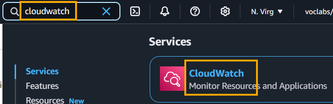

- [Design a Solution to Audit, Monitor, and Analyze Logs and Metrics for Detecting Issues](#design-a-solution-to-audit-monitor-and-analyze-logs-and-metrics-for-detecting-issues)
  - [Lab scenario](#lab-scenario)
  - [Your Assignment](#your-assignment)
    - [Objectives](#objectives)
    - [Documentation](#documentation)
- [Create the CloudTrail Trail to Audit and Monitor the Infrastructure Events](#create-the-cloudtrail-trail-to-audit-and-monitor-the-infrastructure-events)
- [Capture the CloudTrail Trail Data via CloudWatch Logs and Setup the CloudWatch Metric Filter](#capture-the-cloudtrail-trail-data-via-cloudwatch-logs-and-setup-the-cloudwatch-metric-filter)
  - [Documentation](#documentation-1)
- [Create the CloudWatch Alarm to Monitor Server Provisioning and Set up Notifications via Amazon SNS](#create-the-cloudwatch-alarm-to-monitor-server-provisioning-and-set-up-notifications-via-amazon-sns)
  - [Documentation](#documentation-2)
- [Test the CloudWatch Alarm by Setting up Unexpected Server Provisioning Event](#test-the-cloudwatch-alarm-by-setting-up-unexpected-server-provisioning-event)
  - [Documentation](#documentation-3)
- [Clean up resources!](#clean-up-resources)

 

# Design a Solution to Audit, Monitor, and Analyze Logs and Metrics for Detecting Issues

## Lab scenario
* In this lab, you will be a DevOps Engineer working for a technology company called "CyberGuard Technologies". 
* The company specializes in developing advanced cybersecurity solutions for businesses. 
* Your team has recently built a cutting-edge product named "SentinelShield," a next-generation **firewall and intrusion detection system**. 
* As part of your responsibilities, you need to **ensure** that the server infrastructure behind SentinelShield is **securely monitored** and **logged to detect and respond to any incidents effectively**. 
* You are tasked with **designing a solution** that **audits**, **monitors**, and **analyzes** CloudTrail audit trails **using CloudWatch Logs and CloudWatch Metric-Filters**. 
* The solution should also **send notifications** via Amazon Simple Notification Service (SNS) when a **CloudWatch alarm is triggered** in case any server infrastructure is provisioned outside of the designated AWS Region.

 

## Your Assignment
* our primary objective is to **establish a robust infrastructure monitoring system** for SentinelShield. 
* This involves following responsibilities: 
  * Infrastructure Assessment, 
  * Monitoring System Implementation, 
  * Alerting 
  * and Notification Setup. 
* You will leverage capabilities offered by AWS CloudTrail and Amazon CloudWatch to meet these goals. 
* Your contributions to this project are vital to the success of our organization and our mission to protect businesses from cybersecurity threats. 
* We look forward to your hard work, innovative solutions, and commitment to excellence throughout the project.

 

### Objectives
* Create an AWS CloudTrail trail to audit and monitor the infrastructure event.
* Capture an AWS CloudTrail trail data via Amazon CloudWatch Logs and set up the Amazon CloudWatch Metric Filte.
* Create an Amazon CloudWatch alarm to monitor server provisioning and setup notifications via Amazon SN.
* Test an Amazon CloudWatch alarm by triggering an unexpected server provisioning event.

 

### Documentation
* Introduction to [AWS CloudTrail](https://docs.aws.amazon.com/awscloudtrail/latest/userguide/cloudtrail-user-guide.html).
* Overview of [Amazon EC2](https://docs.aws.amazon.com/AWSEC2/latest/UserGuide/concepts.html).

 

# Create the CloudTrail Trail to Audit and Monitor the Infrastructure Events
* Create the CloudTrail trail to audit and monitor the infrastructure events. 
* This task allows AWS CloudTrail to capture event data about operations that are performed on resources in your AWS account.

 

1. Make sure that you are in the **N.Virginia AWS Region**. 
   * Search for `CloudTrail` on the AWS Management Console.

2. Click on the `Create a trail` button.

3. Enter "SentinelShieldTrail" as the Trail name. 
   * Leave the name unchanged for the auto-created S3 log bucket and folder. 
   * Click on the `Create trail` button.

4. You should see that the "SentinelShieldTrail" trail has been created successfully.

5. Search for `EC2` on the AWS Management Console.

6. Click on the `Launch Instance` button.

7. Enter `EC2-us-east-1` as the name for the instance. 
   * Select `Amazon Linux 2` as the AMI and `t2.micro` as the instance type.

8. For the `Key pair`, select "Proceed without a key pair", as you are not required to access the instance for this lab. 
   * Leave all the other options unchanged and click on the `Launch instance` button.

9. You should see the instance launch has been successfully initiated. 
    * Click on the `View all instances` button.

10. Within a few minutes you should see that the instance is in the **running** state. 
    * Now let’s check if the instance provisioning event has been captured in the CloudTrail trail. 
    * Search for S3 on the AWS Management Console.

11. Click on the bucket name starting with “aws-cloudtrail-logs-”.

12. Navigate the AWSLogs folder structure for the us-east-1 Region to find the logs created for the server provisioning event, like so:

 

# Capture the CloudTrail Trail Data via CloudWatch Logs and Setup the CloudWatch Metric Filter
* Update the CloudTrail trail configuration to capture the trail data via CloudWatch Logs. 
* Then, Update the CloudWatch Log group to set up a metric filter to count the number of occurrences when EC2 servers were provisioned outside the us-east-1 AWS Region.

## Documentation
* Sending CloudTrail [events](https://docs.aws.amazon.com/awscloudtrail/latest/userguide/send-cloudtrail-events-to-cloudwatch-logs.html) to CloudWatch Logs.
* Creating metrics from log events using [filters](https://docs.aws.amazon.com/AmazonCloudWatch/latest/logs/MonitoringLogData.html).

 

1. Make sure that you are in the N.Virginia AWS Region. 
   * Search for `CloudTrail` on the AWS Management Console.

2. Click on the "SentinelShieldTrail" to edit the trail configuration.

3. Click on the CloudWatch Logs `Edit` button.

4. Select the checkbox to enable the CloudWatch Logs. 
   * Enter ""Sentinel-Shield-Logs" as the **name** for the new log group.
   * Enter "Sentinel-Shield-Role-For-CloudTrail-To-CloudWatchLogs" as the **name** for the new IAM role name.
   * Click on the `Save changes` button.

5. You should be able to see that the CloudWatch Logs have been configured successfully for the trail.
6. Search for `CloudWatch` on the AWS Management Console.

7. Select the `Log groups` link on the left sidebar. 
   * Click on the "Sentinel-Shield-Logs" log group.

8. Under the Actions button, click on the Create metric filter option.

9. Now, let’s set up the details for the metric filter. 
    * Enter `{ ($.eventName = "RunInstances") && ($.awsRegion != "us-east-1") }` as the value for the filter pattern. 
    * This pattern would filter any server provisioning event outside the **us-east-1** AWS Region. 
    * Click on the `Next` button.

10. Enter the following details for the metric:

Filter name: Sentinel-Shield-Non-us-east-1
        Metric namespace: Sentinel-Shield
        Metric name: Sentinel-Shield-Instances-Non-us-east-1
        Metric value: 1
        Default value: 0
        Unit: Count

* Click on the `Next` button.

11. Review and confirm that all information looks good. 
    * Click on the `Create metric filter` button.

12. You should see that the metric filter has been created successfully.

 

# Create the CloudWatch Alarm to Monitor Server Provisioning and Set up Notifications via Amazon SNS
* Create the CloudWatch alarm to capture any server provisioning events outside the us-east-1 AWS Region. 
* Configure Amazon SNS topic which can be used as a target for the CloudWatch alarm. 
* Have the alarm send out email notifications to the designated users for every occurrence of server provisioning events outside the us-east-1 AWS Region.

## Documentation
* Use Amazon CloudWatch [metrics](https://docs.aws.amazon.com/AmazonCloudWatch/latest/monitoring/working_with_metrics.html).
* Using Amazon CloudWatch [alarms](https://docs.aws.amazon.com/AmazonCloudWatch/latest/monitoring/AlarmThatSendsEmail.html).
* Overview of Amazon [SNS](https://aws.amazon.com/sns/). 

 

1. Make sure that you are in the **N.Virginia** AWS Region. 
   * Search for `CloudWatch` on the AWS Management Console.

2. Expand the `Alarms` menu item on the left sidebar and select the In alarm link. 
   * Then click on the `Create alarm` button.

 

3. While specifying the metric and conditions, capture the following details:
   * Click on the `Select metric` button.

* Select the "Sentinel-Shield" custom namespace.

* Select Metrics with no dimensions.
  

* Select the checkbox with the metric name "Sentinel-Shield-Instances-Non-us-east-1". 
  * Click on the `Select metric` button.

* Finalise the metric parameters like so:
  * Statistic: Sum
  * Period: 5 minutes
* Choose the conditions as shown below. 
* Click on the `Next` button.

4. Configure actions for the alarm, like so:
   * Set the Alarm state trigger to `In alarm`. 
   * Select the option to create a new topic and then enter the topic **name** as "Sentinel-Shield-Topic". 
   * Fill in your **email** address that will receive the notification. 
   * Click on the `Create topic` button.
   * Go to your email inbox and check the details of the email received from AWS Notifications. 
     * You may need to check the spam folder as well if you do not receive the given email. 
   * Click on the `Confirm subscription` link.
   * You should see that the subscription has been confirmed successfully.

For example:

* Go back to the `AWS Management Console` and click on the `View` in `SNS Console link` (This would open a new browser tab).

* You should see that the subscription status is confirmed in the SNS Console.

5. Navigate to the previous browser tab that has the CloudWatch console open. 
   * Enter the details of the alarm as follows:
     * Alarm **name**: "Sentinel-Shield-Alarm".
     * Alarm **description**: Instance provisioned in a non us-east-1 AWS Region.
   * Click on the `Next` button.

6. Review the information for configuring the alarm and click on the `Create alarm` button.

7. You should see that the alarm has been created successfully.

 

# Test the CloudWatch Alarm by Setting up Unexpected Server Provisioning Event
* Configure a test scenario to trigger the CloudWatch alarm by setting up an unexpected server provisioning event by creating an EC2 instance in the us-west-2 AWS Region. 
* This should result in Amazon SNS sending an email notification about the event.

## Documentation
* What is [Amazon EC2](https://docs.aws.amazon.com/AWSEC2/latest/UserGuide/concepts.html)?
* Create a [CloudWatch](https://docs.aws.amazon.com/AmazonCloudWatch/latest/monitoring/WhatIsCloudWatch.html) alarm based on a log group-metric filter. 

 

1. Make sure that you are in the Oregon (us-west-2) AWS Region.
   * Search for EC2 on the AWS Management Console.

2. Select the instances link on the left sidebar. 
   * Click on the `Launch instances` button.

3. Enter "EC2-us-west-2" as the **name** for the instance. 
   * Select `Amazon Linux 2` as the AMI and `t2.micro` as the instance type.

4. For the Key pair, select `Proceed without a key pair`, as you are not required to access the instance for this lab. 
   * Leave all the other options unchanged and click on the `Launch instance` button.

5. You should see that the instance launch has been successfully initiated. 
   * Click on the `View all instances` button.

6. Within a few minutes you should see that the instance is in the **running** state.

7. Go to your email **inbox** and check the details of the email received from AWS Notifications. 
   * You may need to check the spam folder as well if you do not receive the given email. 
   * You should see that the **alarm has been triggered** for provisioning the EC2 instance outside the **us-east-1** AWS Region.

8. Provision an EC2 instance in the **us-east-1** AWS Region. 
   * Since provisioning servers is allowed in the us-east-1 AWS Region, it should **not** trigger the alarm. 
   * Make sure that you are in the **N.Virginia** (us-east-1) AWS Region. 
   * Search for `EC2` on the AWS Management Console.

9. Select the instances link on the left sidebar. 
    * Click on the `Launch instances` button.

10. Enter "EC2-us-east-1-test" as the name for the instance. 
    * Select `Amazon Linux 2` as the AMI and `t2.micro` as the instance type.

11. For the Key pair, select Proceed without a key pair, as you are not required to access the instance for this lab. 
    * Leave all the other options unchanged and click on the `Launch instance` button.

12. You should see the instance launch has been successfully initiated. 
    * Click on the `View all instances` button.

13. Within a few minutes, you should see that the instance is in the running state.

14. This server provisioning event should not trigger the CloudWatch alarm and therefore you should not receive any email notification via Amazon SNS.

  

# Clean up resources!
